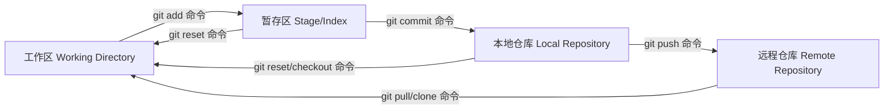
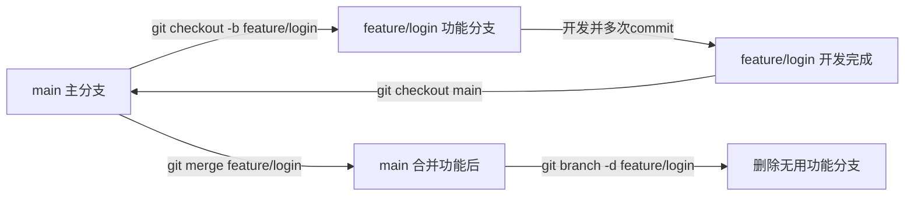

# Git

## 基础命令

### 环境配置相关

```bash
# ==================== 环境配置相关 ====================
# 查看Git版本
git --version

# 配置全局用户名
git config --global user.name "lingkong"

# 配置全局邮箱
git config --global user.email "linkon2846@outlook.com"

# 查看当前所有Git配置
git config --list

# 编辑全局配置文件
git config -e --global

# 编辑当前仓库本地配置文件
git config -e

# 设置当前仓库局部用户名/邮箱
git config user.name "lingkong"
git config user.email "linkon2846@outlook.com"

# 配置默认编辑器为VS Code
git config --global core.editor "code --wait"

# 配置换行符转换（Mac/Linux）
git config --global core.autocrlf input

# 配置换行符转换（Windows）
git config --global core.autocrlf true

# 验证SSH免密连接
ssh -T git@github.com
```

### 仓库初始化与克隆

```bash
# ==================== 仓库初始化与克隆 ====================
# 在当前目录初始化Git仓库
git init

# 新建目录并初始化为Git仓库
git init [项目名称]

# 克隆远程仓库到本地
git clone [远程仓库地址]

# 克隆远程仓库到指定目录
git clone [远程仓库地址] [自定义目录名]

# 克隆指定分支代码
git clone -b [分支名] --single-branch [远程仓库地址]
```

### 文件操作

```bash
# ==================== 文件操作（增/删/改/追踪） ====================
# 添加指定文件到暂存区
git add [文件1] [文件2]

# 添加指定目录到暂存区
git add [目录路径]

# 添加当前目录所有文件到暂存区
git add .

# 交互式添加修改
git add -p

# 删除工作区文件并放入暂存区
git rm [文件1] [文件2]

# 停止追踪文件但保留在工作区
git rm --cached [文件路径]

# 重命名/移动文件并放入暂存区
git mv [原文件路径] [新文件路径]


```

### 代码提交

```bash
# ==================== 代码提交相关 ====================
# 提交暂存区所有内容
git commit -m "提交说明"

# 提交暂存区指定文件
git commit [文件1] [文件2] -m "提交说明"

# 直接提交工作区所有已跟踪文件的修改
git commit -a -m "提交说明"

# 提交时显示diff详情
git commit -v

# 改写上一次提交（修改说明）
git commit --amend -m "新的提交说明"

# 追加文件到上一次提交，不修改说明
git commit --amend --no-edit

```

### 分支管理全

```bash
# ==================== 分支管理全命令 ====================
# 列出所有本地分支
git branch

# 列出所有远程分支
git branch -r

# 列出所有本地+远程分支
git branch -a

# 新建分支但不切换
git branch [新分支名]

# 新建分支指向指定commit
git branch [新分支名] [commit版本号]

# 新建分支并与远程分支建立追踪
git branch --track [新分支名] [远程分支名]

# 为现有分支建立远程追踪
git branch --set-upstream-to=origin/[远程分支名] [本地分支名]

# 切换到指定分支（推荐）
git switch [分支名]

# 切换到指定分支（兼容旧版本）
git checkout [分支名]

# 切换到上一个分支
git switch -
git checkout -

# 新建并切换到新分支（推荐）
git switch -c [新分支名]

# 新建并切换到新分支（兼容旧版本）
git checkout -b [新分支名]

# 基于指定commit/分支新建并切换
git switch -c [新分支名] [commit版本号/分支名]

# 合并指定分支到当前分支
git merge [待合并分支名]

# 合并指定分支，禁用快速合并
git merge --no-ff [待合并分支名]

# 挑选指定commit合并到当前分支
git cherry-pick [commit版本号1] [commit版本号2]

# 安全删除已合并的本地分支
git branch -d [分支名]

# 强制删除本地分支
git branch -D [分支名]

# 删除远程分支
git push origin --delete [远程分支名]
git branch -dr [origin/远程分支名]

```

### 标签（Tag）管理

```bash
# ==================== 标签（Tag）管理 ====================
# 列出所有本地标签
git tag

# 模糊搜索并排序标签
git tag -l | grep "v1." | sort -V

# 新建轻量标签
git tag [标签名]

# 新建带备注的附注标签
git tag -a [标签名] -m "版本发布说明"

# 新建标签在指定commit
git tag [标签名] [commit版本号]

# 查看标签详细信息
git show [标签名]

# 删除本地标签
git tag -d [标签名]

# 推送单个标签到远程
git push origin [标签名]

# 推送所有标签到远程
git push origin --tags

# 删除远程标签
git push origin :refs/tags/[标签名]

# 基于标签新建分支
git switch -c [新分支名] [标签名]

```

### 信息查看与历史追溯

```bash
# ==================== 信息查看与历史追溯 ====================
# 查看文件变更状态
git status

# 极简格式查看提交历史
git log --oneline

# 查看完整提交历史
git log

# 查看提交历史与文件变更统计
git log --stat

# 按提交说明关键词搜索
git log --grep [搜索关键词]

# 按代码内容搜索提交
git log -S [代码关键词]

# 查看文件版本历史（含改名）
git log --follow [文件路径]

# 查看文件的每次提交diff
git log -p [文件路径]

# 查看最近n次提交
git log -n --oneline

# 图形化显示所有分支历史
git log --graph --oneline --all --decorate

# 显示提交用户按次数排序
git shortlog -sn

# 查看文件每一行的修改记录
git blame [文件路径]

# 查看工作区与暂存区差异
git diff

# 查看暂存区与上一次commit差异
git diff --cached

# 查看工作区与最新commit差异
git diff HEAD

# 查看两个分支/版本的差异
git diff [分支1/版本1] [分支2/版本2]

# 查看当天提交行数统计
git diff --shortstat "@{0 day ago}"

# 查看某次提交的元数据与变更
git show [commit版本号]

# 查看某次提交的文件列表
git show --name-only [commit版本号]

# 查看某次提交时的文件内容
git show [commit版本号]:[文件路径]

# 查看所有操作记录
git reflog
```

### 远程仓库协同

```bash
# ==================== 远程仓库协同 ====================
# 查看已关联的远程仓库
git remote -v

# 查看远程仓库详细信息
git remote show [远程别名]

# 新增远程仓库关联
git remote add [别名] [远程仓库地址]

# 修改远程仓库地址
git remote set-url [别名] [新的远程仓库地址]

# 删除远程仓库关联
git remote remove [别名]

# 重命名远程仓库别名
git remote rename [旧别名] [新别名]

# 获取远程所有分支更新（不合并）
git fetch [远程别名]

# 获取指定远程分支更新
git fetch [远程别名] [分支名]

# 拉取远程当前分支并合并
git pull

# 拉取远程指定分支并合并
git pull [远程别名] [远程分支名]

# 拉取远程代码并用rebase合并
git pull --rebase

# 推送当前分支到远程
git push

# 推送指定分支到远程
git push [远程别名] [本地分支名]

# 首次推送并建立追踪
git push -u [远程别名] [本地分支名]

# 强制推送（仅个人分支使用）
git push [远程别名] [分支名] --force

# 安全强制推送
git push --force-with-lease

# 推送所有本地分支
git push [远程别名] --all

```

### 撤销与回滚全场景

```bash
# ==================== 撤销与回滚全场景 ====================
# 丢弃工作区指定文件修改（推荐）
git restore [文件路径]

# 丢弃工作区指定文件修改（兼容旧版本）
git checkout -- [文件路径]

# 丢弃工作区所有未暂存修改
git restore .
git checkout .

# 撤销暂存区文件（推荐）
git restore --staged [文件路径]

# 撤销暂存区文件（兼容旧版本）
git reset HEAD [文件路径]

# 撤销所有暂存区内容
git restore --staged .
git reset HEAD .

# 软重置：保留修改到工作区
git reset --soft [目标版本号]

# 混合重置：保留修改到工作区，重置暂存区（默认）
git reset [目标版本号]

# 硬重置：丢弃所有修改（谨慎使用）
git reset --hard [目标版本号]

# 新建提交抵消指定版本（已推送首选）
git revert [目标版本号]

# 撤销合并操作
git merge --abort

# 撤销rebase操作
git rebase --abort
```

### 临时暂存

```bash
# ==================== 临时暂存（Stash）操作 ====================
# 暂存当前所有未提交修改
git stash

# 暂存并添加备注
git stash push -m "暂存备注"

# 暂存包括未跟踪文件
git stash -u

# 查看所有暂存记录
git stash list

# 恢复最近一次暂存并删除记录
git stash pop

# 恢复指定暂存记录并删除
git stash pop stash@{序号}

# 应用最近一次暂存但不删除
git stash apply

# 应用指定暂存记录但不删除
git stash apply stash@{序号}

# 丢弃最近一次暂存
git stash drop

# 丢弃指定暂存记录
git stash drop stash@{序号}

# 清空所有暂存记录
git stash clear

# 查看指定暂存的修改详情
git stash show stash@{序号} -p

```

### 高频开发场景流程 

```bash
# ==================== 高频开发场景流程 ====================
# 场景1：新项目初始化全流程
git init
git add .
git commit -m "feat: 项目初始化"
git remote add origin 远程仓库地址
git push -u origin main

# 场景2：日常开发标准提交流程
git pull
git status
git add .
git commit -m "feat: 完成功能开发"
git push

# 场景3：功能分支开发全流程
git switch main
git pull
git switch -c feature/login
git add .
git commit -m "feat: 完成登录功能"
git switch main
git pull
git merge feature/login
git push
git branch -d feature/login
```

### 裸仓库

```bash
# =================== 裸仓库初始化与克隆 ====================
# 创建裸仓库
# 裸仓库没有工作区，仅包含版本历史，通常命名为 xxx.git
git init --bare my-repo.git

# 将现有本地项目推送到裸仓库
# 进入现有项目目录
cd existing-project

# 始化本地仓库
git init
git add .
git commit -m "Initial commit"

# 关联裸仓库（路径可以是本地路径或远程服务器路径）
git remote add origin /path/to/my-repo.git

# 推送代码到裸仓库（首次推送需指定分支）
git push -u origin main


# 3. 从裸仓库克隆项目到新位置
# 克隆裸仓库到本地（自动创建工作区）
git clone /path/to/my-repo.git new-project
cd new-project

#日常协作流程（基于裸仓库）
# 拉取远程最新代码
git pull origin main

# 修改文件后提交
git add .
git commit -m "Update: 新增功能"

# 推送到裸仓库
git push origin main

# 其他常用操作
# 查看裸仓库关联的远程地址
cd my-repo.git
git remote -v

# （可选）在服务器上设置裸仓库权限（多用户协作时）
chmod -R 755 my-repo.git
```

### 其他命令

```bash
# ==================== 其他实用命令 ====================
# 打包当前分支为zip
git archive --format=zip --output=发布包.zip HEAD

# 清理本地无效远程分支缓存
git remote prune origin

# 检查仓库完整性
git fsck
```

## git基础

### git本质与基础模块

- **Git 存储原理**：基于哈希函数（任意数据 → 固定长度哈希值）。
  - 文件内容改变 → 哈希值显著不同 → 可判断变更并存储增量。
  - 文件/文件夹的新增、删除同理：通过哈希比较判断是否更改。
  - 每个内容独立存在，由 **Tree** 映射。
  - 不同版本对应不同 Tree → 可确定该版本下的代码元数据。
- **Git 本质**：内容寻址的文件系统，所有操作（保存、恢复、分支、回退）基于 **对象库** + **引用指针**。
- **对象存储**：项目所有内容（文件、目录、历史）转换为 **四种不可变对象**，存储在 `.git/objects` 中（对象一旦创建，内容和哈希值永不改变）。

| 对象类型                                                     | 作用                                                         |
| ------------------------------------------------------------ | ------------------------------------------------------------ |
| **Blob**                                                     | 存储**单个文件的内容**（只存内容，不存文件名、路径）         |
| **Tree**                                                     | 存储**目录结构**（关联 Blob / 子 Tree，记录文件名、路径、文件权限） |
| **Commit**                                                   | Commit 存储版本快照元数据：关联 Tree 对象（当前完整目录）、父 Commit（历史链），并记录作者、提交信息、时间。 |
| **Tag**                                                      | 标签元数据：关联一个 Commit 对象，为特定版本快照起别名（如 `v1.25.0`）。 |
| Git 对象通过 **SHA-1 哈希算法**生成唯一 40 位哈希值，存储于 `.git/objects` 目录；对象**不可变**：内容固定则哈希固定，修改内容会生成新对象，旧对象仍保留。 |                                                              |

#### 一、Blob 对象：单个文件的「内容容器」（无路径、无文件名）

Blob（Binary Large Object）译为 “二进制大对象”是 Git 中存储**单个文件内容**的最小单元。

**核心作用**：只存储文件原始内容（文本/图片/二进制等），**不记录文件名、路径、权限**——即“只存内容的黑盒子”。

**关键特性（内容相同则复用）**：不同路径的文件若内容完全一致，Git 只创建一个 Blob 对象，多处引用，不重复存储。

**实例**：
`project/a.txt` 与 `project/src/b.txt` 内容均为 `"hello git"`。
执行 `git add .` 后，Git 为 `a.txt` 创建 Blob（如哈希 `hash1`），`b.txt` 直接复用 `hash1`，不新建对象。Blob 不知自己对应哪个文件。

**查看命令**：

```bash
git hash-object a.txt          # 获取 Blob 哈希
git cat-file -p <hash>         # 查看 Blob 内容（仅内容，无文件名/路径）
```

#### 二、Tree 对象：目录的「结构索引」（关联 Blob/子 Tree，记录路径+权限）

Tree 对象对应文件系统中的**目录**，存储**目录结构**，解决 Blob 无路径/文件名的问题。

**核心作用**：记录当前目录下文件/子目录的名称、路径、权限，关联对应的 Blob（文件）或子 Tree（子目录），相当于目录的“索引表”。

**实例**（沿用上节项目结构：`project/` 含 `a.txt` 和 `src/b.txt`，内容相同）：

- `git add .` 后生成两个 Tree：
  - `src` 目录 Tree（hash2）：`100644 blob hash1 b.txt`
  - 根目录 Tree（hash3）：`100644 blob hash1 a.txt` + `040000 tree hash2 src`
- 关联路径：根 Tree → a.txt → Blob；根 Tree → src Tree → b.txt → Blob。

**查看命令**：

```bash
git rev-parse HEAD^{tree}          # 获取最新提交的 Tree 哈希
git cat-file -p <tree-hash>        # 查看 Tree 内容（目录结构）
git cat-file -p <子tree-hash>      # 查看子目录 Tree
```

**关键特性**：内容寻址——若两个目录的结构（名称、关联对象、权限）完全一致，Git 复用同一个 Tree 对象。

#### 三、Commit 对象：版本快照的「元数据入口」（关联 Tree，形成历史链）

Commit 对象是 Git 中**版本的核心标识**，存储版本的元数据，并关联对应版本的根 Tree 对象（即“版本快照”本质）。

**核心作用**：

- 关联根 Tree 对象 → 指向当前版本的项目根目录 Tree，可遍历全部文件/目录（完整快照）
- 关联父 Commit 对象 → 记录上一个（或多个）Commit 哈希，形成版本历史链
- 存储元数据 → 作者、提交者、时间、提交信息

**实例**（接上节）：
执行 `git commit -m "init project"` 后，Git 创建 Commit 对象（hash4），内容含 `tree hash3`（根 Tree）、无 parent（首次提交）、作者/提交者信息及提交信息。该 Commit 即为第一个版本快照；后续修改再提交会生成新 Blob → 新 Tree → 新 Commit，且新 Commit 的 parent 指向上一个 Commit，形成链。

**查看命令**：

```bash
git cat-file -p HEAD   # HEAD 指向当前分支最新 Commit
```

**关键特性（不可变性）**：Commit 对象创建后内容（Tree 关联、父 Commit、元数据）永不变；修改代码重新提交只生成新 Commit，旧 Commit 仍保留（可回退任意版本的基础）。

#### 四、Tag 对象：Commit 的「别名标签」（为版本快照起易记名字）

Tag 对象为重要 Commit 添加别名（如 `v1.25.0`），存储标签元数据并关联对应 Commit。

**核心作用**：关联 Commit 对象（起易记名字）；存储标签名、类型、作者、时间、说明等元数据。

**两种标签类型**：

- **轻量标签**：仅标签名 + Commit 哈希，不生成 Tag 对象（无元数据）。
- **附注标签**：创建 Tag 对象，存储完整元数据（推荐正式发布用）。

**实例**：`git tag -a v1.0.0 -m "first release"` 生成 Tag 对象，内容含 `object <commit-hash>`、`tag v1.0.0`、`tagger` 及说明。

**查看命令**：

```bash
git cat-file -p v1.0.0        # 附注标签 → 显示 Tag 对象内容
git cat-file -p v1.0.1        # 轻量标签 → 直接显示对应 Commit 内容
```

#### 四大对象总结的分层协作关系

用一张图可以清晰表示它们的关联逻辑：

```plaintext
Tag对象（v1.0.0） → Commit对象（hash4） → Tree对象（hash3，根目录）
                                          ↳ Blob对象（hash1，a.txt）
                                          ↳ Tree对象（hash2，src目录） → Blob对象（hash1，b.txt）
```

1. **用户视角**：看到标签、分支、历史、代码文件。
2. **Git 底层视角**：通过 **Tag→Commit→Tree→Blob** 层级关联实现，数据以不可变对象形式存储在本地（核心优势：全本地、快、防篡改）。

##### 2. 内容寻址：用哈希值唯一标识对象

每个 Git 对象经 SHA-1 生成 40 位唯一哈希值（内容变则哈希变），Git 通过哈希访问对象，确保完整性。

##### 3. 简化访问：引用指针（分支、标签、HEAD）

- **分支**（如 `main`）：指向最新 Commit（可移动，提交时自动前移）
- **标签**（如 `v1.25.0`）：指向固定 Commit（不可变，标记重要快照）
- **HEAD**：指向当前工作区的引用（如指向分支或直接指向 Commit 哈希——分离头指针）

##### 4. 代码**保存**的过程（`git add` + `git commit`）

```plaintext
工作区 → 暂存区（git add） → 对象库（生成Blob/Tree） → Commit对象（git commit，形成版本链） → 分支指针移动到新Commit
```

- `git add`：将工作区文件转为 Blob，目录转为 Tree，存入对象库并记录到暂存区。
- `git commit`：基于暂存区 Tree 创建 Commit（关联父 Commit、提交信息），分支指针指向新 Commit —— 保存代码的本质：**创建新快照并移动分支指针**。

##### 5. 代码**恢复**的过程（`git checkout`/`git reset`/`git restore`）

```plaintext
引用/哈希 → 找到对应 Commit → 解析关联的 Tree/Blob → 还原文件内容和目录结构到工作区/暂存区
```

- 例如 `git checkout v1.25.0`：通过标签找到 Commit，解析其 Tree/Blob，恢复工作区 —— 恢复代码的本质：**根据快照还原工作区**。

#### Git 中的“快照（Snapshot）”是什么？

**定义**：某个版本下整个项目的完整文件结构和内容的“逻辑照片”。

##### 1. 快照的本质

- 每个 Commit 对应一个快照（Commit 关联的 Tree 为目录入口，Tree 关联的 Blob 为文件内容）。
- 快照不复制整个文件夹：Git 复用相同对象（未修改的文件直接引用旧 Blob），这是高效的关键。

##### 2. 快照的核心特点

- **完整性**：记录整个项目状态（与 SVN 存差异不同，Git 存快照）。
- **不可变性**：Commit 创建后快照永远不变（修改后生成新 Commit 和新快照，旧快照仍存在）。
- **可追溯**：通过父 Commit 关联可回溯任意历史快照。

##### 3. 示例：快照的实际形态

- 第一次提交（commit1）：Tree 包含 `a.txt` 和 `b.txt` 的 Blob 引用 —— 快照1。
- 修改 `a.txt` 后提交（commit2）：生成新 Blob（修改后的 `a.txt`），新 Tree 引用新 `a.txt` 和旧 `b.txt` —— 快照2。`b.txt` 的 Blob 只存一次。

##### 快照与“回退到特定版本”的区别与关联

**核心**：快照是「数据实体」，回退是「操作行为」；回退的本质是利用快照恢复工作区/分支状态。

###### 1. 核心区别（维度不同）

| 维度     | 快照（Snapshot）                            | 回退到特定版本（Checkout/Reset）              |
| :------- | :------------------------------------------ | :-------------------------------------------- |
| 本质     | 静态的**数据实体**（存储的版本数据本身）    | 动态的**操作行为**（利用快照修改工作区/分支） |
| 存在形式 | 以 Commit+Tree+Blob 对象形式存在于对象库    | 用户执行的 Git 命令，执行后改变工作区状态     |
| 不可变性 | 不可变（Commit 一旦创建，快照内容永远不变） | 可重复执行（多次回退到同一版本，结果一致）    |

###### 2. 核心关联：回退操作**依赖快照**实现

所有回退操作都是：**找到版本对应的快照，然后将工作区/暂存区/分支恢复到该快照状态**。

- `git checkout <tag/commit>`：找到快照，恢复工作区和暂存区（若为标签/Commit哈希则进入分离头指针）。
- `git reset --hard <commit>`：找到快照，移动当前分支指针到该 Commit，同时恢复工作区和暂存区（会修改分支历史，慎用）。
- `git restore <file> --source <tag/commit>`：从指定快照提取单个文件内容恢复到工作区（只影响单个文件）。

###### 3. 容易混淆的点：快照≠“差异”，回退≠“应用差异”

- **SVN**：存版本间差异，回退是应用反向差异。
- **Git**：存完整快照，回退是直接替换为快照完整状态（逻辑上是完整快照，存储上复用相同对象）。

###### 总结

1. Git 保存代码：**创建 Commit 对象（关联快照）并移动分支指针**；恢复代码：**根据引用找到快照并还原到工作区**。
2. Git 快照：Commit 对应的**完整项目状态**（逻辑完整，存储增量），是所有版本操作的数据源。
3. 快照与回退的关系：**快照是静态数据，回退是利用快照的操作**。Git 能轻松回退任意版本，因为每个版本都有完整快照，不依赖历史链（与 SVN 不同）。

### 核心概念：必须掌握的3个“区”

Git 围绕3个区域展开，所有操作本质是数据在区域间的转移：




#### 1. 工作区（Working Directory）

- **本质**：电脑上可直接编辑的文件夹，所有修改的起点。
- **核心作用**：存放当前开发文件，Git 不主动跟踪，需手动告知。
- **状态标识**（`git status`）：
  - `Untracked files`：新文件，Git 从未记录。
  - `modified`：已被跟踪但修改后未暂存。
- **典型操作**：编辑文件、新建、删除。

#### 2. 暂存区（Stage/Index）

- **本质**：临时缓冲区，工作区与本地仓库的中转站（存储于 `.git/index`）。
- **核心作用**：筛选需提交的修改，实现精确提交（如只提交部分修改文件）。
- **状态标识**：`git status` 显示 “Changes to be committed”。
- **典型操作**：`git add` 加入暂存区；`git reset HEAD <文件>` 撤回到工作区。

#### 3. 本地仓库（Local Repository）

- **本质**：版本数据库（位于 `.git` 文件夹），存储所有历史版本、分支、日志。
- **核心作用**：永久保存已提交版本（哈希值标识），支持回退、历史查询、分支管理，分布式关键——无需联网。
- **状态标识**：已提交文件不在 `git status` 中显示，需 `git log` 查看历史。
- **典型操作**：`git commit -m` 提交；`git reset --hard <版本>` 回退；`git branch` 管理分支。

#### 三个区域的协作流程

1. 工作区编辑文件
2. `git add` 放入暂存区
3. `git commit` 提交到本地仓库
4. `git push` 同步到远程仓库（如 GitHub）

**核心流程（必须记住）**：工作区修改 → 加入暂存区 → 提交到本地仓库 → 推送到远程。

## git基础操作

### Git安装与环境配置

#### Git安装

- **Git 定义**：分布式版本控制系统，核心作用：追踪文件变化、管理代码版本。
- **核心作用**：
  - 每次修改可“存档”，回退到任意正确版本；
  - 多人协作：管理修改、避免冲突、合并成果；
  - 本地操作无需网络，仅同步远程（如 GitHub）时联网。
- **Git vs GitHub**：
  - Git：本地工具，负责本地版本管理。
  - GitHub：远程代码托管平台（网站），基于 Git 协议，用于存放仓库、同步、分享与协作。
  - 类比：Git = 本地日记本；GitHub = 云端日记本仓库（备份+共享）。

##### Windows系统

1. 下载：[Git官网Windows版](https://git-scm.com/download/win)
2. 安装关键配置（其余默认）：
   - 默认编辑器：推荐 VS Code 或 Notepad++（默认 Vim）
   - 初始分支名：保持 `main`（与 GitHub 统一）
   - 行尾换行符：选 `Checkout Windows-style, commit Unix-style line endings`（跨平台不乱码）
   - 终端模拟器：选 `Git Bash Here`（右键菜单调出，支持 Linux 命令）
3. 验证：右键文件夹 → `Git Bash Here` → `git --version` → 输出版本号即成功

##### Mac系统

- 方法一（推荐）：安装 Homebrew 后执行 `brew install git`
- 方法二：官网下载 dmg 安装包
- 验证：终端 `git --version`

##### Linux（Ubuntu）

```bash
sudo apt update
sudo apt install git -y
git --version
```

#### Git配置

##### 首次配置（身份必须与 GitHub 一致）

| 操作目的         | 核心命令                                              | 说明                                               |
| :--------------- | :---------------------------------------------------- | :------------------------------------------------- |
| 配置全局用户名   | `git config --global user.name "你的GitHub用户名"`    | 提交记录绑定用户名                                 |
| 配置全局邮箱     | `git config --global user.email "你的GitHub注册邮箱"` | 必须与 GitHub 邮箱一致，否则贡献图不记录           |
| 验证配置         | `git config --global --list`                          | 检查 [user.name](https://user.name/) 和 user.email |
| 局部配置（可选） | 进入项目目录后去掉 `--global` 执行相同命令            | 仅作用于当前仓库                                   |

删除原始仓库配置：

```bash
git remote -v
git remote remove origin
```

##### 配置 SSH 密钥（免密连接 GitHub，推荐）

1. **生成密钥**（全程回车，不设密码）：

   ```bash
   ssh-keygen -t ed25519 -C "你的GitHub注册邮箱"
   ```

   - 生成文件：`id_ed25519`（私钥，保密）、`id_ed25519.pub`（公钥）
   - 保存路径：Windows `C:\Users\用户名\.ssh\`；Mac/Linux `~/.ssh/`

2. **复制公钥**：

   - Windows：打开 `.pub` 文件复制
   - Mac/Linux：`cat ~/.ssh/id_ed25519.pub` 复制

3. **GitHub 配置**：Settings → SSH and GPG keys → New SSH key → 填写 Title，粘贴公钥 → Add SSH key

4. **验证连接**：

   ```bash
   ssh -T git@github.com
   ```

   出现 `Hi 用户名! You've successfully authenticated...` 即成功

------

### Git核心操作

#### 初始化（本地项目关联Git & 克隆远程项目）

##### 场景一：本地已有项目，初始化仓库

| 操作步骤           | 命令示例（Windows）         | 说明                                             |
| :----------------- | :-------------------------- | :----------------------------------------------- |
| 1. 进入项目目录    | `cd /d D:\my-first-project` | Mac/Linux 用 `cd /Users/...`，不加 `/d`          |
| 2. 初始化 Git 仓库 | `git init`                  | 生成 `.git` 文件夹（不可删除，否则版本记录丢失） |
| 3. 查看仓库状态    | `git status`                | 显示未跟踪文件（Untracked files）                |

##### 场景二：从 GitHub 克隆项目

1. GitHub 项目页 → Code → SSH → 复制地址（如 `git@github.com:用户名/项目名.git`）
2. 进入存放目录（如 `cd D:\projects`）
3. 执行 `git clone 复制的SSH地址` → 生成项目文件夹及 `.git`

#### 添加、提交、查看版本

##### 第一步：将文件添加到暂存区（git add）

作用：告诉Git“我要把这些文件的修改纳入下一次提交”。
核心作用：将工作区的修改“标记”为需要提交的内容，放入暂存区。这是Git中最常用的命令之一，支持多种场景的添加方式。

| 使用场景               | 核心命令                          | 说明                                          |
| :--------------------- | :-------------------------------- | :-------------------------------------------- |
| 添加单个文件           | `git add README.md`               | 精确控制提交内容                              |
| 添加指定文件夹         | `git add src/`                    | 按模块提交                                    |
| 添加当前目录所有修改   | `git add .`                       | 忽略 `.gitignore` 中文件                      |
| 添加已跟踪文件的修改   | `git add -u`                      | 不添加未跟踪的新文件                          |
| 添加时显示详细日志     | `git add -v`                      | 验证是否添加了目标文件                        |
| 交互式添加（精确选择） | `git add -p app.js`               | 按“块”选择暂存                                |
| **验证**               | `git status`                      | 文件状态变为 `Changes to be committed` 即成功 |
| **撤销误添加**         | `git reset HEAD 文件名`           | 从暂存区撤回到工作区                          |
| **本质**               | `git add` 保存快照到 `.git/index` | 文件再次修改需重新 `git add`                  |

##### 第二步：将暂存区文件提交到本地仓库（git commit）

作用：将暂存区的所有修改“永久存档”到本地仓库，生成一个唯一的版本记录，每个版本都可追溯、可回退。提交时必须填写“提交说明”，这是版本管理的核心规范。将暂存区的修改“存档”到本地仓库，生成一个新的版本，需要填写“提交说明”（描述这次修改做了什么）。

| 使用场景                   | 核心命令                         | 说明                                               |
| :------------------------- | :------------------------------- | :------------------------------------------------- |
| 基础提交（必用）           | `git commit -m "提交说明"`       | 说明规范：动词+核心内容+细节（如“新增：登录功能”） |
| 补充提交（修正上一次）     | `git commit --amend -m "新说明"` | 漏文件或说明写错时用；不要修改已推送的提交         |
| 提交时显示修改内容         | `git commit -v`                  | 提交前二次确认                                     |
| 跳过暂存区直接提交（慎用） | `git commit -a -m "说明"`        | 仅对已跟踪文件有效，不含新文件                     |

##### 第三步：查看版本历史（git log）

作用：查看本地仓库的所有提交记录，获取版本号、提交人、时间、提交说明等关键信息，是版本回退、代码追溯的基础。支持多种格式输出，按需选择。查看所有提交记录，包括版本号、提交人、时间、提交说明。

| 使用场景           | 核心命令                          | 说明                             |
| :----------------- | :-------------------------------- | :------------------------------- |
| 查看完整版本历史   | `git log`                         | 输出版本号、作者、时间、说明     |
| 简洁查看（最常用） | `git log --oneline`               | 每行一个版本：`a3f2d1e 首次提交` |
| 查看分支合并历史   | `git log --graph --oneline --all` | 图形化显示所有分支               |
| 查看指定作者       | `git log --author="用户名"`       | 筛选个人提交                     |
| 查看最近N次提交    | `git log -n 3`                    | 快速定位近期修改                 |

#### 版本回退

##### 情况一：修改未提交（未执行 `git commit`）

| 修改位置                       | 操作目标               | 核心命令                    | 说明                                       |
| :----------------------------- | :--------------------- | :-------------------------- | :----------------------------------------- |
| 仅在工作区（未 `git add`）     | 放弃单个文件修改       | `git checkout -- README.md` | 恢复到上一次提交状态（修改丢失，无法恢复） |
| 仅在工作区                     | 放弃所有文件修改       | `git checkout -- .`         | 批量恢复                                   |
| 已添加到暂存区（已 `git add`） | 第一步：撤回到工作区   | `git reset HEAD README.md`  | 取消暂存状态，变为“已修改未暂存”           |
| 已添加到暂存区                 | 第二步：放弃工作区修改 | `git checkout -- README.md` | 彻底撤销修改（两步缺一不可）               |

##### 情况二：修改已提交（已执行 `git commit`）

| 回退需求                       | 核心命令                                        | 说明                                                   |
| :----------------------------- | :---------------------------------------------- | :----------------------------------------------------- |
| 彻底回退到指定版本（常用）     | `git reset --hard a3f2d1e`                      | 删除目标版本之后的所有提交和修改（**不可恢复**，慎用） |
| 回退但保留当前修改（安全）     | `git reset --soft a3f2d1e`                      | 仅重置仓库，工作区和暂存区修改保留                     |
| 临时查看旧版本内容             | `git checkout a3f2d1e -- README.md`             | 提取旧版本单个文件内容，不改变整体版本                 |
| 回退已推送到远程的版本（特殊） | `git revert a3f2d1e`                            | 创建新提交“抵消”目标版本，不删除历史，适合公共分支     |
| **关键提醒**                   | 回退前先执行 `git log --oneline` 记录当前版本号 | 若回退错误可再切回                                     |

```bash
git reset --hard a3f2d1e   # 回退到版本 a3f2d1e
```

#### 分支操作

分支是“项目的平行宇宙”，在不影响主分支（main）的前提下开发新功能，完成后合并。



##### 分支操作命令速查

| 操作类型               | 核心命令                             | 说明                                                    |
| :--------------------- | :----------------------------------- | :------------------------------------------------------ |
| 查看分支               | `git branch`                         | `-r`：远程分支；`-a`：所有分支；当前分支前有 `*`        |
| 创建分支               | `git branch feature/user-register`   | 建议命名：`类型/功能`（如 `feature/xxx`、`bugfix/xxx`） |
| 创建并切换（最常用）   | `git checkout -b bugfix/login-error` | 一步完成创建+切换，避免忘记切换                         |
| 切换分支               | `git checkout main`                  | 切换前确保当前分支修改已提交或暂存                      |
| 合并分支               | `git merge feature/login`            | 先切换到目标分支（如 main），再合并功能分支             |
| 删除分支（已合并）     | `git branch -d feature/login`        | 仅删除已合并的分支                                      |
| 强制删除分支（未合并） | `git branch -D feature/login`        | 丢弃未合并分支（慎用）                                  |
| 拉取远程分支到本地     | `git checkout -b dev origin/dev`     | 基于远程分支创建本地分支                                |

##### 分支使用规范

- **main**：主分支，存放稳定可发布代码，禁止直接开发。
- **feature**：功能分支（如 `feature/user-register`）。
- **bugfix**：修复分支（如 `bugfix/login-error`）。
- **流程**：从 main 创建 feature → 开发 → 合并回 main → 删除 feature。

------

#### Commit 和分支的核心区别

- **Commit**：版本快照节点，**静态、不可变**。
- **分支**：指向 Commit 的指针，**动态、可移动**。

##### 本质

- **Commit**：不可变的快照节点，记录完整项目状态 + 元数据（作者、时间、父提交等）。有唯一 40 位 SHA-1 哈希值，存储于 `.git/objects`。
- **分支**：可变的符号指针，存储于 `.git/refs/heads/`（文本文件，内容为 Commit 哈希）。有易记名称（如 main），提交时自动前移。

##### 总结

- 分支依赖 Commit 存在，Commit 不依赖分支。
- 删除分支仅删除指针，Commit 仍存在（除非成为“孤儿”被 `git gc` 清理）。

##### 核心区别对比表

| 维度         | Commit（提交）                      | 分支（Branch）                      |
| :----------- | :---------------------------------- | :---------------------------------- |
| **本质**     | 不可变的版本快照节点（Commit 对象） | 可变的指针（引用文件），指向 Commit |
| **标识**     | 唯一的 40 位 SHA-1 哈希值           | 人类可读的名称（如 main）           |
| **可变性**   | 不可修改（修改即生成新 Commit）     | 可随时移动（指向不同 Commit）       |
| **存储位置** | `.git/objects`（二进制对象）        | `.git/refs/heads/`（文本文件）      |
| **核心作用** | 记录代码的具体版本状态和历史关系    | 标记当前开发线路，便于切换、合并    |
| **数量**     | 随开发不断增加                      | 可按需创建/删除                     |
| **关联性**   | 可被多个分支同时指向                | 一个分支同一时间只能指向一个 Commit |

#### 注意

- **分离头指针（Detached HEAD）**：HEAD 直接指向 Commit 哈希（而非分支）。此时新提交无分支指向，切换分支后可能丢失。
- **标签（Tag）**：指向 Commit 的**不可变指针**（分支可变，标签不可变）。Commit 是底层节点。

### 全流程的 Git 操作

#### 步骤 1：初始化仓库，创建第一个 Commit

```plaintext
git init
git add README.md
git commit -m "init: 初始化仓库"
```

**状态**：
Commit A（a1b2c3d）为第一个版本节点。`main` → A。

```plaintext
main → A（a1b2c3d）
```

#### 步骤 2：在 main 分支继续提交，生成新 Commit

```plaintext
git add src/main.js
git commit -m "feat: 添加主程序"
```

**状态**：
新增 Commit B（d4e5f6g），A 是 B 的父提交（A → B）。`main` → B。

```plaintext
main → B（d4e5f6g）
       ↑
A（a1b2c3d）
```

#### 步骤 3：创建 dev 分支，指向同一个 Commit

```plaintext
git branch dev
```

**状态**：
无新 Commit。`main` 和 `dev` 都指向 B。

```plaintext
main → B（d4e5f6g）
dev  → B（d4e5f6g）
       ↑
A（a1b2c3d）
```

#### 步骤 4：切换到 dev 分支，提交新 Commit

```plaintext
git switch dev
git add src/utils.js
git commit -m "feat: 添加工具函数"
```

**状态**：
新增 Commit C（g7h8i9j），B 是 C 的父提交（A → B → C）。`dev` → C，`main` 仍指向 B（分支分叉）。

```plaintext
dev  → C（g7h8i9j）
       ↑
main → B（d4e5f6g）
       ↑
A（a1b2c3d）
```

#### 总结

- **Commit**：历史节点，构成版本链。
- **分支**：贴在节点上的标签，可移动、可分叉指向不同节点。

### Git与GitHub（或其他代码仓库）协同

本地仓库与 GitHub 同步的核心操作：**推送（push）** 和 **拉取（pull）**。

#### 本地项目关联 GitHub 远程仓库，推送代码（`git push`）

适用：本地已 `git init` 并提交代码，需推送到 GitHub。

##### 在 GitHub 创建空白仓库（避免冲突）

- 点击 `+` → New repository
- 仓库名：与本地项目文件夹名一致
- Visibility：Public / Private
- **关键**：不要勾选 README、.gitignore 等初始化文件

##### 本地关联远程仓库

| 操作目的     | 核心命令                                                 | 说明                  |
| :----------- | :------------------------------------------------------- | :-------------------- |
| 关联远程仓库 | `git remote add origin git@github.com:用户名/项目名.git` | origin 为远程仓库别名 |
| 验证关联结果 | `git remote -v`                                          | 显示 push/fetch 地址  |
| 修改远程地址 | `git remote set-url origin 新SSH地址`                    | 纠错或地址变更时使用  |

##### 推送本地代码到 GitHub（`git push`）

| 使用场景                 | 核心命令                                  | 说明                                         |
| :----------------------- | :---------------------------------------- | :------------------------------------------- |
| 首次推送（建立上游关联） | `git push -u origin main`                 | `-u` 建立本地 main 与远程 origin/main 的关联 |
| 后续推送（已关联）       | `git push`                                | 自动推送到关联的远程分支                     |
| 推送指定本地分支到远程   | `git push origin feature/login`           | 推送功能分支供团队协作                       |
| 强制推送（慎用）         | `git push -f origin main`                 | 仅个人项目使用；团队协作禁止                 |
| 推送成功标识             | 显示 `100%` / `done`，GitHub 页面同步更新 |                                              |

#### 从 GitHub 拉取代码到本地（`git pull`）

```
git pull = git fetch + git merge
```

| 使用场景                   | 核心命令                      | 说明                                                         |
| :------------------------- | :---------------------------- | :----------------------------------------------------------- |
| 拉取当前分支（已关联）     | `git pull`                    | **每次开发前必须执行**，同步团队最新代码                     |
| 拉取指定远程分支到本地分支 | `git pull origin main:dev`    | 将远程 main 合并到本地 dev                                   |
| 拉取远程新分支到本地       | `git pull origin feature/new` | 自动创建同名本地分支并关联                                   |
| 拉取时避免自动合并（安全） | `git fetch origin main`       | 仅获取远程修改，需手动 `git merge origin/main` 合并          |
| 冲突提醒                   | `Automatic merge failed`      | 解决方法：解决冲突 → `git add .` → `git commit -m "解决pull冲突"` |

#### 从 GitHub 下载项目

- **`git clone`（推荐）**：保留 `.git` 文件夹，可后续推送修改（参见克隆部分）。
- **直接下载 ZIP**：仅获取代码快照，无版本管理（无 `.git` 文件夹）。

### 常见报错速查手册

#### 安装配置类报错

| 报错现象                                                     | 原因                             | 解决方案                                                     | 预防措施                     |
| :----------------------------------------------------------- | :------------------------------- | :----------------------------------------------------------- | :--------------------------- |
| Windows：`git --version` 显示“不是内部或外部命令”            | Git 未添加到系统环境变量         | 1. 找到 Git 安装路径（如 `C:\Program Files\Git\bin`） 2. 添加到系统 Path 环境变量 3. 重启终端验证 | 安装时勾选 “Add Git to PATH” |
| SSH 连接：`ssh -T git@github.com` 显示 “Permission denied (publickey)” | 公钥未配置、密钥未加载或路径错误 | 1. 确认 `~/.ssh` 下有密钥文件 2. 重新配置公钥到 GitHub（无多余空格） 3. 执行 `ssh-add ~/.ssh/id_ed25519` 4. 重新验证 | 配置公钥后立即验证连接       |

#### 提交推送类报错

| 报错现象                                       | 原因                                  | 解决方案                                                     | 预防措施                |
| :--------------------------------------------- | :------------------------------------ | :----------------------------------------------------------- | :---------------------- |
| `git commit` 显示 “Please tell me who you are” | 未配置用户名/邮箱，或与 GitHub 不一致 | `git config --global user.name "用户名"` `git config --global user.email "邮箱"` 验证：`git config --global --list` | 安装 Git 后立即配置身份 |
| `git push` 显示 “no upstream branch”           | 本地分支未与远程分支建立关联          | 首次推送：`git push -u origin main`                          | 首次推送必须加 `-u`     |
| `git push` 显示 “failed to push some refs”     | 远程有本地没有的更新                  | 1. `git pull origin main` 2. 解决冲突（如有） 3. 重新 `git push` | 推送前先 `git pull`     |

#### 分支合并类报错

##### 常见报错及原因

| 报错核心提示                                                 | 原因                                                    |
| :----------------------------------------------------------- | :------------------------------------------------------ |
| `Automatic merge failed; fix conflicts and then commit the result` | 两个分支修改了同一文件的同一行/相邻行，Git 无法自动合并 |
| `fatal: refusing to merge unrelated histories`               | 两个分支提交历史完全无关（如本地未关联远程）            |
| `error: merge is not possible because you have unmerged files` | 上一次合并冲突未解决，又执行新合并                      |

##### 核心冲突（Automatic merge failed）解决步骤

**原因**：合并分支时，两个分支修改了同一个文件的同一行内容，Git无法自动判断保留哪个，出现“代码冲突”。

**解决**：手动解决冲突，步骤如下：

1. 执行`git status`，查看冲突文件（标注为“both modified”）；

2. 用VS Code打开冲突文件，会看到类似以下内容：
   `<<<<<< HEAD  # 当前分支的内容
     这是main分支的内容
     这是feature分支的内容`
   `>>>>>> feature  # 要合并的分支的内容`

3. 手动修改文件，删除冲突标记（<<<<<< HEAD、=======、>>>>>> feature），保留正确的内容；

4. 解决完冲突后，执行提交：

       `git add .  # 将修改后的文件加入暂存区

   git commit -m "解决分支合并冲突：保留xxx内容"`

##### 列子

以 “合并`feature/login`分支到`main`分支时发生冲突” 为例，详细步骤如下：

1. **识别冲突文件**执行`git merge feature/login`后，终端会提示冲突文件（如`app.js`），同时`git status`会显示 “Unmerged paths”（未合并的路径）：

   ```bash
   # 冲突提示示例  
   CONFLICT (content): Merge conflict in app.js  
   Automatic merge failed; fix conflicts and then commit the result.  
   ```

2. **打开冲突文件，编辑冲突内容**冲突文件中会用特殊标记标注冲突部分，格式如下：

   ```javascript
   // 冲突内容示例  
   <<<<<<< HEAD  // 当前分支（main）的修改  
   let loginBtn = document.getElementById('login');  
   =======  // 分隔符：上方是当前分支，下方是待合并分支  
   let loginButton = document.getElementById('login-btn');  
   >>>>>>> feature/login  // 待合并分支（feature/login）的修改  
   ```

   手动编辑文件，保留需要的内容并删除冲突标记（`<<<<<<<`、`=======`、`>>>>>>>`）。例如：

   ```javascript
   // 解决后：保留更合理的变量名  
   let loginButton = document.getElementById('login-btn');  
   ```

3. **标记冲突已解决**编辑完成后，执行`git add 冲突文件名`将文件标记为 “已解决”：

   ```bash
   git add app.js  # 标记app.js的冲突已解决  
   ```

4. **完成合并提交**执行`git commit`生成合并提交（无需加`-m`，Git 会自动填充合并信息，可直接保存）：

   ```bash
   git commit  # 会自动打开编辑器，确认提交信息后保存即可 
   ```

##### 其他合并报错解决

- **`refusing to merge unrelated histories`**：合并时加参数
  `git merge origin/main --allow-unrelated-histories`
- **`you have unmerged files`**：先解决冲突，或放弃合并
  `git merge --abort`

#### 预防冲突的最佳实践

- 每天开发前先 `git pull` 同步远程代码
- 小步提交，避免长时间不合并
- 不同开发者尽量负责不同文件/模块

## git进阶

### git进阶知识

#### .git 目录文件/文件夹详细作用解析

- **核心理解**：`.git` 是版本库的元数据存储目录；工作区是源数据的可视化结果；Git 是两者之间的转换器。

##### 核心文件（单个文件）

###### `config`（仓库级配置文件）

- **作用**：存储当前仓库专属配置（优先级：仓库级 > 用户级 > 系统级）。
- **内容**：INI 格式，包含 `[core]`仓库基础配置（repositoryformatversion仓库格式版本，filemode是否检测文件权限，bare是否为裸仓库）、`[remote "origin"]`远程仓库配置（url，fetch拉取的分支映射规则）、`[branch "main"]`分支关联配置、可选 `[user]`仓库级的用户名 / 邮箱，覆盖用户级配置、`[pull]`拉取策略， 等。
- **操作**：`git config --local` 修改或直接编辑。

###### `description`

- **作用**：仅用于 GitWeb/Gitea/GitHub 等工具显示仓库描述，对 Git 核心命令无影响。
- **特点**：不被 Git 追踪，仅本地有效。

###### `FETCH_HEAD`

- **作用**：记录最近一次 `git fetch`（或 `git pull`）获取的远程分支引用（commit 哈希）。
- **内容**：每行格式 `commit哈希\tref: refs/heads/远程分支名\t远程仓库名`；大小为 0 表示未 fetch 过。
- **使用**：`git pull` 读取此文件合并；`cat .git/FETCH_HEAD` 查看。

###### `HEAD`

- **作用**：指向当前工作区所在的分支（或分离头指针状态的 commit）。
- **内容**：正常分支时 `ref: refs/heads/分支名`；分离头指针时直接存储 commit 哈希。
- **特性**：切换分支时 Git 自动修改此文件。

###### `index`（暂存区）

- **作用**：存储即将提交的文件快照信息（二进制格式），包含路径、SHA-1、权限、时间戳等。
- **操作**：`git add` 写入；`git commit` 基于它创建 commit；`git reset HEAD` 回滚。
- **查看**：`git ls-files --stage`；`git status` 查看差异。

###### `packed-refs`（引用打包文件）

- **作用**：存储打包后的引用（分支、标签、远程分支），优化大量引用的存储和访问性能。
- **优先级**：Git 优先读取 `packed-refs`，再读取 `refs/` 下的松散引用（松散引用覆盖同名打包引用）。

##### 核心文件夹

###### `hooks`（钩子脚本目录）

- **作用**：存储 Git 钩子脚本，在特定操作（commit、push、merge 等）时自动运行。
- **默认**：包含 `.sample` 示例脚本，需去掉后缀并赋予执行权限才生效。
- **常见钩子**：

| 钩子名称       | 触发时机           | 核心用途                        |
| :------------- | :----------------- | :------------------------------ |
| `pre-commit`   | `git commit` 前    | 代码检查、格式校验，非 0 则终止 |
| `commit-msg`   | 提交信息输入后     | 验证提交信息格式                |
| `pre-push`     | `git push` 前      | 运行测试，失败则阻止推送        |
| `post-commit`  | 提交成功后         | 发送通知、更新文档              |
| `post-receive` | 服务器端接收推送后 | 自动部署、触发 CI/CD            |

- **特性**：支持任意可执行脚本；不被 Git 追踪（需团队共享时自行同步）。

###### `info`（附加信息目录）

- **作用**：存储仓库的附加配置，补充 `.gitignore`、`refs` 等功能。
- **主要文件**：
  - `info/exclude`：本地忽略规则，不被 Git 追踪（如 IDE 配置）。
  - `info/refs`：存储不适合放在 `refs` 的引用（较少用）。
  - `info/sparse-checkout`：稀疏检出配置，用于部分检出。

###### `logs`（操作日志目录）

- **作用**：存储引用日志（reflog），记录分支/HEAD 的变更历史，用于恢复误操作。
- **子目录**：
  - `logs/HEAD`：HEAD 的所有变更。
  - `logs/refs/heads/`：本地分支操作日志。
  - `logs/refs/remotes/`：远程分支操作日志。
- **查看**：`git reflog`（或 `git log -g`）；默认保留 90 天。
- **恢复**：通过 `git reflog` 找到 commit 哈希，再用 `git checkout` 或 `git branch` 恢复。

###### `objects`（对象数据库目录）

- **作用**：存储所有 blob、tree、commit、tag 四种对象。
- **存储结构**：哈希前 2 字符为目录名，后 38 字符为文件名。
- **子目录**：
  - `objects/pack`：打包后的对象（.pack + .idx 文件）。
  - `objects/info`：打包文件的辅助信息。

###### `refs`（引用目录）

- **作用**：存储分支、标签、远程分支的指针文件，内容为对应 commit/tag 哈希。
- **子目录**：

| 子目录          | 存储内容             | 示例                                            |
| :-------------- | :------------------- | :---------------------------------------------- |
| `refs/heads/`   | 本地分支引用         | `main` 文件存 main 分支最新 commit 哈希         |
| `refs/tags/`    | 标签引用             | 轻量标签存 commit 哈希；附注标签存 tag 对象哈希 |
| `refs/remotes/` | 远程分支引用         | `origin/main` 存最后一次 fetch 时的 commit 哈希 |
| `refs/stash/`   | `git stash` 快照引用 | 最新 stash 的 commit 哈希                       |

- **操作关联**：`git branch`、`git tag`、`git fetch` 等会创建或更新对应文件。

##### 四种核心对象

| 对象类型 | 作用                                             | 查看命令                     |
| :------- | :----------------------------------------------- | :--------------------------- |
| Blob     | 存储文件内容（不含元数据）                       | `git cat-file -p <blob哈希>` |
| Tree     | 存储目录结构（名称、权限、哈希）                 | `git cat-file -p <tree哈希>` |
| Commit   | 存储提交元数据（Tree、父提交、作者、信息、时间） | `git cat-file -p HEAD`       |
| Tag      | 存储标签元数据（指向对象、标签名、描述、签名）   | `git cat-file -p <tag哈希>`  |

##### 总结

`.git` 目录设计遵循 **分工明确、分层存储**：

1. **配置层**：`config`、`description`
2. **当前状态层**：`HEAD`、`FETCH_HEAD`
3. **中间层**：`index`
4. **操作扩展层**：`hooks`、`info`
5. **日志层**：`logs`
6. **核心存储层**：`objects`、`refs`、`packed-refs`

#### Git 最新核心概念

##### Git 核心新特性

###### 命令拆分：`git switch` & `git restore`（替代 `git checkout`）

- **背景**：Git 2.23+ 将混乱的 `git checkout` 拆分为 `git switch`（分支操作）和 `git restore`（文件恢复）。

- **核心作用**：

  - `git switch`：切换/创建分支、进入分离头指针。
  - `git restore`：恢复工作区/暂存区文件（撤销修改、取消暂存）。

- **示例**：

  ```bash
  git switch dev                     # 切换分支
  git switch -c feature/test         # 创建并切换
  git switch -                       # 切换到上一个分支
  git restore README.md              # 恢复工作区文件
  git restore --staged README.md     # 取消暂存
  git restore -SW README.md          # 同时恢复暂存区和工作区
  ```

###### 多工作区管理：`git worktree`

- **背景**：Git 2.5+ 允许一个仓库创建多个独立工作目录，对应不同分支，避免频繁切换或重复克隆。

- **核心作用**：共享 `.git` 对象库，节省空间，分支互不干扰。

- **示例**：

  ```bash
  git worktree add ../gitea-bugfix bugfix/123   # 创建链接工作区
  git worktree list                            # 查看所有工作区
  cd ../gitea-bugfix && git commit -m "fix"    # 独立开发
  rm -rf ../gitea-bugfix && git worktree prune # 删除清理
  ```

###### 大型仓库优化：稀疏检出 + 部分克隆

- **稀疏检出（Git 2.25+）**：只检出指定目录/文件。

  ```bash
  git clone --no-checkout <url> && cd <repo> # 只克隆.git目录，不检出文件
  git sparse-checkout init --cone  # --cone：启用锥形模式，优化大型仓库性能
  git sparse-checkout set packages/web docs/ # 添加需要检出的目录可添加多个
  git sparse-checkout add packages/mobile # 后续如需添加新目录
  git sparse-checkout disable # 禁用稀疏检出（恢复全量检出）
  ```

- **部分克隆（Git 2.22+）**：克隆时只下载必要对象，按需获取文件内容。

  ```bash
  git clone --filter=blob:none <url>   # 不下载文件内容，访问时自动下载
  ```

###### 提交签名升级：SSH 签名

- **背景**：Git 2.34+ 支持 SSH 签名，替代复杂的 GPG。

- **配置与使用**：

  bash

  ```bash
  git config --global gpg.format ssh #配置Git使用SSH签名
  git config --global user.signingkey ~/.ssh/id_ed25519.pub # 配置SSH公钥到Gitea/GitHub
  git commit -S -m "feat: add SSH signature" #签名单个提交（-S：--gpg-sign，此处自动使用SSH签名）
  git config --global commit.gpgsign true   # 默认签名所有提交
  git log --show-signature                  # 验证签名
  ```

  

###### 索引优化：Index v4

- **作用**：提升大型仓库的 `git add`、`git status`、`git commit` 速度。Git 2.37+ 新建仓库默认启用。
- **升级旧仓库**：`git update-index --index-version 4`

##### 开发流程中的核心进阶概念

###### 约定式提交与语义化版本

- **格式**：`<类型>[可选作用域]: <描述>`，类型包括 `feat`（新功能）、`fix`（bug 修复）、`docs`（文档更新）、`style`（代码格式，不影响逻辑）、`refactor`（重构，既非新功能也非修复 bug）、`test`（测试代码）、`chore`（构建 / 工具配置）。

- **语义化版本**：`主版本号.次版本号.修订号`，对应 `BREAKING CHANGE`、`feat`、`fix`。

- **示例**：

  ```bash
  git commit -m "feat(web): add login component"
  git commit -m "fix(api): resolve timeout"
  git commit -m "refactor(core): remove deprecated API\n\nBREAKING CHANGE: ..."
  git commit -m "fix(ui): button event\n\nCloses #123"
  ```

- **配套工具**：`commitlint`、`cz-cli`、`standard-version`/`semantic-release`。

###### 现代分支管理策略

| 策略                    | 分支结构                  | 适用场景        | 特点                   |
| :---------------------- | :------------------------ | :-------------- | :--------------------- |
| Git Flow                | master/develop/feature 等 | 发布周期长      | 严谨但复杂             |
| GitHub Flow             | main + 功能分支           | 快速迭代        | 轻量，不支持多版本发布 |
| Trunk-Based Development | 主干 + 短生命周期分支     | 大型团队、CI/CD | 高效，需特性开关配合   |

###### 提交历史整理：交互式变基与提交压缩

- **命令**：`git rebase -i HEAD~n`

- **常用指令**：`pick`、`squash (s)`、`fixup (f)`、`reword (r)`、`edit (e)`、`drop (d)`

- **示例（压缩最近3个提交）**：

  ```bash
  git rebase -i HEAD~3
  # 编辑器中将后两个 pick 改为 s 或 f
  # 保存后编辑合并后的提交信息
  git push -f origin <branch>   # 仅在个人分支使用
  ```

实操示例（压缩最近 3 个提交）

```bash
# 1. 进入交互式变基界面（编辑最近3个提交，HEAD~3表示倒数第3个提交）
git rebase -i HEAD~3

# 2. 此时会打开编辑器，显示如下内容（pick表示保留提交，可修改指令）
pick a1b2c3d feat: add initial code
pick d4e5f6g fix: adjust format
pick g7h8i9j fix: resolve typo

# 3. 修改指令，将后两个pick改为s（squash，压缩到上一个提交）
pick a1b2c3d feat: add initial code
s d4e5f6g fix: adjust format
s g7h8i9j fix: resolve typo

# 4. 保存退出后，会进入提交信息编辑界面，合并三个提交的信息为一个
# 最终三个提交被压缩为一个，提交历史更整洁

# 5. 若已推送到远程，需强制推送（仅在个人分支使用，禁止在公共分支操作）
git push -f origin feature/test
```

关键指令（交互式变基中）

| 指令         | 作用                                   |
| ------------ | -------------------------------------- |
| `pick (p)`   | 保留该提交                             |
| `squash (s)` | 将该提交压缩到上一个提交               |
| `fixup (f)`  | 压缩到上一个提交，且忽略该提交的信息   |
| `reword (r)` | 修改该提交的信息                       |
| `edit (e)`   | 编辑该提交的内容（修改文件后重新提交） |
| `drop (d)`   | 删除该提交                             |

###### 合并策略

| 策略            | 命令                          | 历史特点           | 适用场景            |
| :-------------- | :---------------------------- | :----------------- | :------------------ |
| Fast-Forward    | `git merge feature`（无冲突） | 线性               | 个人/短生命周期分支 |
| Recursive Merge | `git merge feature`（有冲突） | 产生合并提交，网状 | 公共分支            |
| Rebase          | `git rebase main feature`     | 线性，无合并提交   | 个人功能分支整理    |
| Squash Merge    | PR 界面操作                   | 压缩为一个新提交   | 保持主干历史简洁    |

**Rebase 合并示例**：

```bash
git switch feature/test # 切换到功能分支
git rebase main # 将功能分支的提交变基到main分支的最新提交
# 解决冲突后 git add . && git rebase --continue
git switch main #  切换到main分支
git merge feature/test   # 快进合并
```

##### 生态联动的主流实践

###### Git LFS：大文件存储

- **安装与配置**：

  ```bash
  git lfs install # 安装Git LFS
  git lfs track "*.png" "*.jpg" "*.zip" # 跟踪指定类型的大文件
  git add .gitattributes # 将.gitattributes文件加入暂存
  # 正常添加提交大文件
  git add images/*.png archive/*.zip #推送到远程（Git LFS会自动上传大文件到LFS服务器）
  git commit -m "add large files"
  git push origin main
  ```

- **克隆**：`git clone --lfs <url>`

###### 钩子自动化（Husky + lint-staged）

- **前端配置示例**：

  ```bash
  npm install husky lint-staged prettier eslint --save-dev
  npx husky install
  npm set-script prepare "husky install"
  npx husky add .husky/pre-commit "npx lint-staged"
  ```

- `package.json` 中配置 `lint-staged` 规则。

- **commit-msg 校验**：安装 `commitlint` 并添加钩子。

###### CI/CD 与 Git 事件联动

- 通过 Gitea/GitHub Actions 等，在 `push`、`pull_request`、`tag` 时自动触发流水线。

- **示例（Gitea Actions）**：

  ```yaml
  name: CI/CD for Frontend
  on:
    push: { branches: [main] } # 推送到main分支时触发
    pull_request: { branches: [main] } # 创建PR到main分支时触发
  jobs:
    build-and-deploy:
      runs-on: ubuntu-latest
      steps:
        - uses: actions/checkout@v4 # 拉取仓库代码
        - uses: actions/setup-node@v4
        - run: npm install && npm test && npm run build
        - name: Deploy
          uses: appleboy/ssh-action@master # 通过SSH部署到服务器
          with:
            host: ${{ secrets.SERVER_HOST }}
            script: rm -rf /var/www/html/* && cp -r ./dist/* /var/www/html/
  ```

###### GitOps：以 Git 为核心的运维范式

- **核心理念**：将基础设施和应用配置存储在 Git 中作为单一数据源，通过工具（ArgoCD、Flux）自动同步到实际环境。
- **特点**：声明式配置、自动化同步、版本控制可追溯可回滚。
- **适用场景**：云原生项目、Kubernetes 集群管理、企业级基础设施运维。

#### .gitignore 语法规则

| 规则符号 | 作用说明                               | 示例                                                         |
| :------- | :------------------------------------- | :----------------------------------------------------------- |
| `# 注释` | 注释行，不影响忽略规则                 | `# 忽略日志文件`                                             |
| `*`      | 匹配任意字符（0个或多个）              | `*.log`：忽略所有 `.log` 文件                                |
| `?`      | 匹配单个字符                           | `file?.txt`：忽略 `file1.txt`、`file2.txt` 等                |
| `/`      | 末尾加`/`匹配目录；开头加`/`限制根路径 | `logs/`：忽略 `logs` 文件夹；`/tmp`：仅忽略根目录下的 `tmp` 文件 |
| `!`      | 排除规则：不忽略指定文件/文件夹        | `!important.log`：不忽略 `important.log`（即使 `*.log` 被忽略） |
| `**`     | 匹配多级目录                           | `**/node_modules`：忽略所有目录下的 `node_modules`           |

#### 常见项目的 .gitignore 配置示例

##### 前端项目（Node.js）

```
node_modules/
dist/
build/
.env
.env.local
logs/
.vscode/
*.code-workspace
.DS_Store
Thumbs.db
```

##### Python 项目

```
__pycache__/
*.py[cod]
venv/
htmlcov/
.env
.idea/
```

##### 忽略 IDE 配置（VS Code）

```
.vscode/
*.code-workspace
```

> 更多模板：[GitHub 官方 gitignore 模板库](https://github.com/github/gitignore)

#### 关键注意事项

1. **已被跟踪的文件无法被忽略**：需先移除跟踪

   ```bash
   git rm --cached -r node_modules
   git commit -m "移除对 node_modules 的跟踪"
   ```

2. **生效范围**：仅作用于未跟踪文件，已提交的文件不会自动删除。

3. **全局 .gitignore**：

   ```bash
   git config --global core.excludesfile ~/.gitignore_global
   # 编辑 ~/.gitignore_global 添加规则
   ```

------

### git 维护

#### 清理本地无用资源

```bash
# 预览要删除的未跟踪文件
git clean -n
# 强制删除未跟踪文件
git clean -f

# 清理已合并到 main 的本地分支
git checkout main
git branch --merged | grep -v "main" | xargs git branch -d

# 清理远程已删除的本地引用
git fetch --prune
```

#### stash 暂存临时修改

```bash
# 暂存当前修改
git stash

# 查看所有暂存记录
git stash list

# 恢复暂存（保留记录）
git stash apply stash@{0}

# 恢复并删除暂存（常用）
git stash pop stash@{0}

# 删除指定暂存
git stash drop stash@{0}

# 清空所有暂存
git stash clear
```

### 各环境对于 Git 的集成

#### VS Code（1.80+）Git 使用进阶技巧

##### 基础集成

- **源代码管理面板**：左侧「源代码管理」图标 → 暂存（勾选文件）、提交（输入信息后点击√）、拉取（↓）、推送（↑）；支持多行提交信息与 emoji。
- **内置终端**：`Ctrl+`` 调出，自动识别仓库，支持语法高亮与自动补全（需开启`terminal.integrated.syntaxHighlighting.enabled`）。
- **文件修改实时预览**：点击已修改文件，对比工作区与暂存区版本，点击行号旁 `+/-` 快速暂存或放弃单行修改。

##### 进阶功能

- **冲突解决可视化**：合并冲突时自动提示，提供「接受当前/传入/两者更改」「比较更改」选项，修改后点击「标记为已解决」。
- **分支管理**：底部状态栏点击当前分支名可切换/创建分支；`Ctrl+Shift+P` → `Git: Create Branch From` 基于指定提交或标签创建分支。
- **工作区信任**：打开未知仓库时提示「未信任」，点击状态栏「信任」解锁 Git 操作；可在设置中确保 `git.enabled` 为 true。

##### 插件推荐

- **GitLens（14.0+）**：`Alt+L Alt+O` 打开面板，查看每行代码的作者、时间、提交记录；`Alt+L Alt+B` 显示行尾 blame 信息。
- **Git Graph（1.30+）**：`Ctrl+Shift+P` → `Git Graph: Show Git Graph` 可视化分支历史，支持切换分支、创建标签、比较差异。
- **Commitlint**：配合 husky 实时校验提交信息规范，自动补全前缀（如 `feat:`、`fix:`）。

#### Linux 系统

##### 命令行优化

- **Zsh 自动补全与语法高亮**：安装 Zsh + oh-my-zsh，启用 `git` 插件（`plugins=(git)`），配合 `zsh-syntax-highlighting` 插件，命令正确显示绿色，错误显示红色。

- **Git 别名进阶配置**（`~/.zshrc` 或 `~/.bashrc`）：

  ```bash
  alias g='git'
  alias ga='git add'
  alias gc='git commit -m'
  alias gl='git log --oneline --graph --all'
  alias gs='git switch'          # 替代 git checkout 切换分支
  alias gr='git restore'         # 替代 git checkout 恢复文件
  alias gclean='git clean -fd && git fetch --prune'
  alias gp='git pull --rebase'
  alias gpush='git push -u origin HEAD'
  ```

  执行 `source ~/.zshrc` 生效。

- **终端复用与 Git 会话保持**：使用 `tmux` 保持后台操作。

  ```bash
  tmux new -s git-work      # 创建会话
  tmux attach -t git-work   # 重连
  tmux detach               # 断开会话（进程保留）
  ```

##### 系统集成

- **文件系统权限与 Git 配置隔离**：

  - 系统级：`sudo git config --system core.editor "code --wait"`
  - 用户级：`~/.gitconfig`
  - 仓库级：`.git/config`

- **Git 钩子与 Linux 脚本联动**：`.git/hooks/pre-commit` 示例（提交前格式化）：

  ```bash
  #!/bin/sh
  # 在此添加代码格式化命令
  ```

##### 最新工具

- **Lazygit（0.40+）**：终端可视化 Git 工具，方向键操作。安装（Ubuntu）：

  ```bash
  sudo add-apt-repository ppa:lazygit-team/release
  sudo apt update && sudo apt install lazygit
  ```

  启动后按 `?` 查看快捷键。

- **git worktree（Git 2.40+）**：多分支独立工作区。

  ```bash
  git worktree add project-dev dev   # 基于 dev 分支创建新目录
  cd project-dev
  git worktree remove project-dev    # 删除工作区
  ```

- **SSH 密钥管理优化（OpenSSH 8.9+）**：

  ```bash
  eval "$(ssh-agent -s)"
  ssh-add ~/.ssh/id_ed25519
  # 永久生效：将上述命令添加到 ~/.zshrc
  ```

#### 推荐学习资源

- 官方文档：[Git Documentation](https://git-scm.com/doc)（中文支持，实时更新）
- 互动练习：[Learn Git Branching](https://learngitbranching.js.org/)（可视化分支操作）
- VS Code 官方指南：[Git in VS Code](https://code.visualstudio.com/docs/sourcecontrol/git)
- Linux Git 教程：[Git on the Server](https://git-scm.com/book/en/v2/Git-on-the-Server-Setting-Up-the-Server)（服务器端配置最佳实践）