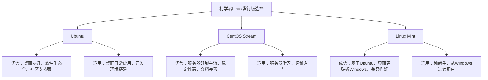
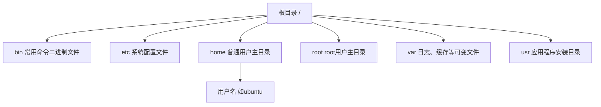
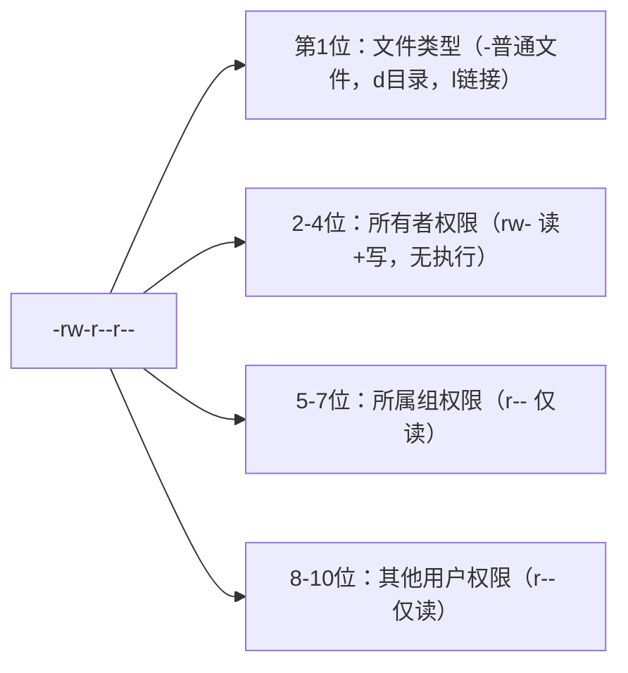
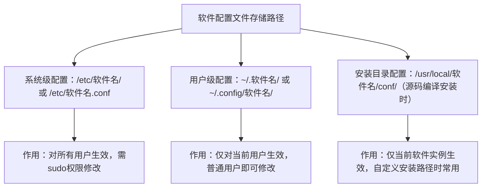
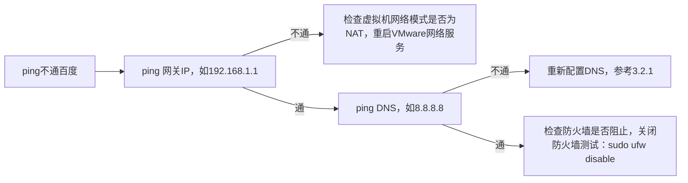

# Linux初学者学习与使用完全指南

本文以教学者身份，从初学者实际使用需求出发，涵盖Linux系统安装配置、核心使用技巧、常见报错解决及后期维护全流程。文档中命令均置于代码块，搭配详细说明；关键逻辑用Markdown图形展示，开头的命令速查表可关联后续章节内容，便于快速查询复用。

## 第一章 Linux命令速查表（关联后续内容）

本速查表涵盖文件操作、系统管理、网络配置、软件管理等核心命令，每个命令后标注关联章节，方便学习时对照深入理解。

| 命令分类    | 命令语法                           | 核心作用              | 关联章节                   |
| ------- | ------------------------------ | ----------------- | ---------------------- |
| 文件/目录操作 | ls [选项] [目录]                   | 列出目录内容，查看文件信息     | 第四章 核心使用 - 4.1 文件系统操作  |
|         | cd [目录路径]                      | 切换当前工作目录          | 第四章 核心使用 - 4.1 文件系统操作  |
|         | pwd                            | 显示当前工作目录的绝对路径     | 第四章 核心使用 - 4.1 文件系统操作  |
|         | mkdir [选项] 目录名                 | 创建新目录             | 第四章 核心使用 - 4.1 文件系统操作  |
|         | rm [选项] 文件/目录                  | 删除文件或目录（谨慎使用）     | 第四章 核心使用 - 4.1 文件系统操作  |
|         | cp [选项] 源文件 目标路径               | 复制文件或目录           | 第四章 核心使用 - 4.1 文件系统操作  |
| 系统管理    | sudo [选项] 命令                   | 以超级管理员权限执行命令      | 第三章 基础配置 - 3.2 用户与权限配置 |
|         | systemctl [选项] 服务名             | 管理系统服务（启动/停止/自启）  | 第五章 常见报错 - 5.3 服务启动失败  |
|         | top                            | 实时监控系统进程与资源占用     | 第四章 核心使用 - 4.3 进程管理    |
|         | df [选项]                        | 查看磁盘空间使用情况        | 第六章 后期维护 - 6.1 系统资源监控  |
| 网络配置    | ip addr                        | 查看网络接口配置信息        | 第三章 基础配置 - 3.1 网络配置    |
|         | ping [IP/域名]                   | 测试网络连通性           | 第五章 常见报错 - 5.4 网络连接问题  |
|         | ssh 用户名@IP                     | 远程登录Linux系统       | 第四章 核心使用 - 4.4 网络管理    |
| 软件管理    | apt [选项] 命令（Debian/Ubuntu）     | 包管理工具（安装/更新/卸载软件） | 第三章 基础配置 - 3.3 软件源配置   |
|         | yum [选项] 命令（CentOS/RHEL）       | 包管理工具（适用于红帽系系统）   | 第三章 基础配置 - 3.3 软件源配置   |
|         | dpkg -i 软件包.deb（Debian/Ubuntu） | 手动安装deb格式软件包      | 第五章 常见报错 - 5.2 软件安装失败  |
| 日志与排查   | journalctl [选项]                | 查看系统日志，排查故障       | 第六章 后期维护 - 6.2 日志管理    |
|         | dmesg                          | 查看内核环缓冲区日志，定位硬件问题 | 第五章 常见报错 - 5.1 启动故障    |

## tar 命令参数速查表
操作类型（必选其一）

| 参数 | 作用 | 适用场景 |
| ---- | ---- | ---- |
| -c | 创建归档（打包） | 生成新 tar 包 |
| -x | 提取/解压归档 | 解压文件 |
| -t | 查看归档内容 | 只浏览、不解压 |
| -r | 追加文件到归档 | 仅**未压缩**的 .tar 文件 |

压缩格式（按需搭配）

| 参数 | 压缩算法 | 后缀名 | 特点 |
| ---- | -------- | ------ | ---- |
| -z | gzip | .tar.gz | 速度快、日常最常用 |
| -j | bzip2 | .tar.bz2 | 压缩率中等 |
| -J | xz | .tar.xz | 压缩率最高，速度偏慢 |

辅助常用选项

| 参数 | 作用 | 补充说明 |
| ---- | ---- | -------- |
| -v | 输出详细执行过程 | 可视化打包/解压进度 |
| -f | 指定归档文件名 | **必须写在所有参数最后** |
| -C | 指定解压目标目录 | 仅解压场景使用 |
| -p | 保留文件原有权限 | 多用于数据备份 |
| -P | 保留绝对路径 | 默认会剔除路径开头 `/` |
| --delete | 删除包内指定文件 | 仅**未压缩**的 .tar 文件可用 |

高频实用命令模板

| 功能            | 命令示例                           |
| ------------- | ------------------------------ |
| 打包并压缩为 tar.gz | `tar -zcvf 包名.tar.gz 待打包文件/目录` |
| 解压 tar.gz     | `tar -zxvf 包名.tar.gz`          |
| 解压到指定目录       | `tar -zxvf 包名.tar.gz -C /目标路径` |
| 查看 tar.gz 内容  | `tar -ztvf 包名.tar.gz`          |
| 解压 tar.bz2    | `tar -jxvf 包名.tar.bz2`         |
| 解压 tar.xz     | `tar -Jxvf 包名.tar.xz`          |
## 第二章 Linux入门准备：系统选择与环境搭建

### 2.1 适合初学者的Linux发行版选择

Linux发行版众多，初学者无需纠结“最优解”，优先选择“社区活跃、文档丰富、操作友好”的版本，以下是三大主流选择及适用场景：



建议优先选择Ubuntu 22.04 LTS（长期支持版），支持周期5年，稳定性和兼容性均有保障，适合入门后长期使用。

### 2.2 安装环境选择：实体机vs虚拟机

初学者无需急于在实体机安装，虚拟机是更安全的选择，可避免影响现有Windows/macOS系统，两者对比及操作建议如下：

|安装方式|优点|缺点|操作建议|
|---|---|---|---|
|虚拟机（推荐）|1. 与主机系统隔离，故障不影响主机；2. 可快速快照、恢复；3. 方便切换系统|资源占用较高，图形性能有限|使用VMware Workstation Player（免费）或VirtualBox，分配2核CPU、4G内存、50G磁盘|
|实体机（双系统）|性能无损耗，体验完整|操作风险高，分区错误可能丢失数据|熟练使用虚拟机后尝试，提前备份主机数据|

## 第三章 Linux系统安装与基础配置

### 3.1 Ubuntu 22.04 虚拟机安装步骤（以VMware为例）

#### 3.1.1 前期准备

1. 下载系统镜像：从[Ubuntu官网](https://ubuntu.com/download/desktop)下载“Ubuntu 22.04.3 LTS”桌面版镜像（iso文件）
2. 安装VMware Workstation Player，打开后点击“创建新的虚拟机”

#### 3.1.2 虚拟机配置与安装


#### 3.1.3 安装后验证

重启后输入设置的密码登录，打开终端（快捷键Ctrl+Alt+T），执行以下命令验证系统版本：

```bash
lsb_release -a
```

若输出“Description: Ubuntu 22.04.3 LTS”，说明安装成功。

### 3.2 基础配置：网络、用户与权限

#### 3.2.1 网络配置（确保能联网）

虚拟机默认使用“NAT模式”，一般可自动获取IP，无需手动配置。验证网络连通性：

```bash
ping -c 3 baidu.com  # -c 3表示发送3个数据包后停止
```

若输出“64 bytes from ...”，说明网络正常；若报错“unknown host”，检查VMware的“虚拟网络编辑器”是否正常。
手动配置静态IP（可选，适合服务器场景）：

```bash
sudo nano /etc/netplan/01-network-manager-all.yaml  # 编辑网络配置文件
```

输入以下内容（需替换IP、网关为实际网段）：

```yaml
network:
  ethernets:
    ens33: # 网卡名称，用ip addr查看
      addresses: [192.168.1.100/24] # 静态IP和子网掩码
      gateway4: 192.168.1.1 # 网关
      nameservers:
        addresses: [8.8.8.8, 114.114.114.114] # DNS
  version: 2
  renderer: NetworkManager
```

保存生效：

```bash
sudo netplan apply
```

#### 3.2.2 用户与权限配置（核心：sudo的使用）

Linux中“root”是超级管理员，初学者不建议直接登录root，而是用普通用户+sudo获取权限，原理如下：


sudo常见操作：

```bash
sudo -i  # 切换到root用户（慎用，退出用exit）
sudo ls /root  # 以root权限查看/root目录（普通用户无权限）
sudo passwd root  # 设置root密码（忘记时可用）
```

> 注意：sudo密码是当前普通用户的密码，不是root密码；连续使用sudo无需重复输密码（默认5分钟有效期）。

#### 3.3 软件源配置（解决下载慢问题）

Ubuntu默认软件源在国外，下载软件慢，需替换为国内镜像源（如阿里云、清华源）：

1. 备份默认源：
   `sudo cp /etc/apt/sources.list /etc/apt/sources.list.bak`
2. 编辑源文件：
   `sudo nano /etc/apt/sources.list`
3. 删除原有内容，粘贴阿里云源（22.04对应代号“jammy”）：

```
    `deb http://mirrors.aliyun.com/ubuntu/ jammy main restricted universe multiverse
    deb-src http://mirrors.aliyun.com/ubuntu/ jammy main restricted universe multiverse
    deb http://mirrors.aliyun.com/ubuntu/ jammy-security main restricted universe multiverse
    deb-src http://mirrors.aliyun.com/ubuntu/ jammy-security main restricted universe multiverse
    deb http://mirrors.aliyun.com/ubuntu/ jammy-updates main restricted universe multiverse
    deb-src http://mirrors.aliyun.com/ubuntu/ jammy-updates main restricted universe multiverse
    deb http://mirrors.aliyun.com/ubuntu/ jammy-backports main restricted universe multiverse
    deb-src http://mirrors.aliyun.com/ubuntu/ jammy-backports main restricted universe multiverse`
```

4. 更新源并升级软件：

```
sudo apt update  # 更新软件源索引
sudo apt upgrade -y  # 升级已安装软件，-y自动确认
```

## 第四章 Linux核心使用：文件、进程与网络

### 4.1 根目录与用户目录结构解析

Linux采用树状文件系统结构，所有文件和目录都源于根目录（`/`）。理解根目录及用户目录下各子目录的作用，是正确操作文件、避免误删系统文件的基础。本节将详细拆解两类目录的核心功能及关键子文件用途。

#### 4.1.1 根目录（/）核心子目录及作用

根目录下的子目录由系统默认创建，各自承担特定功能，部分目录的子文件更是系统运行的核心，以下是最常用子目录的详解：

- **/bin**：存放系统基础命令的二进制可执行文件，普通用户和root都可执行，是系统启动和最小运行必需的命令集合。
- 子文件示例：`ls`（目录列表）、`cd`（切换目录）、`cp`（复制）、`rm`（删除）等，这些命令在任何目录下都可直接调用。
- **/sbin**：存放系统管理命令的二进制文件，主要供root用户使用，用于系统配置、启动管理等关键操作。
- 子文件示例：`reboot`（重启系统）、`shutdown`（关闭系统）、`ifconfig`（旧版网络配置，已逐步被`ip`命令替代）。
- **/etc**：系统核心配置文件目录，几乎所有系统服务、用户信息、软件配置都集中在此，修改需谨慎（建议先备份）。
- 关键子目录/文件：
  - `/etc/passwd`：存储所有用户的基本信息（用户名、UID、主目录等），普通用户可读取。
  - `/etc/group`：存储用户组信息，用于权限管理。
- `/etc/apt`：Ubuntu系统apt包管理工具的配置目录，其中`sources.list`是软件源配置文件（前文3.3节已详解）。
- `/etc/systemd`：系统服务管理配置目录，存放服务的启动脚本（与`systemctl`命令配套使用）。
- **/home**：普通用户的主目录集合，每个普通用户在此拥有一个以用户名命名的独立目录，用户对自己的主目录拥有完全权限。
- 子目录示例：`/home/ubuntu`（ubuntu用户的主目录），后续4.1.2节将详细说明其内部结构。
- **/root**：超级管理员（root用户）的主目录，不同于普通用户的/home下目录，只有root有权限访问和操作。
- **/var**：存放“可变文件”的目录，即运行中会动态变化的文件，如日志、缓存、数据库文件等。
- 关键子目录：
  - `/var/log`：系统和应用的日志文件目录（前文5.4、6.2节重点涉及），如`syslog`（系统日志）、`auth.log`（认证日志）。
  - `/var/cache`：软件运行时的缓存文件目录，如apt的缓存包（可通过`sudo apt clean`清理）。
  - `/var/run`：存储系统运行中进程的PID文件（进程ID标识），系统重启后会清空。
- **/usr**：存放应用程序和系统资源的目录，可理解为“用户资源”目录，类似Windows的Program Files。
- 关键子目录：
  - `/usr/bin`：存放系统非核心的应用命令，如`htop`（进程监控）、`wget`（下载工具）。
  - `/usr/lib`：应用程序依赖的库文件目录，确保软件正常运行。
  - `/usr/share`：存放软件的共享资源，如文档、图标、语言包等。
- **/boot**：系统启动相关文件目录，包含Linux内核、启动加载器（GRUB）配置等，是系统启动的关键。
- 关键文件：`vmlinuz`（Linux内核文件）、`grub.cfg`（GRUB启动配置文件），误删会导致系统无法启动。
- **/dev**：设备文件目录，Linux中“一切皆文件”，硬件设备（如硬盘、键盘、鼠标）都以文件形式在此呈现。
- 常用设备文件：
  - `/dev/sda`：第一块SATA硬盘设备，`/dev/sda1`表示该硬盘的第一个分区。
  - `/dev/null`：“黑洞”设备，写入此文件的内容会被丢弃，常用于屏蔽命令输出。
  - `/dev/zero`：生成空字节数据的设备，可用于创建大文件。
- **/tmp**：临时文件目录，所有用户都可在此创建和删除文件，系统重启后内容会清空，适合存放临时数据。
- **/mnt**：临时挂载目录，用于挂载外接设备（如U盘、移动硬盘）或其他文件系统，例如将U盘挂载到`/mnt/usb`后即可访问其中文件。

#### 4.1.2 用户目录（/home/用户名）结构及作用

用户目录是普通用户的“个人工作区”，系统默认会创建多个子目录用于分类存储文件，用户可根据需求自行创建和管理目录，以下是默认子目录的功能：

- **Documents**：用于存放文档类文件，如文本文件（.txt）、Office文档（.docx、.xlsx）等，是用户日常办公的主要目录。
- **Downloads**：默认的下载目录，浏览器、命令行工具（如wget）下载的文件会自动保存在此。
- **Desktop**：桌面目录，存放的文件或目录会直接显示在图形界面的桌面上，方便快速访问。
- **Pictures**：图片目录，用于存储照片、截图、图片素材等图像文件。
- **Music/Video**：分别用于存储音乐文件（.mp3、.flac）和视频文件（.mp4、.mkv），部分播放器会默认扫描这两个目录。
- **.config**：隐藏目录（以.开头），存放用户级别的应用配置文件，如浏览器设置、终端主题、编辑器配置等，修改此目录文件可定制应用个性化功能。
- **.bashrc**：隐藏的bash配置文件，用于设置命令别名、环境变量等（前文6.3.2节已详解命令别名配置），修改后需通过`source ~/.bashrc`生效。
- **.ssh**：隐藏目录，存放SSH远程登录的密钥文件（如私钥id_rsa、公钥id_rsa.pub），配置免密登录时需在此目录操作。
  核心原则：`/`根目录下仅操作自己明确了解的目录（如/etc需谨慎修改），日常文件操作优先在`/home/用户名`下进行，避免误删系统文件导致崩溃。

### 4.2 文件系统操作（最常用命令）

#### 4.2.1 目录切换与查看

Linux中“一切皆文件”，掌握文件操作是基础。先理解Linux文件系统结构：



#### 4.2.1 目录切换与查看

```bash
cd /home/ubuntu  # 绝对路径切换（从/开始）
cd Documents     # 相对路径切换（从当前目录开始）
cd ..            # 切换到上一级目录
cd ~             # 切换到当前用户主目录（快捷键）
cd -             # 切换到上一次所在目录
pwd              # 显示当前目录绝对路径
ls -l            # 长格式显示（包含权限、大小、修改时间）
ls -a            # 显示隐藏文件（以.开头的文件）
ls -lh           # 人性化显示文件大小（K/M/G）
```

#### 4.2.2 文件/目录创建与删除

```bash
mkdir test_dir          # 创建单个目录
mkdir -p dir1/dir2      # 递归创建多级目录（-p确保父目录存在）
touch test.txt          # 创建空文件
echo "hello linux" > test.txt  # 向文件写入内容（覆盖原有内容）
echo "add content" >> test.txt # 追加内容到文件
rm test.txt             # 删除文件
rm -r test_dir          # 删除目录（-r递归删除子内容）
rm -rf dir1             # 强制删除（-f忽略提示，谨慎使用！）
```

> 警告：rm -rf /\* 会删除系统所有文件，绝对禁止执行！执行删除命令前建议用ls确认目标。

#### 4.2.3 文件复制与移动

```bash
cp test.txt test_copy.txt  # 复制文件到当前目录并重命名
cp -r test_dir /home/ubuntu/  # 复制目录到指定路径
mv test.txt Documents/      # 移动文件到Documents目录
mv old_name.txt new_name.txt # 重命名文件（移动的特殊形式）
```

#### 4.2.4 文件内容查看

```bash
cat test.txt          # 一次性显示整个文件内容
more test.txt         # 分页显示（空格翻页，q退出）
less test.txt         # 更灵活的分页（支持上下键滚动，q退出）
head -5 test.txt      # 显示文件前5行
tail -10 test.txt     # 显示文件后10行
tail -f /var/log/syslog  # 实时跟踪文件更新（日志监控常用）
```

### 4.3 文件权限管理（避免“权限被拒绝”）

Linux文件权限分为“所有者、所属组、其他用户”三类，每类有“读（r）、写（w）、执行（x）”权限，用ls -l可查看：

```bash
ls -l test.txt
# 输出示例：-rw-r--r-- 1 ubuntu ubuntu 12 Oct 10 10:00 test.txt
```

权限解析：



权限修改命令chmod（两种方式：符号法、数字法）：

```bash
# 符号法：u(所有者)、g(所属组)、o(其他)、a(所有)；+（加权限）、-（减权限）、=（设权限）
chmod u+x test.sh     # 给所有者添加执行权限（脚本运行必需）
chmod g+w test.txt    # 给所属组添加写权限
chmod o-r test.txt    # 取消其他用户的读权限
# 数字法：r=4、w=2、x=1，权限值相加（常用！）
chmod 755 test.sh     # 所有者rwx(7)，组和其他rx(5)（脚本默认权限）
chmod 644 test.txt    # 所有者rw(6)，组和其他r(4)（普通文件默认权限）
chmod 777 test_dir    # 所有用户都有rwx权限（测试用，生产环境禁止）
```

修改文件所有者和所属组（chown）：

```bash
sudo chown root:root test.txt  # 把文件所有者和所属组改为root
sudo chown ubuntu:ubuntu -R test_dir  # 递归修改目录及内容的所有者
```

### 4.4 进程管理（解决“系统卡顿”）

进程是运行中的程序，通过进程管理可查看资源占用、终止异常进程。

#### 4.4.1 查看进程

```bash
ps aux  # 查看所有进程（a所有用户，u显示用户，x无终端进程）
ps aux | grep firefox  # 过滤出firefox相关进程（|是管道符，grep过滤）
top                     # 实时监控进程（按P按CPU排序，M按内存排序，q退出）
htop                    # 更友好的进程监控（需安装：sudo apt install htop）
```

#### 4.4.2 终止进程（kill命令）

```bash
kill 1234  # 1234是进程ID（PID，通过ps或top获取），发送终止信号
kill -9 1234  # 强制终止进程（-9是强制信号，用于普通kill无效的进程）
pkill firefox  # 通过进程名终止进程（无需记PID，更方便）
```

### 4.5 网络管理（远程登录与文件传输）

#### 4.5.1 远程登录（ssh）

Linux服务器管理常用ssh远程登录，Ubuntu默认未安装ssh服务，需先安装：

```bash
sudo apt install openssh-server  # 安装ssh服务
sudo systemctl start ssh         # 启动服务
sudo systemctl enable ssh        # 设置开机自启
sudo systemctl status ssh        # 查看服务状态（active(running)为正常）
```

远程登录命令（Windows需用PuTTY或PowerShell，macOS/Linux直接用终端）：

```bash
ssh ubuntu@192.168.1.100  # 用户名@目标IP，首次登录输入yes确认，再输密码
```

#### 4.5.2 远程文件传输（scp）

```bash
# 本地文件传到远程
scp /home/ubuntu/test.txt ubuntu@192.168.1.100:/home/ubuntu/Documents/
# 远程文件传到本地
scp ubuntu@192.168.1.100:/home/ubuntu/data.zip /home/local/
# 传输目录加-r参数
scp -r /home/ubuntu/test_dir ubuntu@192.168.1.100:/home/ubuntu/
```

### 4.6 软件安装、运行与配置（核心实用技能）

Linux软件管理与Windows差异较大，核心依赖“包管理工具”或手动安装。本节将详细介绍Ubuntu（Debian系）和CentOS（RHEL系）的主流安装方式，以及软件运行、配置文件管理的完整流程，解决“怎么装软件、怎么启动、怎么改设置”的核心问题。

#### 4.6.1 软件安装：主流方式全解析

Linux软件安装优先使用系统自带的包管理工具（自动化处理依赖），其次是手动安装二进制包或源码编译（适合特殊需求）。

##### 4.6.1.1 包管理工具安装（推荐，自动化处理依赖）

不同Linux发行版包管理工具不同，重点掌握Ubuntu的`apt`和CentOS的`yum`/`dnf`。

- **Ubuntu/Debian系：apt命令（前文3.3节已讲软件源配置，此处衔接使用）**
  apt通过软件源索引查找软件，安装前需更新索引确保获取最新版本：`# 1. 更新软件源索引（必做步骤，避免安装旧版本或找不到包）
  sudo apt update # 仅更新索引，不安装软件

##### 4.6.1.2 安装软件（以常用编辑器vim、浏览器firefox为例）

sudo apt install -y vim firefox # -y自动确认安装，无需手动输入yes

##### 4.6.1.3安装指定版本（需知道具体版本号，如安装vim 9.0版本）

sudo apt install -y vim=2:9.0.1378-2ubuntu2

##### 4.6.1.4 卸载软件（两种方式：保留配置/彻底删除）

sudo apt remove -y firefox # 卸载软件，保留配置文件（适合后续重装）
sudo apt purge -y firefox # 彻底卸载，删除所有配置文件

##### 4.6.1.5 升级已安装软件

sudo apt upgrade -y # 升级所有可更新的软件
`sudo apt upgrade -y vim  # 仅升级指定软件`
提示：若安装时提示“依赖关系未满足”
执行`sudo apt -f install`可自动修复依赖，再重新安装目标软件。

- **CentOS/RHEL系：yum/dnf命令（红帽系系统通用）**
  CentOS 7用`yum`，CentOS 8及以上推荐用`dnf`（功能更强），操作逻辑与apt类似：
  `# 1. 更新软件源索引`
  sudo yum check-update # yum更新索引
  sudo dnf check-update # dnf更新索引（CentOS 8+）

#### 4.6.2 安装软件（以nginx为例）

sudo dnf install -y nginx # CentOS 8+替代命令

##### 4.6.2.1ubuntu

###### 4.6.2.1.1手动安装：

4.6.2.1.1.1二进制包（.deb/.rpm）
当包管理工具中没有目标软件（如小众工具、特定版本）时，可下载官方提供的二进制包手动安装，核心是处理依赖问题。

- **Ubuntu：.deb包（用dpkg命令）**

```
  .deb是Debian系的二进制包格式，常见于官网下载（如Chrome浏览器）：
  # 1. 下载.deb包（以Chrome为例，可从官网获取下载链接）
  wget https://dl.google.com/linux/direct/google-chrome-stable_current_amd64.deb
  4.6.2.1.1.2 安装.deb包（dpkg不自动处理依赖，可能报错）
  sudo dpkg -i google-chrome-stable_current_amd64.deb
  4.6.2.1.1.3 修复依赖问题（若上一步报错“依赖缺失”）
  sudo apt -f install -y  # 自动安装缺失的依赖，同时完成软件安装
```

###### 自动安装

sudo yum install -y nginx

##### 4.6.2.2 centos

###### 4.6.2.2.1手动安装

4.6.2.2.1.1获取.rpm包
4.6.2.2.1.2 安装.rpm包
sudo rpm -ivh google-chrome-stable_current_x86_64.rpm # -i安装，-v详细信息，-h进度条
4.6.2.2.1.3修复依赖（rpm不自动处理依赖，需用yum/dnf补全）
sudo yum install -y ./google-chrome-stable_current_x86_64.rpm # 用yum安装包并补依赖

#### 4.6.3. 卸载软件

sudo yum remove -y nginx
sudo dnf remove -y nginx

##### 4.6.3.1. 卸载.deb安装的软件

`sudo dpkg -r google-chrome-stable  # 仅卸载软件`
`sudo dpkg -P google-chrome-stable  # 卸载并删除配置文件`

- **CentOS：.rpm包（用rpm命令）**

```
  .rpm是红帽系的二进制包格式：`# 1. 下载.rpm包（以Chrome为例）
  wget https://dl.google.com/linux/direct/google-chrome-stable_current_x86_64.rpm
```

##### 4.6.3.2. 卸载.rpm安装的软件

`sudo rpm -e google-chrome-stable`

#### 4.6.4. 升级软件

`sudo yum update -y`
`sudo dnf update -y`

#### 4.6.5 源码编译安装（进阶：适合定制化需求）

当需要修改软件功能、优化编译参数时，需从源码编译安装（步骤稍复杂，初学者可先掌握前两种方式），核心流程为“下载源码→配置→编译→安装”：
`# 以安装最新版git为例（Ubuntu环境）`

##### 4.6.5.1. 安装编译依赖工具

`sudo apt install -y gcc make libssl-dev zlib1g-dev`

##### 4.6.5.2. 下载源码包并解压

`wget https://mirrors.edge.kernel.org/pub/software/scm/git/git-2.43.0.tar.gz`
`tar -zxvf git-2.43.0.tar.gz  # 解压tar.gz包`
`cd git-2.43.0  # 进入源码目录`

##### 4.6.5.3. 配置编译参数（默认安装到/usr/local，可加--prefix指定路径）

./configure --prefix=/usr/local/git # 自定义安装到/usr/local/git

##### 4.6.5.4. 编译并安装（-j4表示用4核CPU加速编译，提高效率）

```
make -j4
sudo make install
```

##### 4.6.5.5. 配置环境变量（让系统识别git命令）

```
echo "export PATH=/usr/local/git/bin:\$PATH" >> ~/.bashrc
source ~/.bashrc  # 立即生效
```

##### 4.6.5.6验证安装

`git --version`

#### 4.6.6 软件运行：多场景启动方法

适用于带GUI的软件（如浏览器、办公软件、编辑器），两种方式：

- 通过“应用程序菜单”：点击桌面左下角菜单，搜索软件名称（如Chrome、Firefox），点击图标即可启动。
- 通过“文件管理器”：手动打开软件安装目录（如/usr/bin），双击可执行文件（如google-chrome）启动，部分系统需右键“运行”确认。

##### 4.6.6.1 命令行启动（核心场景，服务器必备）

适用于所有软件，尤其是无GUI的服务器软件（如Nginx、MySQL），常用启动方式：

```bash
# 1. 直接启动（前台运行，关闭终端则软件停止）
firefox  # 启动浏览器（前台运行）
nginx    # 启动Nginx服务器（前台运行）
# 2. 后台启动（关闭终端不影响，核心实用技巧）
firefox &  # 末尾加&，软件转入后台运行
nginx &
# 3. 强制后台启动（即使终端关闭也持续运行，用nohup）
nohup firefox > /dev/null 2>&1 &
# 解释：nohup忽略终端关闭信号；>/dev/null屏蔽标准输出；2>&1屏蔽错误输出；末尾&后台运行
# 4. 启动指定配置文件（软件支持时，以Nginx为例）
nginx -c /etc/nginx/my_nginx.conf  # -c指定自定义配置文件
# 5. 验证软件是否启动成功
ps aux | grep firefox  # 过滤firefox进程，有结果则说明启动成功
netstat -tuln | grep 80  # 检查Nginx默认80端口是否监听（有结果则启动成功）
```

##### 4.6.6.2 开机自启：服务化管理（systemctl）

对于服务器软件（如Nginx、MySQL），需配置为开机自启，避免重启系统后手动启动，核心用`systemctl`命令（前文3.2.1节服务管理已提及，此处深化）：

```bash
# 以Nginx为例，前提：软件已通过包管理工具安装（会自动生成systemd服务文件）
# 1. 查看软件服务状态（是否运行、是否自启）
sudo systemctl status nginx  # active(running)表示正在运行
# 2. 启动/停止/重启服务
sudo systemctl start nginx   # 启动
sudo systemctl stop nginx    # 停止
sudo systemctl restart nginx # 重启（修改配置后常用）
sudo systemctl reload nginx  # 平滑重启（不中断服务，推荐生产环境用）
# 3. 配置开机自启/取消自启
sudo systemctl enable nginx  # 设置开机自启（核心命令）
sudo systemctl disable nginx # 取消开机自启
# 4. 验证自启配置是否生效
sudo systemctl is-enabled nginx  # 输出enabled表示已配置自启
# 特殊情况：手动安装的软件无默认服务文件，需手动创建（以自定义脚本为例）
# 步骤：1. 创建服务文件 /etc/systemd/system/myapp.service
#       2. 写入配置（见下方示例）
#       3. 重新加载systemd配置：sudo systemctl daemon-reload
#       4. 启用自启：sudo systemctl enable myapp
# 自定义服务文件示例（/etc/systemd/system/myapp.service）
[Unit]
Description=My Custom Application  # 服务描述
After=network.target  # 网络启动后再启动该服务
[Service]
ExecStart=/usr/local/myapp/myapp.sh  # 软件启动命令
ExecStop=/usr/local/myapp/stop.sh    # 软件停止命令
Restart=on-failure  # 软件故障时自动重启
[Install]
WantedBy=multi-user.target  # 多用户模式下自启
```

##### 4.6.6.3 软件配置：找到并修改配置文件

Linux软件配置不依赖“图形化设置界面”，核心是修改配置文件（多为文本格式），修改后需重启软件或服务生效。掌握配置文件位置是关键。

###### 4.6.6.3.1. 配置文件的3个常见位置



常见软件配置文件位置示例：
|软件名称|系统级配置位置|用户级配置位置|
|---|---|---|
|Nginx|/etc/nginx/nginx.conf|无（服务类软件优先系统级配置）|
|Vim|/etc/vim/vimrc|~/.vimrc|
|Chrome|无|~/.config/google-chrome/|
|MySQL|/etc/mysql/my.cnf|无|

###### 4.6.6.3.2. 配置文件修改与生效流程

以修改Nginx端口（默认80→8080）为例，完整演示配置流程：

```bash
# 步骤1：找到并编辑配置文件（系统级配置，需sudo）
sudo nano /etc/nginx/nginx.conf  # 用nano编辑，也可用vim
# 步骤2：修改配置内容（找到如下段落，将listen 80改为listen 8080）
server {
    listen 8080;  # 原内容为listen 80，修改端口
    server_name localhost;
    # 其他配置保持不变
}
# 步骤3：保存退出（nano编辑器：Ctrl+O保存，Enter确认，Ctrl+X退出）
# 步骤4：验证配置文件是否正确（避免语法错误导致服务启动失败）
sudo nginx -t  # 输出“test is successful”表示配置正确
# 步骤5：重启服务使配置生效（平滑重启不中断服务）
sudo systemctl reload nginx  # 或sudo nginx -s reload
# 步骤6：验证配置是否生效（检查8080端口是否监听）
netstat -tuln | grep 8080  # 输出“tcp  0  0 0.0.0.0:8080  0.0.0.0:*  LISTEN”表示生效
```

重要：修改配置文件前务必备份！例如：
`sudo cp /etc/nginx/nginx.conf /etc/nginx/nginx.conf.bak`，
配置错误时可通过
`sudo cp /etc/nginx/nginx.conf.bak /etc/nginx/nginx.conf`恢复。

###### 4.6.6.3.3. 配置文件常见格式：文本文件为主

Linux软件配置文件多为纯文本格式，无需专用工具编辑，常见格式：

- 键值对格式（如Vim的~/.vimrc）：`set number  # 显示行号，#后为注释`
- 区块格式（如Nginx、Apache）：用`{}`划分功能模块，层次清晰
- XML/JSON格式（少数软件，如Tomcat）：结构严谨，需注意标签闭合
  修改时重点关注“注释说明”（#或//开头），软件会忽略注释内容，初学者可通过注释理解配置项含义。

#### 4.6.7 软件卸载：彻底清理不留残留

卸载软件需根据安装方式选择对应命令，避免残留配置文件占用空间：

```bash
# 1. 包管理工具安装的软件（apt/yum）：用对应工具彻底卸载
sudo apt purge -y nginx  # Ubuntu彻底卸载Nginx及配置
sudo yum remove -y nginx  # CentOS彻底卸载Nginx
# 2. 手动安装的.deb/.rpm包：用dpkg/rpm彻底卸载
sudo dpkg -P google-chrome-stable  # 彻底卸载deb包软件
sudo rpm -e --nodeps google-chrome-stable  # --nodeps强制卸载（忽略依赖，谨慎用）
# 3. 源码编译安装的软件：手动删除安装目录+配置文件
sudo rm -rf /usr/local/git  # 删除源码安装的git目录
rm -rf ~/.gitconfig  # 删除用户级git配置文件
# 4. 清理残留依赖（包管理工具安装的软件）
sudo apt autoremove -y  # Ubuntu清理无用依赖
sudo yum autoremove -y  # CentOS清理无用依赖
```

本指南覆盖了Linux初学者从安装到维护的全流程，核心是掌握“命令使用+权限理解+故障排查”的思路。建议初学者先通过虚拟机反复练习文件操作、sudo权限、apt命令等基础内容，再逐步尝试服务管理、脚本编写等进阶内容。
进阶方向：

1. Shell脚本编程：用bash脚本实现自动化操作（如批量备份、日志清理）
2. 服务器运维：学习Nginx、MySQL等服务的部署与管理
3. 容器技术：了解Docker容器，实现应用的快速部署与隔离
   遇到问题时，优先通过`journalctl`查看日志，或用“Linux 报错信息”关键词搜索，社区（如Stack Overflow、Ubuntu论坛）有大量解决方案。

## 第五章 主流发行版配套软件使用与配置

Linux各发行版基于内核衍生，在“配套软件”（系统预装/官方推荐工具）上形成了差异化特色。本节聚焦Ubuntu、CentOS Stream、Linux Mint、Fedora四大主流发行版，针对其核心配套软件（包管理、桌面工具、系统服务等），提供统一逻辑下的使用与配置方法，帮助初学者快速适配不同发行版环境。

### 5.1 Ubuntu（Debian系代表）：apt与GNOME生态

Ubuntu作为桌面与服务器双场景主流发行版，核心配套软件围绕`apt`包管理和GNOME桌面环境构建，兼顾易用性与扩展性。

#### 5.1.1 核心配套软件：功能定位与使用

| **软件名称**   | **核心功能**                             | **基础使用命令/操作**                                                                     |
| -------------- | ---------------------------------------- | ----------------------------------------------------------------------------------------- |
| apt/apt-get    | 包管理核心，负责软件安装/更新/卸载       | sudo apt update（更新索引）；sudo apt install -y 软件名；sudo apt autoremove（清理依赖）  |
| GNOME Settings | 桌面可视化配置工具（网络、显示、用户等） | 图形界面：菜单搜索“设置”；命令行：gnome-control-center                                    |
| GDebi          | .deb包可视化安装工具（自动处理依赖）     | sudo apt install gdebi；右键.deb文件选择“用GDebi打开”                                     |
| UFW            | 简易防火墙（替代复杂的iptables）         | sudo ufw enable（开启）；sudo ufw allow 80/tcp（放行80端口）；sudo ufw status（查看状态） |
| Nautilus       | GNOME默认文件管理器                      | 图形界面：点击“文件”；命令行：nautilus 路径（如nautilus ~/Downloads）                     |

#### 5.1.2 关键配置：适配新手需求

##### 1. apt软件源优化（解决下载慢）

在第三章基础上深化，除阿里云源外，补充Ubuntu官方国内镜像配置方法：

```bash
# 1. 备份默认源
sudo cp /etc/apt/sources.list /etc/apt/sources.list.bak
# 2. 编辑源文件，替换为清华源（22.04代号jammy）
sudo nano /etc/apt/sources.list
# 粘贴以下内容（覆盖原有内容）
deb https://mirrors.tuna.tsinghua.edu.cn/ubuntu/ jammy main restricted universe multiverse
deb-src https://mirrors.tuna.tsinghua.edu.cn/ubuntu/ jammy main restricted universe multiverse
deb https://mirrors.tuna.tsinghua.edu.cn/ubuntu/ jammy-updates main restricted universe multiverse
deb-src https://mirrors.tuna.tsinghua.edu.cn/ubuntu/ jammy-updates main restricted universe multiverse
deb https://mirrors.tuna.tsinghua.edu.cn/ubuntu/ jammy-backports main restricted universe multiverse
deb-src https://mirrors.tuna.tsinghua.edu.cn/ubuntu/ jammy-backports main restricted universe multiverse
deb https://mirrors.tuna.tsinghua.edu.cn/ubuntu/ jammy-security main restricted universe multiverse
deb-src https://mirrors.tuna.tsinghua.edu.cn/ubuntu/ jammy-security main restricted universe multiverse
# 3. 更新索引生效
sudo apt update
```

##### 2. GNOME桌面个性化配置（提升易用性）

针对Windows过渡用户，优化GNOME操作习惯：

```bash

# 1. 安装桌面优化工具（扩展管理）
sudo apt install -y gnome-tweaks gnome-shell-extensions
# 2. 启用“窗口最小化/最大化”按钮（图形操作）
# 打开“优化”→“窗口标题栏”→勾选“最小化”“最大化”
# 3. 命令行设置任务栏位置（底部显示，类似Windows）
gsettings set org.gnome.shell.extensions.dash-to-dock dock-position BOTTOM
# 4. 显示桌面图标
gsettings set org.gnome.nautilus.desktop icons-visible true
```

### 5.2 CentOS Stream（RHEL系代表）：yum/dnf与服务器工具

CentOS Stream面向服务器场景，配套软件以稳定性为核心，核心工具为`yum`（7版本）/`dnf`（8+版本）包管理和系统服务管理工具。

#### 5.2.1 核心配套软件：使用与区别

- **yum与dnf：包管理双工具**
  dnf是yum的升级版本，CentOS Stream 9默认使用dnf，兼容性更好，命令逻辑一致：

```
# 1. 基础操作（yum/dnf通用，以dnf为例）
sudo dnf check-update  # 检查可更新软件
sudo dnf install -y nginx  # 安装软件
sudo dnf remove -y nginx   # 卸载软件
sudo dnf update -y         # 升级所有软件
```

#### 5.2.2. yum与dnf的核心区别（CentOS 7用户注意）

```
sudo yum makecache  # yum需手动生成缓存
sudo dnf clean all  # dnf清理缓存更彻底（自动处理冗余）
```

- **Firewalld：默认防火墙（替代iptables）**
  CentOS默认启用Firewalld，服务器场景必须掌握基础配置：

```
# 1. 服务管理
sudo systemctl start firewalld  # 启动
sudo systemctl enable firewalld # 开机自启
```

### 5.3. 核心配置（放行端口/服务）

```
sudo firewall-cmd --add-port=80/tcp --permanent  # 永久放行80端口（HTTP）
sudo firewall-cmd --add-service=ssh --permanent  # 永久放行SSH服务
sudo firewall-cmd --reload  # 重新加载规则生效
```

#### 5.3.1. 查看当前规则

`sudo firewall-cmd --list-all`

- **chronyd：时间同步服务**
  确保服务器时间准确，避免日志和定时任务异常

```txt
# 1. 启动并设置自启
sudo systemctl start chronyd
sudo systemctl enable chronyd
```

##### 5.3.1.2. 手动同步时间（国内用阿里云时间服务器）

```
sudo chronyc -a makestep
sudo chronyc add server ntp.aliyun.com iburst
```

##### 5.3.1.3. 验证时间

`timedatectl`

#### 5.3.2 服务器场景配置：安全与性能优化

CentOS服务器必做：关闭SELinux（新手避免权限拦截，生产环境需按需配置）

```bash
# 1. 临时关闭（立即生效，重启失效）
sudo setenforce 0
# 2. 永久关闭（编辑配置文件）
sudo nano /etc/selinux/config
# 将SELINUX=enforcing改为SELINUX=disabled
# 3. 重启系统生效
sudo reboot
```

### 5.4 Linux Mint

（桌面友好型）：apt与Cinnamon工具
Linux Mint基于Ubuntu衍生，主打桌面易用性，配套软件在Ubuntu基础上增加了Cinnamon桌面专属工具，更贴近Windows操作习惯。

#### 5.4.1 特色配套软件：Cinnamon生态

- **Mint Menu：自定义开始菜单**
  图形操作：右键“开始菜单”→“配置”，可添加常用软件到“收藏”、调整菜单布局；命令行快速启动菜单编辑：`mintmenu-editor`

- **Timeshift：系统备份与还原工具**
  新手必备，避免操作失误导致系统崩溃：

```
# 1. 安装（部分版本预装）
sudo apt install -y timeshift
```

#### 5.4.2. 图形化操作：

菜单搜索Timeshift→选择“RSYNC”模式→设置备份目录→执行首次备份

#### 5.4.3. 命令行恢复（紧急场景）

`sudo timeshift --restore --snapshot "2025-12-14_10-00-00" --target /`

- **Update Manager：可视化更新工具**
  替代命令行apt更新，图形界面显示更新类型（安全/推荐），操作更直观：菜单搜索“更新管理器”→点击“安装更新”即可。

### 5.5 Fedora（创新型RHEL系）：dnf与GNOME 4x

Fedora由红帽支持，主打前沿技术，配套软件采用最新版dnf和GNOME 40+桌面，适合开发者体验新功能。

#### 5.5.1 核心配套软件：差异化特色

- **dnf5：新一代包管理工具**
  Fedora 39+默认使用dnf5，速度比传统dnf提升30%+：

```
# 1. 基础命令（兼容dnf语法）
sudo dnf5 install -y gcc  # 安装编译工具
sudo dnf5 search python3  # 搜索软件
sudo dnf5 remove -y gcc   # 卸载软件
```

#### 5.5.2. 特色功能：一键升级系统版本

```
sudo dnf5 system-upgrade download --releasever=40
# 准备升级到Fedora 40
sudo dnf5 system-upgrade reboot
# 重启完成升级
```

**Flatpak：沙箱化应用管理**
Fedora默认支持Flatpak，用于安装最新版桌面应用（如Chrome、VS Code）：
安装Flatpak应用（以VS Code为例）
`flatpak install flathub com.visualstudio.code`

#### 5.5.3. 启动应用

`flatpak run com.visualstudio.code`

#### 5.5.4 卸载应用

`flatpak uninstall com.visualstudio.code`

#### 5.5.5 跨发行版通用技巧：软件选择与适配

核心原则：优先使用发行版“原生包管理工具”安装软件，其次用Flatpak/Snap（跨发行版通用），避免源码编译（新手易出错）。

1. **软件存在性查询**：不确定发行版是否有目标软件时，用包管理工具搜索，如Ubuntu用`apt search 软件名`，Fedora用`dnf search 软件名`。
2. **版本兼容性**：安装指定版本软件时，Ubuntu用`apt show 软件名`查看可用版本，CentOS用`dnf list 软件名 --showduplicates`。
3. **跨发行版迁移**：从Ubuntu迁移到CentOS时，将`apt`命令对应替换为`dnf`，核心逻辑（安装/卸载/更新）完全一致，仅工具名称不同。

### 5.6 树莓派OS（嵌入式代表）：apt与硬件控制工具

树莓派OS（原Raspbian）基于Debian优化，专为树莓派硬件设计，配套软件兼顾桌面使用与硬件控制，核心工具围绕`apt`和树莓派专属配置工具构建。

#### 5.6.1 核心配套软件：硬件与桌面双场景

- **raspi-config：硬件配置核心工具**
  树莓派专属配置工具，用于启用硬件接口、调整分辨率等，必须掌握：

```
# 启动配置界面（需sudo权限）
sudo raspi-config
```

#### 5.6.2常用配置项操作：

1.  启用GPIO/I2C/SPI接口：选择“Interface Options”→对应接口设为“Enabled”
2.  扩展文件系统：选择“Advanced Options”→“Expand Filesystem”（利用完整SD卡空间）
3.  修改默认密码：选择“System Options”→“Change User Password”
4.  配置时区：选择“Localisation Options”→“Timezone”设置对应区域`

#### 5.6.3**硬件控制工具集**

针对树莓派硬件开发的配套工具，适合嵌入式入门：

1.  安装GPIO控制库（Python）
    `sudo apt install -y python3-rpi.gpio python3-gpiozero`
2.  测试GPIO输出（Python示例，点亮LED）
    `python3 -c "import RPi.GPIO as gpio; gpio.setmode(gpio.BCM); gpio.setup(18, gpio.OUT); gpio.output(18, gpio.HIGH)"`
3.  查看CPU温度（树莓派散热监控常用）
    `vcgencmd measure_temp  # 输出格式：temp=45.5'C`
4.  硬件信息查询
    `cat /proc/cpuinfo  # 查看CPU详情`
    `lsusb  # 查看USB设备连接情况`

#### 5.6.4**PIXEL桌面工具**

树莓派OS默认PIXEL桌面，配套实用工具：

- **PCManFM**：轻量文件管理器，支持访问网络共享文件夹；
- **Raspberry Pi Configuration**：raspi-config的图形化版本，菜单搜索即可打开。

### 5.7 Kali Linux（安全测试代表）：apt与渗透测试工具

Kali Linux基于Debian，专注渗透测试与安全审计，预装数百款安全工具，核心配套软件围绕`apt`和安全工具集管理展开。

#### 5.7.1 核心配套软件：安全测试专属

- **包管理与工具更新**
  Kali工具需频繁更新，保持与官方同步：

1. 系统与工具全面更新
   sudo apt update && sudo apt full-upgrade -y

#### 5.7.2. 安装特定安全工具（如社工库工具set）

`sudo apt install -y set`

#### 5.7.3. 清理过时工具依赖

`sudo apt autoremove -y`

- **常用预装安全工具使用**
  Kali默认预装工具分类明确，基础使用示例：
  端口扫描工具nmap（扫描目标IP开放端口）
  nmap 192.168.1.100 # 基础扫描
  nmap -sV -p 1-1000 192.168.1.100 # 扫描1-1000端口并识别服务版本

#### 5.7.4 漏洞利用框架metasploit

msfconsole # 启动控制台
msf> search eternalblue # 搜索永恒之蓝漏洞相关模块

#### 5.7.5 密码破解工具john（破解MD5哈希）

`john --format=raw-md5 hash.txt  # hash.txt中存放待破解哈希值`

- **桌面环境优化**
  Kali默认使用Xfce桌面，可切换为GNOME提升易用性：

```
# 安装GNOME桌面
sudo apt install -y kali-desktop-gnome
# 切换桌面环境：注销后在登录界面选择“GNOME”
```

### 5.8 核心基础软件：文档编辑与IDE配置（跨发行版）

无论何种发行版，文档编辑工具（如vim）和集成开发环境（IDE）都是必备工具，以下介绍通用安装与基础配置方法。

#### 5.8.1 文档编辑工具：vim（全发行版通用）

vim是Linux默认文本编辑器，轻量且功能强大，核心操作与配置跨发行版一致。

##### 1. 安装与基础使用

```Plain Text
# 1. 安装vim（部分发行版预装）
sudo apt install -y vim  # Debian/Ubuntu/树莓派OS/Kali
sudo dnf install -y vim  # CentOS/Fedora
# 2. 基础操作流程
vim test.txt  # 打开或创建文件
# 编辑模式：按i进入，输入内容
# 保存退出：按Esc，输入:wq（保存并退出），:q!（强制退出不保存）
# 查找内容：按Esc，输入:/关键词（如:/error），按n切换下一个匹配
```

##### 2. 新手友好配置（用户级）

编辑~/.vimrc文件自定义配置，提升易用性：

```
# 编辑配置文件
vim ~/.vimrc
```

##### 粘贴以下基础配置（直接生效，无需重启）

```
set number  # 显示行号
set tabstop=4  # Tab键对应4个空格
set shiftwidth=4  # 缩进4个空格
set autoindent  # 自动缩进（编程必备）
set hlsearch  # 高亮显示查找结果
set incsearch  # 实时匹配查找关键词
set encoding=utf-8  # 支持UTF-8编码
```

保存退出后，新打开vim即可应用配置```

#### 5.8.2 主流IDE：跨发行版安装与配置

IDE提升开发效率，以下介绍Python、Java、C/C++常用IDE的安装方法，适配各主流发行版。

##### 1. Visual Studio Code（VS Code：全场景开发）

轻量且插件丰富，支持多语言开发，推荐优先选择：

```
# 方法1：Debian/Ubuntu/树莓派OS/Kali（.deb包）
wget -qO- https://packages.microsoft.com/keys/microsoft.asc | gpg --dearmor > packages.microsoft.gpg
sudo install -D -o root -g root -m 644 packages.microsoft.gpg /etc/apt/trusted.gpg.d/microsoft.gpg
echo "deb [arch=amd64,arm64,armhf] https://packages.microsoft.com/repos/code stable main" | sudo tee /etc/apt/sources.list.d/vscode.list > /dev/null
sudo apt update && sudo apt install -y code
# 方法2：CentOS/Fedora（.rpm包）
sudo rpm --import https://packages.microsoft.com/keys/microsoft.asc
echo -e "[code]\nname=Visual Studio Code\nbaseurl=https://packages.microsoft.com/yumrepos/vscode\nenabled=1\ngpgcheck=1\ngpgkey=https://packages.microsoft.com/keys/microsoft.asc" | sudo tee /etc/yum.repos.d/vscode.repo > /dev/null
sudo dnf install -y code
# 基础配置：安装必备插件
# 启动VS Code后，搜索安装Python、C/C++、Java Extension Pack插件
```

##### 2. PyCharm（Python开发专属）

Python开发专业IDE，社区版免费可用：

```
# 方法1：Flatpak安装（跨发行版通用）
sudo flatpak install -y flathub com.jetbrains.PyCharm-Community
# 启动命令：flatpak run com.jetbrains.PyCharm-Community
# 方法2：Debian/Ubuntu手动安装
wget https://download.jetbrains.com/python/pycharm-community-2024.1.tar.gz
tar -zxvf pycharm-community-2024.1.tar.gz
cd pycharm-community-2024.1/bin
 ./pycharm.sh  # 启动IDE，首次运行按提示配置Python解释器
```

##### 3. CLion（C/C++开发专属）

适用于C/C++开发，需先安装编译环境：

```
# 1. 安装编译依赖（全发行版通用）
sudo apt install -y gcc g++ cmake  # Debian系
sudo dnf install -y gcc-c++ cmake  # RHEL系
# 2. Flatpak安装CLion
sudo flatpak install -y flathub com.jetbrains.CLion
# 启动命令：flatpak run com.jetbrains.CLion`
```

## 第六章 常见报错与解决方案（新手避坑指南）

### 6.1 启动故障：虚拟机启动黑屏/报错“未开启虚拟化”

#### 6.1.1 报错原因

CPU未开启虚拟化技术，VMware无法调用硬件加速。

#### 6.1.2 解决方案

1. 重启电脑，开机时按F2/F10/F12（不同品牌主板不同）进入BIOS
2. 找到“Intel VT-x”或“AMD-V”选项，设置为“Enabled”（开启）
3. 保存BIOS设置并重启，重新启动虚拟机

### 6.2 软件安装失败：apt命令报错“无法定位软件包”

#### 6.2.1 常见原因与解决

| 报错信息                         | 原因                                            | 解决方案                                                                  |
| -------------------------------- | ----------------------------------------------- | ------------------------------------------------------------------------- |
| E: 无法定位软件包 xxx            | 1. 软件源未更新；2. 软件名错误；3. 源中无该软件 | 1. 执行sudo apt update；2. 确认软件名（如htop而非htop1）；3. 更换更全的源 |
| E: 有未能满足的依赖关系          | 软件依赖的库文件未安装                          | 执行sudo apt -f install 修复依赖，再重新安装                              |
| E: 无法获得锁 /var/lib/dpkg/lock | 另一个apt进程在运行（如软件中心）               | 1. 关闭软件中心；2. 强制删除锁文件：sudo rm /var/lib/dpkg/lock            |

### 6.3 服务启动失败：systemctl报错“active (failed)”

#### 6.3.1 排查步骤

```bash
# 1. 查看详细错误日志（最关键）
sudo journalctl -u ssh  # 替换ssh为报错的服务名，如nginx、mysql
# 2. 示例：ssh服务启动失败，日志显示“Address already in use”
# 原因：22端口被占用，解决方案：
sudo lsof -i :22  # 查看占用22端口的进程
sudo kill -9 进程PID  # 终止占用进程，再重启服务
sudo systemctl restart ssh
```

### 6.4 网络连接问题：ping不通或无法上网

#### 6.4.1 排查流程



关闭防火墙（测试用，生产环境需配置规则而非关闭）：

```bash
sudo ufw status  # 查看防火墙状态
sudo ufw disable # 关闭防火墙
sudo ufw enable  # 开启防火墙（如需恢复）
```

### 6.5 权限报错：“Permission denied”（权限被拒绝）

#### 6.5.1 常见场景与解决

| 操作场景                        | 原因                                          | 解决方案                                              |
| ------------------------------- | --------------------------------------------- | ----------------------------------------------------- |
| 普通用户修改/etc目录下文件      | /etc是系统配置目录，仅root有权限              | 用sudo执行编辑命令，如sudo nano /etc/apt/sources.list |
| 运行脚本报错“Permission denied” | 脚本无执行权限                                | chmod u+x 脚本名，或用bash 脚本名（无需执行权限）     |
| 访问其他用户的主目录            | 其他用户主目录默认权限为700（仅所有者可访问） | 对方用户执行chmod o+x ~ 开放其他用户的进入权限        |

## 第七章 Linux后期维护与使用技巧

### 7.1 系统资源监控与清理

#### 7.1.1 资源监控常用命令

```bash
df -h  # 查看磁盘空间使用情况（-h人性化显示）
du -sh /home/ubuntu/*  # 查看目录大小（-s汇总，-h人性化）
free -h  # 查看内存使用情况（total总内存，used已用，free空闲）
vmstat  # 查看CPU、内存、IO状态（刷新间隔2秒，显示3次：vmstat 2 3）
```

#### 7.1.2 系统清理（释放磁盘空间）

```bash
# 清理apt缓存（安装软件残留的包文件）
sudo apt clean  # 清理所有缓存
sudo apt autoclean  # 清理旧版本缓存
# 清理无用依赖包
sudo apt autoremove -y  # 自动删除不再需要的依赖
# 清理日志文件（日志过大时）
sudo rm -rf /var/log/*.log  # 删除所有日志（谨慎，建议先备份）
sudo journalctl --vacuum-size=100M  # 限制系统日志大小为100M
```

### 7.2 日志管理（排查故障的核心）

Linux日志集中存放在/var/log目录，常用日志文件及用途：
|日志文件|用途|
|---|---|
|/var/log/syslog|系统核心日志（应用启动、硬件故障等）|
|/var/log/auth.log|认证日志（登录、sudo操作记录）|
|/var/log/dpkg.log|软件安装/卸载日志（apt操作记录）|
|/var/log/boot.log|系统启动日志（启动故障排查）|
日志查看技巧：

```bash
# 按时间筛选日志（近1小时的syslog）
sudo journalctl --since "1 hour ago" -u syslog
# 按关键词筛选（查找包含“error”的日志）
grep "error" /var/log/syslog
# 查找特定时间范围内的日志
grep "Oct 10 10:00:00" /var/log/syslog -A 10 -B 5  # -A后10行，-B前5行
```

### 7.3 实用技巧：提升操作效率

#### 7.3.1 命令行快捷键（必记）

| 快捷键     | 作用                              |
| ---------- | --------------------------------- |
| Ctrl+Alt+T | 快速打开终端                      |
| Tab        | 命令/文件路径自动补全（最常用！） |
| Ctrl+C     | 终止当前运行的命令                |
| Ctrl+L     | 清屏（等同于clear命令）           |
| ↑↓箭头     | 切换历史命令                      |
| Ctrl+R     | 搜索历史命令（输入关键词匹配）    |

#### 7.3.2 命令别名（简化长命令）

把常用的长命令设置为别名，提升效率。编辑~/.bashrc文件：

```bash
nano ~/.bashrc  # 编辑bash配置文件
```

在文件末尾添加别名：

```bash
alias ll='ls -lh'  # 输入ll等同于ls -lh
alias cls='clear'  # 输入cls等同于clear（适应Windows习惯）
alias update='sudo apt update && sudo apt upgrade -y'  # 一键更新系统
```

使别名生效：

```bash
source ~/.bashrc  # 立即生效，重启终端也会保留
```

#### 7.3.3 批量操作（for循环）

批量创建文件、修改文件名等场景常用for循环：

```bash
# 批量创建10个文件：file1.txt到file10.txt
for i in {1..10}; do touch file$i.txt; done
# 批量将.txt文件改为.log文件
for file in *.txt; do mv $file ${file%.txt}.log; done
# 批量压缩目录下的所有子目录（每个子目录生成单独压缩包）
for dir in */; do zip -r ${dir%/}.zip $dir; done
```

## 第八章 总结与进阶方向

本指南覆盖了Linux初学者从安装到维护的全流程，核心是掌握“命令使用+权限理解+故障排查”的思路。建议初学者先通过虚拟机反复练习文件操作、sudo权限、apt命令等基础内容，再逐步尝试服务管理、脚本编写等进阶内容。
进阶方向：

1. Shell脚本编程：用bash脚本实现自动化操作（如批量备份、日志清理）
2. 服务器运维：学习Nginx、MySQL等服务的部署与管理
3. 容器技术：了解Docker容器，实现应用的快速部署与隔离
