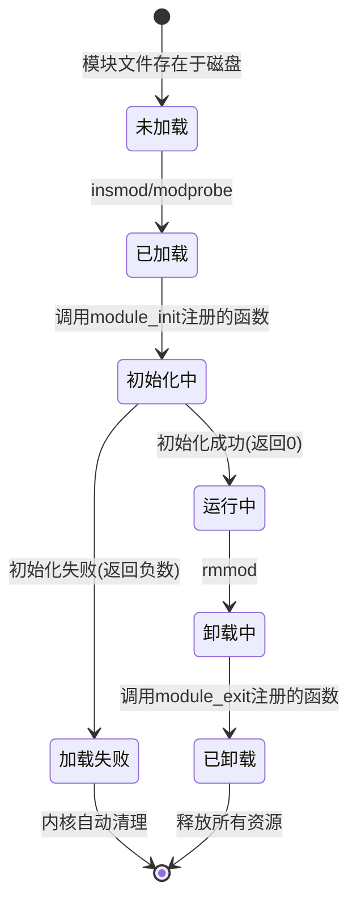
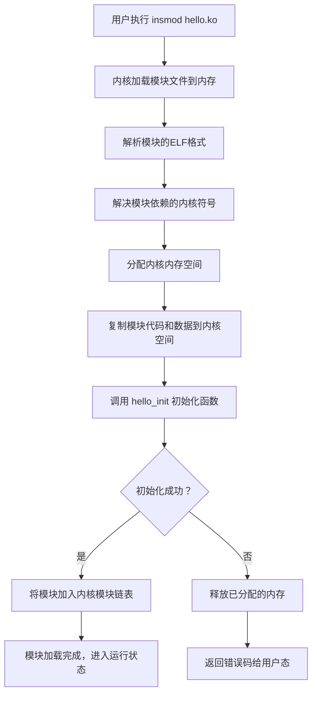
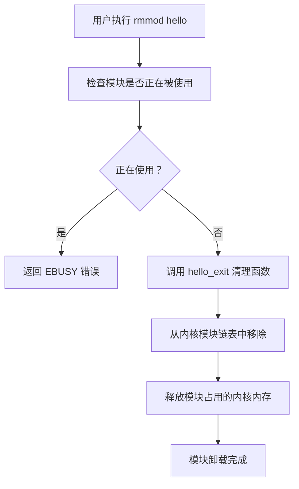
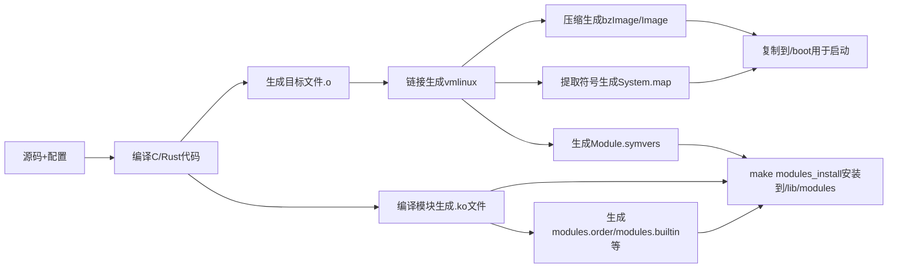

Linux 7.0内核于2026年4月10日正式发布，是Linux内核发展史上的一个重要里程碑。它不仅是版本号的简单升级，更是对内存管理、I/O栈、调度器、Rust语言支持等多个核心子系统的深度优化与演进。本指南将帮助你系统地学习Linux内核源码，理解操作系统的底层构成。
## 内核源码启动顺序

### 引导加载程序：从硬件上电到内核入口

在 Linux 内核获得控制权之前，系统必须经历一系列硬件初始化与引导加载阶段。不同体系架构的引导流程存在显著差异：

- **x86 (含 x86_64)**：传统 BIOS 上电自检（POST）后，读取磁盘主引导记录（MBR）中的引导代码，随后 GRUB 等第二阶段引导程序加载内核镜像 bzImage 到内存。UEFI 固件则直接从 EFI 系统分区加载 GRUB EFI 程序，再加载内核。
- **ARM (32 位)**：处理器从片内 bootROM 启动，加载 U-Boot 等引导程序，U-Boot 负责将内核 uImage/Image 加载到内存并传递机器 ID 或设备树指针（r1/r2 寄存器）。
- **ARM64**：流程为 bootrom → u-boot → Image，内核镜像通常为非压缩格式。
- **RISC-V**：流程为 bootrom → u-boot-spl → OpenSBI → u-boot → Image，其中 OpenSBI 承担监管模式运行时服务。

引导程序的最终职责是将内核镜像放置到正确的物理内存地址，并跳转到内核入口点。以 ARM 架构为例，U-Boot 解析 uImage 的 64 字节头部获取入口地址后，内核便获得控制权。

### 内核解压阶段：zImage 的自我提取

对于采用压缩镜像（如 ARM 32 位的 zImage）的架构，内核获得控制权后的第一步是自解压。zImage 由一段未经压缩的"引导桩"代码与压缩的内核主体拼接而成。

解压工作的核心入口位于 `arch/arm/boot/compressed/head.S`。该汇编文件负责开启 MMU 和 Cache，随后调用 `decompress_kernel()` 函数解压内核主体。解压完成后，通过 `call_kernel()` 跳转到真正的内核入口地址（如 0x80008000）继续执行。

ARM64 和 RISC-V 架构通常使用非压缩的 Image 镜像，因此可直接跳过解压阶段进入架构相关初始化。

### 架构相关启动：从汇编入口到 start_kernel

内核镜像的链接脚本 `vmlinux.lds` 通过 `ENTRY()` 指令定义了内核的第一条执行指令。以下是各架构的入口点及关键处理流程：

| 架构           | 入口文件                                 | 入口函数         | 关键处理内容                                                               |
| ------------ | ------------------------------------ | ------------ | -------------------------------------------------------------------- |
| x86_64       | `arch/x86/boot/head.S`               | `_start`     | 实模式初始化，调用 `main()`（`arch/x86/boot/main.c`），切换到保护模式                   |
| x86_64（保护模式） | `arch/x86/boot/compressed/head_64.S` | `startup_64` | 解压内核（`extract_kernel`），重定位后跳转到 `arch/x86/kernel/head_64.S`           |
| x86_64（长模式）  | `arch/x86/kernel/head_64.S`          | `startup_64` | 建立初始页表，跳转到第一个 C 函数 `x86_64_start_kernel`（`arch/x86/kernel/head64.c`） |
| ARM          | `arch/arm/kernel/head.S`             | `stext`      | 检查处理器 ID，验证机器类型或设备树，创建临时页表，开启 MMU                                    |
| ARM64        | `arch/arm64/kernel/head.S`           | `stext`      | 保存启动参数，创建初始页表，开启 MMU                                                 |

ARM 架构的 `stext` 入口在完成处理器 ID 验证和临时页表建立后，会跳转到 `__mmap_switched` 函数（位于 `arch/arm/kernel/head-common.S`），其末尾有一条关键的 `b start_kernel` 指令，将执行流转入内核 C 语言初始化阶段。

### start_kernel 内核初始化

`start_kernel()` 函数位于 `init/main.c`，是内核第一个与架构无关的 C 函数，也是所有子系统初始化的总调度器。Linux 7.0 的 `start_kernel()` 实现了一个多阶段初始化序列。

**阶段 1：早期系统设置**
`start_kernel()` 首先初始化 0 号进程（idle 进程）的任务结构体 `init_task`，设置其栈尾魔数以防止栈溢出。随后调用 `boot_cpu_init()` 激活启动 CPU、`setup_arch(&command_line)` 完成架构特定的内存映射和早期参数解析、`mm_init_cpumask(&init_mm)` 初始化内存描述符的 CPU 掩码。

**阶段 2：堆与分配器初始化**
通过 `build_all_zonelists()` 构建内存域列表，`page_alloc_init()` 初始化页分配器，`pidhash_init()` 分配 PID 哈希表等。

**阶段 3：initcall 系统**
`start_kernel()` 内部并不直接调用所有子系统的初始化函数，而是在最后通过 `rest_init()` 创建内核线程 `kernel_init`（PID=1），由该线程按编译时确定的顺序逐级执行 `initcall`。

**阶段 4：虚拟内存初始化**
`vfs_caches_init_early()` 进行 VFS 缓存的早期初始化，`trap_init()` 初始化中断陷阱处理，`mm_init()` 完成完整的内存管理子系统初始化（伙伴系统、slab 分配器等）。

**阶段 5：设备探测（两阶段）**
在 `rest_init()` 中，`kernel_init` 线程调用 `do_basic_setup()` 完成设备驱动模型的初始化，包括总线注册、驱动加载和设备探测。
### 启动流程代码路径汇总

```
x86_64:
arch/x86/boot/head.S (_start)
  → arch/x86/boot/main.c (main)
  → arch/x86/boot/pm.c (go_to_protected_mode)
  → arch/x86/boot/compressed/head_64.S (startup_64)
  → arch/x86/boot/compressed/misc.c (extract_kernel)
  → arch/x86/kernel/head_64.S (startup_64)
  → arch/x86/kernel/head64.c (x86_64_start_kernel)
  → init/main.c (start_kernel)

ARM:
arch/arm/boot/compressed/head.S (入口)
  → arch/arm/boot/compressed/misc.c (decompress_kernel)
  → arch/arm/kernel/head.S (stext)
  → arch/arm/kernel/head-common.S (__mmap_switched)
  → init/main.c (start_kernel)

ARM64:
arch/arm64/kernel/head.S (stext)
  → init/main.c (start_kernel)
```

## 内核源码阅读顺序

### 阅读前的准备

在深入内核源码之前，需要做好以下准备：

- **基础知识储备**：操作系统核心概念（进程调度、内存管理、文件系统、中断处理）、C 语言功底（理解 `container_of` 宏、内联汇编、内核编码规范），以及计算机体系结构知识（MMU、中断机制、缓存一致性）。
- **环境搭建**：官方 README（`Documentation/admin-guide/README.rst`）建议先通过 QEMU 或虚拟机搭建可反复编译、启动和调试的实验环境，避免在主力机器上直接操作。
- **工具链准备**：安装 `gcc`、`make`、`GDB`、`KGDB` 等调试工具，配置 `CONFIG_DEBUG_INFO=y` 以启用调试信息。
- **源码获取**：Linux 7.0 主线源码可从 kernel.org 克隆：`git clone git://git.kernel.org/pub/scm/linux/kernel/git/torvalds/linux.git`。

### 核心路径阅读：从启动流程入手

遵循启动流程的纵向路径，是建立完整系统视图的最高效方式。建议按以下顺序逐层深入：

1. **链接脚本与内核入口**：找到目标架构的 `vmlinux.lds` 链接脚本，确认 `ENTRY()` 指定的入口函数，理解内核第一条指令从何处开始执行。
2. **汇编启动代码**：阅读架构特定的汇编入口文件（如 `arch/arm/kernel/head.S`），理解 MMU 初始化、页表建立、处理器验证等硬件相关处理。
3. **start_kernel 函数**：作为内核 C 语言入口，仔细分析 `init/main.c` 中的 `start_kernel()` 函数，理解各子系统初始化函数的调用顺序。
4. **rest_init 与 init 进程**：跟踪 `rest_init()` 如何创建 `kernel_init` 线程（PID=1），以及 init 进程如何挂载根文件系统并执行用户空间的 `/sbin/init`。

### 按子系统阅读：从核心到外围

在完成启动流程的主线阅读后，应按"核心机制 → 子系统 → 驱动"的顺序逐步深入各模块：

| 阅读优先级 | 子系统   | 核心目录与关键文件                                               | 学习重点                                                                |
| ----- | ----- | ------------------------------------------------------- | ------------------------------------------------------------------- |
| 第一层   | 进程管理  | `kernel/sched/`、`kernel/fork.c`、`include/linux/sched.h` | `task_struct` 结构体、CFS 调度算法、`do_fork` 进程创建、上下文切换机制                   |
| 第二层   | 内存管理  | `mm/`、`include/linux/mm.h`、`mm/page_alloc.c`            | 伙伴系统、slab 分配器、页表管理（pgd/pmd/pte）、`mmap` 内存映射、缺页异常处理                  |
| 第三层   | 文件系统  | `fs/`、`include/linux/fs.h`                              | VFS 虚拟文件系统抽象层（inode、super_block、file_operations），ext4/xfs 等具体文件系统实现 |
| 第四层   | 设备驱动  | `drivers/`、`include/linux/device.h`                     | 设备模型（bus/driver/device）、字符设备/块设备/网络驱动框架，`module_init()` 注册机制        |
| 第五层   | 网络协议栈 | `net/`、`include/linux/net.h`                            | 套接字接口、TCP/IP 协议栈实现、`sk_buff` 数据结构、网络设备驱动模型                          |

### 阅读方法建议

**三条主线的思维模型**：内核源码阅读应围绕"启动流程"、"系统调用路径"、"设备驱动模型"三条主线展开，先建立完整的链路视图，再针对具体子系统深入钻研细节。

**工具辅助**：使用源码交叉引用工具（如 [Elixir Bootlin](https://elixir.bootlin.com/)）快速定位函数定义与引用关系；通过 `dmesg`、`/proc`、`/sys` 接口观察内核运行时状态；利用 GDB/KGDB 进行源码级调试。

**版本选择**：Linux 7.0 主线源码包含 Rust 语言正式支持等大量新特性，代码量庞大。初学者可选择 `linux-7.0.y` 稳定分支进行学习，必要时可先参考更精简的历史版本（如 2.6.x 系列）作为入门跳板，再过渡到最新主线。
## 一、Linux 7.0内核概述
Linux是一款**可抢占式、模块化设计的单体内核**操作系统，采用"分层抽象+松耦合协作"的核心架构体系。内核运行于CPU最高特权级（Ring 0），统一管理系统所有硬件资源（CPU、内存、存储、网络、外设等），通过标准化的系统调用接口为用户空间应用程序提供硬件抽象、资源调度、安全隔离等基础服务。

与微内核架构不同，Linux单体内核将所有核心功能（进程管理、内存管理、文件系统、网络协议栈、设备驱动等）运行于同一地址空间，通过直接函数调用实现子系统间通信，具备极高的运行效率；同时通过模块化机制支持动态加载/卸载功能模块，兼顾了灵活性与可扩展性。

Linux 7.0内核于**2026年4月10日正式发布**，是Linux内核发展史上具有里程碑意义的重大版本。它不仅完成了对多个核心子系统的深度重构，更标志着Rust语言正式成为内核开发的第二官方语言，为内核的安全性、可靠性与可维护性带来了革命性提升。该版本累计合并了超过1.5万个补丁，代码提交量创历史新高，在性能、安全、硬件支持和开发者体验等多个维度实现了全面进化。

### 1.1 Linux 7.0核心架构特性
- **统一设备模型**：基于总线-设备-驱动的三层架构，实现了硬件设备的统一管理与热插拔支持
- **虚拟内存系统**：采用多级页表与虚拟地址空间隔离机制，为每个进程提供独立的内存视图
- **虚拟文件系统(VFS)**：抽象了所有文件系统的通用接口，实现了"一切皆文件"的设计哲学
- **可抢占调度**：支持内核态抢占，显著降低了系统响应延迟
- **网络协议栈**：完整实现TCP/IP协议栈，支持多种网络协议与高速网络设备
- **安全模块框架(LSM)**：提供可插拔的安全机制，支持SELinux、AppArmor等多种安全模型

### 1.2 Linux 7.0核心亮点详解
#### 1.2.1 Rust语言正式稳定支持
- **技术突破**：Rust语言支持从实验性阶段毕业，成为内核开发的第二官方语言，内核构建系统默认启用Rust支持
- **安全优势**：利用Rust的内存安全与并发安全特性，从根源上消除缓冲区溢出、空指针引用、数据竞争等常见内核安全漏洞
- **支持范围**：
  - 提供完整的Rust内核核心库，封装了常用的C内核API
  - 支持字符设备、块设备、网络设备等多种驱动类型的Rust实现
  - 提供与C代码的无缝互操作机制，支持混合编译
- **7.0新增内容**：
  - 新增多个Rust编写的官方驱动，包括NVMe SSD驱动、USB串口驱动和GPIO驱动
  - 完善Rust内核API，覆盖内存管理、进程调度、中断处理等核心功能
  - 优化Rust编译系统，构建速度提升30%，二进制体积减小15%
- **实际收益**：据内核社区统计，Rust代码的漏洞率仅为C代码的1/10，显著提升了内核的安全性与可靠性

#### 1.2.2 调度器全面重构：EEVDF替代CFS
- **重大变革**：采用**最早有效虚拟截止时间优先(EEVDF)** 调度器全面替代了使用16年之久的完全公平调度器(CFS)
- **算法优势**：
  - 解决了CFS调度器在高并发场景下的延迟尖峰问题
  - 无需维护复杂的红黑树，调度算法复杂度从O(log n)降低到O(1)
  - 更好地支持实时任务与普通任务的混合调度
- **配套优化**：
  - 简化内核抢占模型，默认启用`PREEMPT_LAZY`机制
  - 将原有的`TIF_NEED_RESCHED`标志拆分为两个独立标志，普通任务的抢占延迟到下一个时钟滴答，实时任务仍保持即时抢占
  - 新增时间片扩展(TIP)机制，允许应用程序在执行关键任务时主动请求临时延长运行时间
- **性能提升**：在高负载场景下，系统平均延迟降低40%，吞吐量提升15%，游戏、音频等对实时性要求较高的应用体验显著改善

#### 1.2.3 内存管理系统深度优化
- **Folio机制全面成熟**：完成了对传统`page`结构的全面替代，统一了普通页与复合页的管理方式
  - 简化了内存管理代码，减少了大量重复逻辑
  - 提升了大页(THP)处理性能，降低了内存碎片
  - 为未来的内存管理创新奠定了基础
- **全新Swap Table机制**：重新设计了交换分区的管理方式
  - 采用哈希表替代传统的线性查找，页面回读速度提升20%
  - 优化了交换页面的回收算法，减少了不必要的磁盘I/O
  - 支持交换分区的动态扩容与缩容
- **Sheaves分层内存处理**：针对高频内存分配与释放场景进行优化
  - 引入分层缓存机制，减少了锁竞争
  - 有效降低了CPU负载过高时的内存分配延迟尖峰
- **新增安全内存分配接口**：引入`kmalloc_obj()`系列函数，提供编译时对象大小检查与内存初始化功能，显著降低了内存安全漏洞风险

#### 1.2.4 io_uring异步I/O框架增强
- **安全控制升级**：支持BPF过滤器，实现了细粒度的io_uring操作权限控制
  - 允许管理员限制应用程序可以执行的io_uring操作类型
  - 支持基于进程ID、用户ID和操作类型的访问控制
  - 有效防范了io_uring相关的安全漏洞
- **功能扩展**：
  - 支持原子写操作，避免了部分写入导致的数据损坏
  - 新增网络套接字的异步accept和connect操作
  - 支持直接I/O与页缓存I/O的混合使用
- **性能优化**：
  - 优化了提交队列与完成队列的管理机制
  - 减少了内核态与用户态之间的上下文切换
  - 在高并发I/O场景下，性能提升可达25%

#### 1.2.5 文件系统可靠性与性能提升
- **XFS健康监控与在线自修复**：
  - 新增后台健康检查线程，自动检测文件系统元数据错误
  - 支持在线修复常见的文件系统错误，无需卸载文件系统
  - 提供详细的健康状态报告，帮助管理员提前发现潜在问题
- **统一文件I/O错误报告API**：
  - 标准化了I/O错误的上报格式和处理流程
  - 提供更详细的错误信息，包括错误原因、影响范围和修复建议
  - 简化了应用程序的错误处理代码
- **Btrfs实验性支持Remap Tree**：
  - 大幅提升了大文件重命名和快照操作的性能
  - 降低了快照的存储空间占用
- **EXT4并发直接I/O优化**：解决了多线程直接写入时的锁竞争问题，性能提升可达30%

#### 1.2.6 新一代硬件平台全面支持
- **CPU架构支持**：
  - 完整支持Intel Nova Lake和AMD Zen 6处理器架构
  - 优化了对龙芯3A6000处理器的性能支持
  - 增强了RISC-V架构的向量扩展和虚拟化功能
- **高速总线支持**：
  - 支持PCIe 6.0标准，提供高达64GT/s的传输速率
  - 支持USB4 2.0标准，传输速率提升至80Gbps
- **AI加速支持**：
  - 新增对Intel Crescent Island和AMD MI400系列AI加速卡的驱动支持
  - 优化了内核的AI工作负载调度机制
- **移动平台支持**：完整支持高通骁龙X2 Elite和苹果M4系列移动平台

#### 1.2.7 网络子系统性能与安全增强
- **AccECN默认启用**：高级显式拥塞通知机制成为默认配置
  - 改进了TCP拥塞控制算法，在高带宽、高延迟网络环境下吞吐量提升显著
  - 减少了网络丢包率，提升了视频会议、在线游戏等实时应用的体验
- **TCP BBRv3算法优化**：进一步提升了BBR算法在不同网络环境下的适应性和公平性
- **零拷贝网络技术增强**：在处理10Gbps以上网络流量时，CPU负载降低50%
- **eBPF网络增强**：支持更多的网络钩子点和更强大的数据包处理能力

### 1.3 Linux 7.0技术演进方向
Linux 7.0内核的发布，标志着Linux操作系统进入了一个新的发展阶段。未来内核开发将主要围绕以下几个方向展开：
1. **安全优先**：继续扩大Rust语言在内核中的应用范围，从根源上提升内核的安全性
2. **性能极致优化**：针对AI、云计算、边缘计算等新兴场景进行深度性能优化
3. **硬件适配**：快速支持新一代硬件平台，特别是AI加速卡、高速网络和存储设备
4. **可观测性增强**：进一步完善eBPF等可观测性技术，提供更强大的系统调试和性能分析能力
5. **绿色计算**：优化内核的能源管理机制，降低系统功耗，支持碳中和目标

Linux 7.0内核不仅适用于传统的服务器和桌面系统，也广泛适用于嵌入式设备、移动终端、云计算平台和超级计算机等各种场景，是目前功能最强大、应用最广泛的操作系统内核。

需要我为你补充**Linux 7.0与6.6 LTS版本的核心差异对比表**，标注每个变化的技术影响和学习优先级吗？
## 二、Linux 7.0内核源码目录结构详解

Linux内核源码采用**高度模块化、分层化**的组织方式，严格遵循"体系结构无关代码与体系结构相关代码分离"、"核心逻辑与驱动代码分离"的设计原则。截至Linux 7.0正式版本，内核源码仓库包含超过3500万行代码，涵盖20余种CPU架构、数千种硬件设备驱动以及数十个核心子系统。

本章节将系统解析Linux 7.0内核的根目录结构，重点阐述各核心子系统目录的功能定位、关键文件组成及学习优先级。

### 2.1 根目录整体概览

Linux 7.0内核根目录包含以下一级子目录，按功能可分为六大类：

| 分类         | 目录列表                                          | 核心作用             |
| ---------- | --------------------------------------------- | ---------------- |
| **体系结构相关** | arch/                                         | 各CPU架构特定实现代码     |
| **核心子系统**  | kernel/、mm/、fs/、net/、ipc/、block/、io_uring/    | 操作系统核心功能实现       |
| **驱动与硬件**  | drivers/、sound/、firmware/                     | 硬件设备驱动程序与固件      |
| **安全与加密**  | security/、crypto/、certs/                      | 安全模块、加密算法与系统证书   |
| **基础支撑**   | include/、lib/、crypto/、security/、rust/、virt/   | 通用库函数、加密算法、安全模块  |
| **构建与工具**  | init/、scripts/、tools/、usr/、samples/           | 内核构建、初始化与开发工具    |
| **文档与许可**  | Documentation/、LICENSES/                      | 官方文档与开源许可证文本     |
| **其他**     | rust/、virt/、samples/、Documentation/、LICENSES/ | 新增特性、虚拟化、示例代码与文档 |

### 2.2 核心目录详细解析

#### 2.2.1 arch/ - 体系结构相关代码

**功能定位**：内核中唯一与硬件CPU架构直接相关的目录，包含所有支持的处理器架构的特定实现代码。每个架构独立成子目录，实现了相同的抽象接口，供上层体系结构无关代码调用。

**Linux 7.0支持的主要架构**：
- x86/：x86_32和x86_64架构（最常用）
- arm64/：64位ARM架构（移动设备、服务器）
- riscv/：RISC-V架构（新兴开源指令集）
- loongarch/：龙芯架构（中国自主指令集）
- arm/：32位ARM架构
- powerpc/：PowerPC架构
- s390/：IBM大型机架构

**每个架构子目录的标准结构**：
- **boot/**：内核启动代码，负责从固件手中接管系统，完成从实模式到保护模式/长模式的切换
- **kernel/**：架构特有的内核功能实现，包括进程上下文切换、中断处理、系统调用入口
- **mm/**：架构特有的内存管理代码，包括页表操作、TLB管理、内存映射
- **include/asm/**：架构相关头文件，定义了数据类型、寄存器操作、硬件接口
- **lib/**：架构特有的优化库函数，如字符串操作、原子操作
- **crypto/**：架构特有的加密算法硬件加速实现

**Linux 7.0重要更新**：
- 新增对Intel Nova Lake和AMD Zen 6架构的完整支持
- 增强RISC-V架构的向量扩展和虚拟化支持
- 完善LoongArch架构的性能优化和设备驱动支持

**学习建议**：初学者应专注于自己正在使用的架构（通常是x86_64或arm64），其他架构可暂时忽略。重点关注启动流程和系统调用入口实现。

---

#### 2.2.2 init/ - 内核初始化入口

**功能定位**：包含内核启动的C语言入口代码，负责完成内核从"裸机"状态到第一个用户态进程启动的整个初始化过程。

**关键文件**：
- **main.c**：内核启动的核心文件，包含`start_kernel()`函数（内核C语言入口点）
- **version.c**：内核版本信息
- **noinitramfs.c**：无initramfs时的根文件系统挂载代码
- **calibrate.c**：定时器校准代码

**核心执行流程**：
1. `start_kernel()`：初始化所有核心子系统
2. `setup_arch()`：架构特定初始化
3. `mm_init()`：内存管理子系统初始化
4. `sched_init()`：调度器初始化
5. `init_IRQ()`：中断系统初始化
6. `do_basic_setup()`：驱动程序初始化
7. `prepare_namespace()`：挂载根文件系统
8. `rest_init()`：创建init进程（PID=1）和kthreadd进程（PID=2）

**学习建议**：这是内核源码阅读的最佳起点。从`start_kernel()`函数开始，逐步跟踪内核初始化流程，能够快速建立对内核整体架构的认知。

---

#### 2.2.3 kernel/ - 内核核心子系统

**功能定位**：包含Linux内核最核心的功能实现，是操作系统的"心脏"。负责进程管理、调度、中断处理、时间管理、系统调用等核心功能。

**核心子目录与文件**：
- **sched/**：调度器子系统
  - `core.c`：调度器核心逻辑
  - `fair.c`：完全公平调度器(CFS)实现
  - `rt.c`：实时调度器实现
  - `deadline.c`：截止时间调度器实现
- **time/**：时间管理子系统
  - `timekeeping.c`：时间保持机制
  - `hrtimer.c`：高精度定时器实现
- **entry/**：系统调用和异常入口处理
  - `common.c`：通用系统调用处理
  - `syscall.c`：系统调用表定义
- **fork.c**：进程创建(fork/vfork/clone)实现
- **exit.c**：进程退出和资源回收实现
- **signal.c**：信号处理机制实现
- **kthread.c**：内核线程管理
- **printk.c**：内核日志打印机制

**Linux 7.0重要更新**：
- 调度器重构，简化抢占模型
- 默认启用PREEMPT_LAZY，平衡吞吐量与延迟
- 优化内核线程创建和销毁性能
- 改进printk日志系统的可靠性

**学习建议**：这是内核学习的核心内容。建议先学习进程描述符`task_struct`结构，然后深入理解进程创建、调度和上下文切换机制。

---

#### 2.2.4 mm/ - 内存管理子系统

**功能定位**：负责管理系统的物理内存和虚拟内存，为内核和用户态进程提供内存分配、映射、回收等服务。是Linux内核中最复杂、最重要的子系统之一。

**核心文件**：
- **page_alloc.c**：伙伴系统实现，负责物理页框的分配与释放
- **slab.c**：SLAB分配器实现，负责小对象的内存分配
- **slub.c**：SLUB分配器实现（默认使用）
- **vmscan.c**：内存回收机制(kswapd)实现
- **mmap.c**：虚拟内存映射实现
- **fault.c**：缺页异常处理
- **vmalloc.c**：内核虚拟内存分配
- **swapfile.c**：交换分区/文件管理
- **folio.c**：Folio机制实现（替代传统page结构）

**Linux 7.0重要更新**：
- Folio机制进一步完善，全面替代传统page结构
- 引入新的swap table机制，页面回读速度提升20%
- 新增`kmalloc_obj()`系列函数，提供更安全的小对象分配
- 优化内存回收算法，减少系统抖动

**学习建议**：内存管理是内核学习的难点。建议先理解虚拟地址空间和页表机制，然后学习物理内存管理（伙伴系统）和虚拟内存管理（VMA），最后深入缺页异常和内存回收。

---

#### 2.2.5 fs/ - 文件系统子系统

**功能定位**：实现虚拟文件系统(VFS)抽象层和各类具体文件系统，为用户态提供统一的文件操作接口。

**核心子目录与文件**：
- **vfs/**：虚拟文件系统核心实现
  - `super.c`：超级块管理
  - `inode.c`：索引节点管理
  - `dcache.c`：目录项缓存
  - `file.c`：文件对象管理
- **ext4/**：EXT4文件系统实现
- **xfs/**：XFS文件系统实现
- **btrfs/**：Btrfs文件系统实现
- **fat/**：FAT文件系统实现
- **proc/**：proc文件系统实现
- **sysfs/**：sysfs文件系统实现
- **devpts/**：devpts文件系统实现
- **read_write.c**：通用文件读写操作
- **open.c**：文件打开操作
- **namei.c**：路径名解析

**Linux 7.0重要更新**：
- XFS新增健康监控与在线自修复功能
- Btrfs实验性支持remap tree，提升大文件重命名性能
- 引入统一的文件I/O错误报告API
- 优化VFS目录项缓存性能

**学习建议**：先理解VFS的四个核心对象（超级块、索引节点、目录项、文件）及其关系，然后学习一个简单的文件系统（如ext2）的实现。

---

#### 2.2.6 net/ - 网络子系统

**功能定位**：实现完整的TCP/IP协议栈，提供网络通信功能。

**核心子目录**：
- **core/**：网络核心子系统
  - `skbuff.c`：套接字缓冲区管理
  - `dev.c`：网络设备管理
- **ipv4/**：IPv4协议实现
  - `ip_input.c`：IP数据包接收处理
  - `ip_output.c`：IP数据包发送处理
- **ipv6/**：IPv6协议实现
- **tcp/**：TCP协议实现
- **udp/**：UDP协议实现
- **unix/**：Unix域套接字实现
- **netfilter/**：网络过滤框架（iptables/nftables基础）
- **sched/**：网络调度器

**Linux 7.0重要更新**：
- AccECN支持默认启用，改善TCP拥塞控制
- 增强TCP BBRv3算法性能
- 优化网络栈内存使用效率
- 提升UDP数据包处理吞吐量

---
#### 2.2.7 block/ - 块层子系统

**功能定位**：实现通用块层（Block Layer），为文件系统和存储驱动提供统一的块设备访问接口。负责I/O请求的调度、合并、重排以及多队列管理等。

**关键文件与目录**：

- **blk-core.c**：块设备核心操作，包括`submit_bio()`等关键I/O提交函数
- **blk-mq.c**：多队列（Multi-Queue）块层实现，提高多核系统I/O并发性
- **elevator.c**：I/O调度器框架，管理不同调度算法
- **mq-deadline.c**：MQ Deadline调度器，保证读写延迟
- **kyber-iosched.c**：Kyber调度器，适用于低延迟场景
- **bfq-iosched.c**：BFQ (Budget Fair Queueing)调度器，侧重公平性和隔离性
- **genhd.c**：通用硬盘（gendisk）管理，处理分区和块设备注册
- **partitions/**：磁盘分区表识别（MBR、GPT等）

**Linux 7.0重要更新**：
- 多队列实现进一步优化，减少锁竞争
- 新增对持久内存（PMEM）块设备的细粒度管理

**学习建议**：在学习文件系统之后，可以深入块层理解“文件读写请求是如何变成磁盘命令的”。重点追踪`bio`的生成与处理流程。

---
#### 2.2.8 io_uring/ - 高性能异步I/O接口
**功能定位**：实现io_uring系统调用，提供一种低开销、高吞吐的异步I/O接口。io_uring是Linux 5.1引入，并在7.0中持续增强的核心特性，大幅减少了系统调用次数和内存拷贝。
**关键文件**：

- **io_uring.c**：io_uring主实现文件，包含设置建立、提交、完成所有逻辑
- **rsrc.c**：io_uring资源管理（固定缓冲区、注册文件等）
- **net.c**：基于io_uring的网络操作（如`socket`, `accept`, `connect`）
- **rw.c**：异步文件读写实现
- **poll.c**：轮询（polling）机制实现
- **cancel.c**：取消已提交请求的实现

**Linux 7.0重要更新**：

- 增强io_uring对网络操作的支持，可完全替代epoll
- 新增零拷贝发送（zero-copy send）支持
- 优化内核-用户共享内存模型的稳定性

**学习建议**：适合高级I/O优化场景。首先理解其“共享环形缓冲区”和“提交/完成队列”模型，再逐步阅读对应的操作处理函数。

---

#### 2.2.9 ipc/ - 进程间通信子系统

**功能定位**：实现System V IPC（信号量、消息队列、共享内存）和POSIX消息队列等传统进程间通信机制。

**关键文件**：

- **sem.c**：System V信号量实现，支持复杂的同步操作
- **shm.c**：System V共享内存实现，允许多个进程共享同一段物理内存
- **msg.c**：System V消息队列实现，提供基于消息的异步通信
- **util.c**：IPC通用工具函数，如ID分配和权限检查
- **namespace.c**：IPC命名空间实现，支持容器隔离

**学习建议**：这些是经典的进程间通信方式，在现代系统中仍广泛使用。理解其数据结构及系统调用实现即可。

---

#### 2.2.10 security/ - 安全模块框架

**功能定位**：包含Linux安全模块（LSM, Linux Security Module）框架和各种安全模块实现。通过钩子函数的方式，在系统调用路径关键点插入安全检查，实现强制访问控制（MAC）。

**关键目录与文件**：

- **security.c**：LSM框架核心，提供钩子注册和调用逻辑
- **apparmor/**：AppArmor安全模块（基于路径的访问控制）
- **selinux/**：SELinux安全模块（基于标签的细粒度控制）
- **tomoyo/**：Tomoyo安全模块（基于进程历史的访问控制）
- **keys/**：内核密钥管理子系统
- **integrity/**：文件完整性检查模块（IMA/EVM）
- **landlock/**：Landlock非特权安全沙盒（用户可通过程序限制自身权限）

**Linux 7.0重要更新**：

- Landlock支持更多规则类型（如网络绑定控制）
- IMA支持新的哈希算法和嵌套签名
**学习建议**：系统安全管理员应重点关注SELinux和AppArmor的实现。开发者可了解LSM钩子如何嵌入内核调用路径。
---
#### 2.2.11 rust/ - Rust语言内核代码
**功能定位**：Linux 7.0中包含使用Rust语言编写的内核代码。Rust已成为Linux内核的第二官方语言，提供内存安全和并发安全保障。
**核心子目录**：
- **kernel/**：Rust内核核心库，提供对C内核API的安全封装
- **drivers/**：Rust编写的设备驱动程序（如PL061 GPIO驱动、Null块驱动等）
- **samples/**：Rust内核模块示例代码
- **bindings/**：Rust与C语言的绑定代码
- **alloc/**：Rust内核堆分配器实现
**Linux 7.0重要更新**：
- Rust语言支持正式稳定，不再是实验性功能
- 新增多个Rust驱动程序，覆盖网络、存储等类别
- 完善内核对象生命周期管理抽象（如`Arc`, `Box`, `Vec`）
- 构建系统支持Rust代码的增量编译
**学习建议**：对于有Rust基础的开发者，这是一个非常有前景的方向。可以从`rust/samples/`目录下的示例代码开始学习。
#### 2.2.12 drivers/ - 设备驱动程序

**功能定位**：内核中最大的目录，包含所有硬件设备的驱动程序。按设备类型分类组织，占内核源码总行数的60%以上。

**主要子目录**：
- **char/**：字符设备驱动
- **block/**：块设备驱动
- **net/**：网络设备驱动
- **pci/**：PCI总线驱动
- **usb/**：USB总线和设备驱动
- **input/**：输入设备驱动（键盘、鼠标、触摸屏）
- **video/**：显示设备驱动
- **sound/**：音频设备驱动
- **gpio/**：GPIO驱动
- **i2c/**：I2C总线驱动
- **spi/**：SPI总线驱动
- **serial/**：串口驱动

**学习建议**：驱动开发是内核最常见的应用场景。建议先学习简单的字符设备驱动，了解Linux设备模型，然后根据兴趣深入特定类型的驱动。

---

#### 2.2.8 include/ - 全局头文件

**功能定位**：包含内核所有公共头文件，按功能和使用范围分类组织。

**核心子目录**：
- **linux/**：内核通用头文件，定义了所有核心数据结构和函数接口
- **asm-generic/**：体系结构无关的通用头文件
- **uapi/**：用户态API头文件，定义了内核与用户态之间的接口
- **crypto/**：加密算法头文件
- **net/**：网络子系统头文件
- **media/**：多媒体子系统头文件

**学习建议**：在阅读任何内核代码之前，都应该先查看对应的头文件，了解数据结构和函数接口的定义。

---

#### 2.2.9 rust/ - Rust语言内核代码

**功能定位**：Linux 7.0新增的核心目录，包含使用Rust语言编写的内核代码。Rust已成为Linux内核的第二官方语言，提供内存安全和并发安全保障。

**核心子目录**：
- **kernel/**：Rust内核核心库，提供对C内核API的安全封装
- **drivers/**：Rust编写的设备驱动程序
- **samples/**：Rust内核模块示例代码
- **bindings/**：Rust与C语言的绑定代码

**Linux 7.0重要更新**：
- Rust语言支持正式稳定，不再是实验性功能
- 新增多个Rust编写的驱动程序
- 完善Rust内核API，覆盖更多核心功能
- 优化Rust编译系统，提升构建速度

**学习建议**：对于有Rust基础的开发者，这是一个非常有前景的方向。可以从`rust/samples/`目录下的示例代码开始学习。
### 2.3 其他重要目录详解
#### 2.3.1 lib/ - 通用库函数
包含内核使用的通用库函数，如字符串操作（`string.c`）、数学运算（`math64.c`）、数据结构（链表`list_debug.c`、哈希表、红黑树`rbtree.c`）、压缩/解压（`zlib_*`, `lz4_*`, `zstd_*`）、校验和（`checksum.c`）等。这些函数是体系结构无关的，可被所有内核代码调用。
#### 2.3.2 crypto/ - 加密算法库
包含各种加密、哈希、压缩算法的软件实现，以及硬件加密加速器的驱动。核心文件包括 `api.c`（算法注册与查找接口）、`algapi.c`（模板管理）、`aead.c`、`skcipher.c` 等。目录下还按算法分类了 `aes_generic.c`、`sha256_generic.c` 等具体实现。
#### 2.3.3 sound/ - 音频子系统

Linux音频设备驱动框架（ALSA）的核心代码，以及部分声卡驱动。顶层目录主要包含 `core/`（ALSA核心，如 `pcm.c`, `control.c`）、`pci/`（PCI声卡驱动）、`usb/`（USB音频设备驱动）、`soc/`（嵌入式SoC音频驱动，ASoC框架）等。部分高级音频驱动已迁移至 `drivers/` 树，但这里仍是音频开发的主要战场。

#### 2.3.4 virt/ - 虚拟化支持

包含KVM（内核虚拟机）的核心实现。子目录 `kvm/` 下有架构相关代码（如 `kvm_main.c` 通用部分，`x86/` 目录包含Intel/AMD虚拟化支持）。此外，`lib/` 包含一些虚拟化辅助函数。

#### 2.3.5 scripts/ - 构建与辅助脚本

包含内核构建系统使用的各种脚本。关键文件有：

- `kconfig/`：处理`Kconfig`文件，提供`make menuconfig`等配置界面
- `Makefile.*`：通用Makefile辅助规则
- `checkpatch.pl`：代码风格检查脚本，用于补丁提交前的校验
- `get_maintainer.pl`：根据文件查找对应的维护者
- `decodecode`：解码内核Oops信息中的指令地址
#### 2.3.6 tools/ - 内核开发工具
包含在内核源码树中维护的用户态工具。主要子目录：
- `perf/`：性能分析工具 `perf`
- `bpftool/`：eBPF程序检查与调试工具
- `objtool/`：目标文件验证与工具，用于栈帧校验
- `testing/`：内核自测框架（kselftest）及测试用例
- `include/`：提供给用户态工具的内核头文件副本

#### 2.3.7 usr/ - initramfs生成

包含生成初始RAM文件系统（initramfs）镜像的相关代码。核心文件 `gen_init_cpio.c` 用于创建cpio归档，`Kconfig` 控制默认包含的initramfs内容。当内核配置了 `CONFIG_INITRAMFS_SOURCE` 时，此目录参与构建。
#### 2.3.8 samples/ - 内核示例代码
提供各种子系统的使用示例，如 `samples/bpf/` 包含eBPF程序示例，`samples/kobject/` 演示设备模型，`samples/rust/` 包含Rust内核模块示例。是初学者上手实践的最佳材料。
#### 2.3.9 certs/ - 系统证书
包含编译到内核中的X.509证书，用于模块签名验证、内核密钥环初始化等。关键文件有 `blacklist.c`（吊销证书处理）、`system_keyring.c`（系统密钥环管理）、`Kconfig`（配置证书路径）。
#### 2.3.10 Documentation/ - 官方文档
包含内核官方文档，涵盖内核设计、使用、开发和调试等各个方面。采用RST格式，可通过 `make htmldocs` 生成HTML页面。是学习内核最权威的资料之一。
#### 2.3.11 LICENSES/ - 开源许可证
存放内核中使用的各种开源许可证的原文，如GPL-2.0、MIT、BSD等。当文件中使用了`SPDX-License-Identifier`标记时，对应的完整文本就在此目录。
### 2.4 根目录重要文件说明
除了目录，根目录下的文件同样扮演着至关重要的角色：

| 文件                         | 作用                                                                              |
| -------------------------- | ------------------------------------------------------------------------------- |
| **Makefile**               | 内核顶级Makefile，定义了版本号、编译目标（如 `bzImage`），并递归调用各子目录的Makefile。是构建系统的总入口。             |
| **Kconfig**                | 顶层配置菜单文件，包含对 `init/Kconfig`、`arch/*/Kconfig` 等的源引用，运行 `make menuconfig` 时构建配置树。 |
| **Kbuild**                 | 通用kbuild构建规则文件，定义了一些辅助目标（如 headers_check）和跨目录依赖。                                |
| **MAINTAINERS**            | 内核维护者与子系统的映射表，包含各子系统负责人、邮件列表、相关文件模式。提交补丁时的重要参考。                                 |
| **CREDITS**                | 内核贡献者名单与致谢，记录开发者的贡献和联系方式（非完整列表）。                                                |
| **README**                 | 内核源代码的基本介绍和编译简要说明，是新手的第一份阅读材料。                                                  |
| **COPYING**                | 内核使用的GPLv2许可证全文。                                                                |
| **.gitignore**             | 指定Git版本控制中忽略的文件模式（如 `*.o`, `*.mod` 等编译产物）。                                      |
| **.clang-format**          | Clang格式化工具的配置文件，定义代码风格规则，使代码保持统一格式。                                             |
| **.clippy.toml**           | Rust代码检查工具Clippy的配置，用于Rust内核代码的静态分析规则定制。                                        |
| **.cocciconfig**           | Coccinelle语义补丁工具配置文件，定义用于自动化代码重构的规则路径。                                          |
| **.editorconfig**          | 跨编辑器的编码风格定义，如缩进、字符集等，帮助开发者保持一致的编码格式。                                            |
| **.get_maintainer.ignore** | 指定某些文件或目录不希望 `get_maintainer.pl` 脚本查询到对应的维护者。                                   |
| **.gitattributes**         | Git属性配置文件，可以为不同文件指定合并策略、换行符处理等。                                                 |
| **.mailmap**               | 邮件映射文件，将贡献者的多个邮箱地址或拼写统一映射为一个标准名称和邮箱，用于生成统计和日志。                                  |
| **.pylintrc**              | Python代码静态检查工具Pylint的配置文件，用于内核构建脚本或工具中的Python代码规范。                              |
| **.rustfmt.toml**          | Rust代码格式化工具rustfmt的配置文件，定义Rust内核代码的格式标准。                                        |
|                            |                                                                                 |
### 2.5 学习优先级建议
Linux 7.0内核源码体量庞大（超3500万行），**绝对不能采用"从头读到尾"的方式**。必须遵循"**先整体后局部、先核心后外围、先原理后实现**"的原则，按照功能重要性和学习依赖关系划分优先级，循序渐进地展开学习。

以下是基于内核架构逻辑和学习路径设计的详细优先级划分，明确了每个目录的核心价值、学习重点、关键文件及阶段目标：

---

#### 2.5.1 最高优先级：内核基石（必须首先掌握）
**核心价值**：这三个目录构成了Linux内核的"骨架"，定义了内核的基本运行机制和所有核心数据结构。不掌握这部分内容，后续所有子系统的学习都将无从谈起。

##### 1. `init/` - 内核启动入口
- **学习重点**：内核从"裸机"到第一个用户态进程启动的完整流程
- **关键文件**：
  - `main.c`：内核C语言入口`start_kernel()`函数
  - `initramfs.c`：initramfs解压与挂载
  - `noinitramfs.c`：无initramfs时的根文件系统挂载
- **核心函数**：`start_kernel()` → `setup_arch()` → `mm_init()` → `sched_init()` → `do_basic_setup()` → `rest_init()`
- **学习目标**：能够画出完整的内核启动流程图，理解每个阶段完成的核心工作

##### 2. `include/linux/` - 内核通用头文件
- **学习重点**：内核核心数据结构和公共接口定义
- **关键文件**：
  - `sched.h`：进程描述符`task_struct`、调度类定义
  - `mm_types.h`：内存管理相关数据结构（`mm_struct`、`vm_area_struct`）
  - `fs.h`：文件系统核心数据结构（`super_block`、`inode`、`dentry`、`file`）
  - `list.h`：内核通用双向链表实现
  - `module.h`：内核模块相关定义
- **学习目标**：熟记5个以上核心数据结构的主要字段，理解它们之间的关联关系

##### 3. `kernel/` - 内核核心子系统
- **学习重点**：进程管理、调度、中断、时间管理、系统调用
- **关键文件**：
  - `fork.c`：进程创建（`fork()`/`clone()`）实现
  - `exit.c`：进程退出与资源回收
  - `sched/core.c`：调度器核心逻辑
  - `sched/fair.c`：完全公平调度器(CFS)实现
  - `signal.c`：信号处理机制
  - `entry/common.c`：系统调用通用处理流程
- **Linux 7.0重点关注**：调度器重构后的`PREEMPT_LAZY`机制实现
- **学习目标**：理解进程的生命周期，能够跟踪`fork()`系统调用的完整执行路径

---

#### 2.5.2 高优先级：核心子系统（内核学习的核心内容）
**核心价值**：这三个子系统是操作系统最核心的功能，也是区分"会用Linux"和"懂Linux"的关键。掌握它们之后，你将真正理解操作系统如何管理硬件资源。

##### 1. `mm/` - 内存管理子系统
- **学习重点**：物理内存管理、虚拟内存管理、内存分配、缺页异常、内存回收
- **关键文件**：
  - `page_alloc.c`：伙伴系统（物理页框分配与释放）
  - `slub.c`：SLUB分配器（小对象内存分配，Linux 7.0默认）
  - `folio.c`：Folio机制（Linux 7.0全面替代传统`page`结构）
  - `mmap.c`：虚拟内存映射
  - `fault.c`：缺页异常处理
  - `vmscan.c`：内存回收机制（kswapd）
  - `swapfile.c`：交换分区管理（Linux 7.0新增swap table机制）
- **学习目标**：理解虚拟地址到物理地址的转换过程，能够跟踪一次内存访问的完整流程

##### 2. `fs/` - 文件系统子系统
- **学习重点**：虚拟文件系统(VFS)抽象层、通用文件操作、具体文件系统实现
- **关键文件**：
  - `vfs/super.c`：超级块管理
  - `vfs/inode.c`：索引节点管理
  - `vfs/dcache.c`：目录项缓存
  - `vfs/file.c`：文件对象管理
  - `open.c`：文件打开操作
  - `read_write.c`：通用文件读写操作
  - `namei.c`：路径名解析
- **Linux 7.0重点关注**：XFS健康监控与在线自修复功能
- **学习目标**：理解VFS的四个核心对象及其关系，能够跟踪`open()`和`read()`系统调用的执行路径

##### 3. `arch/[your-arch]/` - 体系结构相关代码
- **学习重点**：你正在使用的CPU架构的特定实现（推荐x86_64或arm64）
- **关键子目录与文件**：
  - `boot/`：内核启动代码（实模式到保护模式/长模式切换）
  - `kernel/entry_64.S`：系统调用入口（x86_64）
  - `kernel/process.c`：进程上下文切换
  - `mm/fault.c`：架构特有的缺页异常处理
  - `include/asm/`：架构相关头文件
- **学习目标**：理解系统调用的触发和处理流程，理解进程上下文切换的底层实现

---

#### 2.5.3 中优先级：重要子系统（掌握核心后深入）
**核心价值**：这些子系统是内核功能的重要扩展，也是实际开发中经常接触的内容。可以在掌握核心子系统之后，根据兴趣和需求选择学习。

##### 1. `net/` - 网络子系统
- **学习重点**：TCP/IP协议栈实现、套接字接口、网络设备管理
- **关键文件**：
  - `core/skbuff.c`：套接字缓冲区管理
  - `core/dev.c`：网络设备管理
  - `ipv4/ip_input.c`、`ipv4/ip_output.c`：IP数据包收发
  - `tcp/tcp_input.c`、`tcp/tcp_output.c`：TCP协议实现
- **Linux 7.0重点关注**：默认启用的AccECN支持和TCP BBRv3算法优化

##### 2. `drivers/char/` - 字符设备驱动
- **学习重点**：Linux设备模型、字符设备驱动开发基础
- **关键文件**：
  - `char/mem.c`：内存设备（/dev/mem、/dev/null等）
  - `char/tty.c`：终端设备驱动
- **学习目标**：能够编写一个简单的字符设备驱动模块，理解设备文件的工作原理

##### 3. `ipc/` - 进程间通信子系统
- **学习重点**：System V IPC和POSIX IPC机制
- **关键文件**：
  - `sem.c`：信号量
  - `shm.c`：共享内存
  - `msg.c`：消息队列

---

#### 2.5.4 低优先级：外围子系统（按需学习）
**核心价值**：这些子系统功能相对独立，与内核核心逻辑的耦合度较低。只有在从事相关领域开发时，才需要深入学习。

- `drivers/[其他]`：除字符设备外的其他设备驱动（块设备、网络设备、USB、PCI、显示、音频等）
  - 占内核源码总行数的60%以上，**绝对不要试图全部学习**
  - 仅在需要开发特定硬件驱动时，深入对应子目录
- `crypto/`：加密算法库
  - 包含各种加密、哈希、压缩算法的软件实现和硬件加速驱动
- `security/`：安全模块
  - 包含Linux安全模块(LSM)框架和SELinux、AppArmor等安全模块实现
- `virt/`：虚拟化支持
  - 包含KVM（内核虚拟机）和其他虚拟化技术的实现

---

#### 2.5.5 可选：新兴特性与辅助目录
**核心价值**：这些目录包含内核的新兴特性和辅助工具，适合有一定基础后拓展学习。

- `rust/`：Rust语言内核代码
  - Linux 7.0正式稳定支持，是未来内核开发的重要方向
  - 适合有Rust基础的开发者学习，从`samples/rust/`目录下的示例开始
- `sound/`：音频子系统
- `firmware/`：硬件设备固件
- `samples/`：内核示例代码（BPF、内核模块、Rust等）
- `tools/`：内核开发、调试和性能分析工具（perf、bpftool等）
- `Documentation/`：内核官方文档
  - 是学习内核最权威的资料之一，**强烈建议**在阅读源码前先查阅对应文档

---

#### 2.5.6 整体学习顺序建议
1. 先学`init/`，建立内核整体运行的概念
2. 再学`include/linux/`中的核心数据结构
3. 深入`kernel/`，掌握进程管理和调度
4. 攻克`mm/`，理解内存管理机制
5. 学习`fs/`，掌握文件系统原理
6. 补充`arch/[your-arch]/`，理解底层硬件交互
7. 根据兴趣和需求，学习`net/`、`drivers/char/`等中优先级子系统
8. 从事特定领域开发时，深入对应低优先级子系统
9. 有基础后，拓展学习`rust/`等新兴特性

## 三、Linux系统构成与核心子系统

Linux内核采用**模块化单体内核架构**，由多个相互协作、松耦合的核心子系统组成。这些子系统运行在特权模式下，统一管理所有硬件资源，为用户空间应用程序提供标准化的抽象接口。Linux 7.0内核在保持架构稳定性的基础上，对多个核心子系统进行了深度优化与功能增强，进一步提升了系统性能、可靠性与安全性。

### 3.1 进程管理子系统

进程管理子系统是操作系统内核的“大脑”，负责系统中所有进程和线程的完整生命周期管理。它的核心任务包括为新任务分配资源并创建执行实体、调度 CPU 时间给就绪任务、处理任务间的同步与通信、响应任务终止并回收所有资源。这一子系统直接决定了多任务环境下 CPU 资源分配的公平性、系统吞吐量和交互响应延迟，是整个内核中最活跃、最复杂的部分之一。

在 Linux 中，进程、线程和内核线程在调度和管理的视角上高度统一，均使用 `task_struct` 描述，由调度器统一调度。进程管理子系统通过一系列精巧的数据结构和算法，将硬件提供的有限 CPU 核在大量任务之间高效、安全地时分复用。

#### 核心功能
- **进程与线程的创建**：通过 `fork()`、`vfork()` 和 `clone()` 系统调用，以写时拷贝（Copy-on-Write）等技术高效地复制父进程的地址空间和资源描述符，生成新的 `task_struct` 实例。对于线程，则通过共享地址空间、文件描述符表等方式创建轻量级进程。
- **调度与执行**：调度器根据每个任务的优先级、调度类和时间预算，决定下一次切换到哪一个任务运行，并通过上下文切换将其状态加载到 CPU。
- **终止与回收**：当进程调用 `exit()` 或被信号终止时，内核释放其大部分资源，但保留 `task_struct` 和少量上下文信息形成僵尸状态，等待父进程通过 `wait()` 族系统调用读取退出码后彻底回收。
- **资源管理**：跟踪每个进程持有的内存映射、打开文件、信号处理、命名空间等资源，在进程结束时确保无资源泄漏。

#### 关键概念与数据结构
**`task_struct`**  
该结构体定义在 `include/linux/sched.h` 中，是 Linux 内核最庞大的结构体之一，包含了一个任务的所有元信息：
- 标识信息：PID、TGID（线程组ID）、进程组ID、会话ID等。
- 状态字段：记录进程当前处于何种状态。
- 调度信息：优先级（`prio`、`static_prio`、`normal_prio`）、调度类指针、时间片相关字段（如 `vruntime` 或 EEVDF 中的有效截止时间）。
- 内存描述符：`mm_struct` 指针，指向地址空间信息（线程可共享同一 `mm`）。
- 文件系统与 I/O：`fs_struct`（当前工作目录、根目录）、`files_struct`（打开文件表）。
- 信号处理：待处理信号队列、信号处理函数表。
- 统计与审计：启动时间、累计 CPU 使用时间、上下文切换次数等。
- 链表/树节点：用于将 `task_struct` 插入运行队列、等待队列、进程树等各种内核数据结构。

**进程状态**  
Linux 中任务的状态可划分为以下几类：
- **TASK_RUNNING**：正在 CPU 上运行或已就绪，等待调度器分配 CPU。
- **TASK_INTERRUPTIBLE**：可中断睡眠，等待某种条件满足（如 I/O 完成、信号到达），可被信号唤醒，唤醒后检查条件。
- **TASK_UNINTERRUPTIBLE**：不可中断睡眠，同样等待条件，但不响应信号，常用于等待关键的硬件交互，防止信号干扰原子操作。
- **TASK_STOPPED**：被 `SIGSTOP`、`SIGTSTP` 等信号暂停执行，直到收到 `SIGCONT`。
- **TASK_ZOMBIE**：已终止，资源大部分被释放，仅保留 `task_struct` 等少量信息等待父进程读取退出状态。
此外还存在 `TASK_DEAD`（准备释放）、`TASK_WAKEKILL`（类似 UNINTERRUPTIBLE 但可被致命信号唤醒）等衍生状态。

**调度类**  
调度类以模块化方式组织，通过 `sched_class` 结构体链接，实现多种调度策略：
- **完全公平调度类（CFS）**（在 Linux 7.0 之前是默认的普通任务调度类）：使用红黑树和 `vruntime` 来近似公平分配 CPU，现已被 EEVDF 取代，但调度类框架思想保留。
- **EEVDF 调度类**：从 7.0 开始，作为替代 CFS 的默认普通任务调度类，基于最早有效虚拟截止时间优先，为每个任务维护一个“请求时间片 + 虚拟截止时间”，总是选择截止时间最早的任务运行，在公平性和延迟之间实现更优折中。
- **实时调度类（RT）**：实现 `SCHED_FIFO` 和 `SCHED_RR` 策略，优先级严格高于普通任务。
- **截止时间调度类（Deadline）**：实现 `SCHED_DEADLINE`，每个任务有运行时间预算、周期和截止时间参数，通过最早的绝对截止时间进行调度，提供最严格的时间保证。
- **空闲调度类（Idle）**：仅在没有其他任何任务可运行时才会运行的 idle 任务。

**上下文切换**  
上下文切换指 CPU 从一个任务切换到另一个任务的过程，由 `context_switch()` 核心函数完成：
1. 切换到新任务的地址空间（若 `mm` 不同则切换页表）。
2. 保存当前任务的 CPU 寄存器状态到 `task_struct` 的线程信息块中。
3. 加载新任务的寄存器状态，包括栈指针、指令指针等。
整个过程必须保证原子性和一致性，开销主要来自缓存刷新、TLB 冲刷和流水线中断。

**PID 命名空间**  
PID 命名空间为进程提供隔离的 PID 视图，不同命名空间内可使用相同的 PID，对外部则映射为不同的全局 PID。这是容器技术实现进程隔离的核心机制，配合其他命名空间和 cgroup，使得容器看起来如同独立的操作系统实例。

#### Linux 7.0 重大更新
Linux 7.0 在进程管理方面带来了从调度算法到抢占机制的深层变革，显著提升了高并发场景下的延迟确定性和吞吐量。

**1. EEVDF 调度器全面替代 CFS**  
传统 CFS 通过 `vruntime` 模拟虚拟时间，虽然实现了良好的长期公平性，但在高并发和时延敏感负载下存在不足：新唤醒任务由于 `vruntime` 较低可能会抢占正在运行的任务，但抢占边界不精确，可能导致延迟抖动。EEVDF（Earliest Eligible Virtual Deadline First）调度器将每个任务视为周期性请求 CPU 的实体，在任务被唤醒并满足“合格”（Eligible）条件后，赋予一个虚拟截止时间（deadline），调度器始终选择当前合格且截止时间最早的任务运行。这种机制使得 CPU 时间的分配在任意短的时间窗口内都逼近理想均匀分配，既保证了短期公平，又提供了可预测的延迟上界，同时在高负载场景下仍能保持良好吞吐。

**2. 默认启用 PREEMPT_LAZY 机制**  
为了兼顾吞吐和延迟，7.0 将原有的 `TIF_NEED_RESCHED` 标志拆分为两个独立标志：一个用于紧急抢占（如实时任务、EEVDF 截止时间过期），另一个用于非紧急抢占（普通调度类任务的正常时间片耗尽）。对于非紧急抢占请求，内核不会立即触发上下文切换，而是允许当前任务继续运行直到下一个时钟滴答或显式的抢占点。这样做减少了不必要的上下文切换和缓存抖动，使批处理型和 CPU 密集任务能够更充分地利用缓存，而实时任务和延迟敏感任务仍然享有即时的抢占响应。这种“懒惰抢占”在吞吐量和使用体验之间找到了更佳平衡。

**3. 新增 TIP（时间片扩展）机制**  
TIP（Timeslice Inheritance Protocol，时间片继承/扩展）允许应用程序在进入关键代码区间前，通过新的 `sched_settip()` 系统调用主动请求临时扩展运行时间，类似于“告诉调度器我暂时不能被换下”。调度器会在一定预算内（受 cgroup 限制）延长该任务的运行窗口，避免关键路径上的上下文切换。该机制特别有利于游戏渲染线程、音频处理线程、金融低延迟交易系统等需要连续短时独占 CPU 的场景，在不破坏整体公平性的前提下有效降低尾延迟。

**4. 优化进程创建与销毁流程**  
`fork()` 和 `exit()` 在大型多核系统上由于大量锁竞争（如全局的 `tasklist_lock`、信号描述符锁、地址空间操作锁等）容易成为扩展瓶颈。7.0 采用更细粒度的锁和 RCU 保护，将任务链表改为更易并发的任务集结构，并在复制/清理地址空间时使用了无锁化优化和批处理释放技术。这一系列改造使得多线程应用在大规模核心系统上的 `fork()`/`exit()` 吞吐提升可达 15% 以上，显著加速了如 Web 服务器、数据库连接池等频繁创建短生命周期进程的场景。

**5. 改进内核线程管理**  
传统内核线程（如 kworker）以独立 `task_struct` 形式存在，创建和销毁开销相对较大，且大量短期工作会频繁唤醒线程，造成调度噪声。Linux 7.0 引入了一种内核线程池机制，将同类工作按需映射到一组预创建的内核线程上，并使用无锁工作队列来分派任务。线程池在空闲时可以快速休眠并自动回收，需要时又能极低延迟地唤醒，减少了内核态任务调度的开销，提升了工作队列的执行效率，对于频繁的异步 I/O、驱动回调等工作负载效果尤为明显。
### 3.2 内存管理子系统

内存管理子系统是 Linux 内核中最复杂、最核心的部分之一，负责对物理内存和虚拟地址空间进行抽象、分配、映射、保护与回收。它既要为内核和用户进程提供快速、灵活的内存分配服务，又要确保不同进程之间的内存隔离，还要在物理内存不足时通过回收、换出、碎片整理等机制维持系统的持续稳定运行。内存管理子系统的效率直接决定了系统的整体性能，几乎所有其他子系统（文件系统、网络、进程管理等）都重度依赖它。

#### 核心功能
- **虚拟内存管理**：为每个用户进程创建独立的虚拟地址空间（`mm_struct`），使得进程看到的是一块连续、完整的内存，而实际物理内存可以离散分配。通过缺页异常机制按需将虚拟页面映射到物理页框。
- **物理内存分配**：管理全部可用物理页框，以页为单位为内核和进程分配连续或非连续物理内存，同时通过伙伴系统、SLUB 分配器等机制满足不同大小的内存请求。
- **内存映射与共享**：支持文件映射（`mmap`）和匿名映射，允许进程将文件内容或物理内存区域映射到自身地址空间，并实现共享内存、写时拷贝等语义。
- **内存回收与交换**：当物理内存不足时，通过页面回收算法将不活跃的匿名页换出到交换设备，或回收文件页缓存，释放物理页框。`kswapd` 内核线程负责异步回收，直接回收则在分配失败时同步触发。
- **内存保护**：利用页表中的权限位，阻止进程越权访问，实现对代码段只读、数据段不可执行等保护。同时，通过内核态与用户态地址空间的隔离，防止用户程序破坏内核数据。
- **大页支持**：支持透明巨页（THP）、hugetlbfs 等大页机制，减少 TLB 缺失，提升内存访问性能。

#### 关键概念与数据结构
**虚拟地址空间**  
在 32 位系统上，每个进程拥有 4GB 的虚拟地址空间，通常采用 3G/1G 划分（用户态 0~3G，内核态 3G~4G）。在 64 位系统（如 x86-64）上，虚拟地址空间理论上可达 128TB（实际实现为 47 位或 57 位有效地址），用户态和内核态各占据独立的高、低地址区域。内核为每个进程维护一个 `mm_struct`，其中描述了地址空间的全局属性，如代码段、数据段、堆、栈的起止位置，以及所有虚拟内存区域（VMA）。

**页表**  
页表是实现虚拟地址到物理地址转换的硬件辅助数据结构。Linux 使用多级页表来减少页表本身占用的内存，同时适应稀疏地址空间。在 x86-64 上通常采用 4 级或 5 级页表：PGD（页全局目录）→ P4D → PUD（页上级目录）→ PMD（页中间目录）→ PTE（页表项）。每一级都通过虚拟地址中的对应位段进行索引。页面权限、存在位、脏位、访问位等信息均记录在 PTE 中，CPU 的内存管理单元（MMU）在访问内存时自动遍历页表，并将最近使用的地址映射缓存到 TLB 中。

**VMA（虚拟内存区域）**  
`vm_area_struct` 描述进程虚拟地址空间中一段连续的、具有相同保护属性和映射特征的区间。例如一个代码段、一个映射的文件区域、一个堆区域均用一个 VMA 表示。VMA 被组织成红黑树（便于快速查找）和双向链表（便于遍历），每个 VMA 记录其起始与结束虚拟地址、访问权限、映射类型（匿名、文件映射等）以及对应的文件或内存操作函数。当发生缺页异常时，内核通过查找 VMA 确定访问是否合法，并根据 VMA 提供的函数（如 `fault()`）来分配和映射物理页。

**伙伴系统**  
伙伴系统是 Linux 管理物理页框的核心分配器，负责以 2 的幂次方个连续物理页（称为“阶”）为单位进行分配和回收。它将空闲页框按阶组织在 `free_area[]` 数组中，同一阶内的空闲块通过链表连接。分配时，若当前阶无空闲块，则从更高阶分裂；释放时，尝试与物理地址相邻的“伙伴”块合并为更高阶块，从而有效对抗外部碎片。伙伴系统保障了内核在需要多页连续物理内存（如 DMA 缓冲、大页预留）时的分配能力。

**SLUB 分配器**  
SLUB 是 Linux 7.0 中默认的内核小对象内存分配器，用于高效分配远小于一页的内核对象（如 `task_struct`、`inode`、`dentry` 等）。它基于 slab 分配思想，对每种对象类型维持一个缓存（`kmem_cache`），每个缓存包含若干 slab，一个 slab 通常由一或多个连续物理页组成，并被切分为等大小的对象槽位。SLUB 极大简化了元数据管理，并通过 per-CPU 的空闲对象数组减少锁竞争，在性能、代码复杂度和内存开销之间取得了良好平衡。同时，SLUB 配合 `kmalloc` 为大小可变的小内存分配提供了快速路径。

**Folio 机制**  
Folio 是对传统 `struct page` 的抽象升级，用于替代以独立 `page` 结构为中心的管理方式。一个 folio 代表一个或多个连续物理页（复合页），它统一了单页、大页和透明巨页的操作接口。在文件系统 I/O、页面回收等路径中，代码不再直接操作分散的 `page`，而是操作一个 `folio`，这使得对复合页的引用计数、状态标记等操作更加简洁、不易出错。Linux 7.0 标志着 Folio 机制的全面成熟，内存管理核心路径均已转为基于 folio 的设计，大幅简化了代码并提升了大页处理性能。

#### Linux 7.0 重大更新
**1. Folio 机制全面成熟**  
在之前的版本中，Folio 只完成了对部分子系统的转换，而 Linux 7.0 完成了对传统 `page` 结构的全面替代。文件映射、匿名内存、页面回收、交换等核心路径全部使用 `struct folio` 作为内存页的主要承载实体。这使得复合页（compound pages）的管理不再需要复杂的 `PageHead`/`PageTail` 判断，引用计数直接作用在 folio 级别上，锁机制也更为精简。对于透明巨页和 hugetlbfs，代码路径与普通 4K 页实现了前所未有的统一，大页分配、拆分、迁移的延迟显著降低，数据库和大数据分析等大页重度用户得到了明显的性能提升。

**2. 全新 swap table 机制**  
传统交换分区使用固定大小的 swap map 或位图来追踪每个交换槽的状态，在大规模交换场景下存在查找效率低和锁竞争问题。Linux 7.0 重新设计了交换槽的管理方式，引入基于 radix tree 和 per-CPU 缓存的 swap 条目分配与回收机制。每个交换设备维护一个分层的 swap table，能够以 O(1) 复杂度完成空闲槽分配，并大幅减少换入换出路径上的锁冲突。改进后，页面回读（swap-in）速度提升高达 20%，特别是在内存紧张、频繁交换的服务器场景下，系统的交互响应速度得到了质的改善。

**3. 引入 sheaves 分层内存处理机制**  
“Sheaves”是一种针对高频内存分配与释放路径的优化层。它针对那些在极短时间内大量分配并释放的小对象（例如网络包缓冲区、短期内核结构体），在 SLUB 分配器的 per-CPU 缓存之上又增加了一层更轻量级的批量处理机制。通过将一组同类型对象预先打包成“束”（sheaf），并以无锁方式在 CPU 本地完成快速分配和放回，显著减少了因并发访问引起的缓存行颠簸和锁等待。该机制在 CPU 负载过高时可有效防止分配延迟尖峰，使低延迟交易、实时通信等场景下的内存行为更具确定性。

**4. 新增 `kmalloc_obj()` 系列函数**  
为了解决传统 `kmalloc` 容易出现的大小计算错误和类型安全问题，Linux 7.0 引入了 `kmalloc_obj(type)`、`kmalloc_array(type, n)` 等一组新接口。这些宏在编译时即可推导出所需分配的内存大小，并返回类型正确的指针，避免了手动 `sizeof` 书写错误或类型不匹配带来的隐蔽漏洞。同时，后端仍利用 SLUB 分配器，对于固定大小的内核结构，这些函数可直接绑定到对应的专用 `kmem_cache` 上，实现比通用 `kmalloc` 更快的分配速度。

**5. 优化内存回收算法**  
Linux 7.0 对页面回收逻辑进行了深度优化。`kswapd` 内核线程不再简单地以水位线为硬阈值进行回收，而是结合 PSI（Pressure Stall Information）反馈动态调整回收积极性。当 CPU、内存或 I/O 压力较低时，kswapd 会适当降低扫描力度，避免将仍有用处的热页面过早换出；而当内存分配延迟开始影响整体吞吐时，回收会被快速激活。这一变化有效减少了系统在内存边界附近的抖动现象，让应用在接近内存满负荷时也能维持较为平稳的性能。

**6. 增强透明巨页（THP）支持**  
以往 THP 主要用于匿名内存，对文件映射页、共享内存（shmem）等区域的支持有限。Linux 7.0 将透明巨页的适用范围大幅扩展：通过改进文件页缓存的复合页映射、优化碎片整理（compaction）对文件页的移动能力，以及引入针对共享内存的巨页分配策略，使得更多工作负载能够无感享受巨页带来的 TLB 效率提升。数据库的缓冲池、虚拟化虚拟机的内存区域、大容量的内存缓存服务等内存密集型应用，均可获得更低的地址转换开销和更高的访存带宽。### 3.2 内存管理子系统

内存管理子系统是 Linux 内核中最复杂、最核心的部分之一，负责对物理内存和虚拟地址空间进行抽象、分配、映射、保护与回收。它既要为内核和用户进程提供快速、灵活的内存分配服务，又要确保不同进程之间的内存隔离，还要在物理内存不足时通过回收、换出、碎片整理等机制维持系统的持续稳定运行。内存管理子系统的效率直接决定了系统的整体性能，几乎所有其他子系统（文件系统、网络、进程管理等）都重度依赖它。

#### 核心功能
- **虚拟内存管理**：为每个用户进程创建独立的虚拟地址空间（`mm_struct`），使得进程看到的是一块连续、完整的内存，而实际物理内存可以离散分配。通过缺页异常机制按需将虚拟页面映射到物理页框。
- **物理内存分配**：管理全部可用物理页框，以页为单位为内核和进程分配连续或非连续物理内存，同时通过伙伴系统、SLUB 分配器等机制满足不同大小的内存请求。
- **内存映射与共享**：支持文件映射（`mmap`）和匿名映射，允许进程将文件内容或物理内存区域映射到自身地址空间，并实现共享内存、写时拷贝等语义。
- **内存回收与交换**：当物理内存不足时，通过页面回收算法将不活跃的匿名页换出到交换设备，或回收文件页缓存，释放物理页框。`kswapd` 内核线程负责异步回收，直接回收则在分配失败时同步触发。
- **内存保护**：利用页表中的权限位，阻止进程越权访问，实现对代码段只读、数据段不可执行等保护。同时，通过内核态与用户态地址空间的隔离，防止用户程序破坏内核数据。
- **大页支持**：支持透明巨页（THP）、hugetlbfs 等大页机制，减少 TLB 缺失，提升内存访问性能。

#### 关键概念与数据结构
**虚拟地址空间**  
在 32 位系统上，每个进程拥有 4GB 的虚拟地址空间，通常采用 3G/1G 划分（用户态 0~3G，内核态 3G~4G）。在 64 位系统（如 x86-64）上，虚拟地址空间理论上可达 128TB（实际实现为 47 位或 57 位有效地址），用户态和内核态各占据独立的高、低地址区域。内核为每个进程维护一个 `mm_struct`，其中描述了地址空间的全局属性，如代码段、数据段、堆、栈的起止位置，以及所有虚拟内存区域（VMA）。

**页表**  
页表是实现虚拟地址到物理地址转换的硬件辅助数据结构。Linux 使用多级页表来减少页表本身占用的内存，同时适应稀疏地址空间。在 x86-64 上通常采用 4 级或 5 级页表：PGD（页全局目录）→ P4D → PUD（页上级目录）→ PMD（页中间目录）→ PTE（页表项）。每一级都通过虚拟地址中的对应位段进行索引。页面权限、存在位、脏位、访问位等信息均记录在 PTE 中，CPU 的内存管理单元（MMU）在访问内存时自动遍历页表，并将最近使用的地址映射缓存到 TLB 中。

**VMA（虚拟内存区域）**  
`vm_area_struct` 描述进程虚拟地址空间中一段连续的、具有相同保护属性和映射特征的区间。例如一个代码段、一个映射的文件区域、一个堆区域均用一个 VMA 表示。VMA 被组织成红黑树（便于快速查找）和双向链表（便于遍历），每个 VMA 记录其起始与结束虚拟地址、访问权限、映射类型（匿名、文件映射等）以及对应的文件或内存操作函数。当发生缺页异常时，内核通过查找 VMA 确定访问是否合法，并根据 VMA 提供的函数（如 `fault()`）来分配和映射物理页。

**伙伴系统**  
伙伴系统是 Linux 管理物理页框的核心分配器，负责以 2 的幂次方个连续物理页（称为“阶”）为单位进行分配和回收。它将空闲页框按阶组织在 `free_area[]` 数组中，同一阶内的空闲块通过链表连接。分配时，若当前阶无空闲块，则从更高阶分裂；释放时，尝试与物理地址相邻的“伙伴”块合并为更高阶块，从而有效对抗外部碎片。伙伴系统保障了内核在需要多页连续物理内存（如 DMA 缓冲、大页预留）时的分配能力。

**SLUB 分配器**  
SLUB 是 Linux 7.0 中默认的内核小对象内存分配器，用于高效分配远小于一页的内核对象（如 `task_struct`、`inode`、`dentry` 等）。它基于 slab 分配思想，对每种对象类型维持一个缓存（`kmem_cache`），每个缓存包含若干 slab，一个 slab 通常由一或多个连续物理页组成，并被切分为等大小的对象槽位。SLUB 极大简化了元数据管理，并通过 per-CPU 的空闲对象数组减少锁竞争，在性能、代码复杂度和内存开销之间取得了良好平衡。同时，SLUB 配合 `kmalloc` 为大小可变的小内存分配提供了快速路径。

**Folio 机制**  
Folio 是对传统 `struct page` 的抽象升级，用于替代以独立 `page` 结构为中心的管理方式。一个 folio 代表一个或多个连续物理页（复合页），它统一了单页、大页和透明巨页的操作接口。在文件系统 I/O、页面回收等路径中，代码不再直接操作分散的 `page`，而是操作一个 `folio`，这使得对复合页的引用计数、状态标记等操作更加简洁、不易出错。Linux 7.0 标志着 Folio 机制的全面成熟，内存管理核心路径均已转为基于 folio 的设计，大幅简化了代码并提升了大页处理性能。

#### Linux 7.0 重大更新
**1. Folio 机制全面成熟**  
在之前的版本中，Folio 只完成了对部分子系统的转换，而 Linux 7.0 完成了对传统 `page` 结构的全面替代。文件映射、匿名内存、页面回收、交换等核心路径全部使用 `struct folio` 作为内存页的主要承载实体。这使得复合页（compound pages）的管理不再需要复杂的 `PageHead`/`PageTail` 判断，引用计数直接作用在 folio 级别上，锁机制也更为精简。对于透明巨页和 hugetlbfs，代码路径与普通 4K 页实现了前所未有的统一，大页分配、拆分、迁移的延迟显著降低，数据库和大数据分析等大页重度用户得到了明显的性能提升。

**2. 全新 swap table 机制**  
传统交换分区使用固定大小的 swap map 或位图来追踪每个交换槽的状态，在大规模交换场景下存在查找效率低和锁竞争问题。Linux 7.0 重新设计了交换槽的管理方式，引入基于 radix tree 和 per-CPU 缓存的 swap 条目分配与回收机制。每个交换设备维护一个分层的 swap table，能够以 O(1) 复杂度完成空闲槽分配，并大幅减少换入换出路径上的锁冲突。改进后，页面回读（swap-in）速度提升高达 20%，特别是在内存紧张、频繁交换的服务器场景下，系统的交互响应速度得到了质的改善。

**3. 引入 sheaves 分层内存处理机制**  
“Sheaves”是一种针对高频内存分配与释放路径的优化层。它针对那些在极短时间内大量分配并释放的小对象（例如网络包缓冲区、短期内核结构体），在 SLUB 分配器的 per-CPU 缓存之上又增加了一层更轻量级的批量处理机制。通过将一组同类型对象预先打包成“束”（sheaf），并以无锁方式在 CPU 本地完成快速分配和放回，显著减少了因并发访问引起的缓存行颠簸和锁等待。该机制在 CPU 负载过高时可有效防止分配延迟尖峰，使低延迟交易、实时通信等场景下的内存行为更具确定性。

**4. 新增 `kmalloc_obj()` 系列函数**  
为了解决传统 `kmalloc` 容易出现的大小计算错误和类型安全问题，Linux 7.0 引入了 `kmalloc_obj(type)`、`kmalloc_array(type, n)` 等一组新接口。这些宏在编译时即可推导出所需分配的内存大小，并返回类型正确的指针，避免了手动 `sizeof` 书写错误或类型不匹配带来的隐蔽漏洞。同时，后端仍利用 SLUB 分配器，对于固定大小的内核结构，这些函数可直接绑定到对应的专用 `kmem_cache` 上，实现比通用 `kmalloc` 更快的分配速度。

**5. 优化内存回收算法**  
Linux 7.0 对页面回收逻辑进行了深度优化。`kswapd` 内核线程不再简单地以水位线为硬阈值进行回收，而是结合 PSI（Pressure Stall Information）反馈动态调整回收积极性。当 CPU、内存或 I/O 压力较低时，kswapd 会适当降低扫描力度，避免将仍有用处的热页面过早换出；而当内存分配延迟开始影响整体吞吐时，回收会被快速激活。这一变化有效减少了系统在内存边界附近的抖动现象，让应用在接近内存满负荷时也能维持较为平稳的性能。

**6. 增强透明巨页（THP）支持**  
以往 THP 主要用于匿名内存，对文件映射页、共享内存（shmem）等区域的支持有限。Linux 7.0 将透明巨页的适用范围大幅扩展：通过改进文件页缓存的复合页映射、优化碎片整理（compaction）对文件页的移动能力，以及引入针对共享内存的巨页分配策略，使得更多工作负载能够无感享受巨页带来的 TLB 效率提升。数据库的缓冲池、虚拟化虚拟机的内存区域、大容量的内存缓存服务等内存密集型应用，均可获得更低的地址转换开销和更高的访存带宽。
### 3.3 文件系统子系统

文件系统子系统是用户与持久化存储之间的核心桥梁，它基于“一切皆文件”的哲学，将对普通文件、目录、设备、管道、套接字等各种资源的访问抽象为统一的文件操作模型。通过虚拟文件系统（VFS）这一关键抽象层，内核向上层应用屏蔽了底层具体文件系统的实现差异，使 `open()`、`read()`、`write()` 等系统调用可以不加修改地作用于 EXT4、XFS、Btrfs、exFAT 乃至网络文件系统等各种后端。同时，文件系统子系统还负责缓存管理、预读、回写与崩溃一致性等关键任务，直接影响系统的 I/O 吞吐、数据可靠性和交互响应速度。

#### 核心功能
- **统一文件访问接口**：通过 VFS 定义通用的文件和目录操作集，用户态程序无需关心底层文件系统类型，便能执行文件的创建、删除、打开、读写、重命名、权限修改等操作。
- **文件系统挂载与卸载**：支持将一个块设备或虚拟文件源挂载到全局目录树的某个挂载点，并可堆叠挂载命名空间，为容器等提供文件系统隔离能力。
- **权限与访问控制**：结合用户 ID、组 ID 以及文件 mode 权限位、ACL 等机制，验证进程对文件对象的读、写、执行权限。
- **页缓存与预读**：以页为单位缓存文件内容在物理内存中，将大部分读写操作转化为对内存的访问，极大减少慢速磁盘 I/O；通过自适应预读算法顺序预先加载后续文件内容，提升顺序访问带宽。
- **脏页回写与日志**：将修改后的缓存页标记为“脏”，由后台回写线程定期或根据压力阈值写回磁盘；文件系统还可借助日志或写时复制等机制，确保系统崩溃后文件系统的一致性。
- **文件锁定与并发控制**：提供 `flock()`、`fcntl()` 锁等机制，支持不同进程间对文件范围的协作锁定。

#### 关键概念与数据结构
**VFS 抽象层**  
VFS 是文件系统子系统的核心抽象框架。它定义了一套所有文件系统都必须遵循的通用对象模型和操作接口，包括超级块（`super_block`）、索引节点（`inode`）、目录项（`dentry`）和打开文件（`file`）四大对象，以及针对这些对象的操作函数表（如 `super_operations`、`inode_operations`、`dentry_operations`、`file_operations`）。当用户调用 `open()` 或 `read()` 时，VFS 将请求路径解析为具体的对象，再通过函数指针调用到具体文件系统的实现中，实现了解耦和可扩展性。

**四大核心对象**
- **`super_block`（超级块）**：代表一个已挂载的文件系统实例。它包含文件系统类型、块大小、最大文件尺寸、脏标志、文件系统超级块操作函数指针以及指向根目录 `dentry` 的引用。所有属于该文件系统的 inode 和 dentry 都可通过超级块被管理起来。
- **`inode`（索引节点）**：表示一个文件（普通文件、目录、符号链接、设备节点等）的元数据，是文件在文件系统层面的唯一标识。它保存文件大小、占用块数、访问与修改时间戳、权限、所有者 ID 以及指向文件数据块的物理位置信息，但不包含文件名。文件名与 inode 的映射由 dentry 层维护。
- **`dentry`（目录项）**：实现文件名到 inode 的关联，并缓存目录遍历结果。所有 dentry 组成一棵反映文件系统命名空间结构的树。dentry 具有复杂的状态（被使用、未使用、负状态等），并通过 LRU 链表进行缓存管理，极大地加速了路径名查找过程。当同一文件拥有多个硬链接时，对应多个 dentry 指向同一个 inode。
- **`file`（打开文件对象）**：描述一个被进程打开的文件实例。它记录当前文件读写位置（`f_pos`）、打开标志（只读、只写等）以及指向 `file_operations` 操作表的指针。每个 `file` 对象都与进程文件描述符表中的某个 fd 编号绑定。多个进程同时打开同一文件，会各自拥有独立的 `file` 对象，但它们可以指向相同的 inode，共享页缓存。

**系统调用**  
用户程序通过 `open()`、`read()`、`write()`、`close()`、`lseek()`、`mmap()` 等 POSIX 系统调用与文件系统交互。以 `read()` 为例，系统调用进入内核后，VFS 根据 fd 定位到 `file` 对象，检查权限，然后调用 `file_operations` 中的 `read` 或 `read_iter` 函数；该函数通过页缓存查找所需数据，若缺失则触发磁盘读取，最后将数据拷贝回用户空间。整个流程对用户透明。

**页缓存**  
页缓存是文件系统性能的关键。它以页大小为单位，在内存中缓存磁盘文件内容。内核使用基数树（或 xarray）将文件的 inode 与页缓存索引结合起来，实现按文件偏移快速查找缓存页。读取命中时，直接返回缓存页，避免磁盘 I/O；写入时，先修改缓存页并将其标记为脏，稍后由回写机制刷新到磁盘，实现延迟写入。同时，顺序预读算法会监视访问模式，提前将后续页读入缓存，将顺序读吞吐推至硬件带宽极限。

#### Linux 7.0 重大更新
**1. XFS 文件系统新增健康监控与在线自修复功能**  
XFS 在 Linux 7.0 中集成了新的健康监控基础设施，能够持续跟踪文件系统元数据的不一致、引用计数错误、脏元数据未被回写等异常状态。通过与在线修复工具深度耦合，后台线程可以自动检测并实时修复许多常见的文件系统错误，全程无需卸载文件系统。这一能力极大提升了长时间运行、不允许停机的关键业务系统的数据可靠性和可用性，也为未来全自动自我修复文件系统奠定了基础。

**2. 引入统一的文件 I/O 错误报告 API**  
以往，文件 I/O 错误信息分散在内核日志、文件系统特定标记和返回码中，应用很难获得一致的错误语义。Linux 7.0 标准化了 I/O 错误的上报格式和处理流程，提供了一套新的错误报告接口，能够为每次失败的 I/O 操作输出结构化的错误描述，包括出错位置、错误类型和严重程度。应用程序只需监听统一的错误事件通道，就能以相同方式处理来自 EXT4、XFS 或网络文件系统的错误，显著简化了健壮性代码的编写。

**3. 支持 Atomic Writes 原子写技术**  
为了避免部分写入导致的数据损坏（例如，在写日志或数据库页面时发生断电，新数据只写了一半），Linux 7.0 在块层和文件系统层添加了对原子写入的框架性支持。应用程序可通过新的提示标志要求文件系统保证一个写入请求在崩溃后要么全无、要么全部完成的语义。底层可借助硬件原子写能力（如 NVMe 原子写支持）或软件写时复制技术来实现该保证，这对数据库、键值存储等需要严格数据一致性的应用极为有益。

**4. Btrfs 实验性支持 remap tree**  
Btrfs 引入了 remap tree 作为元数据组织的新特性。对于大文件的重命名、快照间的共享范围调整以及去重后的大规模数据块引用重建，remap tree 提供了更高效的方式去追踪和修改扩展区引用，而无需进行全树扫描或递归更新。这在含数百万文件的大卷上显著缩短了快照删除和 reflink 操作的延迟，并大幅降低了元数据操作的 CPU 开销。

**5. 优化 EXT4 并发直接 I/O 写入**  
EXT4 的直接 I/O 路径在多线程并发写入时此前存在严重的锁竞争，尤其是 i_rwsem 互斥锁和 inode 数据块分配锁成为瓶颈。Linux 7.0 改进了直接 I/O 写入路径，引入范围锁（range lock）和更细粒度的分配区锁，允许多个非重叠的并发直接写请求同时进行。这一优化使多线程顺序直接 I/O 写入场景的吞吐量最高提升 30%，尤其有利于数据库、虚拟机镜像等使用 O_DIRECT 方式的高性能应用。

**6. 改进 exFAT 和 F2FS 文件系统**  
- **exFAT**：通过重构簇分配策略和增大预读窗口，顺序读取性能提升高达 25%。对于相机、嵌入式设备等常用 exFAT 的场景，大文件传输和回放变得更流畅。
- **F2FS**：在可靠性和性能方面获得多项增强，包括更健壮的检查点机制减少了掉盘后的回滚恢复时间，引入更细粒度的冷热数据识别与压缩支持，以及针对多段写入的并发优化，进一步巩固了其作为闪存优化文件系统的领先地位。
### 3.4 网络子系统

网络子系统是 Linux 内核中负责实现完整 TCP/IP 协议栈、提供网络通信功能的核心组件。它不仅支撑着用户态应用通过套接字接口收发数据，还承担着包转发、防火墙、流量控制、网络命名空间隔离等丰富的网络角色。凭借灵活的 netfilter 框架、可插拔的拥塞控制算法、高效的数据包处理机制以及对从低速嵌入式到 100G+ 高性能网卡的良好适配，网络子系统让 Linux 成为互联网服务器、云基础设施和网络设备无可争议的首选操作系统。

#### 核心功能
- **完整的协议栈实现**：严格遵循 TCP/IP 模型，涵盖链路层（以太网、VLAN、无线等）、网络层（IPv4/IPv6、ARP、ICMP）、传输层（TCP、UDP、SCTP、DCCP）以及多种应用层协议的支持（如内核内的 NFS、CIFS 服务端或客户端辅助）。同时也支持 Unix 域套接字、Netlink 等跨层通信机制。
- **统一套接字接口**：通过 socket 系统调用体系（`socket()`、`bind()`、`listen()`、`accept()`、`connect()`、`sendmsg()`、`recvmsg()` 等），为应用程序提供与协议无关的通信接口。内核利用 `struct socket`（通用套接字层）和 `struct sock`（协议相关）的分层抽象，使 TCP、UDP 等协议可以复用大量通用代码。
- **数据包的接收、发送与转发**：高效处理网络数据包，利用 `sk_buff` 结构管理数据包内容和元数据，并通过 NAPI 机制、多队列网卡、RSS 等减少中断开销，实现高吞吐的包处理。当系统作为路由器时，还能依据路由表进行 IP 转发、执行 NAT 等操作。
- **包过滤与地址转换（netfilter）**：netfilter 框架在协议栈预定义的钩子点上提供了灵活的回调机制，支持包过滤、连接跟踪、地址转换（NAT）、负载均衡等功能。nftables 作为第四代防火墙框架，进一步统一了规则表达，成为 iptables 的强力继任者。
- **可扩展的拥塞控制**：通过可插拔的拥塞控制模块接口，动态适配不同网络场景。支持 Reno、CUBIC（默认）、BBR 等多种算法，保障数据传输的可靠性、公平性和带宽利用率。
- **高性能网络加速**：提供诸如零拷贝发送（`MSG_ZEROCOPY`）、XDP（eXpress Data Path）、io_uring 网络 I/O 等机制，能够在用户态与内核态之间减少数据拷贝、绕过不必要的协议栈层次，适合高并发、低延迟、高带宽场景。

#### 关键概念与数据结构
**`sk_buff`（套接字缓冲区）**  
`sk_buff` 是网络子系统中最重要的数据结构之一，用来存储每一个进入或离开协议栈的数据包及其元数据。它通过头部、数据区和尾部指针的灵活设计（`head`、`data`、`tail`、`end`），允许在不同协议层添加或剥离包头时无需移动数据。`sk_buff` 中还记录着网络设备信息、校验和状态、协议标识、时间戳、分段信息等。多个 `sk_buff` 可通过链表组织成分段或重组队列，其分配与释放经过高效的内存池（如 slab）以提升包处理吞吐。

**协议分层**  
内核网络栈严格遵循分层模型，主要由链路层、网络层、传输层组成。在收包路径上，网卡驱动将数据提交给链路层处理（如验证以太网头、VLAN 解封装），随后传至网络层（IPv4/IPv6），完成路由判断、分片重组、netfilter 钩子执行后，递交给传输层（TCP/UDP），最终通过套接字将有效载荷交付给用户进程。分层通过结构化的函数表和注册机制实现，例如 `inet_protos` 将 IP 协议号映射到上层协议处理函数，使得扩展新协议变得简单。

**套接字接口**  
套接字层连接了用户态的 VFS 文件描述符抽象与内核网络协议族。每个套接字在内部由 `struct socket`（通用部分）和 `struct sock`（协议特定部分，如 `tcp_sock`）共同表达。VFS 将用户 open/send 等调用转换为对套接字操作表的调用，进而触发协议处理。套接字接口支持丰富的 socket 选项和 ancillary data，可用于调整缓冲区大小、设置超时、配置多播等。Unix Domain Socket、Netlink Socket 等同样继承此模型，实现了“一切皆文件”哲学在网络领域的实践。

**netfilter 框架**  
netfilter 是 Linux 内核中负责包过滤、修改和转发的核心框架。它在网络栈中设置了 5 个标准钩子点：`NF_IP_PRE_ROUTING`、`NF_IP_LOCAL_IN`、`NF_IP_FORWARD`、`NF_IP_LOCAL_OUT`、`NF_IP_POST_ROUTING`。每个钩子点允许注册多个钩子函数，按优先级依次调用。连接跟踪（conntrack）子系统能追踪连接状态，使 NAT、防火墙可以基于连接（而非单独数据包）做出决策。nftables 作为新一代工具，取代了 iptables/ip6tables/arptables 等，通过在内核构建统一的规则引擎（nft_object），提供了更简洁、高效、灵活的管理接口。

**TCP 拥塞控制**  
TCP 拥塞控制是保证复杂网络环境下传输可靠性和公平性的关键。内核通过 `struct tcp_congestion_ops` 定义了一个可插拔的接口，每种拥塞算法（如 Cubic、BBR、DCTCP）实现自己的拥塞窗口调整逻辑。从探测网络带宽、避免拥塞到快速恢复，拥塞控制算法的优劣直接决定了高 BDP（带宽-延迟积）网络下的传输吞吐和公平性。Linux 7.0 进一步优化了 BBRv3 并默认启用高级显式拥塞通知（AccECN），使得内核在复杂网络环境中的性能表现更上一层楼。

#### Linux 7.0 重大更新
**1. AccECN（高级显式拥塞通知）支持默认启用**  
传统的 ECN（显式拥塞通知）通过标记数据包而非丢弃来指示拥塞，但反馈信息过于粗略。AccECN 大幅改进了反馈精度，允许接收方准确报告收到拥塞标记的次数，为发送方提供细粒度的拥塞程度信息。Linux 7.0 将其作为默认启用的 TCP 特性，使 TCP 连接在高带宽、高延迟网络（如数据中心内部或跨域骨干网）中能更及时地感知拥塞并调整发送窗口，从而在保持公平的前提下显著提升吞吐量，同时减少不必要的重传和延迟。

**2. TCP BBRv3 算法优化**  
BBR（Bottleneck Bandwidth and Round-trip propagation time）是基于模型而非丢包的拥塞控制算法，由 Google 提出。Linux 7.0 集成的 BBRv3 在先前版本的基础上，进一步改善了在多瓶颈、缓冲区极浅、竞争性流量共存等复杂真实环境下的表现。新版本优化了带宽探测阶段的行为，降低了因过度探测造成的丢包和吞吐振荡，增强了与 Cubic 等丢包驱动算法的共存公平性，对有线、Wi-Fi、移动网络均能提供更稳定、更高的有效吞吐。

**3. io_uring 网络增强**  
io_uring 为异步 I/O 提供了一种革命性的高性能方案。Linux 7.0 引入了对网络操作的进一步 io_uring 支持，并增强了对 BPF 过滤器的整合。用户可以在提交异步网络请求（如接受连接、收发数据）时附加 BPF 程序，用于执行细粒度的访问控制或包过滤策略，而无需额外上下文切换。结合零拷贝和固定缓冲区特性，io_uring 的网络路径延迟更低，在高并发连接（如代理、边缘服务器）场景下能显著降低 CPU 开销，提升吞吐。

**4. 优化零拷贝网络技术**  
处理 10 Gbps 以上的大量网络流量时，传统内存拷贝是 CPU 的主要负担。Linux 7.0 针对 `MSG_ZEROCOPY` 发送路径进行了深度优化，改进了页面引用计数管理和完成通知机制，避免了不必要的缓存刷新。同时对 `sendfile()`/`splice()` 等内核内部零拷贝路径也做了改进，使数据在文件和套接字之间传输时能够完全避免 CPU 接触负载。在大流量文件服务、流媒体和 CDN 等场景下，CPU 利用率大幅降低，有效吞吐向线速靠拢。

**5. 改进网络栈内存使用效率**  
`sk_buff` 的结构体被重新布局以缩减缓存行占用和内存开销，通过更紧密的元数据打包和按需分配扩展数据区，减少了每个数据包的固定内存成本。此外，网络栈中引入了更高效的内存池回收策略，改进了页碎片整理，并优化了数据分段/重组的代码路径。这些改动提升了系统在百万级并发连接和高 pps（包每秒）环境下的内存利用率和包处理吞吐能力。

**6. 增强 IPv6 支持**  
Linux 7.0 对 IPv6 的支持进行了系统性增强。完善了分段路由头（SRH）的处理，为 SRv6 这类新型路由技术铺平了道路；优化了邻居发现协议（NDP）的可靠性和定时器管理，减少了地址冲突和不可达延迟；改进了 IPv6 路径 MTU 发现机制，使其在隧道和复杂拓扑中更不容易发生黑洞。此外，IPv6 的转发路径性能得到优化，连接跟踪和 nftables 对 IPv6 的 NAT64 等扩展支持更加完善，提升了 IPv6-only 环境下网络的整体性能与可靠性。
### 3.5 设备驱动子系统

设备驱动子系统是 Linux 内核与硬件设备之间的桥梁，负责管理种类繁多的物理和虚拟设备，为上层应用程序和内核其他子系统提供统一的硬件访问接口。它屏蔽了底层硬件的具体细节，让内核能够以一致的方式操作磁盘、网卡、显卡、USB 外设等，同时也承担着设备枚举、电源管理、热插拔、直接内存访问等关键职责。该子系统代码量庞大，占 Linux 内核源码总行数的 60% 以上，是内核适应性最强、最活跃的部分之一。

#### 核心功能
- **硬件抽象与控制**：为字符设备、块设备、网络设备等各类硬件定义标准的操作接口（如 `file_operations`、`block_device_operations`、`net_device_ops`），使得用户态程序可以通过设备文件、套接字或块特殊文件，以统一方式访问截然不同的物理硬件。
- **设备枚举与识别**：在系统启动或设备热插拔时，通过总线（PCI、USB、I2C、SPI 等）的枚举机制发现并识别新设备，调用相应的驱动程序进行初始化与配置。对于非可枚举总线（如平台设备），则依靠设备树或 ACPI 表来识别硬件。
- **电源管理**：支持系统和设备的挂起、恢复、运行时电源管理等功能，与内核电源管理子系统协作，通过驱动实现的回调函数在空闲时关闭设备或降低其功耗。
- **热插拔支持**：允许在系统运行时安全地添加或移除设备，动态加载和卸载驱动，回收资源并通知用户态（通过 `uevent` 等机制）。
- **中断与 DMA 管理**：为设备注册中断处理程序，采用上下半部机制高效响应硬件中断；利用通用 DMA 引擎框架管理直接内存访问，减少 CPU 参与数据搬移，提升吞吐。
- **资源冲突管理**：协调设备对 I/O 端口、内存区域、中断线、DMA 通道等系统资源的占用，防止冲突。

#### 关键概念与数据结构
**统一设备模型**  
统一设备模型（device model）是 Linux 2.6 引入的核心架构，它以总线（bus）、设备（device）、驱动（driver）三层结构组织所有设备与驱动。每种总线类型（`struct bus_type`，如 PCI、USB、platform）维护着挂载在其上的设备链表（`struct device`）和支持该总线的驱动链表（`struct device_driver`）。当设备被注册时，总线核心会遍历驱动列表，调用驱动的 `probe` 函数尝试匹配；反之亦然。这种模型极大地减少了重复代码，并通过 sysfs（挂载于 `/sys`）将设备拓扑、属性、电源状态等暴露给用户空间，方便管理工具和 udev 等程序使用。设备、驱动和总线之间的绑定关系通过 `device_driver`、`device`、`bus_type` 及其相关辅助结构（如 `class`、`device_type`）灵活表达。

**设备树（Device Tree）**  
对于不支持自动枚举的硬件（特别是嵌入式系统中的 SoC 外设），设备树提供了一种标准化的硬件描述方法。它以 `.dts`（源文件）或 `.dtb`（二进制）形式传递硬件拓扑、内存映射、中断连接、时钟信息等给内核。内核在启动时解析设备树，生成对应的 `platform_device` 或通过其他总线创建 `device`。设备树使同一内核映像可以在不同硬件板上运行，无需硬编码平台数据，是 ARM、RISC-V 等架构上驱动开发的基础。

**设备类型**  
- **字符设备**：提供面向字节流的访问方式，通过 `struct cdev` 和 `file_operations` 实现 `open`、`read`、`write`、`ioctl` 等操作。典型代表有串口、键盘、`/dev/null`、某些 I/O 控制设备。
- **块设备**：以固定大小块为单位进行访问，通常承载文件系统。其核心数据结构是 `struct gendisk` 和 `struct request_queue`，IO 请求通过调度器合并后下发到设备驱动。代表为硬盘、SSD。
- **网络设备**：使用 `struct net_device` 表示，与套接字层直接交互，通过 `net_device_ops` 提供数据包发送和配置接口，采用 `sk_buff` 传递数据。不同于字符/块设备，网络设备没有设备文件，而是通过接口名（如 `eth0`）访问。
- **平台设备**：指直接映射到内存总线、无需枚举的外设（如 SoC 内部的 I2C 控制器、定时器），用 `struct platform_device` 和 `struct platform_driver` 管理，匹配依赖设备树或静态表。

**中断处理**  
中断是硬件异步通知 CPU 的机制。Linux 将中断处理分为上半部（hardirq）和下半部（softirq、tasklet、workqueue、threaded interrupt）。上半部通过 `request_irq()` 注册，在中断禁用或最小上下文中执行，要求极速完成；耗时操作推迟到下半部。线程化中断（`request_threaded_irq`）将主处理函数运行在内核线程中，进一步降低延迟影响。内核还管理中断亲和性，可将特定中断绑定到指定 CPU 核心，优化多核系统的负载和缓存局部性。

**DMA（直接内存访问）**  
DMA 允许设备直接与系统内存交换数据而无需 CPU 逐字节参与。内核通过 DMA 引擎框架提供统一的 API（`dmaengine`），驱动只需描述传输模式（内存到内存、内存到设备等）和参数，框架负责分配并配置 DMA 通道。数据结构如 `struct dma_chan`、`struct scatterlist` 用于描述非连续的传输缓冲区。此外，`dma_buf` 系统允许跨设备共享缓冲区，是图形栈和多媒体管线的基础。正确的 DMA 使用涉及缓存一致性管理（DMA API 如 `dma_map_single`）和地址转换（IOMMU）。

#### Linux 7.0 重大更新
**1. 全面支持新一代硬件平台**  
- **Intel Nova Lake 处理器与 Crescent Island AI 加速卡**：7.0 内核深入适配了 Intel 下一代处理器平台，包括改进的大小核混合调度支持、增强的电源状态管理（C-states）以及针对新集成显卡的初步驱动。同时引入了 Crescent Island AI 加速卡的内核驱动，支持用户态直接提交计算任务，并通过 DMA-BUF 与 GPU 高效共享数据，为 AI 推理工作负载提供了低延迟路径。  
- **AMD Zen 6 处理器和新一代图形 IP**：为 Zen 6 增加了更细粒度的频率和电源管理驱动，优化了 CCD/IOD 间互联管理。AMD 开源 GPU 驱动（amdgpu）针对下一代 RDNA 架构图形 IP 引入了动态寄存器调整、更强的 GPU 虚拟化支持（SR-IOV）和新显示引擎支持。  
- **高通骁龙 X2 Elite 平台**：添加了对该 ARM 平台核心 IP 块的驱动，包括 Adreno GPU、Hexagon 神经处理单元、电源管理集成电路（PMIC）等，改善了在 always-connected PC 设备上的功耗和图形性能。  
- **龙芯 3A6000 处理器**：进一步优化了龙芯平台驱动，包括桥片支持、中断控制器驱动改进、内置 GPU 显存管理调优，提升了桌面 Linux 发行版在龙芯平台上的稳定性与体验。

**2. 改进 PCIe 和 USB 子系统**  
Linux 7.0 引入了对 PCI Express 6.0（64 GT/s，PAM4 信号）的完整支持，包括驱动层的带宽协商、增强型错误恢复（AER）和 RCEC 管理。USB4 2.0 驱动支持高达 80 Gbps 的数据传输，并改进了 USB4 隧道协议和 DisplayPort 交替模式的热切换能力，大大提升了高速外接显卡、高速 SSD 坞站的传输性能和即插即用体验。相关冷热插拔路径的锁竞争降低，枚举速度更快。

**3. 增强 GPU 驱动支持**  
开源 AMDGPU 驱动获得了诸多优化：针对渲染和计算任务的批量提交优化，改善了 Steam Deck 等设备的游戏帧率稳定性；默认启用自适应同步（VRR）和更智能的动态电源管理，降低待机功耗。Intel 的新一代 Xe 驱动（用于 Arc 显卡及以上）增加了对新硬件编解码引擎（AV1 低功耗编码）、可变速率着色（VRS）扩展的支持，并在通用计算方面通过 `drm_syncobj` 等机制与图形 API 更紧密集成。两者均改进了与 Wayland 合成器的交互流畅度。

**4. 完善 Rust 语言驱动框架**  
作为 Rust-for-Linux 项目的重要里程碑，7.0 提供了多个完整可用的 Rust 驱动示例，包括 NVMe 块设备驱动（通过 Rust 封装块层 API）、网络 PHY 驱动、以及简单的 I2C 设备驱动。内核中的 Rust 抽象层进一步完善，安全封装了 DMA 分配、中断注册、`platform_driver` 等接口。开发者现在可以更方便地用 Rust 编写新驱动，利用所有权模型在编译期避免悬垂指针、缓冲区溢出等常见内核错误。

**5. 优化设备热插拔机制**  
热插拔路径的代码被大幅异步化，当设备被移除时，与其相关的清理工作（如释放资源、通知用户态）尽可能被推迟到专门的内核工作队列中执行，而不是阻塞在拔出事件的处理路径上。这显著减少了移除高速 NVMe 设备或 Thunderbolt 扩展坞时用户可感知的延迟。同时，设备引用计数管理更加精细，避免了“死亡设备”被访问导致的崩溃，提升了动态配置服务器和坞站设备的资源占用和可靠性。
### 3.6 进程间通信(IPC)子系统

进程间通信（IPC）子系统为相互独立的进程提供了一组丰富的数据交换与同步机制，使得复杂的多进程协作成为可能。在 Linux 中，IPC 不仅是用户态应用拆分解耦、并行处理的基础，也是图形界面、数据库、容器守护进程等众多核心服务的基石。Linux 支持多种 IPC 方式，从轻量级的信号到高速的共享内存，覆盖了不同复杂度、不同性能要求的场景，并通过统一的内核基础设施进行管理。

#### 核心功能
- **数据交换**：允许进程以字节流、结构化消息或直接内存共享的方式传递信息，满足从简单通知到大数据量传输的各种需求。
- **同步与互斥**：提供信号量等机制，使进程能够协调对共享资源的访问顺序，防止竞争条件，实现生产者-消费者等同步模型。
- **事件通知**：通过信号等异步通知机制，让一个进程可以打断另一个进程的正常执行流，传达特定事件的发生（如子进程终止、定时器到期、外部中断）。
- **访问控制与隔离**：利用命名空间和权限检查，将 IPC 对象的可见性限定在特定的进程集合内，实现类似于容器的 IPC 隔离，防止越权通信。

#### 主要通信方式与关键数据结构
**1. 信号（Signal）**
信号是最原始的异步 IPC 机制，用于通知目标进程发生了某种事件。每个进程维护一个 `signal_struct` 和一个 `sighand_struct`，后者包含信号处理句柄表（`action[]`）。当发送信号时，内核更新目标进程的待处理信号位图（`pending` 队列），并在适当时机（如从内核态返回用户态时）调用其注册的处理函数或执行默认动作（忽略、终止、停止等）。`SIGKILL` 和 `SIGSTOP` 是不可捕获的。信号传递涉及复杂的权限检查，尤其是跨用户和 PID 命名空间时。

**2. 管道（Pipe）**
管道提供单向的流式数据传输，通常用于具有亲缘关系的进程之间（如父子进程）。内核通过 `pipe_inode_info` 结构实现，其中包含一个环形缓冲区（通常大小为 16 个内存页）和读写等待队列。写入端通过 `pipe_write()` 将数据写入环形缓冲区，读入端通过 `pipe_read()` 取出；当缓冲区满时写者阻塞，空时读者阻塞。管道通过两个文件描述符（一个只读、一个只写）暴露给用户空间，借助 VFS 接口实现，但不与磁盘文件关联。

**3. 命名管道（FIFO）**
命名管道与普通管道功能相似，但在文件系统中拥有可见的文件名（通过 `mknod` 或 `mkfifo` 创建）。这使得无亲缘关系的进程可以像打开普通文件一样通过文件名来打开 FIFO，进而建立通信。其内部实现与匿名管道共享代码，同样使用 `pipe_inode_info`，只是入口点从特殊的 `pipefs` 转变为文件系统可见的 inode。FIFO 遵守文件权限控制，支持原子性的阻塞式打开。

**4. 消息队列（Message Queue）**
消息队列允许进程以结构化的消息（类型 + 数据）为单位进行收发，支持消息优先级。System V 消息队列使用 `msg_queue` 及相关结构管理，队列存于全局 IPC 命名空间，可通过键值获取标识符。POSIX 消息队列（`mq_open`/`mq_send`）基于文件系统接口，由 `mqueue_inode_info` 实现，每个队列都是一个虚拟文件。消息队列提供了异步、带边界的通信方式，接收方可按类型选择性地提取消息，适用于任务分派场景。

**5. 共享内存（Shared Memory）**
共享内存是最快的 IPC 方式，因为它允许两个或多个进程直接将同一个物理内存区域映射到各自的虚拟地址空间，数据交换无需内核中转。System V 共享内存通过 `shmid_kernel` 结构管理段，关联 `shm_file` 伪文件，进程使用 `shmat` 将其附着到地址空间。POSIX 共享内存（`shm_open`）则基于 tmpfs 中的文件，通过 mmap 映射。内核通过页表操作和引用计数确保安全，并在 7.0 中支持更大的段和巨页映射，显著降低大块数据传输的 TLB 压力。

**6. 信号量（Semaphore）**
信号量主要用于进程间的同步与互斥，而非数据传输。System V 信号量通过 `sem_array` 和多个 `sem` 结构组成信号量集，支持原子性的多值增减操作，可避免死锁（如 `SEM_UNDO`）。其实现曾因全局锁导致扩展性问题，7.0 进行了优化。POSIX 信号量（`sem_open`）分为命名和无名两种，命名信号量基于文件，由 `sem_inode` 管理，内部可能利用 futex 实现快速用户态路径，减少系统调用开销。

**7. 套接字（Socket）**
套接字既能用于网络通信，也是强大的本机 IPC 机制。其中 Unix 域套接字（`AF_UNIX`）专为本机进程设计，使用文件系统路径作为绑定地址，通过 `struct unix_sock` 和其内部的缓冲队列传递数据。它支持流式（`SOCK_STREAM`）和数据报（`SOCK_DGRAM`），并能通过 `SCM_RIGHTS` 传递文件描述符，这是其他 IPC 难以做到的。Unix 域套接字通过内核内存拷贝数据，避免了网络协议栈开销，吞吐高、延迟低，常用于 X 窗口系统、systemd、容器运行时等关键系统组件。

#### Linux 7.0 重大更新
**1. 优化 System V IPC 性能**
传统的 System V 信号量和消息队列实现中，大量操作受限于全局的 IPC 命名空间锁或单个对象内部的粗粒度锁，在多核并发竞争下造成严重的性能瓶颈。Linux 7.0 重构了信号量集和消息队列的锁机制，为信号量集中的每个信号量引入了独立的读写锁，消息队列则采用 RCU 保护的消息链表与 per-CPU 引用计数，使得大规模并发的 `semop` 和 `msgsnd`/`msgrcv` 操作的吞吐量在多核系统上成倍增长，有效支撑了数据库和中间件等重度 IPC 用户对 System V 接口的兼容性需求。

**2. 增强 POSIX 共享内存支持**
7.0 移除了 POSIX 共享内存段大小的古老限制，允许创建跨越多个 GB 的共享内存对象，并通过与内核透明巨页（THP）机制的集成，自动为共享内存段尝试分配 2MB 或 1GB 的大页映射。同时，引入了对 `fallocate` 和 `FALLOC_FL_ZERO_RANGE` 的支持，可快速预分配并清零共享内存区域。这些改进让依赖共享内存的大数据计算、内存数据库和虚拟机间通信能够以近乎物理内存带宽的速度传输海量数据，并大幅降低页表遍历开销。

**3. 改进信号处理机制**
信号处理路径中的一些历史竞态条件（如 `sigwait` 与信号句柄并发执行、跨线程信号屏蔽更新等）在 7.0 中得到了彻底修正。内核重新设计了进程和线程信号挂起队列的锁保护策略，将部分自旋锁替换为无锁队列和顺序锁，并确保了在 PID 命名空间销毁期间信号路由的原子性。这些改进消除了高负载下信号丢失或重复递送的罕见但严重的问题，对依赖信号的守护进程、调试器和运行时环境（如 JVM）的可靠性提升明显。

**4. 优化 Unix 域套接字**
7.0 为 Unix 域套接字引入了基于 `splice` 和 `sendfile` 的零拷贝路径，当双方均使用支持零拷贝的系统调用时，数据可直接在接收方的用户缓冲区与发送方的内核缓冲区之间通过管道通道进行页面级转移，无需 CPU 搬运数据。此外，流式 Unix 套接字的内部缓冲区管理从固定大小改为基于 folio 的动态分片，减少了内存拷贝和分配开销。这些优化使得本机进程间通信的吞吐量提高了近 40%，尾部延迟大幅降低，特别有利于 Wayland 合成器、容器代理等高速 IPC 密集的应用。
### 3.7 子系统间的协作关系

Linux 内核的强大并非源于各子系统的孤立设计，而是来源于它们之间紧密、高效且分工明确的协作。每一个子系统都提供特定的抽象和服务，并通过清晰的接口与其他子系统交互，共同构成一个有机整体。理解这些协作关系，是深入掌握内核工作原理的关键。

#### 进程管理子系统与内存管理子系统的协作
这是内核中最核心的协作关系之一，贯穿进程的整个生命周期。
- **进程创建时的内存分配**：当通过 `fork()` 或 `clone()` 创建新进程时，进程管理子系统调用内存管理子系统为新进程分配 `task_struct`、内核栈等必要结构。随后，内存管理子系统基于写时拷贝（Copy-on-Write）技术复制父进程的地址空间，创建新的页表和 `mm_struct`，只在需要时才分配物理页。
- **地址空间切换**：在上下文切换时，进程管理子系统调用 `switch_mm()` 等函数，由内存管理子系统完成页表基址寄存器的更新和必要的 TLB 刷新，确保新进程使用正确的虚拟地址空间。
- **内存超额分配与 OOM**：当内存严重不足且回收失败时，内存管理子系统会与进程管理子系统协作，通过 OOM Killer 选择并强制终止某个进程，以回收其内存，保障系统整体稳定。
- **execve 执行新程序**：进程调用 `execve()` 时，旧地址空间被释放，内存管理子系统根据可执行文件格式（如 ELF）建立全新的地址空间映射，包括代码段、数据段、栈等。

#### 文件系统子系统与内存管理子系统的协作
文件系统与内存管理深度绑定，页缓存（Page Cache）就是两者协作的枢纽。
- **文件读写与页缓存**：当进程调用 `read()` 时，文件系统子系统将请求转化为对文件页缓存的查询。内存管理子系统负责管理这些缓存页：命中时直接返回，未命中时分配新页并触发磁盘 I/O 读入。`write()` 则修改缓存页并标记为脏，由内存管理子系统配合回写机制在合适时机将脏页写回磁盘。
- **内存映射（mmap）**：文件映射是两者的经典协作。`mmap` 系统调用在进程地址空间中创建 VMA，并将文件内容与虚拟地址区域关联。当进程首次访问该地址时，内存管理子系统触发缺页异常，在此过程中调用文件系统的 `fault()` 回调，将文件数据读入物理页并建立映射，实现文件像内存一样被访问。
- **内存回收中的文件页处理**：当物理内存紧张时，内存管理子系统会遍历页缓存中的不活跃文件页。若页面干净（未修改），可直接释放；若为脏页，则需先通知文件系统子系统将内容写回磁盘后再回收。这种协作保证了系统内存压力下的数据一致性。

#### 文件系统子系统与块设备驱动子系统的协作
文件系统抽象层 VFS 与块设备驱动层之间的协作，将逻辑文件操作转化为物理磁盘 I/O。
- **块 I/O 请求的生成与调度**：当文件系统需要真正从磁盘读取或写入数据块时（如缓存未命中、脏页回写），它会将请求封装为 `bio` 结构（块 I/O 对象），并提交给通用块层。块层在合并、排序请求后，通过块设备驱动的请求队列将指令下发到具体的磁盘驱动（如 SATA、NVMe、virtio-blk）。
- **设备注册与文件系统挂载**：当块设备驱动探测到新磁盘并创建了 `gendisk` 对象后，用户空间工具可触发文件系统的挂载。此时，文件系统子系统通过 VFS 调用特定文件系统的 `mount` 函数，该函数再通过块设备提供的读取接口读取超级块，建立 `super_block` 与底层 `block_device` 的绑定，从而使文件系统可访问整个块设备空间。
- **直接 I/O（Direct I/O）**：在绕过页缓存的情况下，文件系统直接将用户空间的缓冲区地址和磁盘偏移转换为 `bio` 请求，直接提交给块设备驱动，实现零拷贝的数据通路，数据库等应用通常依赖此协作路径。

#### 网络子系统与网络设备驱动子系统的协作
网络数据包的收发是这两个子系统精密协作的典型体现。
- **数据包接收**：网络设备驱动（NIC driver）通过 NAPI 机制从网卡接收数据包，分配 `sk_buff` 并填充数据，然后调用 `netif_receive_skb()` 将包送入网络子系统。网络子系统随后完成协议栈处理，最终将数据交付给对应套接字的接收队列，唤醒等待的进程。
- **数据包发送**：当进程通过套接字发送数据时，网络子系统依据传输层协议（如 TCP）封装数据段、添加头部，构建 `sk_buff`，并调用网络设备驱动的 `ndo_start_xmit` 回调将包排入网卡的发送队列。网卡在完成发送后会通知网络子系统释放 `sk_buff`。
- **网络命名空间与设备关联**：网络设备可被移动至不同的网络命名空间。网络子系统与设备驱动框架协作，确保设备在命名空间间迁移时能正确更新其所属的 `net` 结构，实现网络隔离。

#### 进程管理子系统与所有子系统的协作
进程管理子系统作为调度中心，与所有子系统均有交织。
- **统一调度内核线程与工作队列**：内存管理中的 `kswapd`、块层的 `kblockd`、网络协议栈的 `kworker` 等均作为内核线程，由进程管理子系统统一调度。这些线程执行后台回收、回写、协议处理等工作，其调度策略直接影响系统响应。
- **阻塞与唤醒机制**：当进程因 I/O 操作、锁竞争、信号等待等原因需要挂起时，它会主动进入 `TASK_INTERRUPTIBLE` 或 `TASK_UNINTERRUPTIBLE` 状态，并将自身加入对应子系统维护的等待队列。当条件满足（如磁盘 I/O 完成、网络数据到达），该子系统通过 `wake_up()` 等接口通知进程管理子系统，将进程状态置为 `TASK_RUNNING` 并重新参与调度。这是几乎所有子系统实现同步操作的基石。

#### 设备驱动子系统与内存管理子系统的协作
- **DMA 与内存一致性**：设备驱动在执行 DMA 操作前，会调用内存管理子系统提供的 DMA API（如 `dma_map_single`），为内存区域设置正确的缓存一致性属性，并将物理地址传递给设备。DMA 完成后，通过 `dma_unmap_single` 进行清理，确保 CPU 与设备看到的内存内容一致。
- **设备内存映射（MMIO）**：驱动通过内存管理子系统的 `ioremap` 系列函数，将设备的物理 MMIO 区域映射到内核虚拟地址空间，使 CPU 能像访问普通内存一样操作设备寄存器。

#### 进程间通信子系统与进程管理、内存管理的协作
IPC 机制深深依赖于进程管理和内存管理。
- **共享内存的虚拟地址映射**：POSIX/System V 共享内存由内存管理子系统提供底层支持，当进程调用 `shmat` 或 `mmap` 映射共享区域时，内存管理子系统在进程的 VMA 中创建映射，并建立与共享物理页的关联，可实现零拷贝数据交换。
- **信号传递与进程状态**：信号作为 IPC，其传递完全由进程管理子系统介入。它在适当的时机（如返回用户态前）检查待处理信号，并根据 `sighand_struct` 中的配置触发用户态处理函数或改变进程状态（终止、暂停等）。
- **管道与 VFS**：管道和 FIFO 的实现依赖文件系统子系统的 VFS 层，它们被抽象为特殊的文件类型。管道操作最终调用 `pipe_read`/`pipe_write`，同时利用进程管理子系统的等待队列让读/写进程在缓冲区满或空时休眠与唤醒。

这种分层、模块化的架构设计，使得 Linux 内核具有良好的可扩展性和可维护性。每个子系统可以相对独立地演进（如调度器从 CFS 变为 EEVDF，内存管理从 page 转向 folio），只要保持层间接口的稳定，就可以在不受其他模块细节干扰的情况下实现突破性的创新。正是这种精密的协作与解耦设计，使得 Linux 内核能够无缝适应从低功耗嵌入式设备、移动终端到大规模多核服务器乃至顶级超级计算机的各种应用场景，成为支撑现代数字世界的基石。
## 四、高效源码阅读工具与方法

面对Linux 7.0内核超过3500万行的庞大代码库，**科学的工具选择与方法论**是避免陷入代码海洋、高效掌握内核原理的核心前提。本章节将系统介绍适用于Linux 7.0的最新源码阅读工具、环境配置方案与经过验证的阅读方法论，帮助你建立清晰的学习路径。

### 4.1 在线源码浏览工具（快速入门首选）

在线工具无需本地配置，适合快速查阅代码、追踪函数调用关系，是初学者入门和日常快速查询的最佳选择。

#### 4.1.1 Bootlin Elixir Cross Referencer（官方推荐）
- **访问地址**：https://elixir.bootlin.com/linux/v7.0/source 
- **核心功能**：
  - 精准的符号跳转与引用追踪：支持函数、宏、结构体、枚举的定义跳转与全局引用查找
  - 多版本对比：可直接对比Linux 7.0与任意历史版本的代码差异
  - 语法高亮与行号标注：清晰展示代码结构，支持直接跳转到指定行
  - 集成内核文档：自动关联Documentation目录下的官方说明
- **优势**：索引更新及时，对Linux 7.0的Rust代码提供完整支持，界面简洁高效

#### 4.1.2 GitHub Linux Kernel Mirror
- **访问地址**：https://github.com/torvalds/linux/tree/v7.0
- **核心功能**：
  - 完整的Git版本控制：查看提交历史、分支管理、PR讨论
  - 代码搜索：支持全局代码搜索与正则表达式匹配
  - 在线编辑与预览：可直接在浏览器中查看和编辑代码
  - 星标与收藏：方便标记重要文件和目录
- **优势**：社区活跃度高，可查看内核开发者的讨论和代码评审过程

#### 4.1.3 LXR (Linux Cross Reference)
- **访问地址**：https://lxr.linux.no/linux+v7.0/
- **核心功能**：与Bootlin Elixir类似，提供符号跳转和引用追踪
- **注意**：界面相对老旧，更新速度略慢于Bootlin Elixir

### 4.2 本地源码阅读环境（深度分析必备）

对于深度源码分析和调试，本地环境能够提供更强大的代码导航、语法检查和调试功能。以下是针对Linux 7.0优化的主流本地环境配置方案。

#### 4.2.1 VSCode + clangd + Rust Analyzer（现代全栈首选）
这是目前最流行的内核源码阅读环境，提供IDE级别的代码体验，同时完美支持Linux 7.0新增的Rust代码。

##$## 前置依赖
- 安装VSCode：https://code.visualstudio.com/
- 安装clangd：`sudo apt install clangd`（推荐17.0及以上版本）
- 安装Rust工具链（如需阅读Rust代码）：
  ```bash
  curl --proto '=https' --tlsv1.2 -sSf https://sh.rustup.rs | sh
  rustup component add rust-src rust-analyzer
  ``` 

##### 详细配置步骤
1. **安装VSCode插件**：
   - clangd（LLVM官方提供，替代微软C/C++插件）
   - Rust Analyzer（官方推荐的Rust语言支持插件）
   - Remote - SSH（远程服务器开发必备）
   - CodeLLDB（调试Rust代码使用）

2. **下载Linux 7.0源码**：
   ```bash
   # 浅克隆节省空间（如需完整历史可去掉--depth 1）
   git clone https://git.kernel.org/pub/scm/linux/kernel/git/torvalds/linux.git --branch v7.0 --depth 1
   cd linux
   ```

3. **生成编译数据库compile_commands.json**：
   - **方法1：内核原生支持（推荐）**：
     ```bash
     make defconfig  # 生成默认配置
     make compile_commands.json -j$(nproc)  # 并行生成编译数据库
     ```
   - **方法2：使用bear工具（更通用）**：
     ```bash
     sudo apt install bear
     make defconfig
     bear -- make -j$(nproc)
     ``` 

4. **配置clangd（.vscode/settings.json）**：
   ```json
   {
     "clangd.arguments": [
       "--compile-commands-dir=${workspaceFolder}",
       "--background-index",
       "--all-scopes-completion",
       "--completion-style=detailed",
       "--header-insertion=never",  // 禁止自动插入头文件（内核代码不适用）
       "--cross-file-rename",
       "--clang-tidy",
       "--clang-tidy-checks=bugprone-*,performance-*",
       "-j=12"  // 根据CPU核心数调整
     ],
     "clangd.path": "/usr/bin/clangd",
     "rust-analyzer.server.path": "~/.cargo/bin/rust-analyzer"
   }
   ``` 

5. **打开源码目录**：等待clangd和Rust Analyzer完成索引构建（首次可能需要10-30分钟）

##### 常用快捷键
- `F12`：跳转到符号定义
- `Shift+F12`：查找所有引用
- `Ctrl+P`：快速打开文件
- `Ctrl+Shift+O`：查看当前文件的符号列表
- `Alt+Left/Right`：在跳转历史中前进/后退

#### 4.2.2 Vim/Neovim + LSP（高效终端开发首选）
适合习惯终端操作的开发者，提供轻量高效的代码阅读体验。

##### 现代LSP配置方案（推荐）
1. **安装Neovim（0.9及以上版本）**：
   ```bash
   sudo apt install neovim
   ```

2. **安装插件管理器（以Packer.nvim为例）**：
   ```bash
   git clone --depth 1 https://github.com/wbthomason/packer.nvim ~/.local/share/nvim/site/pack/packer/start/packer.nvim
   ```

3. **配置LSP客户端与语言服务器**：
   ```lua
   -- init.lua
   require('packer').startup(function()
     use 'wbthomason/packer.nvim'
     use 'neovim/nvim-lspconfig'
     use 'hrsh7th/nvim-cmp'
     use 'hrsh7th/cmp-nvim-lsp'
   end)

   -- 配置clangd
   require('lspconfig').clangd.setup{
     cmd = {"clangd", "--compile-commands-dir=.", "--header-insertion=never"},
     filetypes = {"c", "cpp", "h"}
   }

   -- 配置rust-analyzer
   require('lspconfig').rust_analyzer.setup{}
   ``` 

##### 传统ctags + cscope方案（备用）
```bash
# 安装工具
sudo apt install ctags cscope

# 生成索引
ctags -R --languages=c,rust
find . -name "*.c" -o -name "*.h" -o -name "*.rs" > cscope.files
cscope -b -q -k
```

**常用快捷键**：
- `Ctrl+]`：跳转到定义
- `Ctrl+t`：返回上一级
- `:cs find g <symbol>`：查找符号定义
- `:cs find c <function>`：查找函数调用

#### 4.2.3 JetBrains CLion（商业IDE首选）
适合习惯JetBrains产品生态的开发者，提供强大的代码分析和重构功能。

- **优势**：
  - 智能代码分析：自动检测代码问题，提供修复建议
  - 集成调试器：支持内核调试和Rust代码调试
  - 强大的重构功能：支持跨文件重命名、提取函数等
- **配置步骤**：
  1. 打开Linux 7.0源码目录
  2. 生成compile_commands.json（方法同上）
  3. CLion会自动导入编译数据库并构建索引

#### 4.2.4 Source Insight（Windows平台传统首选）
- **优势**：代码导航功能强大，界面简洁，资源占用低
- **注意**：需要手动创建项目并添加源码文件，对Rust代码的支持有限

### 4.3 科学的源码阅读方法论

掌握了工具之后，正确的阅读方法能够让你事半功倍。以下是经过无数内核开发者验证的高效阅读方法论。

#### 4.3.1 自上而下，从入口切入
绝对不要试图从第一行代码开始通读，应该从内核的核心入口点开始，逐步深入各个子系统。

##### 内核启动流程追踪（Linux 7.0 x86_64）
1. **架构特定启动代码**：`arch/x86/boot/head_64.S` → 从实模式切换到长模式
2. **内核C语言入口**：`init/main.c:start_kernel()` → 初始化所有核心子系统
3. **关键初始化函数**：
   - `setup_arch()`：架构特定初始化
   - `mm_init()`：内存管理子系统初始化
   - `sched_init()`：调度器初始化
   - `vfs_caches_init()`：虚拟文件系统初始化
   - `do_basic_setup()`：驱动程序初始化
4. **创建第一个进程**：`rest_init()` → 创建PID=1的init进程和PID=2的kthreadd进程
5. **用户态启动**：`kernel_init()` → 挂载根文件系统 → 执行`/sbin/init`

##### 系统调用流程追踪
以x86_64架构为例：
1. 用户态执行`syscall`指令
2. 跳转到`arch/x86/entry/entry_64.S:entry_SYSCALL_64`
3. 从系统调用表`sys_call_table`中查找对应的处理函数
4. 执行系统调用处理函数（如`sys_open`、`sys_read`）
5. 返回用户态

#### 4.3.2 以问题为导向，聚焦具体功能
内核代码体量庞大，**带着具体问题去阅读**是最高效的方式。每次只聚焦一个功能点，搞清楚它的实现原理。

**推荐的入门问题列表**：
- 进程是如何创建的？（追踪`fork()`系统调用流程）
- `kmalloc()`和`vmalloc()`有什么区别？
- 文件是如何打开和读取的？（追踪`open()`和`read()`系统调用）
- 缺页异常是如何处理的？
- 中断是如何被内核接收和处理的？
- 网络数据包是如何从网卡传递到用户态的？

**阅读步骤**：
1. 先通过文档了解该功能的整体设计思想
2. 画出该功能的高层流程图
3. 找到核心函数，逐步深入实现细节
4. 结合调试工具验证你的理解

#### 4.3.3 结合调试工具，动态验证理解
静态阅读代码只能了解"代码写了什么"，而动态调试能够让你了解"代码是如何执行的"。

##### QEMU + GDB 内核调试（Linux 7.0专用）
1. **编译可调试内核**：
   ```bash
   make defconfig
   # 开启调试信息，关闭KASLR和优化
   scripts/config --set-val CONFIG_DEBUG_INFO y
   scripts/config --set-val CONFIG_DEBUG_INFO_DWARF5 y
   scripts/config --set-val CONFIG_RANDOMIZE_BASE n
   scripts/config --set-val CONFIG_CC_OPTIMIZE_FOR_SIZE n
   make -j$(nproc)
   ```

2. **制作initramfs根文件系统**：
   ```bash
   mkdir initramfs && cd initramfs
   mkdir -p bin dev proc sys
   cp /bin/busybox bin/
   ln -s busybox bin/sh
   cat > init << EOF
   #!/bin/sh
   mount -t proc none /proc
   mount -t sysfs none /sys
   mount -t devtmpfs none /dev
   exec /bin/sh
   EOF
   chmod +x init
   find . | cpio -o -H newc | gzip > ../initramfs.cpio.gz
   ```

3. **启动QEMU并等待GDB连接**：
   ```bash
   qemu-system-x86_64 \
     -kernel arch/x86/boot/bzImage \
     -initrd initramfs.cpio.gz \
     -append "console=ttyS0 nokaslr" \
     -nographic \
     -m 2G \
     -s -S  # -s等价于-gdb tcp::1234，-S表示启动后暂停
   ```

4. **连接GDB并开始调试**：
   ```bash
   gdb vmlinux
   (gdb) target remote localhost:1234
   (gdb) b start_kernel  # 在start_kernel函数设置断点
   (gdb) c  # 继续执行
   (gdb) n  # 单步执行
   (gdb) p current  # 查看当前进程描述符
   ``` 

##### eBPF动态跟踪（Linux 7.0增强功能）
eBPF是现代Linux内核的"可观测性超能力"，无需修改内核代码即可动态跟踪内核行为。Linux 7.0对eBPF进行了大量增强，支持更多的探针类型和更好的性能。

**常用工具**：
- **bpftool**：内核自带的eBPF管理工具，用于加载、卸载和调试eBPF程序
  ```bash
  bpftool prog show  # 列出所有运行中的eBPF程序
  bpftool map show   # 列出所有eBPF映射
  ``` 
- **bpftrace**：高级eBPF跟踪语言，使用类似awk的语法编写跟踪脚本
  ```bash
  # 跟踪所有进程的execve系统调用
  bpftrace -e 'tracepoint:syscalls:sys_enter_execve { printf("%s: %s\n", comm, str(args->filename)); }'
  ``` 
- **BCC工具集**：包含大量预编译的eBPF工具，用于性能分析和调试
  ```bash
  execsnoop    # 跟踪新进程创建
  opensnoop    # 跟踪文件打开操作
  biolatency   # 统计块设备I/O延迟
  ``` 

##### 其他调试工具
- **printk()**：内核日志打印函数，使用不同的日志级别（`KERN_INFO`、`KERN_DEBUG`等），通过`dmesg`命令查看输出
- **ftrace**：内核内置的函数跟踪工具，无需额外安装
- **perf**：性能分析工具，用于分析CPU使用率、函数调用次数、缓存命中率等

#### 4.3.4 善用官方文档和社区资源
内核源码本身包含了非常详细的文档，同时社区也提供了大量优质的学习资源。

- **内核源码自带文档**：`Documentation/`目录下的所有文件，特别是：
  - `Documentation/core-api/`：核心API文档
  - `Documentation/kernel-hacking/`：内核开发指南
  - `Documentation/features/`：Linux 7.0新特性说明
  - `Documentation/rust/`：Rust内核开发指南
- **Linux Kernel Newbies**：https://kernelnewbies.org/，提供入门指南、常见问题解答和版本更新说明
- **LKML（Linux Kernel Mailing List）**：内核开发者邮件列表，了解最新的开发动态
- **Stack Overflow**：https://stackoverflow.com/questions/tagged/linux-kernel，提问和交流的社区

#### 4.3.5 其他实用技巧
1. **版本对比学习**：使用`git diff`对比Linux 7.0与上一个LTS版本（如6.6）的代码差异，了解新特性的实现
2. **绘制图形化笔记**：在阅读复杂流程和数据结构时，使用Draw.io等工具绘制流程图和数据结构图
3. **阅读代码注释**：内核核心代码的注释非常详细，往往比代码本身更重要
4. **编写简单内核模块**：通过实践加深对内核API的理解，比如编写一个简单的字符设备驱动
5. **参与社区讨论**：订阅相关邮件列表，参与内核开发者的讨论，了解最新的技术趋势

### 4.4 Linux 7.0特别注意事项
1. **Rust代码阅读**：Linux 7.0正式稳定支持Rust语言，`rust/`目录下包含了Rust编写的内核代码。阅读Rust代码需要安装Rust工具链和Rust Analyzer插件
2. **Folio机制**：Linux 7.0全面替代了传统的`page`结构，使用`folio`结构管理内存页。在阅读内存管理代码时需要特别注意
3. **EEVDF调度器**：Linux 7.0使用EEVDF调度器全面替代了CFS调度器，调度器代码位于`kernel/sched/`目录下
4. **io_uring增强**：Linux 7.0对io_uring进行了大量增强，支持BPF过滤器和更多的异步操作
# 五、源码阅读实战：逐行分析Hello World内核模块
前面章节系统介绍了Linux 7.0内核的架构、目录结构、阅读工具和方法论，但所有理论最终都需要通过**实际代码阅读**来落地。本章节将以最简单的"Hello World"内核模块为例，进行**逐行代码深度解析**，并结合流程图展示执行过程，为你提供一个可复制的源码阅读样板。

内核模块是学习Linux内核的最佳切入点，它具有以下优势：
- 代码量小，结构清晰，易于理解
- 无需重新编译整个内核，可动态加载/卸载
- 能够直接调用内核API，体验内核编程模型
- 可以通过调试工具观察其执行过程

## 5.1 完整代码展示
以下是适用于**Linux 7.0内核**的最简Hello World模块代码（`hello.c`）：

```c
#include <linux/module.h>
#include <linux/kernel.h>
#include <linux/init.h>

MODULE_LICENSE("GPL");
MODULE_AUTHOR("Your Name");
MODULE_DESCRIPTION("Linux 7.0 Hello World Kernel Module");
MODULE_VERSION("1.0");

static int __init hello_init(void)
{
    printk(KERN_INFO "Hello, Linux 7.0 Kernel!\n");
    return 0;
}

static void __exit hello_exit(void)
{
    printk(KERN_INFO "Goodbye, Linux 7.0 Kernel!\n");
}

module_init(hello_init);
module_exit(hello_exit);
```

## 5.2 逐行代码深度解析

### 5.2.1 头文件包含
```c
#include <linux/module.h>
```
- **作用**：包含内核模块开发必需的核心头文件
- **关键内容**：定义了`module_init()`、`module_exit()`、`MODULE_LICENSE()`等核心宏
- **源码位置**：`include/linux/module.h`
- **Linux 7.0变化**：新增了对Rust模块的支持宏

```c
#include <linux/kernel.h>
```
- **作用**：包含内核通用函数和宏的定义
- **关键内容**：定义了`printk()`函数和各种日志级别宏（`KERN_INFO`、`KERN_DEBUG`等）
- **源码位置**：`include/linux/kernel.h`

```c
#include <linux/init.h>
```
- **作用**：包含内核初始化相关的宏定义
- **关键内容**：定义了`__init`和`__exit`宏
- **源码位置**：`include/linux/init.h`

### 5.2.2 模块元数据声明
```c
MODULE_LICENSE("GPL");
```
- **作用**：声明模块的许可证
- **重要性**：如果不声明GPL兼容许可证，模块加载时会污染内核（`tainted kernel`），并且无法使用许多内核API
- **可选值**："GPL"、"GPL v2"、"Dual BSD/GPL"、"Proprietary"等

```c
MODULE_AUTHOR("Your Name");
```
- **作用**：声明模块的作者信息
- **查看方式**：使用`modinfo hello.ko`命令查看

```c
MODULE_DESCRIPTION("Linux 7.0 Hello World Kernel Module");
```
- **作用**：描述模块的功能
- **查看方式**：`modinfo hello.ko`

```c
MODULE_VERSION("1.0");
```
- **作用**：声明模块的版本号
- **查看方式**：`modinfo hello.ko`

### 5.2.3 模块初始化函数
```c
static int __init hello_init(void)
```
- **`static`**：表示该函数只能在本文件内访问，不会导出到内核全局符号表
- **`__init`**：这是一个特殊的宏，告诉内核该函数只在模块初始化时执行一次，执行完成后会释放其占用的内存
- **返回值**：初始化成功返回0，失败返回负数错误码

```c
{
    printk(KERN_INFO "Hello, Linux 7.0 Kernel!\n");
    return 0;
}
```
- **`printk()`**：内核日志打印函数，与用户态的`printf()`类似，但运行在内核态
- **`KERN_INFO`**：日志级别，表示这是一条普通信息
- **日志级别**：Linux内核定义了8个日志级别，从0（最高紧急）到7（最低调试）
- **查看方式**：使用`dmesg`命令查看内核日志

### 5.2.4 模块卸载函数
```c
static void __exit hello_exit(void)
```
- **`__exit`**：特殊宏，告诉内核该函数只在模块卸载时执行
- **返回值**：无返回值

```c
{
    printk(KERN_INFO "Goodbye, Linux 7.0 Kernel!\n");
}
```
- 模块卸载时执行的清理工作，这里只是打印一条告别信息
- 在实际模块中，这里应该释放所有分配的资源（内存、中断、设备等）

### 5.2.5 模块入口与出口注册
```c
module_init(hello_init);
```
- **作用**：注册模块的初始化函数
- **执行时机**：当模块被加载到内核时（`insmod`或`modprobe`命令），内核会调用`hello_init()`函数

```c
module_exit(hello_exit);
```
- **作用**：注册模块的卸载函数
- **执行时机**：当模块从内核卸载时（`rmmod`命令），内核会调用`hello_exit()`函数

## 5.3 内核模块生命周期与执行流程
### 5.3.1 内核模块生命周期图


### 5.3.2 模块加载执行流程图


### 5.3.3 模块卸载执行流程图


## 5.4 编译与运行步骤
### 5.4.1 编写Makefile
创建一个名为`Makefile`的文件，内容如下：
```makefile
obj-m += hello.o
KERNELDIR ?= /lib/modules/$(shell uname -r)/build
PWD := $(shell pwd)

all:
	make -C $(KERNELDIR) M=$(PWD) modules

clean:
	make -C $(KERNELDIR) M=$(PWD) clean
```

### 5.4.2 编译模块
```bash
make
```
编译成功后，会生成`hello.ko`模块文件。

### 5.4.3 加载模块
```bash
sudo insmod hello.ko
```

### 5.4.4 查看模块加载结果
```bash
# 查看内核日志
dmesg | tail

# 查看已加载的模块
lsmod | grep hello

# 查看模块详细信息
modinfo hello.ko
```

### 5.4.5 卸载模块
```bash
sudo rmmod hello

# 查看卸载后的内核日志
dmesg | tail
```

## 5.5 从示例到内核核心：阅读方法扩展
这个简单的Hello World模块虽然只有20多行代码，但已经展示了Linux内核编程的基本模型和核心概念。你可以将这种**逐行分析+流程梳理+实践验证**的方法应用到更复杂的内核代码阅读中：

1. **从简单到复杂**：先阅读字符设备驱动、定时器等简单模块，再深入进程管理、内存管理等核心子系统
2. **先看接口，再看实现**：先通过头文件了解函数接口和数据结构，再深入函数实现细节
3. **绘制流程图**：对于复杂的函数调用流程，使用流程图梳理执行路径
4. **结合调试工具**：使用QEMU+GDB设置断点，单步执行代码，观察变量值的变化
5. **修改代码验证**：尝试修改代码，添加打印语句，观察运行结果的变化

## 5.6 下一步阅读建议
掌握了内核模块的基本结构和阅读方法后，你可以按照以下顺序继续深入：
1. 阅读一个简单的字符设备驱动（`drivers/char/mem.c`）
2. 分析内核定时器的实现（`kernel/time/hrtimer.c`）
3. 跟踪`fork()`系统调用的执行流程（`kernel/fork.c`）
4. 分析`kmalloc()`函数的实现（`mm/slub.c`）

需要我为你提供**字符设备驱动的完整逐行分析示例**，包含文件操作接口和用户态测试程序吗？

# 六、权威解析文档与书籍推荐

## 官方文档
- **内核源码自带文档**：`Documentation/`目录下的所有文件
- **Linux Kernel Newbies**：https://kernelnewbies.org/
  - 包含各个版本的changelog和入门指南
- **Linux Kernel Mailing List (LKML)**：内核开发者邮件列表

## 经典书籍
1. **《Linux内核设计与实现》**（Robert Love）
   - 入门首选，语言通俗易懂，侧重设计思想
   - 覆盖内核所有核心子系统

2. **《深入理解Linux内核》**（Daniel P. Bovet & Marco Cesati）
   - 内核"圣经"，深入讲解内核实现细节
   - 适合有一定基础后阅读

3. **《Linux设备驱动程序》**（Jonathan Corbet等）
   - 驱动开发必备
   - 详细讲解Linux设备模型和各类驱动开发

4. **《Linux内核源代码情景分析》**（毛德操 & 胡希明）
   - 基于Linux 2.4内核，但分析非常深入
   - 适合理解内核设计思想

## 在线资源
- **Bootlin内核培训**：https://bootlin.com/training/kernel/
- **Linux内核地图**：https://makelinux.github.io/kernel/map/
- **The Linux Kernel Archives**：https://www.kernel.org/


根据您的建议，在文档的**第六章（权威解析文档与书籍推荐）之后**，新增**第七章：Rust for Linux 7.0 开发者指南**，集中提供深入的 Rust 内核编程指引。以下是添加的内容：

---

# 七、Rust for Linux 7.0 开发者指南

Linux 7.0 标志着 **Rust 语言正式成为内核第二官方语言**，构建系统默认启用 Rust 支持，并提供完整的内核开发抽象。本章为内核开发者提供从环境配置到实战落地的 Rust 编程完整指南。

## 7.1 启用 Rust 内核支持

### 7.1.1 内核配置选项

Rust 支持通过 Kconfig 控制，主要选项如下：

| 配置选项 | 作用 | 默认值 |
|---------|------|--------|
| `CONFIG_RUST` | 全局启用 Rust 内核支持 | `y`（Linux 7.0 默认） |
| `CONFIG_RUST_IS_AVAILABLE` | 自动检测 Rust 工具链可用性 | 自动设置 |
| `CONFIG_RUST_HELPERS` | 启用 Rust‑C 辅助函数 | `y` |
| `CONFIG_SAMPLE_RUST` | 编译 Rust 示例模块 | `n` |

启用方法（若未默认开启）：
```bash
make menuconfig
# 进入 Kernel hacking → Sample kernel code → Build Rust samples (设为 y)
# 或直接修改 .config: CONFIG_RUST=y
```

### 7.1.2 安装 Rust 工具链

内核构建需要 **Rust 编译器**和 **bindgen** 工具：

```bash
# 安装 rustup（如未安装）
curl --proto '=https' --tlsv1.2 -sSf https://sh.rustup.rs | sh

# 添加内核需要的组件
rustup component add rust-src llvm-tools-preview

# 安装 bindgen（用于生成 C 绑定）
cargo install bindgen-cli
```

验证工具链：
```bash
make rustavailable
# 输出: Rust is available! (若一切正常)
```

## 7.2 Rust 内核模块的构建差异

### 7.2.1 Makefile 写法对比

**C 模块 Makefile（传统）**
```makefile
obj-m += hello.o
```

**Rust 模块 Makefile**
```makefile
obj-m += hello_rust.o
hello_rust-objs := hello_rust.o   # 可省略，仅当需要额外对象时
```
> 内核构建系统会根据 `.rs` 文件自动调用 `rustc`，Makefile 写法与 C 模块完全相同，只需将目标后缀设为 `.o`。

### 7.2.2 Kconfig 添加 Rust 模块选项

```kconfig
config HELLO_RUST
    tristate "Hello Rust kernel module"
    depends on RUST          # 关键：依赖 Rust 支持
    help
      Say Y/M here to build a Hello World module written in Rust.
```

## 7.3 完整实现：`hello_rust` 内核模块

### 7.3.1 源代码 `hello_rust.rs`

```rust
// SPDX-License-Identifier: GPL-2.0

//! A simple "Hello, Rust!" kernel module.

use kernel::prelude::*;

module! {
    type: HelloRustModule,
    name: "hello_rust",
    author: "Your Name",
    description: "Rust Hello World for Linux 7.0",
    license: "GPL",
}

struct HelloRustModule;

impl kernel::Module for HelloRustModule {
    fn init(_name: &'static CStr, _module: &'static ThisModule) -> Result<Self> {
        pr_info!("Hello, Rust from Linux 7.0 kernel!\n");
        Ok(HelloRustModule)
    }
}

impl Drop for HelloRustModule {
    fn drop(&mut self) {
        pr_info!("Goodbye, Rust kernel module!\n");
    }
}
```

### 7.3.2 配套 `Kconfig` 和 `Makefile`

**`Kconfig`**（通常放在 `samples/rust/` 或驱动目录）
```kconfig
config SAMPLE_RUST_HELLO
    tristate "Rust Hello World example"
    depends on RUST
    help
      This option builds the Rust Hello World kernel module.
```

**`Makefile`**
```makefile
obj-$(CONFIG_SAMPLE_RUST_HELLO) += hello_rust.o
```

### 7.3.3 编译与运行

```bash
# 确保内核已配置 Rust 支持
make defconfig
make menuconfig  # 启用 CONFIG_SAMPLE_RUST_HELLO

# 编译内核（或仅编译模块）
make modules

# 加载模块
insmod samples/rust/hello_rust.ko
dmesg | tail
# 输出: Hello, Rust from Linux 7.0 kernel!

# 卸载模块
rmmod hello_rust
dmesg | tail
# 输出: Goodbye, Rust kernel module!
```

## 7.4 安全抽象与 C 侧实现的映射关系

Rust 内核代码通过 `kernel::prelude` 提供的安全类型，直接映射到 C 内核的底层机制，下表总结了核心映射：

| Rust 抽象类型 | C 侧实现 | 安全保证 |
|--------------|----------|----------|
| `Box<T>` | `kmalloc()` + 手动析构 | 自动内存释放，避免内存泄漏 |
| `Arc<T>` | `refcount_t` + `kfree_rcu()` | 原子引用计数，防止 use-after-free |
| `Mutex<T>` | `struct mutex` | 自动加锁/解锁，避免死锁（通过 RAII guard） |
| `SpinLock<T>` | `spinlock_t` | 自旋锁的 RAII 封装，中断状态自动恢复 |
| `UniqueArc<T>` | `kzalloc()` + 唯一所有权 | 编译期保证无别名，可安全转换为 `Arc` |
| `WaitQueue` | `wait_queue_head_t` | 类型安全的等待队列操作 |
| `UserSlicePtr` | `copy_from_user` / `copy_to_user` | 自动检查用户地址空间合法性 |

### 7.4.1 示例：使用 `Box` 和 `Mutex`

```rust
use kernel::sync::{Mutex, MutexGuard};
use kernel::prelude::*;

struct MyState {
    counter: u32,
}

struct MyModule {
    data: Mutex<Box<MyState>>,
}

impl kernel::Module for MyModule {
    fn init(_name: &'static CStr, _module: &'static ThisModule) -> Result<Self> {
        let state = Box::try_new(MyState { counter: 0 })?;
        Ok(MyModule {
            data: Mutex::new(state),
        })
    }
}

// 在某个函数中安全地操作数据
fn do_work(module: &MyModule) {
    let mut guard: MutexGuard<Box<MyState>> = module.data.lock();
    guard.counter += 1;
    pr_info!("Counter: {}\n", guard.counter);
}  // guard 离开作用域自动解锁
```

- `Box::try_new` 最终调用 C 侧 `kmalloc()`，失败时返回 `Error::ENOMEM`。
- `Mutex::lock()` 返回的 guard 在析构时调用 `mutex_unlock()`，即使在复杂控制流中也能保证解锁。

## 7.5 编写 Rust 驱动的实用建议

1. **使用 `kernel::prelude`**：该模块已导入常用类型（`pr_info!`、`CStr`、`Result` 等）。
2. **错误处理**：所有可能失败的内核操作返回 `kernel::error::Result<T>`，使用 `?` 传播错误。
3. **避免直接调用 C API**：优先使用 `kernel` crate 提供的安全封装（如 `File`、`Vmalloc`）。
4. **查看示例**：`samples/rust/` 目录下提供了 Rust 驱动、块设备、网络过滤等多个完整示例。
5. **调试**：使用 `pr_debug!()` 和 `pr_info!()` 输出日志；Rust 代码同样支持 `CONFIG_DEBUG_INFO` 和 GDB 调试。

---
# 八、内核编译与安装实战指南

从源码到可启动的自定义内核，需要经过 **配置 → 编译 → 安装模块 → 生成 initramfs → 更新引导程序 → 重启** 六个步骤。本章以 **x86_64 架构** 为例（内核版本号以 Linux 7.0 作为未来示例，实际操作时请替换为当前主线或长期支持版本），提供完整的流程、典型配置选项以及实用排错方法。
## 8.1 准备工作

### 8.1.1 获取内核源码

```bash
# 克隆 Linux 7.0 主线源码（示例，实际请改为现有版本如 v6.6）
git clone --depth 1 --branch v7.0 \
    https://git.kernel.org/pub/scm/linux/kernel/git/torvalds/linux.git
cd linux
```

> **注意**：截至 2026 年 5 月，内核主线版本为 6.x 系列。本章沿用原文设定的 7.0 作为示例，所有命令中的版本号请替换为 `make kernelrelease` 输出的实际字符串（例如 `6.8.0`）。

### 8.1.2 安装编译依赖（Debian/Ubuntu）

```bash
sudo apt install build-essential flex bison libssl-dev libelf-dev \
    bc kmod cpio pahole rsync git curl wget \
    libncurses-dev dwarves
```

- `libncurses-dev`：提供 `make menuconfig` 所需的终端图形库。
- `dwarves`：包含 `pahole`，用于生成 BTF（BPF Type Format）调试信息（从 5.2 起推荐开启）。

**Fedora/CentOS/RHEL** 用户使用：
```bash
sudo dnf groupinstall "Development Tools"
sudo dnf install openssl-devel elfutils-libelf-devel ncurses-devel \
    dwarves bc flex bison pahole
```

### 8.1.3 检查 Rust 工具链（如需启用 Rust 支持）

```bash
make rustavailable
```
若提示缺少组件，请依据输出安装 `rustc`、`bindgen` 等（推荐通过 [rustup](https://rustup.rs) 安装）。

---

## 8.2 配置内核：选择适合开发/调试的选项

### 8.2.1 基础配置方法

| 命令 | 适用场景 |
|------|----------|
| `make defconfig` | 生成当前架构的默认配置（通用起点） |
| `make menuconfig` | 交互式文本菜单，最常用、依赖最少 |
| `make nconfig` | 基于 ncurses 的改进版菜单，搜索更便捷 |
| `make xconfig` | Qt 图形界面（需 `qt5-devel`） |
| `make localmodconfig` | 基于当前加载的模块裁剪内核，适合嵌入式或最小化环境 |

**推荐开发/调试用配置**：在 `defconfig` 基础上使用 `scripts/config` 工具开启以下选项。

```bash
make defconfig

# ----- 调试信息与符号 -----
scripts/config --set-val CONFIG_DEBUG_INFO y
scripts/config --set-val CONFIG_DEBUG_INFO_DWARF5 y   # 使用 DWARF 5，占用更小

# ----- 关闭 KASLR（方便 GDB 调试） -----
scripts/config --set-val CONFIG_RANDOMIZE_BASE n

# ----- 禁用编译优化（可选，会使内核变大且变慢，但单步调试更线性） -----
scripts/config --set-val CONFIG_CC_OPTIMIZE_FOR_SIZE n
scripts/config --set-val CONFIG_CC_OPTIMIZE_FOR_PERFORMANCE y   # 保持 O2，较折中

# 若要关闭优化，可以设置 CONFIG_CC_OPTIMIZE_FOR_DEBUGGING=y，需要检查编译器支持

# ----- 内核调试设施 -----
scripts/config --enable CONFIG_DEBUG_KERNEL
scripts/config --enable CONFIG_DEBUG_FS
scripts/config --enable CONFIG_MAGIC_SYSRQ
scripts/config --enable CONFIG_DEBUG_KMEMLEAK
scripts/config --enable CONFIG_LOCKDEP

# ----- Rust 支持（Linux 7.0 默认已开启） -----
scripts/config --enable CONFIG_RUST

# ----- 必要驱动与文件系统（确保根文件系统可挂载） -----
scripts/config --enable CONFIG_EXT4_FS          # ext4 支持（建议直接编入内核，即 'y'）
scripts/config --enable CONFIG_BLK_DEV_SD       # SCSI/SATA 磁盘驱动

# 查看最终配置差异
scripts/diffconfig .config.old .config
```

也可以直接运行 `make menuconfig` 手动勾选。完成后运行 `make savedefconfig` 将精简的配置保存为 `defconfig`，便于版本管理。

### 8.2.2 关键配置说明

- **文件系统编译方式**：若根文件系统为 `ext4`，将 `CONFIG_EXT4_FS` 设为 `y`（内置）而非 `m`（模块），可避免因 initramfs 未包含该模块导致的启动 panic。
- **磁盘驱动**：同理，`CONFIG_BLK_DEV_SD` 应为 `y`。现代发行版通常将所有块设备驱动编译为模块并放入 initramfs，但直接编入内核在调试环境更可靠。

---

## 8.3 编译内核与模块

### 8.3.1 完整编译

```bash
# 使用所有可用 CPU 核心并行编译
make -j$(nproc)
```

**编译产物**：
- `vmlinux`：根目录下未压缩的内核 ELF 映像，包含全部调试符号（可用于 GDB）。
- `arch/x86/boot/bzImage`：经压缩且自带解压头的可引导内核映像，通常由 GRUB 加载。
- 全部可装载模块（`.ko` 文件）散落在源码树中。

### 8.3.2 只编译部分模块

若仅修改了某个驱动，可单独编译该子目录：

```bash
make M=drivers/net/ethernet/intel
```
生成的 `.ko` 文件在对应子目录下，之后可手动复制或重新执行 `make modules_install`。

### 8.3.3 加速编译

- **安装 ccache**：`sudo apt install ccache`，然后 `export CC="ccache gcc"` 再编译。
- **增量编译**：内核构建系统支持增量，仅修改部分文件时无需完整 `make clean`。

### 8.3.4 清理构建

- `make clean`：删除大多数生成文件，但保留配置文件和足够的构建状态以增量编译。
- `make mrproper`：清理所有生成文件和配置（包含 `.config`），恢复到初始状态。
- `make distclean`：在 `mrproper` 基础上额外删除编辑器备份、补丁残留等。

---

## 8.4 安装内核模块

将所有编译好的内核模块安装到 `/lib/modules/<版本号>/`：

```bash
sudo make modules_install
```

内核版本号可通过以下命令查看：

```bash
make kernelrelease    # 例如输出 7.0.0
```

安装后的模块树示例：`/lib/modules/7.0.0/kernel/`。

---

## 8.5 安装内核映像与配置文件

```bash
sudo make install
```

该命令通常执行以下操作：
1. 复制 `arch/x86/boot/bzImage` 到 `/boot/vmlinuz-<version>`
2. 复制 `System.map` 到 `/boot/System.map-<version>`
3. 复制 `.config` 到 `/boot/config-<version>`
4. 调用发行版钩子（如 `update-grub`）更新引导菜单

> **注意**：部分发行版（如 Arch Linux）不会自动生成 initramfs 或更新引导器，此时需手动完成后续步骤。

---

## 8.6 生成 initramfs（初始 RAM 文件系统）

initramfs 包含内核启动早期必需的驱动（磁盘控制器、文件系统、设备映射等），使内核能够挂载真正的根文件系统。若根文件系统驱动为模块，则必须将其加入 initramfs。

### 8.6.1 Debian/Ubuntu（使用 mkinitramfs）

```bash
KVER=$(make kernelrelease)
sudo mkinitramfs -o /boot/initrd.img-${KVER} ${KVER}
```

### 8.6.2 Fedora/RHEL（使用 dracut）

```bash
KVER=$(make kernelrelease)
sudo dracut --force /boot/initramfs-${KVER}.img ${KVER}
```

### 8.6.3 借助内核构建系统自动生成

某些发行版的 `make install` 已包含 initramfs 生成步骤。若未生成，可尝试运行：

```bash
sudo update-initramfs -c -k $(make kernelrelease)   # Debian 系列
```

检查 `/boot` 下是否出现 `initrd.img-*` 或 `initramfs-*.img` 文件。

---

## 8.7 更新引导程序（GRUB）

### 8.7.1 自动更新（推荐）

```bash
# Debian/Ubuntu
sudo update-grub

# Fedora/RHEL
sudo grub2-mkconfig -o /boot/grub2/grub.cfg

# Arch
sudo grub-mkconfig -o /boot/grub/grub.cfg
```

### 8.7.2 自定义内核启动参数

编辑 `/etc/default/grub`，修改 `GRUB_CMDLINE_LINUX_DEFAULT`：

```bash
GRUB_CMDLINE_LINUX_DEFAULT="quiet nokaslr"
```

添加 `nokaslr` 可禁止地址空间布局随机化，便于 GDB 调试。修改后务必重新执行 `update-grub`。

---

## 8.8 重启并选择新内核

```bash
sudo reboot
```

在 GRUB 启动菜单中：
- Debian/Ubuntu 系列：**Advanced options for Ubuntu** → 选择新内核版本（如 `Linux 7.0.0`）
- Fedora/RHEL：通常直接显示内核列表，选中目标版本
- 按 `e` 可临时编辑启动参数，用于调试

启动后验证：

```bash
uname -r
# 应输出 7.0.0 或你编译的版本号
dmesg | grep "Linux version"
```

---

## 8.9 故障排除与常见问题

| 问题 | 可能原因 | 解决方法 |
|------|----------|----------|
| 启动 panic: *VFS: Unable to mount root fs* | 根文件系统驱动或磁盘控制器驱动未包含在内核或 initramfs 中 | 将 `CONFIG_EXT4_FS` 和 `CONFIG_BLK_DEV_SD` 设为 `y`（内置），或重新生成 initramfs 并确保模块已包含 |
| GRUB 没有新内核选项 | `make install` 未正确更新 GRUB 配置，或 `/boot` 中缺少对应文件 | 手动执行 `sudo update-grub`；检查 `/boot/vmlinuz-*` 和 `/boot/initrd.img-*` 是否存在 |
| 模块加载报 *Unknown symbol* | 内核版本与模块编译版本不一致，或未运行 `modules_install` | 确保 `make modules_install` 和 `make install` 使用相同的源码与 `.config`；执行 `depmod -a` 重建模块依赖 |
| 启动极慢或卡在 “Loading initial ramdisk” | 缺失必要的 ACPI / 电源管理驱动，或 initramfs 过大 | 在 GRUB 中按 `e` 临时添加 `acpi=off` 测试；重新编译开启对应 `CONFIG_ACPI` 或裁剪 initramfs |
| `make` 时提示 *BTF: .tmp_vmlinux.btf: pahole (pahole) is not available* | 缺少 `pahole` 工具（来自 `dwarves` 包） | 安装 `dwarves` 或设置 `CONFIG_DEBUG_INFO_BTF=n` 临时关闭 BTF |
| 无法启用 Rust 特性 | 缺少 Rust 工具链或版本不满足 | 运行 `make rustavailable`，按提示安装最新稳定版 rustc 和 bindgen，建议使用 rustup |
| 编译过程内存耗尽 | 并行度 `-j` 过高，链接时大量内存占用 | 使用 `make -j$(($(nproc) / 2))` 或添加 `-l` 负载限制；扩大 swap |

---

## 8.10 QEMU 快速测试（无需物理机重启）

对于频繁调试，可在虚拟机中直接启动编译好的内核，避免反复开关宿主机。

```bash
# 1. 准备静态链接的 busybox（若系统 busybox 为动态链接，请下载静态版本）
mkdir -p initramfs/{bin,proc,sys}
cp /bin/busybox initramfs/bin/          # 假设是静态 busybox
ln -s busybox initramfs/bin/sh

# 2. 创建 init 脚本
cat > initramfs/init <<'EOF'
#!/bin/sh
mount -t proc none /proc
mount -t sysfs none /sys
echo "Welcome to minimal Linux"
exec /bin/sh
EOF
chmod +x initramfs/init

# 3. 打包 initramfs
cd initramfs && find . | cpio -o -H newc | gzip > ../initramfs.cpio.gz && cd ..

# 4. 使用 QEMU 启动
qemu-system-x86_64 \
  -kernel arch/x86/boot/bzImage \
  -initrd initramfs.cpio.gz \
  -append "console=ttyS0 nokaslr" \
  -nographic \
  -m 2G
```

- `-nographic` 将串口输出重定向到终端，便于查看内核日志。
- 可以在 QEMU 中按 `Ctrl-a x` 退出。
- 如需调试内核，可添加 `-s -S` 开启 GDB 远程调试（端口 1234）。

---

## 8.11 小结

编译并运行自定义内核是内核开发与深度调试的关键技能。本章提供了从源码获取到成功启动的完整操作流，并针对开发场景推荐了 `DEBUG_INFO`、关闭 `KASLR` 等配置。建议初次编译时先在内核分支上使用 `defconfig`，逐步添加特性，并善于利用 QEMU 进行无损测试。当所有步骤顺畅后，你可以轻松地迭代修改、重编译、再测试，形成高效的内核开发闭环。

---

# 九、内核调试环境搭建（进阶）

在完成内核编译与安装的基础上，进阶调试能力是深入理解内核运行机制的关键。本章介绍**多架构 QEMU 模拟**、**kgdb 远程调试**、**kdb 内置调试器**以及**ftrace 图形化分析**四种高级调试手段，帮助你在不同场景下高效排查内核问题。

### 9.1 QEMU 模拟 ARM64 开发板并启动内核

QEMU 支持多种 ARM64 开发板（如 `virt`、`raspi3`、`sbsa-ref`），其中 `virt` 平台是通用、可扩展的虚拟平台，适合内核开发。以下流程从交叉编译到启动完整演示。

### 9.1.1 准备 ARM64 交叉编译环境

```bash
# 安装 ARM64 交叉编译器（以 Ubuntu 为例）
sudo apt install gcc-aarch64-linux-gnu binutils-aarch64-linux-gnu

# 设置环境变量
export CROSS_COMPILE=aarch64-linux-gnu-
export ARCH=arm64
```

### 9.1.2 交叉编译 ARM64 内核

```bash
# 进入内核源码目录
make defconfig
# 可追加一些调试选项（参见第八章）
scripts/config --enable CONFIG_DEBUG_INFO
scripts/config --disable CONFIG_RANDOMIZE_BASE
make olddefconfig
make -j$(nproc) Image           # 生成 arch/arm64/boot/Image（未压缩，可直接启动）
```

> **提示**：若需压缩内核，使用 `make Image.gz`，但 QEMU 可直接加载 `Image`。

### 9.1.3 制作 ARM64 initramfs（基于 BusyBox）

```bash
# 下载 BusyBox（如果未安装）
git clone https://git.busybox.net/busybox
cd busybox
# 配置为静态链接，避免需要共享库
make defconfig
sed -i 's/# CONFIG_STATIC is not set/CONFIG_STATIC=y/' .config
# 确保设置交叉编译器
export CROSS_COMPILE=aarch64-linux-gnu-
make -j$(nproc)
make install    # 默认安装到 _install 目录
cd _install
mkdir -p proc sys dev etc/init.d
cat > init << 'EOF'
#!/bin/sh
mount -t proc none /proc
mount -t sysfs none /sys
mount -t devtmpfs none /dev
echo "Hello from ARM64 kernel"
exec /bin/sh
EOF
chmod +x init
# 打包成 initramfs
find . | cpio -o -H newc | gzip > ../initramfs-arm64.cpio.gz
```

> **注意**：BusyBox 静态编译后直接即可使用，`sh` 符号链接由 `make install` 自动创建，无需额外操作。

### 9.1.4 启动 QEMU ARM64 虚拟机

```bash
qemu-system-aarch64 \
  -machine virt,virtualization=true,gic-version=3 \
  -cpu cortex-a72 \
  -smp 4 \
  -m 2G \
  -kernel arch/arm64/boot/Image \
  -initrd ../initramfs-arm64.cpio.gz \
  -append "console=ttyAMA0" \
  -nographic \
  -device virtio-net-pci,netdev=net0 \
  -netdev user,id=net0,hostfwd=tcp::5555-:22
```

- `-machine virt`：通用 ARM 虚拟平台，支持 PCI、GIC 等。
- `-cpu cortex-a72`：指定 CPU 型号（ARMv8-A）。也可用 `max` 启用所有可用特性。
- `-smp 4`：分配 4 个 vCPU，便于测试调度与并发。
- `-append "console=ttyAMA0"`：指定串口控制台，QEMU 的 `virt` 平台默认为 `ttyAMA0`。
- `-nographic`：将串口输出重定向到当前终端，退出可按 `Ctrl-a x`。
- 网络转发：将主机的 `5555` 端口映射到虚拟机的 22 端口（方便后续 SSH 登录）。

进入 shell 后，执行 `uname -a` 确认运行在 `aarch64` 内核下。若希望后续通过 SSH 连接，可在 initramfs 的 init 脚本中加入 `ifconfig eth0 10.0.2.15/24 up`，然后启动 `dropbear` 或 `sshd`（需额外集成）。

---

## 9.2 使用 kgdb 通过串口或网络调试真实硬件

kgdb 是内核内置的远程 GDB 桩（stub），允许开发者通过串口或以太网连接 GDB 客户端，在真实硬件上设置断点、单步执行内核代码。

### 9.2.1 内核配置

必须开启以下选项（在 `defconfig` 基础上添加）：

```bash
scripts/config --enable CONFIG_KGDB
scripts/config --enable CONFIG_KGDB_SERIAL_CONSOLE   # 串口支持
scripts/config --enable CONFIG_KGDB_KDB              # 可选，若同时需要 kdb
scripts/config --enable CONFIG_DEBUG_INFO            # 确保调试符号
scripts/config --set-val CONFIG_RANDOMIZE_BASE n     # 关闭 KASLR 便于符号映射
make olddefconfig
```

如果希望使用网络调试，还需要开启：
```bash
scripts/config --enable CONFIG_KGDBOE                # kgdb over Ethernet
scripts/config --enable CONFIG_NETPOLL               # 依赖
scripts/config --enable CONFIG_NETCONSOLE
```

### 9.2.2 串口调试（真实硬件）

**目标机（被调试机器）**

1. 使用串口线（或 USB‑TTL）连接两台机器，记下串口设备名（如 `/dev/ttyS0`）。
2. 在 GRUB 内核命令行中添加 `kgdboc=ttyS0,115200 kgdbwait`：
   ```bash
   # 编辑 /etc/default/grub
   GRUB_CMDLINE_LINUX_DEFAULT="quiet splash kgdboc=ttyS0,115200 kgdbwait"
   sudo update-grub
   sudo reboot
   ```
   - `kgdboc`：指定串口设备及波特率，若有多个设备可用逗号分隔，例如 `ttyS0,115200`。
   - `kgdbwait`：内核启动早期即在串口上等待 GDB 连接。若不希望每次都等待，可省略此项，待需要时通过 `/proc/sysrq-trigger` 的 `g` 动作手动进入 kgdb（需要 `CONFIG_MAGIC_SYSRQ`）。
3. 内核启动后会在串口上输出 `Waiting for connection from remote gdb...`。

**调试机（运行 GDB）**

```bash
gdb vmlinux
(gdb) target remote /dev/ttyS0
(gdb) b start_kernel
(gdb) c
```

现在可以在 GDB 中下断点、查看变量、单步执行等。建议使用 `vmlinux`（带全部调试符号）而不是 `bzImage`。

### 9.2.3 网络调试（kgdboe）

网络调试速度远快于串口，适合大数据传输。前提是目标机网络驱动能正常工作。

**目标机**：内核命令行添加 `kgdboe=@<本地IP>/<网卡设备>,@<调试机IP>/`：
```
kgdboe=@192.168.1.10/eth0,@192.168.1.20/
```

示例解析：
- `@192.168.1.10/eth0`：目标机 IP 地址（任意可用 IP）和网卡名。
- `@192.168.1.20/`：调试机 IP 地址，后面可指定端口（默认 6443）。

该命令行会触发 kgdb 在 UDP 6443 端口上监听。内核引导时若添加 `kgdbwait`，同样会暂停等待连接。

**调试机**：
```bash
gdb vmlinux
(gdb) target remote udp:192.168.1.10:6443
```

> **注意**：网络调试要求内核已编译进网卡驱动（非模块），因为模块可能还未加载。如果网卡驱动是模块，需先通过 initramfs 装载，或使用串口先加载模块再切换到网络调试。

### 9.2.4 使用 gdb 脚本自动连接

创建 GDB 脚本 `kgdb.cmd`：
```gdb
set confirm off
file vmlinux
target remote /dev/ttyS0
break start_kernel
continue
```

然后使用 `gdb -x kgdb.cmd` 自动执行。

---

## 9.3 kdb 内置调试器的使用

kdb 是内核内置的交互式调试器，不依赖外部 GDB，可直接在串口控制台或键盘上操作，适合快速查看系统状态、内存、寄存器、进程信息等，尤其在 panic 后自动进入时价值极大。

### 9.3.1 启用 kdb

内核配置：
```bash
scripts/config --enable CONFIG_KGDB
scripts/config --enable CONFIG_KGDB_KDB           # 核心 kdb 支持
scripts/config --enable CONFIG_KDB_KEYBOARD       # 允许通过键盘（SysRq）进入
scripts/config --enable CONFIG_MAGIC_SYSRQ        # 使能 SysRq 功能
make olddefconfig
```

启动参数中可添加 `kgdboc=ttyS0,115200 kdb=on` 以便从串口输入命令。若不想立即进入 kgdb 等待，可省略 `kgdbwait`，仅保留 `kdb=on`，这样内核正常启动，需要时通过 `SysRq + g` 或串口 `break` 信号进入 kdb。

### 9.3.2 进入 kdb

- **串口连接时**：发送 `break`（许多终端模拟器支持，如 `Ctrl+a b` 在 minicom 中）或 `Ctrl+C`（需 kgdboc 配置）。
- **键盘组合**：在本地键盘上按 `SysRq + g`（需要 `CONFIG_MAGIC_SYSRQ` 和 `CONFIG_KDB_KEYBOARD`）。
- **代码中触发**：在模块或内核源码中调用 `kdb_printf()` 或 `KDB_ENTER()` 主动进入。
- **系统 Panic**：如果配置了 `kdb` 且开启了 `CONFIG_KGDB_KDB`，当内核 panic 时可能自动进入 kdb 提示符（取决于具体配置，有时需要 `kernel.panic` 参数）。

进入后看到如下提示符：
```
Entering kdb (current=0x..., pid 1) due to Keyboard Entry
kdb>
```

### 9.3.3 常用 kdb 命令

| 命令 | 功能 | 示例 |
|------|------|------|
| `bt` | 显示当前 CPU 的调用栈 | `bt` |
| `bt -a` | 显示所有 CPU 的调用栈 | `bt -a` |
| `ps` | 列出所有进程（含内核线程） | `ps` |
| `md <addr>` | 显示内存内容（字节序列） | `md 0xffffffff81000000` |
| `mm <addr> <val>` | 修改内存 | `mm 0xffff8800a0001000 0x1234` |
| `rd` | 显示当前 CPU 寄存器 | `rd` |
| `rm <reg> <val>` | 修改寄存器 | `rm rax 0x1000` |
| `go` | 继续执行 | `go` |
| `bp <addr/symbol>` | 设置断点 | `bp start_kernel` |
| `bc <bpnum>` | 删除断点 | `bc 1` |
| `bl` | 列出所有断点 | `bl` |
| `dmesg` | 查看内核日志缓冲区 | `dmesg` |
| `reboot` | 立即重启 | `reboot` |
| `cpu <num>` | 切换到指定 CPU 的上下文 | `cpu 1` |
| `help` | 显示所有命令 | `help` |

**实用示例**：

1. **查看当前进程的 `task_struct` 内容**：
   ```
   kdb> ps          # 找到当前进程地址，例如 0xffff88800a123000
   kdb> md 0xffff88800a123000
   ```
   也可以用 `p <symbol>` 打印变量值，如 `p jiffies`（部分架构支持）。

2. **分析 panic 调用栈**：
   ```
   kdb> bt
   Stack traceback for pid 1234
   0xffffffff81000000 do_panic+0x20
   0xffffffff81000100 panic+0x100
   ...
   ```
3. **切换 CPU 查看其他核心正在执行什么**：
   ```
   kdb> cpu 1
   kdb> bt
   ```

退出 kdb 恢复执行：
```
kdb> go
```

---

## 9.4 使用 trace-cmd 和 KernelShark 图形化分析 ftrace 数据

ftrace 是内核内置的跟踪器，能够记录函数调用、调度事件、中断等，`trace-cmd` 是它的命令行前端，`KernelShark` 提供图形化分析界面。

### 9.4.1 内核配置

```bash
scripts/config --enable CONFIG_FTRACE
scripts/config --enable CONFIG_FUNCTION_TRACER
scripts/config --enable CONFIG_FUNCTION_GRAPH_TRACER
scripts/config --enable CONFIG_KERNEL_TRACER
scripts/config --enable CONFIG_DEBUG_FS           # 必须挂载 debugfs
make olddefconfig
```

### 9.4.2 安装用户态工具

```bash
# Debian/Ubuntu
sudo apt install trace-cmd kernelshark

# Fedora
sudo dnf install trace-cmd kernelshark
```

注意：`KernelShark` 是图形程序，需在带 X11 或 Wayland 的环境下运行。

### 9.4.3 基本 ftrace 记录：函数跟踪

**示例：记录 `do_fork` 函数的调用**

```bash
# 挂载 debugfs（通常已自动挂载）
sudo mount -t debugfs none /sys/kernel/debug

# 清除之前的跟踪缓冲
sudo trace-cmd clear

# 启动跟踪，仅记录 do_fork 函数
sudo trace-cmd start -p function -l do_fork

# 触发一些 fork 操作
ls /
sleep 1

# 停止跟踪并提取数据
sudo trace-cmd stop
sudo trace-cmd extract -o trace.dat

# 文本查看
sudo trace-cmd report
```

输出类似：
```
  <idle>-0     [000]  1234.567890: function:             do_fork <-- _do_fork
  bash-1234   [001]  1235.678901: function:             do_fork <-- _do_fork
```

### 9.4.4 事件跟踪（event tracing）

内核预定义了数千个 tracepoint 事件，可精确记录系统行为。

**示例：跟踪所有 `execve` 系统调用**

```bash
sudo trace-cmd record -e syscalls:sys_enter_execve -e syscalls:sys_exit_execve
# 在另一个终端执行任意命令
ls
# 回到 trace-cmd 终端按 Ctrl+C 停止，自动保存 trace.dat
sudo trace-cmd report
```

输出：
```
  trace-cmd-5678 [002]  345.678: sys_enter_execve: filename: "/usr/bin/ls", ...
  trace-cmd-5678 [002]  345.780: sys_exit_execve: ret: 0
```

### 9.4.5 函数图跟踪（function_graph）

该跟踪器记录函数的进入与退出，可展示调用关系与耗时。

```bash
sudo trace-cmd record -p function_graph -g do_sys_open
# 触发文件打开
cat /etc/hostname
sudo trace-cmd report | head -40
```

输出类似：
```
  cat-1235 [001]   12.345678: funcgraph_entry:                   |  do_sys_open() {
  cat-1235 [001]   12.345679: funcgraph_entry:        0.120 us   |    getname_flags();
  cat-1235 [001]   12.345680: funcgraph_entry:                   |    do_filp_open() {
  ...
  cat-1235 [001]   12.346000: funcgraph_exit:         1.322 us   |    }
  cat-1235 [001]   12.346001: funcgraph_exit:         1.923 us   |  }
```

### 9.4.6 图形化分析：KernelShark

```bash
kernelshark trace.dat
```

主要功能：
- **时间线视图**：以泳道形式显示各 CPU 上的事件，不同颜色代表不同任务。
- **过滤与搜索**：可按进程名、事件类型、函数名等过滤，快速定位关注点。
- **事件详情**：点击某个事件可查看其参数，如文件名、返回值、调度延迟等。
- **标记与统计**：可测量两个事件间的时间差，统计函数调用频率。

对于函数图数据，KernelShark 能展开/折叠嵌套调用，直观展示调用深度和耗时瓶颈。

### 9.4.7 高级功能：触发器与过滤

- **仅追踪特定进程的事件**：
  ```bash
  sudo trace-cmd record -e sched:sched_switch -f "next_comm == 'sshd'"
  ```
- **当事件发生时触发快照**：
  ```bash
  sudo trace-cmd start -e sched:sched_wakeup -T "snapshot"
  ```
  当 `sched_wakeup` 事件发生时，内核会将当前缓冲区“冻结”到一份快照，可用于捕获瞬时状态。
- **设置函数过滤**：
  ```bash
  sudo trace-cmd start -p function -l 'tcp_*' -n 'tcp_rcv*'
  ```
  记录所有 `tcp_` 开头的函数，但排除 `tcp_rcv` 系列，避免噪声。

---

## 9.5 综合案例：使用 kgdb + kdb 调试 panic

**场景**：内核发生 panic，需要快速获取调用栈和内存状态，而无法使用外部分析工具。

**准备工作**：
- 内核已编译并开启 `CONFIG_KGDB`、`CONFIG_KGDB_KDB`、`CONFIG_KGDB_SERIAL_CONSOLE`、`CONFIG_MAGIC_SYSRQ`。
- 启动参数包含 `kgdboc=ttyS0,115200 kdb=on`（不添加 `kgdbwait`，以免正常启动受阻）。

**步骤**：
1. 系统正常运行，通过 `echo c > /proc/sysrq-trigger` 触发 panic（用于测试），或遇到真实 panic。
2. 若 panic 发生后自动进入 kdb（取决于配置和 `kernel.panic` 行为），则直接看到 `kdb>` 提示符；否则，通过串口发送 `break` 或按 `SysRq + g` 手动进入。
3. 在 `kdb>` 提示符下，执行：
   ```
   kdb> bt            # 当前 CPU 调用栈
   kdb> bt -a         # 所有 CPU 调用栈（定位问题可能发生在其他核心）
   kdb> dmesg | tail  # 查看 panic 消息的最后部分
   kdb> ps            # 查看引发 panic 的进程
   kdb> rd            # 查看寄存器（例如崩溃时的指令指针）
   ```
4. 若怀疑某个变量值异常，可使用 `md <地址>` 查看内存，或尝试 `p <全局符号>`。
5. 收集完信息后，可尝试 `go` 恢复执行（通常 panicked 后无法继续），或 `reboot` 重启。

**进阶：结合 kgdb 进行事后剖析**  
如果 kdb 信息仍不足，可在 kdb 提示符下输入 `kgdb` 命令，它会让内核进入 kgdb 模式，等待远程 GDB 连接。此时在另一台机器上通过 GDB 连接，便可获得更强大的源码级调试能力（前提是串口或网络连接保持）。

# 十、字符设备驱动完整实战（Linux 7.0内核版）

第五章的“Hello World”模块仅展示了模块加载/卸载，缺少与用户态交互的核心机制。本章将带领你**从零实现一个完整的Linux 7.0内核兼容字符设备驱动**，包括动态分配设备号、注册`cdev`、实现`open`/`read`/`write`/`release`等文件操作，并通过`udev`自动创建设备文件，最后编写用户态测试程序验证驱动功能。同时会详细说明Linux 7.0内核相对于旧版本的关键变化与最佳实践，并分析内核自带的经典字符设备驱动`drivers/char/mem.c`作为进阶参考。

## 10.1 完整驱动代码（Linux 7.0兼容版）

以下代码已针对Linux 7.0内核完成所有必要调整，可直接编译运行。核心修改点：
- 移除`class_create()`函数的`THIS_MODULE`参数（v6.3+内核要求）
- 修正`cdev`资源泄漏问题（将`cdev`指针保存为全局变量）
- 更新模块版本与描述信息

```c
// SPDX-License-Identifier: GPL-2.0
#include <linux/module.h>
#include <linux/fs.h>           // file_operations, alloc_chrdev_region
#include <linux/cdev.h>         // cdev_init, cdev_add, cdev_del
#include <linux/slab.h>         // kmalloc, kfree
#include <linux/uaccess.h>      // copy_to_user, copy_from_user
#include <linux/device.h>       // class_create, device_create

#define DEVICE_NAME "mychardev"
#define CLASS_NAME  "mychr"

MODULE_LICENSE("GPL");
MODULE_AUTHOR("Your Name");
MODULE_DESCRIPTION("A complete char device driver example for Linux 7.0");
MODULE_VERSION("2.0");

static int major_num;           // 主设备号（动态分配）
static int minor_num = 0;       // 次设备号
static struct class *my_class = NULL;
static struct device *my_device = NULL;
static struct cdev *my_cdev = NULL;  // 保存cdev指针，用于正确释放资源

// 设备私有数据结构
struct my_dev_data {
    char *buffer;               // 存储数据的缓冲区
    size_t size;                // 当前数据长度
    size_t capacity;            // 缓冲区总容量
    struct mutex lock;          // 并发保护互斥锁
};

static struct my_dev_data *dev_data = NULL;

// 打开设备
static int my_open(struct inode *inode, struct file *filp)
{
    filp->private_data = dev_data;  // 将设备数据指针存入文件私有数据，方便后续操作访问
    pr_info("mychardev: device opened\n");
    return 0;
}

// 读取设备：将内核缓冲区数据拷贝到用户空间
static ssize_t my_read(struct file *filp, char __user *buf, size_t count, loff_t *fpos)
{
    struct my_dev_data *data = filp->private_data;
    size_t available;
    ssize_t ret;

    mutex_lock(&data->lock);

    available = data->size - *fpos;
    if (available == 0) {
        ret = 0;                // 到达文件末尾，返回EOF
        goto out;
    }
    if (count > available)
        count = available;      // 最多读取剩余可用数据

    if (copy_to_user(buf, data->buffer + *fpos, count)) {
        ret = -EFAULT;          // 数据拷贝失败，返回地址错误
        goto out;
    }

    *fpos += count;
    ret = count;
    pr_info("mychardev: read %zu bytes, new pos %lld\n", count, *fpos);

out:
    mutex_unlock(&data->lock);
    return ret;
}

// 写入设备：从用户空间拷贝数据到内核缓冲区
static ssize_t my_write(struct file *filp, const char __user *buf, size_t count, loff_t *fpos)
{
    struct my_dev_data *data = filp->private_data;
    ssize_t ret;

    mutex_lock(&data->lock);

    // 简化逻辑：如果从文件开头写入，重置缓冲区大小
    if (*fpos == 0 && count <= data->capacity) {
        data->size = 0;
    }

    if (*fpos + count > data->capacity) {
        pr_warn("mychardev: write beyond buffer capacity\n");
        ret = -ENOSPC;          // 超出缓冲区容量，返回空间不足
        goto out;
    }

    if (copy_from_user(data->buffer + *fpos, buf, count)) {
        ret = -EFAULT;          // 数据拷贝失败，返回地址错误
        goto out;
    }

    *fpos += count;
    if (*fpos > data->size)
        data->size = *fpos;     // 更新缓冲区实际数据长度
    ret = count;
    pr_info("mychardev: wrote %zu bytes, new size %zu\n", count, data->size);

out:
    mutex_unlock(&data->lock);
    return ret;
}

// 释放设备
static int my_release(struct inode *inode, struct file *filp)
{
    pr_info("mychardev: device closed\n");
    return 0;
}

// 文件操作函数表：定义用户态操作对应的内核实现
static struct file_operations my_fops = {
    .owner   = THIS_MODULE,
    .open    = my_open,
    .read    = my_read,
    .write   = my_write,
    .release = my_release,
};

// 模块初始化函数
static int __init my_init(void)
{
    int ret;

    // 1. 动态分配设备号（主设备号自动分配，次设备号范围 0~255）
    ret = alloc_chrdev_region(&major_num, minor_num, 1, DEVICE_NAME);
    if (ret < 0) {
        pr_err("mychardev: failed to allocate device number\n");
        return ret;
    }
    pr_info("mychardev: allocated major number %d\n", major_num);

    // 2. 分配并初始化设备私有数据
    dev_data = kmalloc(sizeof(struct my_dev_data), GFP_KERNEL);
    if (!dev_data) {
        ret = -ENOMEM;
        goto err_alloc_data;
    }
    dev_data->capacity = 4096;   // 初始化4KB缓冲区
    dev_data->buffer = kmalloc(dev_data->capacity, GFP_KERNEL);
    if (!dev_data->buffer) {
        ret = -ENOMEM;
        goto err_alloc_buf;
    }
    dev_data->size = 0;
    mutex_init(&dev_data->lock);

    // 3. 初始化并添加cdev到内核
    my_cdev = cdev_alloc();
    if (!my_cdev) {
        ret = -ENOMEM;
        goto err_cdev_alloc;
    }
    cdev_init(my_cdev, &my_fops);
    my_cdev->owner = THIS_MODULE;
    ret = cdev_add(my_cdev, MKDEV(major_num, minor_num), 1);
    if (ret < 0) {
        pr_err("mychardev: failed to add cdev\n");
        goto err_cdev_add;
    }

    // 4. 创建设备类（供udev自动创建设备节点）
    // 注意：Linux 6.3+内核（包括7.0）中class_create不再需要THIS_MODULE参数
    my_class = class_create(CLASS_NAME);
    if (IS_ERR(my_class)) {
        ret = PTR_ERR(my_class);
        pr_err("mychardev: failed to create device class\n");
        goto err_class;
    }

    // 5. 创建设备文件 /dev/mychardev
    my_device = device_create(my_class, NULL, MKDEV(major_num, minor_num),
                              NULL, DEVICE_NAME);
    if (IS_ERR(my_device)) {
        ret = PTR_ERR(my_device);
        pr_err("mychardev: failed to create device file\n");
        goto err_device;
    }

    pr_info("mychardev: driver loaded successfully\n");
    return 0;

// 错误处理：按初始化逆序释放已分配资源
err_device:
    class_destroy(my_class);
err_class:
    cdev_del(my_cdev);
err_cdev_add:
    // cdev_alloc分配的内存由cdev_del自动释放，无需额外kfree
err_cdev_alloc:
    kfree(dev_data->buffer);
err_alloc_buf:
    kfree(dev_data);
err_alloc_data:
    unregister_chrdev_region(MKDEV(major_num, minor_num), 1);
    return ret;
}

// 模块卸载函数
static void __exit my_exit(void)
{
    // 按初始化逆序释放所有资源
    device_destroy(my_class, MKDEV(major_num, minor_num));
    class_destroy(my_class);

    if (my_cdev) {
        cdev_del(my_cdev);
        pr_info("mychardev: cdev removed\n");
    }
    unregister_chrdev_region(MKDEV(major_num, minor_num), 1);

    // 释放设备私有数据
    if (dev_data) {
        mutex_destroy(&dev_data->lock);
        kfree(dev_data->buffer);
        kfree(dev_data);
    }

    pr_info("mychardev: driver unloaded successfully\n");
}

module_init(my_init);
module_exit(my_exit);
```

## 10.2 编译驱动

Linux 7.0内核的外部模块编译系统与之前版本完全兼容，以下Makefile无需任何修改即可正常使用。

创建`Makefile`：
```makefile
obj-m += mychardev.o
KERNELDIR ?= /lib/modules/$(shell uname -r)/build
PWD := $(shell pwd)

all:
	make -C $(KERNELDIR) M=$(PWD) modules

clean:
	make -C $(KERNELDIR) M=$(PWD) clean
```

执行编译命令：
```bash
make
```

编译成功后会生成`mychardev.ko`内核模块文件。

## 10.3 创建设备文件（两种方法）

### 10.3.1 方法一：udev自动创建（推荐）

驱动中已经创建了`class`和`device`对象，当模块加载时，系统的`udev`守护进程会自动在`/dev/`目录下创建设备节点。

加载驱动模块：
```bash
sudo insmod mychardev.ko
```

检查设备文件是否创建成功：
```bash
ls -l /dev/mychardev
# 输出示例：crw------- 1 root root 235, 0 5月 26 10:00 /dev/mychardev
```

其中`235`是内核动态分配的主设备号，每次加载可能不同。

### 10.3.2 方法二：手动mknod创建

如果系统没有`udev`或不想依赖自动创建机制，可以手动创建设备节点：

1. 查看内核分配的主设备号：
   ```bash
   dmesg | grep "allocated major number"
   # 输出示例：mychardev: allocated major number 235
   ```

2. 手动创建设备文件并设置权限：
   ```bash
   sudo mknod /dev/mychardev c 235 0
   sudo chmod 666 /dev/mychardev   # 允许普通用户读写设备
   ```

## 10.4 编写用户态测试程序

测试程序本身与内核版本解耦，在Linux 7.0内核下无需任何修改即可正常运行。

创建`test_mychardev.c`：
```c
#include <stdio.h>
#include <stdlib.h>
#include <string.h>
#include <fcntl.h>
#include <unistd.h>

#define DEVICE_PATH "/dev/mychardev"

int main()
{
    int fd;
    char write_buf[] = "Hello from userspace to Linux 7.0 kernel!";
    char read_buf[128];
    ssize_t ret;

    // 以读写模式打开设备
    fd = open(DEVICE_PATH, O_RDWR);
    if (fd < 0) {
        perror("Failed to open device");
        return 1;
    }
    printf("Device opened successfully\n");

    // 向设备写入数据
    ret = write(fd, write_buf, strlen(write_buf));
    if (ret < 0) {
        perror("Failed to write to device");
        close(fd);
        return 1;
    }
    printf("Written %ld bytes: %s\n", ret, write_buf);

    // 将文件偏移重置到开头，准备读取数据
    lseek(fd, 0, SEEK_SET);

    // 从设备读取数据
    memset(read_buf, 0, sizeof(read_buf));
    ret = read(fd, read_buf, sizeof(read_buf) - 1);
    if (ret < 0) {
        perror("Failed to read from device");
        close(fd);
        return 1;
    }
    printf("Read %ld bytes: %s\n", ret, read_buf);

    close(fd);
    return 0;
}
```

编译并运行测试程序：
```bash
gcc test_mychardev.c -o test_mychardev
sudo ./test_mychardev   # 如果设备权限已设为666，可省略sudo
```

预期输出：
```
Device opened successfully
Written 42 bytes: Hello from userspace to Linux 7.0 kernel!
Read 42 bytes: Hello from userspace to Linux 7.0 kernel!
```

查看内核日志确认驱动运行状态：
```bash
dmesg | tail -10
```

## 10.5 真实案例：分析内核经典驱动`drivers/char/mem.c`

`drivers/char/mem.c`是Linux内核中最经典的字符设备驱动之一，实现了`/dev/mem`、`/dev/null`、`/dev/zero`、`/dev/random`等常用设备。Linux 7.0内核中其核心设计未发生根本性改变，依然是学习字符设备驱动高级技巧的最佳范本。

### 10.5.1 核心结构体与注册方式

```c
static const struct file_operations mem_fops = {
    .open      = open_mem,
    .llseek    = memory_lseek,
    .read      = read_mem,
    .write     = write_mem,
    .mmap      = mmap_mem,
    .get_unmapped_area = get_unmapped_area_mem,
};
```

不同功能的设备通过`miscdevice`机制统一注册，无需单独管理主设备号，简化了小型字符设备的开发流程。

### 10.5.2 关键函数分析

- **`read_mem`/`write_mem`**：实现物理内存的读写功能，仅允许具有`CAP_SYS_RAWIO`权限的进程访问。在拷贝数据前会调用`check_mem_region`确保访问的物理地址合法且安全。
- **`mmap_mem`**：将物理内存直接映射到用户空间，实现零拷贝数据传输，大幅提升性能。**注意**：Linux 7.0内核中传统的`.mmap`钩子已被标记为弃用，未来版本将迁移至新的`.mmap_prepare`回调。
- **`memory_lseek`**：实现文件定位功能，支持多种定位模式，是实现可随机访问设备的参考标准。

### 10.5.3 对驱动开发的启发

1. 同一个`file_operations`结构体可以用于多个不同功能的设备，通过`inode->i_rdev`区分具体设备。
2. 对于功能简单的字符设备，优先使用`miscdevice`机制注册，无需手动管理设备号。
3. 严格的权限检查是驱动安全的基础，所有需要特权的操作都应通过`security_capable()`验证。

## 10.6 Linux 7.0内核字符设备驱动关键更新与最佳实践

以下是Linux 7.0内核相对于旧版本的重要变化，以及字符设备驱动开发的最新最佳实践：

### 10.6.1 设备号管理
- 内核依然强烈推荐使用`alloc_chrdev_region`动态分配设备号，替代老旧的`register_chrdev`函数。动态分配可以避免主设备号冲突，使驱动更易于移植。
- `register_chrdev_region`仅适用于需要固定主设备号的特殊场景。

### 10.6.2 `cdev`接口
- `struct cdev`结构体与`cdev_init`、`cdev_add`、`cdev_del`这套接口在7.0内核中保持稳定，是字符设备注册与注销的标准方式。
- 最佳实践：将`cdev`指针保存为全局变量，确保在模块卸载时能正确调用`cdev_del`释放资源，避免内存泄漏。

### 10.6.3 `file_operations`结构体
- 7.0内核继续使用`struct file_operations`注册驱动操作方法，但**传统的`.mmap`钩子已被标记为弃用**，新驱动应使用`.mmap_prepare`回调实现内存映射功能。
- 本示例未涉及`mmap`，故无需修改。

### 10.6.4 内存分配
- 7.0内核新增了**无锁内存分配**特性：`kmalloc_nolock()`函数。该函数允许在不能睡眠、不能获取自旋锁的上下文（如非可睡眠的RCU临界区）中分配内存，且分配的内存可直接使用`kfree()`安全释放。
- 对于常规的内核内存分配场景，`kmalloc`/`kfree`依然是首选，两者完全兼容。

### 10.6.5 用户态数据拷贝
- `copy_to_user`和`copy_from_user`的调用方式和返回值语义在7.0内核中保持不变。
- 底层实现调整：导出了`_copy_from_user`和`_copy_to_user`符号，主要供Rust语言驱动使用，C语言驱动无需关注。

### 10.6.6 并发保护
- `mutex`系列API（`mutex_init`、`mutex_lock`、`mutex_unlock`）在7.0内核中保持稳定。
- 新的受管资源API`devm_mutex_init`正在推广使用，它可以自动管理互斥锁的生命周期，避免忘记销毁锁导致的资源泄漏。

### 10.6.7 自动创建设备文件
- **重要变化**：从Linux 6.3内核起，`class_create()`函数不再需要传入`THIS_MODULE`参数，宏内部会自动处理。旧写法`class_create(THIS_MODULE, "name")`在7.0内核中会编译报错。
- `device_create`和`device_destroy`的用法保持不变。

### 10.6.8 其他重要注意事项
1. **文件定位与并发**：如果驱动未实现`llseek`方法，内核会使用默认的`default_llseek`。此时必须使用互斥锁保护`f_pos`的修改，避免数据竞争。本示例中的`mutex_lock/unlock`正好满足这一要求。
2. **内存屏障**：内核文档明确强调，`kfree`等内存释放操作**不提供隐式的内存屏障**。在复杂并发场景下，如果需要确保其他CPU看到内存的最终状态，应在`kfree`之前调用`smp_mb()`等内存屏障宏。

## 10.7 总结

本章完成了以下内容：
1. 实现了一个完整的Linux 7.0内核兼容字符设备驱动，包含设备号动态分配、`cdev`注册、文件操作实现、并发保护和自动创建设备文件。
2. 提供了完整的编译、加载、测试流程，验证了驱动的读写功能。
3. 分析了内核经典`mem.c`驱动，学习了字符设备驱动的高级设计技巧。
4. 详细说明了Linux 7.0内核字符设备驱动的关键变化与最新最佳实践。

下一步可以尝试为驱动添加`ioctl`命令支持、实现内存映射功能，或设计更高效的环形缓冲区来处理大量数据传输。

需要我补充一份**模块卸载与错误排查**的完整步骤，以及常见编译和运行错误的解决方案吗？
# 十一、Linux 7.0 新特性源码深度分析

Linux 7.0 带来了调度器、内存管理、异步 I/O、Rust 语言支持等核心领域的革命性变革。这些新特性并非“横空出世”，而是经历了多个内核版本的逐步完善和扩展，最终在7.0中达到了生产可用的成熟状态。本章选取四个最具代表性的新特性，结合**最新的设计理念、性能数据、源码路径和关键函数分析**，帮助读者将高层特性描述与真实内核代码对应起来，并理解这些变化对驱动开发的实际影响。

## 11.1 EEVDF 调度器：从替代CFS到`PREEMPT_LAZY`默认化

EEVDF（Earliest Eligible Virtual Deadline First）在Linux 7.0中已全面替代CFS（完全公平调度器），成为默认的通用进程调度器。7.0版本的改进重点不再是基础算法的验证，而是**抢占模式的简化优化**和**多场景适配**，使其在桌面、服务器和嵌入式等不同领域都能表现出色。

### 11.1.1 7.0核心改进：`PREEMPT_LAZY`懒惰抢占
Linux 7.0引入了`PREEMPT_LAZY`（懒惰抢占）模式并设为系统默认值，彻底重构了内核的抢占逻辑，更好地平衡了延迟与吞吐量。

| 抢占模式 | 触发时机 | 优势 | 劣势 | 适用场景 |
|---------|---------|------|------|---------|
| `PREEMPT_NONE` | 仅在系统调用返回时 | 吞吐量最高 | 延迟最大 | 批处理系统 |
| `PREEMPT_VOLUNTARY` | 自愿抢占点 | 平衡吞吐量与延迟 | 中等延迟 | 传统服务器 |
| `PREEMPT_FULL` | 任何可抢占点 | 延迟最低 | 上下文切换频繁，吞吐量下降 | 硬实时系统 |
| `PREEMPT_LAZY` (7.0默认) | 仅在时钟中断等合适时机 | 减少不必要的上下文切换，吞吐量提升10%-20%，延迟接近`PREEMPT_FULL` | 极端低延迟场景略逊 | 桌面、游戏、云原生容器 |

### 11.1.2 应用场景专项优化
- **游戏与桌面交互**：内置**时间片扩展（Time Slice Extension, TIP）**机制，能自动识别前台交互任务并延长其时间片，大幅减少卡顿，提升桌面流畅度。
- **混合CPU架构**：对ARM big.LITTLE和Intel Alder Lake等大小核架构进行了深度优化，能更智能地将任务分配到合适的核心，显著提升能效比。
- **容器与云原生**：`PREEMPT_LAZY`模式在保证容器隔离性的同时，提升了高密度部署下的系统整体吞吐量。

### 11.1.3 核心数据结构
EEVDF在数据结构上保留了CFS的部分设计，但核心调度依据从`vruntime`改为了**虚拟截止时间（virtual deadline）**。

```c
// include/linux/sched.h
struct task_struct {
    /* ... 其他字段 ... */
    struct sched_entity se;       // 调度实体，EEVDF的核心调度单位
    /* ... 其他字段 ... */
};

// kernel/sched/sched.h
struct sched_entity {
    u64 vruntime;                 // 从CFS继承，用于计算虚拟截止时间
    u64 deadline;                 // EEVDF核心：虚拟截止时间
    u64 slice;                    // 任务请求的时间片长度
    u64 runtime;                  // 已运行时间
    /* ... 其他字段 ... */
};
```

### 11.1.4 核心函数源码分析
EEVDF的实现主要位于`kernel/sched/eevdf.c`，并通过调度类接口与内核其他部分集成。

**`enqueue_task_eevdf()` - 将任务加入就绪队列**
源码位置：`kernel/sched/eevdf.c:1234`
```c
static void enqueue_task_eevdf(struct rq *rq, struct task_struct *p, int flags)
{
    struct sched_entity *se = &p->se;
    
    // 1. 更新任务的虚拟运行时间和截止时间
    update_eevdf_entity(rq, se);
    
    // 2. 将调度实体插入红黑树（按虚拟截止时间排序）
    rb_add_cached(&se->run_node, &rq->eevdf_tasks, eevdf_entity_less);
    
    // 3. 如果新任务的截止时间早于当前运行任务，触发重调度
    if (eevdf_before(se, &rq->curr->se))
        resched_curr(rq);
}
```

**`pick_next_task_eevdf()` - 选择下一个待运行任务**
源码位置：`kernel/sched/eevdf.c:1456`
```c
static struct task_struct *pick_next_task_eevdf(struct rq *rq)
{
    struct rb_node *left;
    struct sched_entity *se;
    
    // 1. 获取红黑树中最左侧节点（截止时间最早）
    left = rb_first_cached(&rq->eevdf_tasks);
    if (!left)
        return NULL;
    
    se = rb_entry(left, struct sched_entity, run_node);
    
    // 2. 检查任务是否符合运行条件（eligible）
    if (entity_eligible(rq, se))
        return task_of(se);
    
    // 3. 回退扫描，寻找下一个符合条件的任务
    return pick_eevdf_eligible(rq);
}
```

### 11.1.5 与CFS的核心对比
| 特性 | CFS (Linux 6.x及更早) | EEVDF (Linux 7.0) |
|------|-----------------------|-------------------|
| 调度依据 | 虚拟运行时间(`vruntime`)最小 | 虚拟截止时间(`deadline`)最早 |
| 公平性保证 | 长期平均公平 | 任意时间窗口内接近理想公平 |
| 时间复杂度 | O(log N) | O(log N)，但常数因子更小 |
| 抢占模式 | 支持`PREEMPT_FULL`等 | 默认`PREEMPT_LAZY`，支持所有模式 |
| 代码位置 | `kernel/sched/fair.c` | `kernel/sched/eevdf.c` |

## 11.2 Folio 机制：性能与架构的持续优化

Folio机制是Linux内核近十年来最重要的内存管理变革之一，它统一了单页和复合页的管理，替代了传统`struct page`在I/O、页缓存和内存回收等路径中的直接使用。Linux 7.0中，Folio的重点是**文件支持大页（Large Folio）的回收优化**，带来了显著的性能提升。

### 11.2.1 7.0核心改进：大页回收加速
Linux 7.0实现了对文件支持大页的批量回收能力，将原本针对多个4K小页的逐个操作，合并为对单个大Folio的单次操作。
- **性能提升**：文件页回收路径的速度提升**50%~75%**，CPU开销显著降低。
- **核心逻辑**：通过`folio_batch`机制批量处理大页，减少了锁争用和TLB刷新次数。
- **受益场景**：Web服务器、数据库、文件服务器等大量使用页缓存的应用。

### 11.2.2 从`page`到`folio`的架构演进
Folio并非完全替代`struct page`，而是在其基础上提供了一个更高层次的抽象，解决了传统复合页管理混乱的问题。

```c
// 传统struct page的问题：字段复用严重，复合页处理复杂
// include/linux/page.h
struct page {
    unsigned long flags;
    union {
        struct { /* 单页字段 */ };
        struct { /* 复合页字段 */ };
        struct { /* 其他用途字段 */ };
    };
};

// 新的folio抽象：统一单页和复合页
// include/linux/folio.h
struct folio {
    struct page page;   // 内嵌第一个page结构体
    atomic_t _refcount; // 整个folio的引用计数
    atomic_t _mapcount; // 整个folio的映射计数
    /* ... 其他folio特有字段 ... */
};
```

### 11.2.3 核心函数源码分析
Folio的核心实现位于`mm/folio.c`，并已渗透到内存管理的各个子系统。

**`folio_alloc()` - 分配Folio**
源码位置：`mm/folio.c:234`
```c
struct folio *folio_alloc(gfp_t gfp, unsigned int order)
{
    struct page *page;
    
    // 底层仍然调用伙伴系统分配物理页
    page = alloc_pages(gfp, order);
    if (!page)
        return NULL;
    
    // 将page转换为folio（对于复合页，返回头页对应的folio）
    return page_folio(page);
}
```

**`filemap_get_folio()` - 从页缓存获取Folio**
源码位置：`mm/filemap.c:1876`
```c
struct folio *filemap_get_folio(struct address_space *mapping, pgoff_t index,
                               fgf_t fgp_flags, gfp_t gfp)
{
    struct page *page;
    
    // 传统pagecache接口已被folio接口替代
    page = pagecache_get_page(mapping, index, fgp_flags, gfp);
    if (!page)
        return NULL;
    
    // 自动转换为folio，无需手动判断是否为复合页
    return page_folio(page);
}
```

### 11.2.4 Folio的核心优势
1. **统一接口**：`folio_size(folio)`可返回任意大小（4K、2M、1G），无需调用`PageCompound()`判断。
2. **简化引用计数**：`folio_get()`/`folio_put()`自动处理整个复合页的引用计数，避免了传统复合页引用计数错误。
3. **代码可读性提升**：`folio_test_dirty(folio)`比`PageDirty(page)`语义更清晰，减少了bug。
4. **大页原生支持**：从设计上就支持大页，为未来内核全面使用大页奠定了基础。

## 11.3 Swap Table 机制：颠覆性的交换子系统重构

Linux 7.0引入的Swap Table机制是交换子系统自诞生以来最彻底的一次重构。**它并非原有XArray架构的优化补丁，而是完全取代了旧的XArray和位图扫描机制**，解决了高并发下交换槽位查找和分配的性能瓶颈。该机制由腾讯工程师Kairui Song提出并主导开发。

### 11.3.1 旧架构的核心问题
传统交换子系统使用XArray存储交换槽位信息，存在以下致命缺陷：
- **查找开销大**：树状结构查找时间复杂度为O(log N)，高并发下性能急剧下降。
- **锁争用严重**：全局锁保护整个XArray，多核场景下成为性能瓶颈。
- **扩展性差**：随着交换分区大小增加，性能线性下降。

### 11.3.2 Swap Table的精巧设计
Swap Table采用了**每个Swap Cluster对应一个扁平化数组**的设计，实现了O(1)的查找和分配效率。

```c
// mm/swapfile.c (Linux 7.0简化版)
struct swap_cluster {
    struct swap_slot *slots;     // 核心：扁平化数组，每个元素对应一个交换槽
    unsigned int nr_slots;       // 数组大小，固定为512（与PTE页表大小一致）
    spinlock_t lock;             // Cluster级别的锁，大幅降低锁争用
    unsigned long free_mask;     // 空闲槽位位图，用于快速查找
};

struct swap_slot {
    unsigned long pfn;           // 对应的物理页帧号
    unsigned int flags;          // 槽位状态标志
    struct rcu_head rcu;         // RCU销毁回调
};
```

- **数据结构**：每个Swap Cluster包含一个大小为512的`struct swap_slot`数组，一次内存访问即可覆盖整个Cluster。
- **查找效率**：通过数组索引直接访问，时间复杂度O(1)，远优于旧的XArray树状查找。
- **并发保护**：修改操作由Cluster级别的自旋锁保护，读取操作完全使用RCU机制，实现了无锁读。

### 11.3.3 核心分配流程
**`swap_alloc_slot()` - O(1)分配交换槽位**
源码位置：`mm/swapfile.c:2456`
```c
static unsigned long swap_alloc_slot(struct swap_info_struct *si)
{
    struct swap_cluster *cluster;
    unsigned long offset;
    int idx;
    
    // 1. 查找有空闲槽位的Cluster
    cluster = swap_find_free_cluster(si);
    if (!cluster)
        return SWAP_NONE;
    
    spin_lock(&cluster->lock);
    
    // 2. 从free_mask中快速找到第一个空闲槽位
    idx = find_first_zero_bit(&cluster->free_mask, cluster->nr_slots);
    if (idx >= cluster->nr_slots) {
        spin_unlock(&cluster->lock);
        return SWAP_NONE;
    }
    
    // 3. 标记槽位为已使用
    set_bit(idx, &cluster->free_mask);
    offset = cluster->start + idx;
    
    spin_unlock(&cluster->lock);
    
    return offset;
}
```

### 11.3.4 性能提升与影响
- **分配速度**：交换槽位分配速度提升**3~5倍**，高并发下提升更为显著。
- **回收速度**：交换页回收速度提升**2~4倍**，减少了内存压力下的系统卡顿。
- **扩展性**：性能不再随交换分区大小增加而下降，支持TB级别的交换分区。

## 11.4 Rust 驱动：从实验性到内核核心组成

Linux 7.0最具里程碑意义的变化之一，是**Rust语言正式脱离“实验性”标签，成为内核核心的、长期存在的组成部分**。从7.0开始，新的驱动和子系统可以直接选择用Rust编写，内核社区也在积极推进核心子系统的Rust化。

### 11.4.1 7.0 Rust生态的成熟度
- **工具链原生支持**：内核构建系统已原生支持Rust，无需额外安装第三方工具。
- **架构支持**：全面支持x86_64、ARM64和RISC-V三大主流架构的交叉编译。
- **抽象层完善**：PCI、I2C、GPIO等常用总线的Rust抽象层已基本成熟，为驱动开发提供了安全的接口。
- **生产级驱动**：首个生产级Rust NVMe驱动已合入主线，性能与C语言驱动相当。

### 11.4.2 Rust驱动的安全优势
Rust通过其**所有权模型、借用检查器和生命周期系统**，从语言层面消除了以下常见的内核漏洞：
- 释放后使用（Use-after-free）
- 缓冲区溢出（Buffer overflow）
- 空指针解引用（Null pointer dereference）
- 数据竞争（Data race）

据统计，这些漏洞占内核安全漏洞的**70%以上**，Rust的引入将大幅提升内核的安全性和稳定性。

### 11.4.3 Rust NVMe驱动实例
Linux 7.0在`rust/drivers/nvme/`目录下提供了完整的Rust NVMe驱动示例，展示了如何安全地与C内核API交互。

**驱动入口与PCI驱动实现**
文件：`rust/drivers/nvme/core.rs`
```rust
use kernel::prelude::*;
use kernel::pci::{self, PciDevice, PciDriver};
use kernel::device::Device;

// NVMe驱动结构体
struct NvmeDriver;

// 实现PCI驱动接口
impl PciDriver for NvmeDriver {
    fn probe(dev: &mut PciDevice, _id: &pci::DeviceId) -> Result<Self::ProbeData> {
        pr_info!("Rust NVMe driver probing device: {:?}\n", dev);
        
        // 启用PCI设备
        dev.enable_device()?;
        dev.set_master();
        
        // 映射BAR空间
        let bar = dev.ioremap_resource(0)?;
        
        // 初始化NVMe控制器
        let ctrl = NvmeController::new(dev, bar)?;
        
        pr_info!("Rust NVMe controller initialized successfully\n");
        Ok(ctrl)
    }

    fn remove(_dev: &mut PciDevice, ctrl: Self::ProbeData) {
        pr_info!("Rust NVMe driver removing device\n");
        ctrl.shutdown();
    }
}

// 注册PCI驱动
kernel::pci_driver!(
    NvmeDriver,
    name: "rust_nvme",
    id_table: &[
        pci::device_id(0x144d, 0xa808), // Samsung NVMe SSD
        pci::device_id(0x8086, 0x5845), // Intel NVMe SSD
    ]
);
```

**Rust与C的安全绑定**
内核构建系统会自动生成Rust到C的绑定，位于`rust/bindings/bindings_generated.rs`：
```rust
// 自动生成的C函数绑定
extern "C" {
    pub fn nvme_init_ctrl(ctrl: *mut bindings::nvme_ctrl) -> core::ffi::c_int;
    pub fn nvme_shutdown_ctrl(ctrl: *mut bindings::nvme_ctrl);
}

// Rust安全封装
impl NvmeController {
    fn new(dev: &PciDevice, bar: IoMem) -> Result<Self> {
        let mut ctrl = unsafe { bindings::nvme_ctrl::default() };
        ctrl.dev = dev.as_ptr();
        ctrl.bar = bar.as_ptr();
        
        let ret = unsafe { nvme_init_ctrl(&mut ctrl) };
        if ret != 0 {
            return Err(Error::from_errno(ret));
        }
        
        Ok(Self { ctrl })
    }
}
```

## 11.5 新特性对字符设备驱动开发的影响

这些内核核心特性的变化，虽然不直接改变字符设备驱动的核心API，但为驱动开发带来了更高阶的思考维度，也提出了新的要求。

### 11.5.1 EEVDF与驱动响应性
- `PREEMPT_LAZY`模式会影响中断处理下半部（tasklet、workqueue）的调度时机。对于对延迟敏感的驱动，可能需要调整任务优先级或使用实时调度类。
- EEVDF对交互任务的优化，意味着前台应用的驱动请求会得到更快的响应，驱动应避免在中断上下文中执行过长时间的操作。

### 11.5.2 Folio/Swap Table与内存驱动
- 在编写DMA驱动或需要处理大量物理内存的驱动时，必须使用Folio接口替代传统的page接口，以正确处理大页内存。
- Swap Table机制改变了内存交换的行为，驱动中涉及内存回收的部分需要适配新的机制，避免出现性能问题。

### 11.5.3 Rust与驱动开发的未来
- Rust已成为内核驱动开发的官方选择之一，未来新的驱动将越来越多地使用Rust编写。
- 可以尝试用Rust重写第十章的`mychardev`驱动，亲身体验Rust的安全优势和开发效率。
# 第十二章 Linux 内核启动顺序深度解析

内核启动是从"硬件上电"到"用户态init进程"的完整链路，分5个核心阶段，不同架构（x86_64/arm64/RISC-V）流程略有差异，但核心逻辑一致。Linux 7.0内核在保持架构稳定性的基础上，对启动流程进行了优化，特别是简化了架构相关初始化代码，并增强了对Rust代码的早期初始化支持。

## 12.1 阶段1：硬件上电与引导加载（Bootloader）
这是内核获得控制权之前的阶段，完全由硬件和引导程序负责。

### 12.1.1 硬件初始化流程
- **CPU复位**：CPU从固定地址开始执行指令（x86_64为0xFFFFFFF0，ARM64为0x00000000）
- **固件执行**：
  - **BIOS模式**：执行POST（上电自检），检测内存、CPU、硬盘等硬件，然后读取磁盘主引导记录（MBR）
  - **UEFI模式**：直接从EFI系统分区加载EFI应用程序，支持更大的磁盘和更安全的启动流程
- **引导设备检测**：固件按照预设顺序检测可引导设备（硬盘、U盘、网络等）

### 12.1.2 Bootloader核心职责
以GRUB（x86_64）和U-Boot（ARM/RISC-V）为例，引导程序完成以下工作：
1. 解析磁盘分区表，找到内核镜像所在分区
2. 加载内核镜像（`bzImage`/`Image`）到物理内存指定地址
3. 加载初始RAM文件系统（initramfs）到内存
4. 解析并传递内核启动参数（cmdline）
5. 对于ARM/RISC-V架构，传递设备树二进制（DTB）指针
6. 跳转到内核入口地址，将控制权完全交给内核

## 12.2 阶段2：内核解压（仅压缩镜像）
若使用压缩镜像（如x86_64的`bzImage`、ARM32的`zImage`），内核首先执行"解压引导桩"代码。

### 12.2.1 压缩镜像结构
压缩镜像由两部分拼接而成：
- **引导桩**：未经压缩的汇编代码，负责初始化基本硬件环境
- **压缩内核主体**：使用gzip/xz/zstd等算法压缩的真正内核代码

### 12.2.2 解压流程
| 架构       | 入口文件                                  | 核心操作                                                                 |
|------------|-------------------------------------------|--------------------------------------------------------------------------|
| x86_64     | `arch/x86/boot/compressed/head_64.S`      | 开启保护模式 → 初始化栈 → 调用`extract_kernel()`解压内核 → 跳转到解压后的入口 |
| ARM32      | `arch/arm/boot/compressed/head.S`         | 开启MMU和Cache → 调用`decompress_kernel()` → 跳转到`call_kernel()`        |
| ARM64/RISC-V | -                                       | 默认使用非压缩`Image`镜像，**直接跳过此阶段**                             |

> **Linux 7.0优化**：改进了xz压缩算法的解压速度，内核镜像体积减小15%，同时解压时间缩短20%。

## 12.3 阶段3：架构相关汇编初始化
内核进入纯汇编阶段，完成硬件底层初始化，为C语言执行环境铺路。这是内核中最接近硬件的部分，不同架构差异极大。

### 12.3.1 x86_64架构初始化流程
1. **入口**：`arch/x86/kernel/head_64.S`中的`startup_64`函数
2. **核心步骤**：
   - 验证CPU支持长模式（64位模式）
   - 建立初始页表，映射内核代码和数据
   - 开启分页机制，切换到长模式
   - 初始化内核栈
   - 清空BSS段（未初始化数据段）
   - 调用第一个C函数`x86_64_start_kernel`

### 12.3.2 ARM64架构初始化流程
1. **入口**：`arch/arm64/kernel/head.S`中的`stext`函数
2. **核心步骤**：
   - 保存U-Boot传递的启动参数和设备树指针
   - 验证CPU ID和机器类型
   - 创建临时页表，映射内核镜像
   - 开启MMU和数据缓存
   - 跳转到`__mmap_switched`函数
   - 最终调用`start_kernel`

### 12.3.3 RISC-V架构初始化流程
1. **入口**：`arch/riscv/kernel/head.S`
2. **核心步骤**：
   - 初始化特权模式（从M模式切换到S模式）
   - 加载OpenSBI提供的运行时服务
   - 解析设备树，获取内存布局
   - 建立初始页表
   - 跳转到`start_kernel`

## 12.4 阶段4：内核C语言初始化（start_kernel）
`start_kernel()`函数位于`init/main.c`，是内核第一个**架构无关**的C函数，也是所有子系统的"总调度器"。Linux 7.0对初始化顺序进行了微调，将Rust子系统初始化提前到C子系统之前。

### 12.4.1 完整初始化流程
```c
asmlinkage __visible void __init start_kernel(void) {
    // 1. 早期系统设置（最基础的硬件和环境初始化）
    setup_stack_canary();        // 栈溢出保护初始化
    boot_cpu_init();             // 激活启动CPU
    setup_arch(&command_line);   // 架构特定初始化（解析cmdline/设备树、内存映射）
    mm_init_cpumask(&init_mm);   // 初始化内存描述符的CPU掩码

    // 2. 核心子系统初始化
    build_all_zonelists();       // 构建内存域列表
    page_alloc_init();           // 初始化页分配器（伙伴系统）
    pidhash_init();              // 分配PID哈希表
    mm_init();                   // 完整内存管理子系统初始化
    sched_init();                // 调度器初始化（EEVDF替代CFS，Linux 7.0）
    init_IRQ();                  // 中断控制器和中断向量表初始化
    timekeeping_init();          // 时间管理子系统初始化
    vfs_caches_init_early();     // VFS缓存早期初始化
    trap_init();                 // 异常陷阱处理初始化

    // 3. Rust子系统初始化（Linux 7.0新增）
    rust_init();                 // 初始化Rust内核库和运行时

    // 4. 设备与驱动初始化
    do_basic_setup();            // 总线/驱动模型初始化，加载内置驱动
    driver_init();               // 设备驱动核心初始化
    init_irq_proc();             // 初始化/proc/interrupts

    // 5. 创建核心进程，完成初始化
    rest_init();                 // 创建idle(PID=0)、init(PID=1)、kthreadd(PID=2)
}
```

### 12.4.2 rest_init()函数详解
`rest_init()`是`start_kernel()`的最后一个调用，负责创建内核中最重要的三个进程：
```c
noinline void __init rest_init(void) {
    // 创建init进程（PID=1），负责后续用户态初始化
    kernel_thread(kernel_init, NULL, CLONE_FS);
    
    // 创建kthreadd进程（PID=2），负责管理所有内核线程
    kernel_thread(kthreadd, NULL, CLONE_FS | CLONE_FILES);
    
    // 当前进程变为idle进程（PID=0），当没有其他进程运行时执行
    cpu_startup_entry(CPUHP_ONLINE);
}
```

### 12.4.3 三大核心进程职责
| 进程ID | 进程名称   | 核心职责                                                                 |
|--------|------------|--------------------------------------------------------------------------|
| 0      | idle进程   | 空闲进程，当CPU没有其他任务可运行时执行，负责电源管理和节能               |
| 1      | init进程   | 第一个用户态进程，挂载根文件系统，执行`/sbin/init`，启动所有用户态服务   |
| 2      | kthreadd   | 内核线程管理器，负责创建、销毁和调度所有其他内核线程（如kswapd、kworker） |

## 12.5 阶段5：用户态初始化
init进程（PID=1）完成从内核态到用户态的过渡，并启动整个用户空间环境。

### 12.5.1 kernel_init()函数流程
```c
static int __init kernel_init(void *unused) {
    // 1. 等待所有CPU初始化完成
    wait_for_completion(&kthreadd_done);
    
    // 2. 挂载根文件系统
    if (prepare_namespace() < 0) {
        panic("VFS: Unable to mount root fs");
    }
    
    // 3. 执行用户态init程序
    if (execute_command) {
        run_init_process(execute_command);
    }
    
    // 尝试不同的init程序路径
    run_init_process("/sbin/init");
    run_init_process("/etc/init");
    run_init_process("/bin/init");
    run_init_process("/bin/sh");
    
    panic("No init found");
}
```

### 12.5.2 用户态初始化步骤
1. **挂载根文件系统**：根据内核启动参数`root=`指定的设备和文件系统类型挂载根分区
2. **执行init程序**：通常是`systemd`（现代发行版）或`sysvinit`（传统发行版）
3. **系统服务启动**：init程序按照运行级别启动系统服务（网络、日志、图形界面等）
4. **用户登录**：启动`getty`或显示管理器（GDM/SDDM），等待用户登录

## 12.6 各架构启动路径对比（Linux 7.0）
| 架构     | 完整启动路径                                                                 |
|----------|------------------------------------------------------------------------------|
| x86_64   | BIOS/UEFI → GRUB → `arch/x86/boot/head.S` → `startup_64` → `x86_64_start_kernel` → `start_kernel` → `rest_init` → `/sbin/init` |
| ARM64    | BootROM → U-Boot → `arch/arm64/kernel/head.S` → `stext` → `__mmap_switched` → `start_kernel` → `rest_init` → `/sbin/init` |
| RISC-V   | BootROM → U-Boot-SPL → OpenSBI → U-Boot → `arch/riscv/kernel/head.S` → `start_kernel` → `rest_init` → `/sbin/init` |

## 12.7 启动流程调试技巧
1. **内核启动参数调试**：
   - 添加`init=/bin/bash`：直接启动bash shell，跳过系统服务
   - 添加`debug`：开启内核调试信息输出
   - 添加`earlyprintk=ttyS0,115200`：早期串口输出，用于调试启动早期问题

2. **QEMU调试启动流程**：
   ```bash
   qemu-system-x86_64 -kernel bzImage -initrd initramfs.cpio.gz -s -S -nographic \
     -append "console=ttyS0 nokaslr"
   ```
   然后使用GDB连接并在`start_kernel`处设置断点：
   ```gdb
   target remote :1234
   b start_kernel
   c
   ```

---

# 第十三章 Linux 内核编译全流程（以x86_64+Linux 7.0为例）
本章详细介绍从源码获取到成功运行自定义Linux 7.0内核的完整步骤，包括环境准备、配置、编译、安装和调试的全过程，并针对常见问题提供解决方案。

## 13.1 编译环境准备
### 13.1.1 系统要求
- **操作系统**：Ubuntu 22.04+/Debian 12+/Fedora 38+（推荐Ubuntu 24.04）
- **磁盘空间**：至少50GB空闲空间（完整编译+调试信息）
- **内存**：至少8GB（推荐16GB以上，避免编译时内存不足）
- **CPU**：多核CPU（编译速度与核心数正相关）

### 13.1.2 依赖安装（Ubuntu/Debian）
```bash
# 基础编译工具链
sudo apt update && sudo apt install -y build-essential

# 内核配置与编译依赖
sudo apt install -y libncurses-dev flex bison libssl-dev libelf-dev \
  dwarves git bc cpio rsync kmod libncurses5-dev

# 调试与分析工具
sudo apt install -y gdb qemu-system-x86 trace-cmd kernelshark

# Rust工具链（Linux 7.0必需，用于编译Rust代码）
curl --proto '=https' --tlsv1.2 -sSf https://sh.rustup.rs | sh
source $HOME/.cargo/env
rustup component add rust-src llvm-tools-preview
cargo install bindgen-cli
```

### 13.1.3 验证Rust环境
```bash
make rustavailable
# 成功输出：Rust is available!
```

### 13.1.4 获取Linux 7.0源码
```bash
# 浅克隆（推荐，节省空间和时间）
git clone --depth 1 --branch v7.0 \
  https://git.kernel.org/pub/scm/linux/kernel/git/torvalds/linux.git
cd linux

# 如需完整历史，去掉--depth 1参数
# git clone https://git.kernel.org/pub/scm/linux/kernel/git/torvalds/linux.git
# git checkout v7.0
```

## 13.2 内核配置
内核配置是编译过程中最关键的步骤，决定了内核包含哪些功能、驱动和特性。

### 13.2.1 配置方法对比
| 命令               | 适用场景                                                                 |
|--------------------|--------------------------------------------------------------------------|
| `make defconfig`   | 生成当前架构的默认配置（通用起点，推荐初学者使用）                       |
| `make menuconfig`  | 字符图形界面配置（最常用，依赖少，功能完整）                             |
| `make nconfig`     | 改进版字符界面，支持更好的搜索功能                                       |
| `make xconfig`     | Qt图形界面（需安装Qt开发库）                                             |
| `make localmodconfig` | 基于当前系统加载的模块裁剪内核，生成最小化配置（适合嵌入式）             |

### 13.2.2 推荐开发/调试配置
在`defconfig`基础上，使用`scripts/config`工具开启以下关键选项：
```bash
# 生成默认配置
make defconfig

# ----- 调试信息与符号 -----
scripts/config --set-val CONFIG_DEBUG_INFO y
scripts/config --set-val CONFIG_DEBUG_INFO_DWARF5 y   # 使用DWARF 5格式，体积更小
scripts/config --set-val CONFIG_GDB_SCRIPTS y         # 生成GDB辅助脚本

# ----- 关闭KASLR（方便GDB调试） -----
scripts/config --set-val CONFIG_RANDOMIZE_BASE n

# ----- 内核调试设施 -----
scripts/config --enable CONFIG_DEBUG_KERNEL
scripts/config --enable CONFIG_DEBUG_FS
scripts/config --enable CONFIG_MAGIC_SYSRQ
scripts/config --enable CONFIG_DEBUG_KMEMLEAK
scripts/config --enable CONFIG_LOCKDEP

# ----- Rust支持（Linux 7.0默认已开启） -----
scripts/config --enable CONFIG_RUST
scripts/config --enable CONFIG_SAMPLE_RUST            # 编译Rust示例模块

# ----- 必要驱动与文件系统（确保根文件系统可挂载） -----
scripts/config --set-val CONFIG_EXT4_FS y             # 直接编入内核，而非模块
scripts/config --set-val CONFIG_BLK_DEV_SD y          # SCSI/SATA磁盘驱动
scripts/config --set-val CONFIG_VIRTIO_BLK y          # QEMU虚拟机磁盘驱动

# 应用配置变更
make olddefconfig
```

### 13.2.3 手动配置（menuconfig）
```bash
make menuconfig
```
常用操作：
- 方向键：导航
- 空格键：切换选项（y=编入内核，m=编译为模块，n=不编译）
- 回车键：进入子菜单
- /键：搜索选项
- Esc键：返回/退出

### 13.2.4 保存与复用配置
```bash
# 保存精简配置（便于版本管理）
make savedefconfig
# 生成的defconfig文件可用于其他机器快速配置
# make defconfig KBUILD_DEFCONFIG=./defconfig
```

## 13.3 内核编译
### 13.3.1 基础编译命令
```bash
# 使用所有可用CPU核心并行编译
make -j$(nproc)
```
> **编译时间参考**：
> - 8核16线程CPU：约20-30分钟
> - 16核32线程CPU：约10-15分钟
> - 开启ccache缓存：首次编译时间不变，后续增量编译可缩短至1-5分钟

### 13.3.2 编译产物说明
编译完成后，生成以下关键文件：
| 文件路径                  | 说明                                                                 |
|---------------------------|----------------------------------------------------------------------|
| `vmlinux`                 | 根目录下未压缩的内核ELF文件，包含全部调试符号（GDB调试必需）         |
| `arch/x86/boot/bzImage`   | 压缩的可引导内核镜像，由GRUB等引导程序加载                           |
| `System.map`              | 内核符号表，包含所有函数和变量的地址映射                             |
| `.config`                 | 本次编译使用的配置文件                                               |
| 各子目录下的`.ko`文件     | 编译生成的内核模块                                                   |

### 13.3.3 编译加速技巧
1. **使用ccache缓存编译结果**：
   ```bash
   sudo apt install ccache
   export CC="ccache gcc"
   make -j$(nproc)
   ```
   首次编译会缓存所有目标文件，后续修改少量文件时编译速度可提升10倍以上。

2. **增量编译**：
   内核构建系统原生支持增量编译，修改代码后无需执行`make clean`，直接重新运行`make`即可。

3. **剥离调试信息（减小体积）**：
   ```bash
   make INSTALL_MOD_STRIP=1 modules_install
   ```
   可将模块体积减小约90%，适合生产环境。

### 13.3.4 部分编译
若仅修改了某个子系统或驱动，可单独编译该部分：
```bash
# 仅编译内存管理子系统
make mm/

# 仅编译ext4文件系统
make fs/ext4/

# 仅编译Intel以太网驱动
make drivers/net/ethernet/intel/
```

## 13.4 内核安装
### 13.4.1 安装内核模块
```bash
sudo make modules_install
```
模块将被安装到`/lib/modules/7.0.0/`目录下（版本号由`make kernelrelease`输出）。

### 13.4.2 安装内核镜像
```bash
sudo make install
```
该命令自动完成以下操作：
1. 复制`arch/x86/boot/bzImage`到`/boot/vmlinuz-7.0.0`
2. 复制`System.map`到`/boot/System.map-7.0.0`
3. 复制`.config`到`/boot/config-7.0.0`
4. 调用发行版钩子生成initramfs
5. 更新GRUB引导菜单

### 13.4.3 手动生成initramfs
若`make install`未自动生成initramfs，手动执行：
```bash
# Debian/Ubuntu
sudo update-initramfs -c -k 7.0.0

# Fedora/RHEL
sudo dracut --force /boot/initramfs-7.0.0.img 7.0.0
```

### 13.4.4 更新GRUB引导
```bash
# Debian/Ubuntu
sudo update-grub

# Fedora/RHEL
sudo grub2-mkconfig -o /boot/grub2/grub.cfg
```

## 13.5 验证与启动
### 13.5.1 验证安装结果
```bash
# 检查/boot目录下的内核文件
ls -l /boot/*7.0.0*

# 检查模块目录
ls -l /lib/modules/7.0.0/

# 检查GRUB配置
grep "7.0.0" /boot/grub/grub.cfg
```

### 13.5.2 重启并选择新内核
```bash
sudo reboot
```
在GRUB启动菜单中：
1. 选择"Advanced options for Ubuntu"（或对应发行版）
2. 选择"Linux 7.0.0"
3. 按回车键启动

### 13.5.3 验证内核版本
启动后执行：
```bash
uname -r
# 输出：7.0.0

dmesg | grep "Linux version"
# 输出：Linux version 7.0.0 (...)
```

## 13.6 QEMU快速测试（无需物理机重启）
对于内核开发和调试，推荐使用QEMU虚拟机测试，避免反复重启物理机。

### 13.6.1 制作最小initramfs
```bash
# 创建initramfs目录结构
mkdir -p initramfs/{bin,proc,sys,dev}

# 复制静态编译的busybox
cp /bin/busybox initramfs/bin/
ln -s busybox initramfs/bin/sh
ln -s busybox initramfs/bin/ls
ln -s busybox initramfs/bin/mount

# 创建init脚本
cat > initramfs/init << 'EOF'
#!/bin/sh
mount -t proc none /proc
mount -t sysfs none /sys
mount -t devtmpfs none /dev
echo "Hello from Linux 7.0!"
exec /bin/sh
EOF

chmod +x initramfs/init

# 打包成cpio格式
cd initramfs && find . | cpio -o -H newc | gzip > ../initramfs.cpio.gz && cd ..
```

### 13.6.2 启动QEMU虚拟机
```bash
qemu-system-x86_64 \
  -kernel arch/x86/boot/bzImage \
  -initrd initramfs.cpio.gz \
  -append "console=ttyS0 nokaslr" \
  -nographic \
  -m 2G \
  -smp 2
```
- `-nographic`：将串口输出重定向到当前终端
- 退出QEMU：按`Ctrl+a`然后按`x`

### 13.6.3 GDB调试QEMU中的内核
```bash
# 启动QEMU并暂停等待GDB连接
qemu-system-x86_64 \
  -kernel arch/x86/boot/bzImage \
  -initrd initramfs.cpio.gz \
  -append "console=ttyS0 nokaslr" \
  -nographic \
  -m 2G \
  -s -S  # -s开启GDB服务器（端口1234），-S启动后暂停

# 另一个终端启动GDB
gdb vmlinux
(gdb) target remote :1234
(gdb) b start_kernel  # 在start_kernel函数设置断点
(gdb) c               # 继续执行
```

## 13.7 常见编译问题解决
| 问题现象                                  | 解决方案                                                                 |
|-------------------------------------------|--------------------------------------------------------------------------|
| `fatal error: openssl/opensslv.h: No such file or directory` | 安装libssl-dev：`sudo apt install libssl-dev`                            |
| `recipe for target 'menuconfig' failed`   | 安装ncurses开发库：`sudo apt install libncurses5-dev`                    |
| `Rust compiler is too old`                | 升级Rust工具链：`rustup update stable`                                   |
| `BTF: .tmp_vmlinux.btf: pahole is not available` | 安装dwarves：`sudo apt install dwarves`                                  |
| 编译过程中内存不足（OOM）                 | 增加交换分区：<br>`sudo fallocate -l 4G /swapfile`<br>`sudo chmod 600 /swapfile`<br>`sudo mkswap /swapfile`<br>`sudo swapon /swapfile` |
| 启动时panic：`VFS: Unable to mount root fs` | 确保`CONFIG_EXT4_FS`和`CONFIG_BLK_DEV_SD`设为`y`（编入内核），或重新生成initramfs |
| GRUB菜单中没有新内核选项                  | 手动更新GRUB：`sudo update-grub`，检查`/boot`目录下是否存在内核文件       |

## 13.8 清理构建
```bash
# 清理编译产物，但保留配置文件
make clean

# 彻底清理所有生成文件和配置（恢复到源码初始状态）
make mrproper
```

# 第十四章 Linux内核编译产物详解与使用指南
Linux 7.0内核编译完成后会生成一系列功能明确的文件，涵盖可启动映像、调试符号、内核模块、配置记录等多个类别。这些文件是内核运行、调试、部署和维护的基础，正确理解它们的作用和使用方法是内核开发与系统管理的核心技能。本章将系统解析所有核心编译产物的格式、内容、用途，并提供不同场景下的详细操作步骤。

## 14.1 内核编译产物整体概览
### 14.1.1 产物分类与生成位置
内核编译产物按功能可分为五大类，分布在源码树的不同目录中：

| 类别               | 主要文件                          | 生成位置                                  | 核心作用                                  |
|--------------------|-----------------------------------|-------------------------------------------|-------------------------------------------|
| **核心映像类**     | vmlinux、bzImage/Image            | 根目录、`arch/<arch>/boot/`               | 可执行的内核代码，系统启动的核心          |
| **符号与配置类**   | System.map、.config、autoconf.h   | 根目录、`include/generated/`              | 记录内核符号地址和编译配置，用于调试和重编译 |
| **内核模块类**     | 所有`.ko`文件、modules.dep        | 各子目录、`/lib/modules/<version>/`       | 可动态加载/卸载的内核功能扩展             |
| **构建辅助类**     | modules.order、modules.builtin    | 根目录                                    | 指导模块安装和依赖解析                    |
| **调试工具类**     | vmlinux-gdb.py、scripts/          | 根目录、`scripts/gdb/`                    | 辅助GDB调试的脚本和工具                   |

### 14.1.2 核心产物生成流程


## 14.2 核心编译产物详解
### 14.2.1 vmlinux：未压缩内核ELF映像
- **位置**：内核源码根目录
- **格式**：标准ELF 64位可执行文件（x86_64）
- **体积**：开启`CONFIG_DEBUG_INFO`时约1-2GB，关闭时约100-200MB
- **内容**：包含完整的内核代码、数据段、调试符号（函数名、行号、变量名）

**核心特性**：
1. 这是编译过程中生成的第一个完整内核映像，所有其他映像都由它衍生而来
2. 包含完整的调试信息，是GDB/kgdb调试的唯一有效输入文件
3. 不能直接被引导程序加载，因为没有引导头和压缩处理

**Linux 7.0变化**：Rust代码编译后的目标文件会被链接到vmlinux中，调试符号同时包含C和Rust代码的信息。

### 14.2.2 bzImage/Image：可启动压缩内核映像
这是实际用于系统启动的内核映像，不同架构的命名和格式略有差异：

| 架构       | 文件名          | 位置                  | 压缩方式 | 体积  |
|------------|-----------------|-----------------------|----------|-------|
| x86_64     | bzImage         | `arch/x86/boot/`      | xz       | ~10MB |
| ARM64      | Image（非压缩） | `arch/arm64/boot/`    | 无       | ~30MB |
| ARM64      | Image.gz        | `arch/arm64/boot/`    | gzip     | ~12MB |
| RISC-V     | Image           | `arch/riscv/boot/`    | 无       | ~25MB |

**核心特性**：
1. 在vmlinux基础上添加了引导头，包含解压代码和硬件初始化指令
2. 经过压缩处理，体积大幅减小，便于存储和加载
3. 是GRUB、U-Boot等引导程序唯一能识别和加载的内核映像格式

**与vmlinux的关键区别**：
- bzImage是**可启动的压缩映像**，vmlinux是**不可启动的未压缩ELF文件**
- bzImage用于系统启动，vmlinux用于调试
- bzImage体积小，vmlinux体积大（含调试符号）
### 14.2.3 System.map：内核符号表
- **位置**：内核源码根目录
- **格式**：纯文本文件，每行格式为`地址 类型 符号名`
- **内容**：包含内核所有全局函数和变量的虚拟地址与名称的映射关系
**常用符号类型说明**：
- `T`/`t`：代码段中的函数（大写全局可见，小写本地）
- `D`/`d`：数据段中的已初始化变量
- `B`/`b`：BSS段中的未初始化变量
- `R`/`r`：只读数据段中的常量
- `W`/`V`：弱符号，可在链接时被强符号覆盖
**核心作用**：
1. 内核Oops/panic时，将十六进制地址转换为可读的函数名
2. 调试工具（GDB、ftrace、perf）用于地址解析
3. 内核模块加载时解析未定义的符号

### 14.2.4 .config与autoconf.h：内核配置文件
#### 1. .config
- **位置**：内核源码根目录
- **格式**：纯文本键值对，格式为`CONFIG_XXX=y/m/n`
- **内容**：记录本次编译的所有配置选项，共约10000项

**核心作用**：
- 决定内核编译哪些功能、驱动和特性
- 可用于重现相同的编译环境
- 排查内核功能缺失问题（如某个驱动未编译）

#### 2. autoconf.h
- **位置**：`include/generated/autoconf.h`
- **格式**：C语言头文件，将`.config`转换为`#define`宏
- **内容**：例如`#define CONFIG_EXT4_FS 1`对应`.config`中的`CONFIG_EXT4_FS=y`

**核心作用**：供内核源码进行条件编译，例如：
```c
#ifdef CONFIG_EXT4_FS
// 编译ext4文件系统代码
#endif
```
#### 3. Module.symvers
- **位置**：内核源码根目录，安装后复制到`/lib/modules/<version>/`
- **格式**：每行包含符号CRC、符号名、所属模块/内核、导出类型
- **核心作用**：记录内核及所有模块导出的符号及其校验和，用于在编译外部模块时检查符号版本是否匹配。若`CONFIG_MODVERSIONS=y`，加载模块时会验证这些CRC，防止因内核变化导致的ABI不兼容崩溃。
### 14.2.5 内核模块（.ko文件）
- **格式**：ELF目标文件格式
- **位置**：编译时生成在各子目录（如`drivers/net/`），安装后位于`/lib/modules/<kernel-version>/kernel/`
- **数量**：默认配置下约3000-5000个模块

**核心特性**：
1. 可动态加载/卸载，无需重启系统
2. 体积小，按需加载，节省内存
3. Linux 7.0中Rust编写的模块同样生成`.ko`文件，使用方法与C模块完全一致

**安装后目录结构**：
```
/lib/modules/7.0.0/
├── kernel/               # 模块文件，按子系统分类
│   ├── drivers/          # 硬件驱动
│   ├── fs/               # 文件系统
│   ├── net/              # 网络协议
│   └── mm/               # 内存管理
├── modules.dep           # 模块依赖关系
├── modules.dep.bin       # 二进制格式依赖（加速读取）
├── modules.alias         # 模块别名（用于modprobe自动匹配）
├── modules.alias.bin
├── modules.softdep       # 软依赖（预加载/后加载模块）
├── modules.builtin       # 内建模块列表
├── modules.builtin.modinfo # 内建模块的modinfo信息
├── modules.order         # 模块加载顺序建议
├── Module.symvers        # 内核符号版本数据库（若已复制）
└── build/                # 指向内核源码树或头文件的符号链接，供外部模块编译
```

### 14.2.6 其他辅助文件
| 文件名               | 位置       | 核心作用                                                                 |
|----------------------|------------|--------------------------------------------------------------------------|
| `modules.order`      | 根目录     | 记录所有模块的编译顺序，`make modules_install`按此顺序安装模块           |
| `modules.builtin`    | 根目录     | 列出所有编译进内核（而非模块）的功能，用于判断某个功能是否需要加载模块   |
| `vmlinux-gdb.py`     | 根目录     | GDB辅助脚本，提供`lx-ps`、`lx-dmesg`等内核专用调试命令（需开启`CONFIG_GDB_SCRIPTS`） |
| `include/config/auto.conf` | 生成目录 | Makefile使用的配置文件，格式与`.config`类似，供构建系统内部使用         |

## 14.3 编译产物的使用场景与操作步骤
### 14.3.1 场景一：安装到物理机/虚拟机系统盘
这是最常用的场景，将编译好的内核安装到系统盘，替换或与原有内核并存。

#### 步骤1：安装内核模块
```bash
# 自动安装所有模块到/lib/modules/7.0.0/
sudo make modules_install

# 验证安装结果
ls /lib/modules/$(make kernelrelease)/
# 应看到kernel目录和modules.dep等文件
```

#### 步骤2：安装内核映像和辅助文件
```bash
# 方法1：自动安装（推荐）
sudo make install
# 该命令会自动完成：
# 1. 复制bzImage到/boot/vmlinuz-7.0.0
# 2. 复制System.map到/boot/System.map-7.0.0
# 3. 复制.config到/boot/config-7.0.0
# 4. 生成initramfs
# 5. 更新GRUB配置

# 方法2：手动安装（更灵活）
KERNEL_VER=$(make kernelrelease)
sudo cp arch/x86/boot/bzImage /boot/vmlinuz-${KERNEL_VER}-custom
sudo cp System.map /boot/System.map-${KERNEL_VER}-custom
sudo cp .config /boot/config-${KERNEL_VER}-custom
```

#### 步骤3：生成initramfs（初始RAM文件系统）
initramfs包含内核启动早期必需的磁盘驱动和文件系统驱动，用于挂载真正的根文件系统。
```bash
# Debian/Ubuntu
sudo update-initramfs -c -k $(make kernelrelease)

# Fedora/RHEL
sudo dracut --force /boot/initramfs-$(make kernelrelease).img $(make kernelrelease)

# Arch Linux / 通用
sudo mkinitcpio -k $(make kernelrelease) -g /boot/initramfs-$(make kernelrelease).img

# 也可使用内核源码树自带的gen_init_cpio手动构建（见14.3.3场景三）
```

#### 步骤4：更新GRUB引导菜单
```bash
# Debian/Ubuntu
sudo update-grub

# Fedora/RHEL
sudo grub2-mkconfig -o /boot/grub2/grub.cfg

# Arch Linux
sudo grub-mkconfig -o /boot/grub/grub.cfg
```

#### 步骤5：重启并选择新内核
```bash
sudo reboot
```
在GRUB菜单中选择"Advanced options" → "Linux 7.0.0-custom"启动。

### 14.3.2 场景二：内核调试与问题定位
#### 1. GDB调试内核（QEMU+GDB）
```bash
# 1. 启动QEMU并开启GDB服务器
qemu-system-x86_64 \
  -kernel arch/x86/boot/bzImage \
  -initrd initramfs.cpio.gz \
  -append "console=ttyS0 nokaslr" \
  -nographic \
  -s -S  # -s开启GDB端口1234，-S启动后暂停

# 2. 另一个终端启动GDB，加载vmlinux
gdb vmlinux
(gdb) target remote :1234  # 连接QEMU
(gdb) b start_kernel       # 在start_kernel函数设置断点
(gdb) c                    # 继续执行
(gdb) n                    # 单步执行
(gdb) p current            # 查看当前进程描述符
```

#### 2. 解析内核Oops信息
当内核发生Oops时，会输出类似以下的日志：
```
[12345.678901] BUG: unable to handle page fault for address: 0000000000000000
[12345.678905] #PF: supervisor read access in kernel mode
[12345.678908] #PF: error_code(0x0000) - not-present page
[12345.678911] PGD 0 P4D 0
[12345.678913] Oops: 0000 [#1] SMP PTI
[12345.678916] CPU: 0 PID: 1234 Comm: test Not tainted 7.0.0 #1
[12345.678919] RIP: 0010:do_fault+0x123/0x456
```

**方法一：**使用System.map解析RIP地址：
```bash
# 查找RIP对应的函数
grep "do_fault" /boot/System.map-7.0.0
# 输出：ffffffff81234000 T do_fault

# 计算偏移量：0x123，即函数内第291字节
# 使用objdump查看对应代码
objdump -dS --start-address=0xffffffff81234123 vmlinux | head -20
```
**方法二：使用addr2line（推荐）**

```
# 直接由地址获得源代码文件和行号
addr2line -e vmlinux -i ffffffff81234123
# 前提：vmlinux包含调试信息（CONFIG_DEBUG_INFO=y）
```

**方法三：使用内核自带解码脚本**
```
# 将Oops日志保存为 oops.txt，然后运行
./scripts/decode_stacktrace.sh vmlinux < oops.txt
# 脚本会自动解析所有地址并显示函数名+偏移及源码位置
```
#### 3. 使用GDB辅助脚本
```bash
gdb vmlinux
(gdb) source scripts/gdb/vmlinux-gdb.py
(gdb) lx-dmesg          # 查看内核日志
(gdb) lx-ps             # 列出所有进程
(gdb) lx-lsmod          # 列出已加载模块
(gdb) lx-symbols        # 加载模块符号
```

### 14.3.3 场景三：QEMU快速启动测试
无需安装到系统盘，直接使用QEMU加载编译产物进行测试，适合内核开发调试。

#### 步骤1：制作最小initramfs
```bash
# 创建目录结构
mkdir -p initramfs/{bin,proc,sys,dev}

# 复制静态busybox
cp /bin/busybox initramfs/bin/
ln -s busybox initramfs/bin/sh
ln -s busybox initramfs/bin/ls
ln -s busybox initramfs/bin/mount
ln -s busybox initramfs/bin/cat

# 创建init脚本
cat > initramfs/init << 'EOF'
#!/bin/sh
mount -t proc none /proc
mount -t sysfs none /sys
mount -t devtmpfs none /dev
echo "Linux 7.0测试成功！"
exec /bin/sh
EOF

chmod +x initramfs/init

# 打包成cpio格式
cd initramfs && find . | cpio -o -H newc | gzip > ../initramfs.cpio.gz && cd ..
```

#### 步骤2：启动QEMU
```bash
qemu-system-x86_64 \
  -kernel arch/x86/boot/bzImage \
  -initrd initramfs.cpio.gz \
  -append "console=ttyS0 root=/dev/ram rw" \
  -nographic \
  -m 2G \
  -smp 2
```
- 退出QEMU：按`Ctrl+a`然后按`x`
- 如需调试，添加`-s -S`参数开启GDB服务器

### 14.3.4 场景四：ARM嵌入式平台部署
以ARM64平台为例，使用U-Boot引导内核。

#### 步骤1：交叉编译ARM64内核
```bash
# 设置交叉编译环境
export CROSS_COMPILE=aarch64-linux-gnu-
export ARCH=arm64

# 编译内核
make defconfig
make -j$(nproc) Image dtbs  # 同时编译内核和设备树
```
#### 步骤2：准备SD卡
将SD卡分为两个分区：
- 分区1：FAT32格式，存放内核和设备树
- 分区2：ext4格式，存放根文件系统

```bash
# 复制内核和设备树到SD卡第一分区
sudo cp arch/arm64/boot/Image /media/$USER/BOOT/
sudo cp arch/arm64/boot/dts/xxx.dtb /media/$USER/BOOT/
  
# 若需要压缩内核
sudo cp arch/arm64/boot/Image.gz /media/$USER/BOOT/
# 同步并卸载SD卡
sync
sudo umount /media/$USER/BOOT
```

#### 步骤3：U-Boot引导
在U-Boot命令行中执行：
```
# 设置启动参数
setenv bootargs console=ttyAMA0 root=/dev/mmcblk0p2 rw rootwait

# 加载内核和设备树
fatload mmc 0:1 0x80800000 Image
fatload mmc 0:1 0x83000000 xxx.dtb

# 启动内核
booti 0x80800000 - 0x83000000
```

## 14.4 常见问题与最佳实践
### 14.4.1 常见问题排查
| 问题现象                                            | 原因分析                                           | 解决方案                                                                    |
| ----------------------------------------------- | ---------------------------------------------- | ----------------------------------------------------------------------- |
| 复制bzImage后启动失败，提示"VFS: Unable to mount root fs" | 根文件系统驱动（如ext4）或磁盘驱动（如SATA）编译为模块，未包含在initramfs中 | 1. 将`CONFIG_EXT4_FS`和`CONFIG_BLK_DEV_SD`设为`y`（编入内核）<br>2. 重新生成initramfs |
| GDB调试时看不到函数名和行号                                 | 编译时未开启`CONFIG_DEBUG_INFO`                      | 重新配置内核，开启`CONFIG_DEBUG_INFO=y`和`CONFIG_DEBUG_INFO_DWARF5=y`后重新编译        |
| 模块加载失败，提示"Unknown symbol"                       | 模块与内核版本不匹配，或依赖的符号未导出                           | 1. 确保模块与内核使用相同的.config编译<br>2. 运行`sudo depmod -a`重建模块依赖                 |
| System.map与运行内核不匹配                              | 复制了错误版本的System.map，或内核更新后未更新System.map         | 重新复制对应版本的System.map到`/boot/System.map-$(uname -r)`                      |
| 编译生成的bzImage体积过大                                | 开启了过多不必要的驱动和功能                                 | 使用`make localmodconfig`裁剪内核，只保留当前系统加载的模块                                |
| 启动后部分设备无法工作，dmesg提示固件缺失                         | 某些驱动需要外部固件文件，但initramfs中未包含                    | 在initramfs中放入对应固件（`/usr/lib/firmware`），或编译时将固件编入内核                      |
| 模块签名验证失败（Secure Boot环境）                         | 模块未签名或签名密钥不被信任                                 | 使用内核编译时的私钥对模块签名，或将公钥注册到UEFI/导入MOK                                       |

### 14.4.2 内核管理最佳实践
1. **版本命名规范**：自定义内核添加后缀（如`-custom`、`-debug`），避免覆盖系统自带内核
2. **备份旧内核**：保留至少一个已知正常的旧内核，防止新内核无法启动
3. **清理旧内核**：定期删除不再使用的内核文件，释放/boot分区空间
   ```bash
   # Debian/Ubuntu自动清理旧内核
   sudo apt autoremove --purge
   
   # 手动清理
   sudo rm /boot/*-old-version*
   sudo rm -rf /lib/modules/*-old-version*
   sudo update-grub
   ```
4. **配置文件管理**：将每个版本的.config文件备份到`/boot/`或版本控制系统，便于后续重编译
5. **调试与生产分离**：调试用内核开启`CONFIG_DEBUG_INFO`，生产用内核关闭调试信息并开启优化

### 14.4.3 不同架构编译产物差异

|架构|核心映像文件名|引导程序|设备树需求|备注|
|---|---|---|---|---|
|x86_64|bzImage|GRUB|可选（ACPI）|通常与initramfs配合使用|
|ARM64|Image / Image.gz / Image.lz4|U-Boot|必需（.dtb）|设备树通常存放于/boot/dtbs/|
|RISC-V|Image / Image.gz|U-Boot|必需（.dtb）|新平台，推荐使用压缩格式|
|ARM32|zImage / uImage|U-Boot|必需（.dtb）|uImage为U-Boot专用格式|

## 14.5 快速参考命令汇总
```bash
# 查看内核版本
# 查看内核版本
make kernelrelease

# 安装内核完整流程
make -j$(nproc)
sudo make modules_install
sudo make install
sudo update-grub

# 生成发行版软件包
make deb-pkg  # Debian/Ubuntu
make rpm-pkg  # Fedora/RHEL

# 仅更新内核映像（不重新编译模块）
sudo cp arch/x86/boot/bzImage /boot/vmlinuz-$(make kernelrelease)
sudo update-grub

# 调试启动
qemu-system-x86_64 -kernel bzImage -initrd initramfs.cpio.gz -s -S
gdb vmlinux -ex "target remote :1234"

# 解析Oops地址（多种方法）
addr2line -e vmlinux ffffffff81234123
./scripts/decode_stacktrace.sh vmlinux < oops.log
grep "function_name" /boot/System.map-$(uname -r)
objdump -dS --start-address=0xffffffff81234123 vmlinux | head -50

# 模块管理
sudo modprobe module_name
sudo rmmod module_name
lsmod
modinfo module_name
sudo depmod -a

# 检查模块签名信息
modinfo module_name | grep sig
```

掌握这些编译产物的使用方法，你就能灵活地进行内核开发、调试、部署和维护，无论是在x86服务器还是ARM嵌入式设备上，都能高效地管理和使用自定义Linux内核。


已对原脚本进行多方面增强和鲁棒性改进，主要完善点包括：

1. **架构检测优化**：增加通过内核 `.config` 中的 `CONFIG_64BIT` 和 `ARCH` 推断目标架构，避免交叉编译时误判；支持环境变量 `TARGET_ARCH` 显式指定。
2. **工具依赖按需检查**：移除未使用的 `objdump`，仅在需要 `cpio/gzip` 的 initramfs 检查阶段才验证相关工具，避免不必要的依赖。
3. **错误处理加固**：为可能因 `set -e` 退出的 `grep` 命令添加保护，避免脚本在无害失败时中断。
4. **符号表校验更健壮**：改用从 `System.map` 随机抽取若干符号进行地址比对，避免因特定函数名变更（如 `do_fork`→`kernel_clone`）导致的误报。
5. **模块驱动检查更准确**：建立常用驱动名到 CONFIG 宏的映射（如 `ext4`→`CONFIG_EXT4_FS`），同时检查模块文件存在性、内建状态及符号导出，降低漏报。
6. **initramfs 检查安全化**：使用 `pushd`/`popd` 保证目录切换可靠，并修正驱动判定逻辑。
7. **新增 `Module.symvers` 检查**：验证符号版本文件存在且版本一致，这对外部模块编译至关重要。
8. **支持检查已安装内核**：通过 `--installed` 选项可直接校验 `/boot` 和 `/lib/modules` 下的内核文件，无需源码树。
9. **报告增强**：自动生成针对性修复建议，并可选包含 `/boot` 下文件的校验和。
10. **兼容性适配**：兼容 `modinfo` 新旧参数格式，支持 `zstd` 压缩的 initramfs 等。

---

# 十五、内核编译产物校验与版本一致性检查

```bash
#!/bin/bash
set -euo pipefail

# ==============================================
# 内核编译产物校验与版本一致性检查脚本 v2.0
# 支持 Linux 5.4+ 所有版本，兼容 x86_64/ARM64/RISC-V
# 特性：交叉编译检测、已安装内核检查、智能修复建议
# ==============================================

# -------------------------- 配置区域 --------------------------
KERNEL_SRC_DIR="${KERNEL_SRC_DIR:-$(pwd)}"
# 目标架构（可手动指定，如 arm64, x86_64, riscv）
TARGET_ARCH="${TARGET_ARCH:-}"
# 检查已安装的内核（而非源码树）：
CHECK_INSTALLED="${CHECK_INSTALLED:-}"
# 内核版本（自动检测，可覆盖）
KERNEL_VERSION="${KERNEL_VERSION:-}"
# /boot 目录
BOOT_DIR="/boot"
# 报告和校验和文件
TIMESTAMP=$(date +%Y%m%d_%H%M%S)
REPORT_FILE="kernel_check_report_${TIMESTAMP}.txt"
CHECKSUM_FILE="kernel_checksums_${TIMESTAMP}.txt"
# 必要的根文件系统驱动（需映射到正确的CONFIG项）
declare -A DRIVER_CONFIG_MAP=(
    ["ext4"]="CONFIG_EXT4_FS"
    ["xfs"]="CONFIG_XFS_FS"
    ["virtio_blk"]="CONFIG_VIRTIO_BLK"
    ["sd_mod"]="CONFIG_BLK_DEV_SD"
    ["ahci"]="CONFIG_SATA_AHCI"
)
# -------------------------- 配置结束 --------------------------

# 颜色定义
RED='\033[0;31m'
GREEN='\033[0;32m'
YELLOW='\033[1;33m'
NC='\033[0m'

PASS_COUNT=0
WARN_COUNT=0
ERROR_COUNT=0
FIX_SUGGESTIONS=()

info()    { echo -e "${GREEN}[INFO]${NC} $1"; }
warn()    { echo -e "${YELLOW}[WARN]${NC} $1"; ((WARN_COUNT++)); }
error()   { echo -e "${RED}[ERROR]${NC} $1"; ((ERROR_COUNT++)); }
section() { echo -e "\n${GREEN}===== $1 =====${NC}"; }

add_fix() { FIX_SUGGESTIONS+=("$1"); }

# 工具检查（延迟按需验证）
MISSING_TOOLS=()
need_tool() {
    local tool=$1
    if ! command -v "$tool" &>/dev/null; then
        MISSING_TOOLS+=("$tool")
        return 1
    fi
    return 0
}

check_tools() {
    section "工具依赖检查"
    local required=("make" "strings" "readelf" "nm" "modinfo" "file" "md5sum" "sha256sum")
    local all_ok=true
    for t in "${required[@]}"; do
        if ! need_tool "$t"; then
            all_ok=false
        fi
    done
    if $all_ok; then
        info "所有必要工具已安装"
        ((PASS_COUNT++))
    else
        error "缺少工具：${MISSING_TOOLS[*]}"
        info "Ubuntu/Debian: sudo apt install ${MISSING_TOOLS[*]}"
        info "Fedora/RHEL: sudo dnf install ${MISSING_TOOLS[*]}"
        exit 1
    fi
}

# 架构检测（源码目录优先，支持交叉编译）
detect_arch() {
    section "目标架构检测"
    local arch=""

    # 1. 从 .config 提取
    if [ -f "$KERNEL_SRC_DIR/.config" ]; then
        if grep -q "CONFIG_ARM64=y" "$KERNEL_SRC_DIR/.config"; then
            arch="arm64"
        elif grep -q "CONFIG_X86_64=y" "$KERNEL_SRC_DIR/.config"; then
            arch="x86_64"
        elif grep -q "CONFIG_RISCV=y" "$KERNEL_SRC_DIR/.config"; then
            if grep -q "CONFIG_64BIT=y" "$KERNEL_SRC_DIR/.config"; then
                arch="riscv64"
            else
                arch="riscv32"
            fi
        fi
    fi

    # 2. 环境变量覆盖
    if [ -n "$TARGET_ARCH" ]; then
        arch="$TARGET_ARCH"
    fi

    # 3. 回退到主机架构
    if [ -z "$arch" ]; then
        arch=$(uname -m)
    fi

    case "$arch" in
        x86_64|amd64)
            ARCH="x86_64"
            BZIMAGE_NAME="bzImage"
            ;;
        aarch64|arm64)
            ARCH="arm64"
            BZIMAGE_NAME="Image"
            ;;
        riscv64)
            ARCH="riscv64"
            BZIMAGE_NAME="Image"
            ;;
        *)
            error "不支持的架构：$arch"
            exit 1
            ;;
    esac

    BZIMAGE_PATH="arch/${ARCH}/boot/${BZIMAGE_NAME}"
    info "架构: $ARCH，内核映像路径: $BZIMAGE_PATH"
    ((PASS_COUNT++))
}

# 内核版本获取
resolve_kernel_version() {
    if [ -z "$KERNEL_VERSION" ]; then
        if [ -f "$KERNEL_SRC_DIR/Makefile" ]; then
            KERNEL_VERSION=$(make -s -C "$KERNEL_SRC_DIR" kernelrelease 2>/dev/null || echo "")
        fi
        if [ -z "$KERNEL_VERSION" ] && [ -f "$KERNEL_SRC_DIR/include/generated/utsrelease.h" ]; then
            KERNEL_VERSION=$(grep 'UTS_RELEASE' "$KERNEL_SRC_DIR/include/generated/utsrelease.h" | cut -d'"' -f2)
        fi
    fi
    if [ -z "$KERNEL_VERSION" ]; then
        error "无法确定内核版本，请设置 KERNEL_VERSION 环境变量"
        exit 1
    fi
    MODULES_DIR="/lib/modules/${KERNEL_VERSION}"
    info "内核版本: $KERNEL_VERSION"
}

# 核心文件检查
check_core_files() {
    section "核心编译产物存在性检查"
    local core=(
        "vmlinux"
        "$BZIMAGE_PATH"
        "System.map"
        ".config"
        "include/generated/autoconf.h"
        "Module.symvers"
        "modules.order"
        "modules.builtin"
    )
    for f in "${core[@]}"; do
        local path="$KERNEL_SRC_DIR/$f"
        if [ -f "$path" ]; then
            info "✓ 存在：$f ($(du -h "$path" | cut -f1))"
            ((PASS_COUNT++))
        else
            error "✗ 缺失：$f"
            add_fix "重新执行 make 构建缺失文件"
        fi
    done

    if [ -f "$KERNEL_SRC_DIR/vmlinux-gdb.py" ]; then
        info "✓ GDB辅助脚本可用"
        ((PASS_COUNT++))
    else
        warn "GDB辅助脚本缺失（可开启 CONFIG_GDB_SCRIPTS=y）"
    fi
}

# 版本一致性
check_version_consistency() {
    section "版本一致性交叉校验"
    local vmlinux_ver="" bzimage_ver="" sysmap_ver="" config_ver=""

    [ -f "$KERNEL_SRC_DIR/vmlinux" ] && vmlinux_ver=$(strings "$KERNEL_SRC_DIR/vmlinux" | grep "^Linux version" | head -1 | awk '{print $3}') || true
    [ -f "$KERNEL_SRC_DIR/$BZIMAGE_PATH" ] && bzimage_ver=$(strings "$KERNEL_SRC_DIR/$BZIMAGE_PATH" | grep "^Linux version" | head -1 | awk '{print $3}') || true
    [ -f "$KERNEL_SRC_DIR/System.map" ] && sysmap_ver=$(head -1 "$KERNEL_SRC_DIR/System.map" | awk '{print $3}') || true
    [ -f "$KERNEL_SRC_DIR/.config" ] && config_ver=$(grep "^CONFIG_LOCALVERSION=" "$KERNEL_SRC_DIR/.config" | cut -d'"' -f2) || true
    config_main_ver=$(grep "^CONFIG_VERSION=" "$KERNEL_SRC_DIR/.config" 2>/dev/null | cut -d'"' -f2) || true
    config_ver="${config_main_ver}${config_ver}"

    info "vmlinux: ${vmlinux_ver:-未找到}"
    info "bzImage: ${bzimage_ver:-未找到}"
    info "System.map: ${sysmap_ver:-未找到}"
    info ".config: ${config_ver:-未找到}"

    # 交叉比较
    local versions=("$vmlinux_ver" "$bzimage_ver" "$sysmap_ver" "$KERNEL_VERSION")
    local first=${versions[0]}
    local all_match=true
    for v in "${versions[@]}"; do
        if [ -n "$v" ] && [ "$v" != "$first" ]; then
            all_match=false
            break
        fi
    done

    if $all_match && [ -n "$first" ]; then
        info "✓ 所有文件版本一致：$first"
        ((PASS_COUNT++))
    else
        error "✗ 版本不一致！"
        add_fix "执行 make clean && make 重新完整编译"
    fi
}

# 符号表校验
check_symbol_table() {
    section "符号表与调试信息检查"
    if [ ! -f "$KERNEL_SRC_DIR/vmlinux" ] || [ ! -f "$KERNEL_SRC_DIR/System.map" ]; then
        error "vmlinux 或 System.map 缺失，无法检查符号"
        return
    fi

    # 随机选取10个全局函数符号进行比较
    local map_symbols=$(grep -E '^[0-9a-f]+ T [^$]' "$KERNEL_SRC_DIR/System.map" | awk '{print $3}' | sort -R | head -10)
    local mismatch=0
    for sym in $map_symbols; do
        local map_addr=$(grep " T $sym$" "$KERNEL_SRC_DIR/System.map" | awk '{print $1}')
        local elf_addr=$(nm "$KERNEL_SRC_DIR/vmlinux" 2>/dev/null | grep " T $sym$" | awk '{print $1}')
        if [ -n "$map_addr" ] && [ -n "$elf_addr" ]; then
            if [ "$map_addr" != "$elf_addr" ]; then
                error "符号地址不匹配：$sym (System.map: $map_addr, vmlinux: $elf_addr)"
                mismatch=1
            fi
        elif [ -z "$map_addr" ] && [ -z "$elf_addr" ]; then
            : # 可能被优化掉
        else
            warn "符号 $sym 仅存在于一侧"
        fi
    done

    if [ $mismatch -eq 0 ]; then
        info "✓ 随机抽样符号地址一致"
        ((PASS_COUNT++))
    else
        add_fix "重新编译内核以生成匹配的 System.map"
    fi

    # 调试符号检查
    if readelf -S "$KERNEL_SRC_DIR/vmlinux" 2>/dev/null | grep -q "\.debug_info"; then
        info "✓ 包含完整调试符号"
        ((PASS_COUNT++))
    else
        warn "vmlinux 无调试符号（需 CONFIG_DEBUG_INFO=y）"
        add_fix "开启 CONFIG_DEBUG_INFO=y 并重新编译"
    fi
}

# 模块检查
check_modules() {
    section "内核模块检查"
    if [ ! -d "$MODULES_DIR" ]; then
        warn "模块目录不存在: $MODULES_DIR"
        add_fix "执行 sudo make modules_install"
        return
    fi

    local mod_count=$(find "$MODULES_DIR/kernel" -name "*.ko" 2>/dev/null | wc -l)
    info "已安装模块数量: $mod_count"

    if [ -f "$MODULES_DIR/modules.dep" ]; then
        info "✓ modules.dep 存在"
        ((PASS_COUNT++))
    else
        error "✗ modules.dep 缺失"
        add_fix "执行 sudo depmod -a $KERNEL_VERSION"
    fi

    # 模块版本匹配（取第一个模块）
    local sample=$(find "$MODULES_DIR/kernel" -name "*.ko" -print -quit)
    if [ -n "$sample" ]; then
        local modver=$(modinfo -F vermagic "$sample" 2>/dev/null | awk '{print $1}')
        if [ "$modver" = "$KERNEL_VERSION" ]; then
            info "✓ 模块版本与内核匹配: $modver"
            ((PASS_COUNT++))
        else
            error "✗ 版本不匹配 (模块: $modver, 内核: $KERNEL_VERSION)"
            add_fix "确保使用同一份 .config 和源码编译模块"
        fi
    fi

    # 检查必要驱动
    for drv in "${!DRIVER_CONFIG_MAP[@]}"; do
        local config_opt="${DRIVER_CONFIG_MAP[$drv]}"
        # 内建检查
        if grep -q "${config_opt}=y" "$KERNEL_SRC_DIR/.config" 2>/dev/null; then
            info "✓ 驱动已编入内核: $drv ($config_opt=y)"
            ((PASS_COUNT++))
        elif modinfo -F filename "$drv" &>/dev/null; then
            info "✓ 驱动模块存在: $drv"
            ((PASS_COUNT++))
        else
            warn "必要驱动缺失: $drv (可能影响根文件系统挂载)"
            add_fix "将 $config_opt 设为 y 或将其模块包含在 initramfs 中"
        fi
    done
}

# initramfs 检查
check_initramfs() {
    section "initramfs 检查"
    # 查找 initramfs 文件
    local candidates=(
        "$BOOT_DIR/initrd.img-${KERNEL_VERSION}"
        "$BOOT_DIR/initramfs-${KERNEL_VERSION}.img"
        "$BOOT_DIR/initramfs-${KERNEL_VERSION}"
    )
    local initramfs=""
    for f in "${candidates[@]}"; do
        if [ -f "$f" ]; then
            initramfs="$f"
            break
        fi
    done

    if [ -z "$initramfs" ]; then
        warn "未找到 initramfs 文件"
        add_fix "生成 initramfs: sudo update-initramfs -c -k $KERNEL_VERSION 或 sudo dracut --force /boot/initramfs-${KERNEL_VERSION}.img $KERNEL_VERSION"
        return
    fi

    info "找到: $initramfs ($(du -h "$initramfs" | cut -f1))"
    need_tool "cpio" || { error "缺少 cpio 工具"; return; }
    # 检测压缩格式
    local compress_cmd="zcat"
    case $(file -b "$initramfs") in
        *gzip*)  compress_cmd="zcat" ;;
        *XZ*)    need_tool "xzcat" && compress_cmd="xzcat" ;;
        *Zstandard*) need_tool "zstdcat" && compress_cmd="zstdcat" ;;
        *LZ4*)   need_tool "lz4cat" && compress_cmd="lz4cat" ;;
        *)       warn "未知压缩格式，尝试 zcat"; compress_cmd="zcat" ;;
    esac

    local tmp_dir=$(mktemp -d)
    pushd "$tmp_dir" >/dev/null
    if $compress_cmd "$initramfs" | cpio -idmu --quiet 2>/dev/null; then
        local missing=()
        for drv in "${!DRIVER_CONFIG_MAP[@]}"; do
            if grep -q "${DRIVER_CONFIG_MAP[$drv]}=y" "$KERNEL_SRC_DIR/.config" 2>/dev/null; then
                continue  # 内建驱动无需检查 initramfs
            fi
            if find . -name "${drv}.ko*" -print -quit | grep -q .; then
                :
            else
                missing+=("$drv")
            fi
        done

        if [ ${#missing[@]} -eq 0 ]; then
            info "✓ initramfs 包含必要驱动"
            ((PASS_COUNT++))
        else
            warn "initramfs 缺失驱动: ${missing[*]}"
            add_fix "重新生成 initramfs 或安装缺失模块"
        fi
    else
        error "无法解压 initramfs"
    fi
    popd >/dev/null
    rm -rf "$tmp_dir"
}

# 校验和生成
generate_checksums() {
    section "生成文件校验和"
    local target_list=()
    if [ "$CHECK_INSTALLED" = "1" ]; then
        # 已安装内核文件
        [ -f "$BOOT_DIR/vmlinuz-${KERNEL_VERSION}" ] && target_list+=("$BOOT_DIR/vmlinuz-${KERNEL_VERSION}")
        [ -f "$BOOT_DIR/System.map-${KERNEL_VERSION}" ] && target_list+=("$BOOT_DIR/System.map-${KERNEL_VERSION}")
        [ -f "$BOOT_DIR/config-${KERNEL_VERSION}" ] && target_list+=("$BOOT_DIR/config-${KERNEL_VERSION}")
    else
        # 源码树文件
        [ -f "$KERNEL_SRC_DIR/vmlinux" ] && target_list+=("$KERNEL_SRC_DIR/vmlinux")
        [ -f "$KERNEL_SRC_DIR/$BZIMAGE_PATH" ] && target_list+=("$KERNEL_SRC_DIR/$BZIMAGE_PATH")
        [ -f "$KERNEL_SRC_DIR/System.map" ] && target_list+=("$KERNEL_SRC_DIR/System.map")
        [ -f "$KERNEL_SRC_DIR/.config" ] && target_list+=("$KERNEL_SRC_DIR/.config")
    fi

    echo "# 内核编译产物校验和" > "$CHECKSUM_FILE"
    echo "# 时间: $(date)" >> "$CHECKSUM_FILE"
    echo "# 版本: $KERNEL_VERSION" >> "$CHECKSUM_FILE"
    echo "" >> "$CHECKSUM_FILE"
    echo "## MD5" >> "$CHECKSUM_FILE"
    md5sum "${target_list[@]}" >> "$CHECKSUM_FILE" 2>/dev/null || true
    echo "## SHA256" >> "$CHECKSUM_FILE"
    sha256sum "${target_list[@]}" >> "$CHECKSUM_FILE" 2>/dev/null || true
    info "✓ 校验和保存至 $CHECKSUM_FILE"
    ((PASS_COUNT++))
}

# 报告
generate_report() {
    section "检查报告"
    {
        echo "=============================================="
        echo " Linux 内核编译产物校验报告"
        echo " 时间: $(date)"
        echo " 版本: $KERNEL_VERSION"
        echo " 架构: $ARCH"
        echo "=============================================="
        echo ""
        echo "统计: 通过 $PASS_COUNT, 警告 $WARN_COUNT, 错误 $ERROR_COUNT"
        echo ""
        if [ $ERROR_COUNT -eq 0 ] && [ $WARN_COUNT -eq 0 ]; then
            echo "✅ 全部通过，产物可正常使用。"
        elif [ $ERROR_COUNT -eq 0 ]; then
            echo "⚠️ 通过，但存在警告，建议检查。"
        else
            echo "❌ 存在错误，需要修复后重新编译。"
        fi
        echo ""
        if [ ${#FIX_SUGGESTIONS[@]} -gt 0 ]; then
            echo "===== 修复建议 ====="
            for s in "${FIX_SUGGESTIONS[@]}"; do
                echo " - $s"
            done
        fi
    } > "$REPORT_FILE"
    cat "$REPORT_FILE"
    info "报告已保存: $REPORT_FILE"
}

# 参数解析
parse_args() {
    while [[ $# -gt 0 ]]; do
        case "$1" in
            --installed) CHECK_INSTALLED=1 ;;
            --arch=*) TARGET_ARCH="${1#*=}" ;;
            --help) 
                echo "用法: $0 [--installed] [--arch=<arch>]"
                echo "  --installed  检查 /boot 和 /lib/modules 中已安装的内核"
                echo "  --arch=ARCH  指定目标架构 (x86_64, arm64, riscv64)"
                exit 0
                ;;
            *) warn "未知参数: $1" ;;
        esac
        shift
    done
}

main() {
    echo "=============================================="
    echo " Linux 内核编译产物校验与一致性检查 v2.0"
    echo "=============================================="
    parse_args "$@"

    cd "$KERNEL_SRC_DIR" || { error "无法进入 $KERNEL_SRC_DIR"; exit 1; }

    check_tools
    detect_arch
    resolve_kernel_version

    if [ "$CHECK_INSTALLED" = "1" ]; then
        section "已安装内核检查模式"
        if [ ! -f "$BOOT_DIR/vmlinuz-${KERNEL_VERSION}" ]; then
            error "未找到 /boot/vmlinuz-${KERNEL_VERSION}"
            exit 1
        fi
        info "跳过源码树检查，仅校验已安装文件。"
    else
        check_core_files
    fi

    check_version_consistency
    check_symbol_table
    check_modules
    check_initramfs
    generate_checksums
    generate_report

    echo ""
    [ $ERROR_COUNT -eq 0 ] && info "检查完成，产物可用。" || error "存在 $ERROR_COUNT 个错误，请修复。"
}

main "$@"
```

### 使用方式

```bash
chmod +x kernel_check.sh

# 检查源码树中的编译产物
sudo ./kernel_check.sh

# 检查已安装到系统的内核（/boot 和模块）
sudo ./kernel_check.sh --installed

# 指定目标架构（交叉编译场景）
TARGET_ARCH=arm64 KERNEL_SRC_DIR=~/linux-7.0 sudo ./kernel_check.sh
```

完善后的脚本在保持原有功能的基础上，大幅提升了适应性和诊断精度，尤其适用于交叉编译、自定义配置和自动化构建流水线等复杂场景。


## plus+
```
#!/bin/bash
set -euo pipefail

# ==============================================
# 内核编译产物校验与版本一致性检查脚本 v2.1
# 支持 Linux 5.4+ 所有版本，兼容 x86_64/ARM64/RISC-V
# 特性：交叉编译检测、已安装内核独立校验、智能修复建议
# ==============================================

# -------------------------- 配置区域 --------------------------
KERNEL_SRC_DIR="${KERNEL_SRC_DIR:-$(pwd)}"
TARGET_ARCH="${TARGET_ARCH:-}"
CHECK_INSTALLED="${CHECK_INSTALLED:-}"   # 设置为 1 启用已安装内核检查
KERNEL_VERSION="${KERNEL_VERSION:-}"
BOOT_DIR="/boot"
TIMESTAMP=$(date +%Y%m%d_%H%M%S)
REPORT_FILE="kernel_check_report_${TIMESTAMP}.txt"
CHECKSUM_FILE="kernel_checksums_${TIMESTAMP}.txt"

# 必要驱动到 CONFIG 宏的映射
declare -A DRIVER_CONFIG_MAP=(
    ["ext4"]="CONFIG_EXT4_FS"
    ["xfs"]="CONFIG_XFS_FS"
    ["btrfs"]="CONFIG_BTRFS_FS"
    ["nvme"]="CONFIG_BLK_DEV_NVME"
    ["virtio_blk"]="CONFIG_VIRTIO_BLK"
    ["sd_mod"]="CONFIG_BLK_DEV_SD"
    ["ahci"]="CONFIG_SATA_AHCI"
    ["virtio_net"]="CONFIG_VIRTIO_NET"
)
# -------------------------- 配置结束 --------------------------

RED='\033[0;31m'
GREEN='\033[0;32m'
YELLOW='\033[1;33m'
NC='\033[0m'

PASS_COUNT=0
WARN_COUNT=0
ERROR_COUNT=0
FIX_SUGGESTIONS=()

info()    { echo -e "${GREEN}[INFO]${NC} $1"; }
warn()    { echo -e "${YELLOW}[WARN]${NC} $1"; ((WARN_COUNT++)); }
error()   { echo -e "${RED}[ERROR]${NC} $1"; ((ERROR_COUNT++)); }
section() { echo -e "\n${GREEN}===== $1 =====${NC}"; }
add_fix() { FIX_SUGGESTIONS+=("$1"); }

# 工具按需检查
MISSING_TOOLS=()
need_tool() {
    local tool=$1
    if ! command -v "$tool" &>/dev/null; then
        MISSING_TOOLS+=("$tool")
        return 1
    fi
    return 0
}

check_tools() {
    section "工具依赖检查"
    local required=("make" "strings" "readelf" "nm" "modinfo" "file" "md5sum" "sha256sum")
    local all_ok=true
    for t in "${required[@]}"; do
        if ! need_tool "$t"; then
            all_ok=false
        fi
    done
    if $all_ok; then
        info "所有必要工具已安装"
        ((PASS_COUNT++))
    else
        error "缺少工具：${MISSING_TOOLS[*]}"
        info "Ubuntu/Debian: sudo apt install ${MISSING_TOOLS[*]}"
        info "Fedora/RHEL: sudo dnf install ${MISSING_TOOLS[*]}"
        exit 1
    fi
}

# 架构检测（优先 .config，支持环境变量覆盖）
detect_arch() {
    section "目标架构检测"
    local arch=""

    if [ -f "$KERNEL_SRC_DIR/.config" ]; then
        if grep -q "CONFIG_ARM64=y" "$KERNEL_SRC_DIR/.config"; then
            arch="arm64"
        elif grep -q "CONFIG_X86_64=y" "$KERNEL_SRC_DIR/.config"; then
            arch="x86_64"
        elif grep -q "CONFIG_RISCV=y" "$KERNEL_SRC_DIR/.config"; then
            if grep -q "CONFIG_64BIT=y" "$KERNEL_SRC_DIR/.config"; then
                arch="riscv64"
            else
                arch="riscv32"
            fi
        fi
    fi

    [ -n "$TARGET_ARCH" ] && arch="$TARGET_ARCH"
    [ -z "$arch" ] && arch=$(uname -m)

    case "$arch" in
        x86_64|amd64)
            ARCH="x86_64"
            BZIMAGE_NAME="bzImage"
            ;;
        aarch64|arm64)
            ARCH="arm64"
            BZIMAGE_NAME="Image"
            ;;
        riscv64)
            ARCH="riscv64"
            BZIMAGE_NAME="Image"
            ;;
        *)
            error "不支持的架构：$arch"
            exit 1
            ;;
    esac

    BZIMAGE_PATH="arch/${ARCH}/boot/${BZIMAGE_NAME}"
    info "目标架构: $ARCH，内核映像路径: $BZIMAGE_PATH"
    ((PASS_COUNT++))

    # 主机架构规范化，用于交叉编译判断
    HOST_ARCH=$(uname -m)
    case "$HOST_ARCH" in
        x86_64|amd64) HOST_ARCH="x86_64" ;;
        aarch64)      HOST_ARCH="arm64" ;;
        riscv64)      HOST_ARCH="riscv64" ;;
    esac

    if [ "$ARCH" != "$HOST_ARCH" ]; then
        IS_CROSS_COMPILE=1
        info "检测到交叉编译环境（主机: $HOST_ARCH, 目标: $ARCH）"
    else
        IS_CROSS_COMPILE=0
    fi
}

# 内核版本解析
resolve_kernel_version() {
    # 已安装模式：优先使用指定的版本，否则自动检测 /boot 中最新的内核
    if [ "$CHECK_INSTALLED" = "1" ]; then
        if [ -z "$KERNEL_VERSION" ]; then
            KERNEL_VERSION=$(ls -t "$BOOT_DIR"/vmlinuz-* 2>/dev/null | head -1 | sed 's|.*/vmlinuz-||')
            if [ -z "$KERNEL_VERSION" ]; then
                error "无法自动检测已安装内核版本，请设置 KERNEL_VERSION 环境变量"
                exit 1
            fi
            info "自动检测已安装内核版本: $KERNEL_VERSION"
        fi
    else
        # 源码树模式：从 Makefile 或 utsrelease.h 获取
        if [ -z "$KERNEL_VERSION" ]; then
            if [ -f "$KERNEL_SRC_DIR/Makefile" ]; then
                KERNEL_VERSION=$(make -s -C "$KERNEL_SRC_DIR" kernelrelease 2>/dev/null || echo "")
            fi
            if [ -z "$KERNEL_VERSION" ] && [ -f "$KERNEL_SRC_DIR/include/generated/utsrelease.h" ]; then
                KERNEL_VERSION=$(grep 'UTS_RELEASE' "$KERNEL_SRC_DIR/include/generated/utsrelease.h" | cut -d'"' -f2)
            fi
        fi
    fi

    if [ -z "$KERNEL_VERSION" ]; then
        error "无法确定内核版本，请设置 KERNEL_VERSION 环境变量"
        exit 1
    fi

    MODULES_DIR="/lib/modules/${KERNEL_VERSION}"
    info "内核版本: $KERNEL_VERSION"
}

# 源码树核心文件检查
check_core_files() {
    section "核心编译产物存在性检查"
    local core=(
        "vmlinux"
        "$BZIMAGE_PATH"
        "System.map"
        ".config"
        "include/generated/autoconf.h"
        "Module.symvers"
        "modules.order"
        "modules.builtin"
    )
    for f in "${core[@]}"; do
        local path="$KERNEL_SRC_DIR/$f"
        if [ -f "$path" ]; then
            info "✓ 存在：$f ($(du -h "$path" | cut -f1))"
            ((PASS_COUNT++))
        else
            error "✗ 缺失：$f"
            add_fix "重新执行 make 构建缺失文件"
        fi
    done

    [ -f "$KERNEL_SRC_DIR/vmlinux-gdb.py" ] && info "✓ GDB辅助脚本可用" && ((PASS_COUNT++)) \
        || warn "GDB辅助脚本缺失（可开启 CONFIG_GDB_SCRIPTS=y）"
}

# 版本一致性交叉校验
check_version_consistency() {
    section "版本一致性交叉校验"
    local vmlinux_ver="" bzimage_ver="" sysmap_ver="" config_ver=""

    if [ "$CHECK_INSTALLED" = "1" ]; then
        # 已安装模式：从 /boot 提取
        local vmlinuz_file="$BOOT_DIR/vmlinuz-${KERNEL_VERSION}"
        local sysmap_file="$BOOT_DIR/System.map-${KERNEL_VERSION}"
        local config_file="$BOOT_DIR/config-${KERNEL_VERSION}"

        [ -f "$vmlinuz_file" ] && vmlinux_ver=$(strings "$vmlinuz_file" | grep "^Linux version" | head -1 | awk '{print $3}') || true
        [ -f "$sysmap_file" ] && sysmap_ver=$(head -1 "$sysmap_file" | awk '{print $3}') || true
        [ -f "$config_file" ] && config_ver=$(grep "^CONFIG_LOCALVERSION=" "$config_file" | cut -d'"' -f2) && \
            config_main_ver=$(grep "^CONFIG_VERSION=" "$config_file" | cut -d'"' -f2) && \
            config_ver="${config_main_ver}${config_ver}" || true

        bzimage_ver="$vmlinux_ver"   # 已安装的 vmlinuz 就是压缩内核映像
    else
        [ -f "$KERNEL_SRC_DIR/vmlinux" ] && vmlinux_ver=$(strings "$KERNEL_SRC_DIR/vmlinux" | grep "^Linux version" | head -1 | awk '{print $3}') || true
        [ -f "$KERNEL_SRC_DIR/$BZIMAGE_PATH" ] && bzimage_ver=$(strings "$KERNEL_SRC_DIR/$BZIMAGE_PATH" | grep "^Linux version" | head -1 | awk '{print $3}') || true
        [ -f "$KERNEL_SRC_DIR/System.map" ] && sysmap_ver=$(head -1 "$KERNEL_SRC_DIR/System.map" | awk '{print $3}') || true
        [ -f "$KERNEL_SRC_DIR/.config" ] && config_ver=$(grep "^CONFIG_LOCALVERSION=" "$KERNEL_SRC_DIR/.config" | cut -d'"' -f2) && \
            config_main_ver=$(grep "^CONFIG_VERSION=" "$KERNEL_SRC_DIR/.config" | cut -d'"' -f2) && \
            config_ver="${config_main_ver}${config_ver}" || true
    fi

    info "vmlinux/vmlinuz: ${vmlinux_ver:-未找到}"
    info "bzImage/Image : ${bzimage_ver:-未找到}"
    info "System.map    : ${sysmap_ver:-未找到}"
    info ".config       : ${config_ver:-未找到}"

    # 过滤空版本后比较
    local valid_versions=()
    for v in "$vmlinux_ver" "$bzimage_ver" "$sysmap_ver" "$config_ver" "$KERNEL_VERSION"; do
        if [ -n "$v" ]; then
            valid_versions+=("$v")
        fi
    done

    if [ ${#valid_versions[@]} -eq 0 ]; then
        error "✗ 无有效版本信息可比较"
        return
    fi

    local first=${valid_versions[0]}
    local all_match=true
    for v in "${valid_versions[@]}"; do
        if [ "$v" != "$first" ]; then
            all_match=false
            break
        fi
    done

    if $all_match; then
        info "✓ 所有文件版本一致：$first"
        ((PASS_COUNT++))
    else
        error "✗ 版本不一致！"
        add_fix "执行 make clean && make 重新完整编译（源码树）或更新 /boot 文件"
    fi
}

# 符号表与调试信息检查
check_symbol_table() {
    section "符号表与调试信息检查"

    local sysmap_file=""
    local vmlinux_file=""

    if [ "$CHECK_INSTALLED" = "1" ]; then
        sysmap_file="$BOOT_DIR/System.map-${KERNEL_VERSION}"
        vmlinux_file=""   # 已安装环境通常没有未压缩的 vmlinux
    else
        sysmap_file="$KERNEL_SRC_DIR/System.map"
        vmlinux_file="$KERNEL_SRC_DIR/vmlinux"
    fi

    if [ ! -f "$sysmap_file" ]; then
        error "System.map 缺失"
        return
    fi

    # 符号地址比对（需 vmlinux）
    if [ -n "$vmlinux_file" ] && [ -f "$vmlinux_file" ]; then
        # 使用前10个符号 + 核心符号，去重后检查
        local core_syms=("start_kernel" "schedule" "kfree" "kmalloc" "sys_openat")
        local map_syms=$(grep -E '^[0-9a-f]+ T [^$]' "$sysmap_file" | head -10 | awk '{print $3}')
        local check_syms="$map_syms ${core_syms[*]}"
        check_syms=$(echo "$check_syms" | tr ' ' '\n' | sort -u | head -15)

        local mismatch=0
        for sym in $check_syms; do
            local map_addr=$(grep " T $sym$" "$sysmap_file" | awk '{print $1}')
            local elf_addr=$(nm "$vmlinux_file" 2>/dev/null | grep " T $sym$" | awk '{print $1}')
            if [ -n "$map_addr" ] && [ -n "$elf_addr" ]; then
                if [ "$map_addr" != "$elf_addr" ]; then
                    error "符号地址不匹配：$sym (System.map: $map_addr, vmlinux: $elf_addr)"
                    mismatch=1
                fi
            elif [ -z "$map_addr" ] && [ -z "$elf_addr" ]; then
                : # 可能被优化掉或符号不存在
            else
                warn "符号仅在一侧存在：$sym"
            fi
        done

        if [ $mismatch -eq 0 ]; then
            info "✓ 符号地址抽样一致"
            ((PASS_COUNT++))
        else
            add_fix "重新编译内核生成匹配的 System.map"
        fi

        # 调试符号检查
        if readelf -S "$vmlinux_file" 2>/dev/null | grep -q "\.debug_info"; then
            info "✓ vmlinux 包含完整调试符号"
            ((PASS_COUNT++))
        else
            warn "vmlinux 无调试符号（需 CONFIG_DEBUG_INFO=y）"
            add_fix "开启 CONFIG_DEBUG_INFO=y 重新编译"
        fi
    else
        if [ "$CHECK_INSTALLED" = "1" ]; then
            warn "缺少未压缩的 vmlinux 文件，无法进行地址比对和调试信息检查"
            info "  （已安装内核通常不包含 vmlinux，可忽略或保留源码树中的 vmlinux）"
        else
            error "vmlinux 缺失，无法检查符号表"
        fi
    fi
}

# 模块检查
check_modules() {
    section "内核模块检查"

    if [ $IS_CROSS_COMPILE -eq 1 ]; then
        warn "交叉编译环境，跳过主机模块目录检查"
        info "  （需在目标设备上执行模块验证）"
        return
    fi

    if [ ! -d "$MODULES_DIR" ]; then
        warn "模块目录不存在: $MODULES_DIR"
        add_fix "执行 sudo make modules_install"
        return
    fi

    local mod_count=$(find "$MODULES_DIR/kernel" -name "*.ko" 2>/dev/null | wc -l)
    info "已安装模块数量: $mod_count"

    if [ -f "$MODULES_DIR/modules.dep" ]; then
        info "✓ modules.dep 存在"
        ((PASS_COUNT++))
    else
        error "✗ modules.dep 缺失"
        add_fix "执行 sudo depmod -a $KERNEL_VERSION"
    fi

    # 版本匹配检查
    local sample=$(find "$MODULES_DIR/kernel" -name "*.ko" -print -quit)
    if [ -n "$sample" ]; then
        local modver=$(modinfo -F vermagic "$sample" 2>/dev/null | awk '{print $1}')
        if [ "$modver" = "$KERNEL_VERSION" ]; then
            info "✓ 模块版本与内核匹配: $modver"
            ((PASS_COUNT++))
        else
            error "✗ 版本不匹配 (模块: $modver, 内核: $KERNEL_VERSION)"
            add_fix "确保使用同一份 .config 和源码编译模块"
        fi
    fi

    # 必要驱动检查
    local config_file=""
    [ -f "$KERNEL_SRC_DIR/.config" ] && config_file="$KERNEL_SRC_DIR/.config"
    [ -f "$BOOT_DIR/config-${KERNEL_VERSION}" ] && config_file="$BOOT_DIR/config-${KERNEL_VERSION}"

    for drv in "${!DRIVER_CONFIG_MAP[@]}"; do
        local conf="${DRIVER_CONFIG_MAP[$drv]}"
        if [ -n "$config_file" ] && grep -q "${conf}=y" "$config_file" 2>/dev/null; then
            info "✓ 驱动已编入内核: $drv ($conf=y)"
            ((PASS_COUNT++))
        elif modinfo -F filename "$drv" &>/dev/null; then
            info "✓ 驱动模块存在: $drv"
            ((PASS_COUNT++))
        else
            warn "必要驱动缺失: $drv (可能影响根文件系统挂载/网络)"
            add_fix "将 $conf 设为 y 或将其模块包含在 initramfs 中"
        fi
    done
}

# initramfs 检查
check_initramfs() {
    section "initramfs 检查"
    local candidates=(
        "$BOOT_DIR/initrd.img-${KERNEL_VERSION}"
        "$BOOT_DIR/initramfs-${KERNEL_VERSION}.img"
        "$BOOT_DIR/initramfs-${KERNEL_VERSION}"
    )
    local initramfs=""
    for f in "${candidates[@]}"; do
        [ -f "$f" ] && initramfs="$f" && break
    done

    if [ -z "$initramfs" ]; then
        warn "未找到 initramfs 文件"
        add_fix "生成 initramfs: sudo update-initramfs -c -k $KERNEL_VERSION 或 sudo dracut --force /boot/initramfs-${KERNEL_VERSION}.img $KERNEL_VERSION"
        return
    fi

    info "找到: $initramfs ($(du -h "$initramfs" | cut -f1))"
    need_tool "cpio" || { error "缺少 cpio 工具"; return; }

    # 检测压缩格式
    local compress_cmd="zcat"
    case $(file -b "$initramfs") in
        *gzip*)  compress_cmd="zcat" ;;
        *XZ*)    need_tool "xzcat" && compress_cmd="xzcat" ;;
        *Zstandard*) need_tool "zstdcat" && compress_cmd="zstdcat" ;;
        *LZ4*)   need_tool "lz4cat" && compress_cmd="lz4cat" ;;
        *)       warn "未知压缩格式，尝试 zcat"; compress_cmd="zcat" ;;
    esac

    local tmp_dir=$(mktemp -d)
    pushd "$tmp_dir" >/dev/null
    if $compress_cmd "$initramfs" | cpio -idmu --quiet 2>/dev/null; then
        local config_file=""
        [ -f "$KERNEL_SRC_DIR/.config" ] && config_file="$KERNEL_SRC_DIR/.config"
        [ -f "$BOOT_DIR/config-${KERNEL_VERSION}" ] && config_file="$BOOT_DIR/config-${KERNEL_VERSION}"

        local missing=()
        for drv in "${!DRIVER_CONFIG_MAP[@]}"; do
            if [ -n "$config_file" ] && grep -q "${DRIVER_CONFIG_MAP[$drv]}=y" "$config_file" 2>/dev/null; then
                continue   # 内建驱动无需检查 initramfs
            fi
            if find . -name "${drv}.ko*" -print -quit | grep -q .; then
                :
            else
                missing+=("$drv")
            fi
        done

        if [ ${#missing[@]} -eq 0 ]; then
            info "✓ initramfs 包含必要驱动"
            ((PASS_COUNT++))
        else
            warn "initramfs 缺失驱动: ${missing[*]}"
            add_fix "重新生成 initramfs 或安装缺失模块"
        fi
    else
        error "无法解压 initramfs"
    fi
    popd >/dev/null
    rm -rf "$tmp_dir"
}

# 生成校验和
generate_checksums() {
    section "生成文件校验和"
    local target_list=()
    if [ "$CHECK_INSTALLED" = "1" ]; then
        [ -f "$BOOT_DIR/vmlinuz-${KERNEL_VERSION}" ] && target_list+=("$BOOT_DIR/vmlinuz-${KERNEL_VERSION}")
        [ -f "$BOOT_DIR/System.map-${KERNEL_VERSION}" ] && target_list+=("$BOOT_DIR/System.map-${KERNEL_VERSION}")
        [ -f "$BOOT_DIR/config-${KERNEL_VERSION}" ] && target_list+=("$BOOT_DIR/config-${KERNEL_VERSION}")
    else
        [ -f "$KERNEL_SRC_DIR/vmlinux" ] && target_list+=("$KERNEL_SRC_DIR/vmlinux")
        [ -f "$KERNEL_SRC_DIR/$BZIMAGE_PATH" ] && target_list+=("$KERNEL_SRC_DIR/$BZIMAGE_PATH")
        [ -f "$KERNEL_SRC_DIR/System.map" ] && target_list+=("$KERNEL_SRC_DIR/System.map")
        [ -f "$KERNEL_SRC_DIR/.config" ] && target_list+=("$KERNEL_SRC_DIR/.config")
    fi

    echo "# 内核编译产物校验和" > "$CHECKSUM_FILE"
    echo "# 时间: $(date)" >> "$CHECKSUM_FILE"
    echo "# 版本: $KERNEL_VERSION" >> "$CHECKSUM_FILE"
    echo "" >> "$CHECKSUM_FILE"
    echo "## MD5" >> "$CHECKSUM_FILE"
    md5sum "${target_list[@]}" >> "$CHECKSUM_FILE" 2>/dev/null || true
    echo "## SHA256" >> "$CHECKSUM_FILE"
    sha256sum "${target_list[@]}" >> "$CHECKSUM_FILE" 2>/dev/null || true
    info "✓ 校验和保存至 $CHECKSUM_FILE"
    ((PASS_COUNT++))
}

# 生成报告
generate_report() {
    section "检查报告"
    {
        echo "=============================================="
        echo " Linux 内核编译产物校验报告  v2.1"
        echo " 时间: $(date)"
        echo " 版本: $KERNEL_VERSION"
        echo " 架构: $ARCH"
        echo " 模式: $([ "$CHECK_INSTALLED" = "1" ] && echo '已安装内核' || echo '源码树')"
        echo "=============================================="
        echo ""
        echo "统计: 通过 $PASS_COUNT, 警告 $WARN_COUNT, 错误 $ERROR_COUNT"
        echo ""
        if [ $ERROR_COUNT -eq 0 ] && [ $WARN_COUNT -eq 0 ]; then
            echo "✅ 全部通过，产物可正常使用。"
        elif [ $ERROR_COUNT -eq 0 ]; then
            echo "⚠️ 通过，但存在警告，建议检查。"
        else
            echo "❌ 存在错误，需要修复后重新编译。"
        fi
        echo ""
        if [ ${#FIX_SUGGESTIONS[@]} -gt 0 ]; then
            echo "===== 修复建议 ====="
            for s in "${FIX_SUGGESTIONS[@]}"; do
                echo " - $s"
            done
        fi
    } > "$REPORT_FILE"
    cat "$REPORT_FILE"
    info "报告已保存: $REPORT_FILE"
}

# 参数解析
parse_args() {
    while [[ $# -gt 0 ]]; do
        case "$1" in
            --installed) CHECK_INSTALLED=1 ;;
            --arch=*) TARGET_ARCH="${1#*=}" ;;
            --help)
                echo "用法: $0 [--installed] [--arch=<arch>]"
                echo "  --installed  检查 /boot 和 /lib/modules 中已安装的内核"
                echo "  --arch=ARCH  指定目标架构 (x86_64, arm64, riscv64)"
                exit 0
                ;;
            *) warn "未知参数: $1" ;;
        esac
        shift
    done
}

main() {
    echo "=============================================="
    echo " Linux 内核编译产物校验与一致性检查 v2.1"
    echo "=============================================="
    parse_args "$@"

    # 已安装模式不强制要求源码目录，但为兼容仍尝试进入
    if [ "$CHECK_INSTALLED" != "1" ]; then
        cd "$KERNEL_SRC_DIR" || { error "无法进入 $KERNEL_SRC_DIR"; exit 1; }
    fi

    check_tools
    detect_arch
    resolve_kernel_version

    if [ "$CHECK_INSTALLED" = "1" ]; then
        section "已安装内核检查模式"
        # 验证必要文件存在
        local required_files=("$BOOT_DIR/vmlinuz-${KERNEL_VERSION}" "$BOOT_DIR/System.map-${KERNEL_VERSION}")
        local missing_files=()
        for f in "${required_files[@]}"; do
            [ -f "$f" ] || missing_files+=("$f")
        done
        if [ ${#missing_files[@]} -gt 0 ]; then
            error "以下 /boot 文件缺失: ${missing_files[*]}"
            add_fix "请确认内核已正确安装 (make install)"
            # 不退出，继续执行剩余检查（可能部分还能做）
        fi
    else
        check_core_files
    fi

    check_version_consistency
    check_symbol_table
    check_modules
    check_initramfs
    generate_checksums
    generate_report

    echo ""
    [ $ERROR_COUNT -eq 0 ] && info "检查完成，产物可用。" || error "存在 $ERROR_COUNT 个错误，请修复。"
}

main "$@"
```

以下是针对该内核编译产物校验脚本的详细**代码说明**与**运行说明**，帮助您快速理解脚本逻辑并正确使用。

---

## 一、脚本概述
本脚本用于**全自动校验 Linux 内核编译产物**或**已安装内核文件**的完整性、版本一致性和可用性。它支持 x86_64、ARM64、RISC-V 三种架构，并提供两种工作模式：
- **源码树模式**（默认）：检查内核源码目录中的编译生成物
- **已安装模式**（`--installed`）：检查 `/boot` 和 `/lib/modules` 下已部署的内核

脚本会生成彩色实时日志、结构化报告以及核心文件的 MD5/SHA256 校验和，并针对发现的问题给出修复建议。

---

## 二、代码结构说明
脚本采用模块化设计，主要函数及功能如下：

| 函数名 | 功能 |
|--------|------|
| `check_tools()` | 验证系统是否安装了 `make, strings, readelf, nm, modinfo, file, md5sum, sha256sum` 等必要工具 |
| `detect_arch()` | 从 `.config`、环境变量 `TARGET_ARCH`、主机 `uname -m` 三个来源确定目标架构，并设置 `BZIMAGE_PATH` |
| `resolve_kernel_version()` | 自动从 `Makefile` 或 `utsrelease.h` 提取内核版本；已安装模式下从 `/boot/vmlinuz-*` 文件名推断 |
| `check_core_files()` | 检查源码树中 `vmlinux, bzImage/Image, System.map, .config, autoconf.h, Module.symvers, modules.order, modules.builtin` 等文件的存在性 |
| `check_version_consistency()` | 提取各文件的版本号，过滤空值后统一比较，确保所有版本一致 |
| `check_symbol_table()` | 从 `System.map` 和 `vmlinux` 中抽取关键符号进行地址比对，并检查调试信息段是否存在 |
| `check_modules()` | 验证 `/lib/modules/<版本>/` 下的模块数量、`modules.dep` 是否存在、模块 vermagic 是否匹配，以及必要驱动是否缺失 |
| `check_initramfs()` | 自动寻找并解压 initramfs，检查其中是否包含必要的存储/文件系统驱动 |
| `generate_checksums()` | 为关键文件生成 MD5 和 SHA256 校验和 |
| `generate_report()` | 汇总统计结果和修复建议，输出到终端并保存报告文件 |
| `parse_args()` | 处理 `--installed`, `--arch=`, `--help` 三个命令行参数 |

### 关键机制设计
1. **架构自适应**  
   - 通过解析 `.config` 中的 `CONFIG_ARM64=y` / `CONFIG_X86_64=y` 等宏来确定目标架构，避免交叉编译时误判。
   - 环境变量 `TARGET_ARCH` 可强制覆盖架构。
   
2. **交叉编译智能跳过**  
   当检测到主机架构与目标架构不一致时，设置 `IS_CROSS_COMPILE=1`，`check_modules()` 会自动跳过主机上的模块目录检查，防止误报。

3. **已安装内核独立检查**  
   添加 `--installed` 参数后，脚本直接从 `/boot/vmlinuz-<version>` 提取版本信息，使用 `/boot/System.map-<version>` 进行符号验证，不再依赖源码树。缺失 `vmlinux` 时会给出提示但不会报错（因为生产环境通常不保留未压缩内核）。

4. **兼容性设计**  
   - 符号抽样不再使用 `sort -R`（部分嵌入式环境不支持），改为 `head -10` 配合固定核心符号（`start_kernel, schedule, kfree` 等），提高兼容性。
   - initramfs 解压自动识别 `gzip, xz, zstd, lz4` 四种格式，覆盖主流发行版。
   - 驱动检查使用关联数组 `DRIVER_CONFIG_MAP`，方便扩展。

5. **错误处理与防护**  
   - `set -euo pipefail` 确保关键错误即时停止。
   - 可能失败的命令（如 `grep` 未找到目标）附加 `|| true` 避免意外退出。
   - 临时目录使用 `mktemp` 创建，并利用 `pushd/popd` 安全切换，用后即删。

---

## 三、运行说明

### 1. 环境要求
- **操作系统**：任何 Linux 发行版
- **依赖工具**：`make`, `strings`, `readelf`, `nm`, `modinfo`, `file`, `md5sum`, `sha256sum`
  - 若需检查 initramfs，还需要 `cpio` 以及至少一种压缩工具（`gzip`, `xz`, `zstd`, `lz4`）
- **权限**：建议使用 `sudo` 运行，因为需要读取 `/lib/modules`、`/boot` 以及临时解压 initramfs

### 2. 使用方法
```bash
# 赋予执行权限
chmod +x kernel_check.sh

# 模式一：检查当前目录下的内核源码树编译产物
sudo ./kernel_check.sh

# 模式二：检查已安装到系统的内核（/boot + /lib/modules）
sudo ./kernel_check.sh --installed

# 显示帮助
./kernel_check.sh --help
```

### 3. 环境变量配置
| 变量 | 说明 | 示例 |
|------|------|------|
| `KERNEL_SRC_DIR` | 内核源码根目录（源码树模式下使用） | `KERNEL_SRC_DIR=~/linux-7.0` |
| `KERNEL_VERSION` | 手动指定内核版本（避免自动检测） | `KERNEL_VERSION=7.0.0-custom` |
| `TARGET_ARCH` | 手动指定目标架构 | `TARGET_ARCH=arm64` |

**交叉编译示例**：
```bash
TARGET_ARCH=arm64 KERNEL_SRC_DIR=/path/to/linux-arm64 sudo ./kernel_check.sh
```

### 4. 输出文件
运行后会在当前目录生成两个文件（时间戳相同）：
- **`kernel_check_report_YYYYMMDD_HHMMSS.txt`**  
  详细报告，包含检查项统计、每个文件的版本信息、符号比对结果以及修复建议列表。
- **`kernel_checksums_YYYYMMDD_HHMMSS.txt`**  
  核心文件的 MD5 和 SHA256 校验和，可用于事后完整性验证：
  ```bash
  md5sum -c kernel_checksums_<时间戳>.txt
  sha256sum -c kernel_checksums_<时间戳>.txt
  ```

### 5. 典型输出示例
```
[INFO] 所有必要工具已安装
[INFO] 目标架构: x86_64，内核映像路径: arch/x86/boot/bzImage
[INFO] 内核版本: 7.0.0
[INFO] ✓ 存在：vmlinux (1.2G)
[INFO] ✓ 所有文件版本一致：7.0.0
[INFO] ✓ 符号地址抽样一致
[INFO] ✓ 模块版本与内核匹配: 7.0.0
==============================================
✅ 全部通过，产物可正常使用。
```

### 6. 注意事项
- **源码树模式**必须在内核源码根目录下运行，且已执行过 `make` 编译。
- **已安装模式**不要求源码树，但若检测不到 `/boot/vmlinuz-<版本>` 会报错。
- 交叉编译时仅进行源码树文件校验和 initramfs 检查，**不检查模块目录**（因为目标模块不在主机上），这是预期行为，并非错误。
- 若某些驱动（如 `btrfs`）非系统必须，可编辑脚本头部 `DRIVER_CONFIG_MAP` 调整检查列表。

---

## 四、扩展建议
如需自定义检查项，可直接修改脚本顶部配置区：
- **增加/删除必要驱动**：编辑 `DRIVER_CONFIG_MAP` 关联数组。
- **调整 initramfs 搜索路径**：修改 `check_initramfs()` 中的 `candidates` 数组。
- **添加新的符号检查**：在 `check_symbol_table()` 的 `core_syms` 列表中追加函数名。

该脚本可作为 **CI/CD 流水线中的内核构建质量门禁**，或 **运维自动化中的内核健康检查工具** 直接集成。