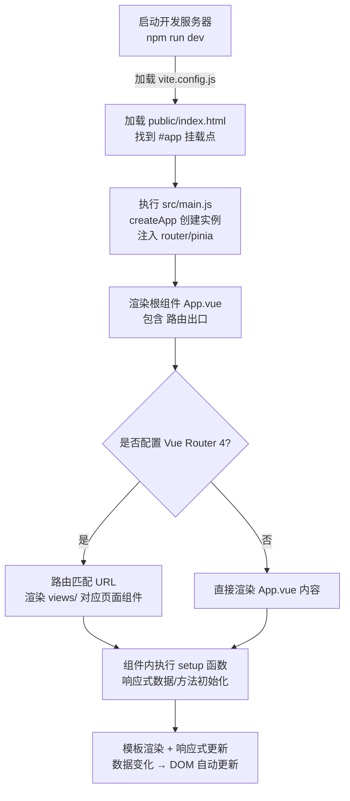

# Vue3

## 简介
Vue3 是一套用于构建用户界面的渐进式框架，核心升级包括：
- **组合式 API（Composition API）**：更灵活地组织和复用代码逻辑，替代 Vue2 选项式 API；
- **响应式系统重构**：基于 `Proxy` 实现，解决 Vue2 `Object.defineProperty` 的局限性；
- **更好的性能**：体积更小、渲染更快、内存占用更低；
- **TypeScript 友好**：原生支持 TS，类型推导更完善；
- **新增特性**：如 `Teleport` 传送门、`Suspense` 异步加载、`v-memo` 缓存等。

## 基础使用
### 创建挂载点
```html
<div id="app">
  {{ message }}
  <button @click="changeMsg">修改消息</button>
</div>
```
- `{{ message }}` 插值表达式，支持简单 JS 表达式，仅可写在标签内容区，不可写在标签属性上；

### 引入 Vue3 包
```html
<script src="https://unpkg.com/vue@3/dist/vue.global.js"></script>
```

### 创建 Vue3 实例
```js
<script>
// Vue3 从全局对象中解构 createApp 方法
const { createApp, ref, computed, watch, watchEffect } = Vue;

// 创建应用实例
const app = createApp({
  // 组合式 API 入口：setup 函数（Vue3 核心）
  setup() {
    // 1. 响应式数据（基础类型用 ref）
    const message = ref('Hello, Vue3.js!');
    
    // 2. 方法定义
    const changeMsg = () => {
      message.value = 'Vue3 组合式 API 更灵活！';
    };

    // 3. 计算属性
    const reversedMsg = computed(() => {
      return message.value.split('').reverse().join('');
    });

    // 4. 监听属性（监听 ref 数据）
    watch(message, (newVal, oldVal) => {
      console.log(`消息从 ${oldVal} 变为 ${newVal}`);
    });

    // 5. 立即执行的监听（watchEffect）
    watchEffect(() => {
      console.log(`当前消息：${message.value}`);
    });

    // 必须返回需要在模板中使用的变量/方法
    return {
      message,
      changeMsg,
      reversedMsg
    };
  }
});

// 挂载到 DOM 节点（替代 Vue2 的 el 选项）
app.mount('#app');
</script>
```
- `createApp`：Vue3 创建应用实例的核心方法，替代 Vue2 的 `new Vue()`；
- `ref`：创建基础类型响应式数据，需通过 `.value` 访问/修改（模板中自动解包，无需 `.value`）；
- `computed`：创建计算属性，返回只读的响应式引用；
- `watch`：监听指定响应式数据变化，支持深度监听、立即执行；
- `watchEffect`：自动追踪依赖，立即执行，依赖变化时重新执行；
- `app.mount('#app')`：将应用挂载到指定 DOM 节点，挂载后无法修改配置。

## 开发工具
### 浏览器开发工具
Vue3 适配的 Vue Devtools：
1. 访问 [极简插件](https://chrome.zzzmh.cn/index)，搜索「Vue Devtools」；
2. 下载解压后，打开 Chrome 拓展程序（开启「开发者模式」）；
3. 拖动解压后的文件夹到拓展页面，启用插件；
4. 确保插件「允许访问文件网址」，即可在 Vue3 项目中调试。

### 工程化
##### Vue CLI（兼容 Vue3）
```bash
# 安装 Vue CLI（需 Node.js ≥ 14.18）
npm i @vue/cli -g

# 创建 Vue3 项目
vue create 工程名
# 选择「Default (Vue 3)」或「Manually select features」自定义配置

# 启动项目
npm run serve
```

##### Vite（推荐 Vue3 首选）
Vite 是 Vue3 官方推荐的构建工具，基于原生 ES 模块，启动/热更新速度远超 Vue CLI。
- **核心优势**：极速启动、按需编译、热更新快、原生支持 TS/JSX、体积优化；
- **适用场景**：Vue3 单页应用、静态网站、库开发。

###### Vite 工作原理
- **开发模式**：直接加载原生 ES 模块，无需打包，仅更新修改的模块；
- **生产模式**：基于 Rollup 打包，生成优化后的静态资源。

###### 创建 Vite + Vue3 项目
```bash
# npm
npm create vite@latest 工程名 -- --template vue

# yarn
yarn create vite 工程名 --template vue

# pnpm
pnpm create vite 工程名 -- --template vue

# 进入项目目录
cd 工程名

# 安装依赖
npm install

# 启动开发服务器
npm run dev

# 打包生产环境
npm run build

# 预览打包结果
npm run preview
```

## Vue3 项目文件与运行流程
### Vue3 项目文件结构
```
vue3-project/
├── public/         # 静态资源（不经过 Vite 处理）
│   └── index.html  # HTML 模板（挂载点 #app 在此）
├── node_modules/   # 项目依赖
├── src/            # 源代码核心目录
│   ├── assets/     # 静态资源（图片/字体，会被 Vite 处理）
│   ├── components/ # 公共组件（可复用小组件）
│   ├── views/      # 页面组件（对应路由）
│   ├── router/     # Vue Router 4 配置
│   ├── stores/     # Pinia 状态管理（替代 Vue2 的 Vuex）
│   ├── App.vue     # 根组件
│   └── main.js     # 项目入口文件
├── package.json    # 依赖/脚本配置
├── vite.config.js  # Vite 配置（代理、打包、插件等）
├── vue.config.js   # 若兼容 Vue CLI 需配置（可选）
├── README.md       # 项目说明
├── .gitignore      # Git 忽略文件
└── tsconfig.json   # TypeScript 配置（若使用 TS）
```

### 入口文件 main.js（Vue3 写法）
```js
// 1. 引入 createApp 方法
import { createApp } from 'vue'
// 2. 引入根组件
import App from './App.vue'
// 3. 引入路由（Vue Router 4）
import router from './router'
// 4. 引入 Pinia 状态管理
import { createPinia } from 'pinia'
// 5. 全局样式
import './assets/main.css'
// 6. 全局组件
import SvgIcon from './components/SvgIcon.vue'

// 创建 Pinia 实例
const pinia = createPinia()

// 创建 Vue3 应用实例
const app = createApp(App)

// 注册全局组件
app.component('SvgIcon', SvgIcon)

// 注入路由、Pinia
app.use(router)
app.use(pinia)

// 挂载应用（替代 Vue2 的 $mount）
app.mount('#app')
```

### Vue3 运行流程


## Vue3 内置指令
指令是带有 `v-` 前缀的特殊属性，Vue3 兼容大部分 Vue2 指令，并新增 `v-memo` 等特性。

| 指令      | 用法示例                                                     | 核心说明                                                     |
| --------- | ------------------------------------------------------------ | ------------------------------------------------------------ |
| v-text    | `<p v-text="message"></p>`                                   | 更新元素 `textContent`，单向绑定，替代插值 `{{ }}`（无闪烁问题） |
| v-html    | `<div v-html="htmlContent"></div>`                           | 更新元素 `innerHTML`，注意 XSS 风险                          |
| v-model   | `<input v-model="value">`                                    | 表单双向绑定，Vue3 支持自定义组件多 v-model                  |
| v-show    | `<div v-show="isVisible"></div>`                             | 基于 `display` 属性切换显示/隐藏，初始渲染成本低             |
| v-if      | `<p v-if="isVisible">可见</p>`                               | 条件渲染，不满足时移除 DOM 节点，切换成本高                  |
| v-else    | `<p v-if="flag">A</p><p v-else>B</p>`                        | 配合 v-if 实现二元条件渲染                                   |
| v-else-if | `<p v-if="type===1">1</p><p v-else-if="type===2">2</p>`      | 多条件渲染                                                   |
| v-for     | `<li v-for="(item, idx) in list" :key="item.id">{{ item.name }}</li>` | 遍历数组/对象，`key` 推荐用唯一标识（避免索引），Vue3 性能更优 |
| v-on      | `<button @click="handleClick">点击</button>`                 | 绑定事件，简写 `@`，支持修饰符（.stop/.prevent/.enter 等）   |
| v-bind    | ``          | 动态绑定属性，简写 `:`，支持对象/数组语法                    |
| v-slot    | `<template #header>{{ title }}</template>`                   | 插槽绑定，简写 `#`，支持作用域插槽                           |
| v-pre     | `<div v-pre>{{ message }}</div>`                             | 跳过编译，直接显示原始插值语法                               |
| v-cloak   | `<div v-cloak>{{ message }}</div>` + `[v-cloak]{display:none}` | 防止编译前显示插值语法，Vue3 中使用场景减少                  |
| v-once    | `<p v-once>{{ message }}</p>`                                | 只渲染一次，后续数据变化不更新                               |
| v-memo    | `<div v-memo="[list.length]">...</div>`                      | Vue3 新增，缓存模板子树，依赖不变时跳过更新（优化长列表渲染） |

### 指令修饰符（Vue3 兼容并增强）
- **按键修饰符**：`@keyup.enter`（回车）、`@keyup.esc`（ESC）；
- **v-model 修饰符**：`v-model.trim`（去空格）、`v-model.number`（转数字）、`v-model.lazy`（失焦更新）；
- **事件修饰符**：`@click.stop`（阻止冒泡）、`@click.prevent`（阻止默认行为）、`@click.self`（仅自身触发）。

## 计算属性与监听属性（Vue3 组合式 API）
### 计算属性（computed）
基于响应式依赖自动计算，缓存结果，依赖变化才重新计算。
```vue
<template>
  <div>
    <p>原始值：{{ count }}</p>
    <p>双倍值：{{ doubleCount }}</p>
    <p>可修改计算值：{{ fullName }}</p>
    <button @click="fullName = 'Vue3 Pro'">修改全名</button>
  </div>
</template>

<script setup>
import { ref, computed } from 'vue'

// 基础响应式数据
const count = ref(1)
const firstName = ref('Vue3')
const lastName = ref('Composition API')

// 只读计算属性
const doubleCount = computed(() => {
  return count.value * 2
})

// 可写计算属性（get/set）
const fullName = computed({
  // 获取值
  get() {
    return `${firstName.value} ${lastName.value}`
  },
  // 设置值
  set(newVal) {
    const [first, last] = newVal.split(' ')
    firstName.value = first
    lastName.value = last
  }
})
</script>
```

### 监听属性（watch / watchEffect）
#### watch（显式监听指定依赖）
```vue
<script setup>
import { ref, reactive, watch } from 'vue'

// 监听 ref 数据
const num = ref(0)
watch(num, (newVal, oldVal) => {
  console.log(`num 从 ${oldVal} 变为 ${newVal}`)
}, {
  immediate: true, // 初始化立即执行
  deep: false      // 基础类型无需深度监听
})

// 监听 reactive 数据（默认深度监听）
const user = reactive({ name: '张三', age: 20 })
watch(
  () => user.age, // 监听对象的单个属性
  (newAge) => {
    console.log(`年龄变为 ${newAge}`)
  }
)

// 监听多个依赖
watch([num, () => user.name], ([newNum, newName]) => {
  console.log(`num: ${newNum}, name: ${newName}`)
})
</script>
```

#### watchEffect（自动追踪依赖）
无需指定监听目标，自动追踪函数内的响应式依赖，立即执行。
```vue
<script setup>
import { ref, watchEffect } from 'vue'

const msg = ref('Vue3')

// 立即执行，监听 msg 变化
const stop = watchEffect((onInvalidate) => {
  console.log(`当前消息：${msg.value}`)
  
  // 清理副作用（比如取消请求、清除定时器）
  onInvalidate(() => {
    console.log('依赖变化，清理副作用')
  })
})

// 手动停止监听
// stop()
</script>
```

## 组件（Vue3 组合式 API 写法）
组件是 Vue3 构建界面的核心单元，Vue3 推荐使用 `<script setup>` 语法糖（简化组合式 API 写法）。

### 组件结构（Vue3 标准写法）
```vue
<template>
  <div class="counter-card">
    <h3>{{ title }}</h3>
    <p>当前计数：{{ count }}</p>
    <p>双倍计数：{{ doubleCount }}</p>
    <button @click="increment">+1</button>
    <button @click="decrement">-1</button>
    <button @click="reset">重置</button>
  </div>
</template>

<!-- Vue3 <script setup> 语法糖（推荐） -->
<script setup>
// 1. 定义 Props（无需导入，Vue3 内置宏）
const props = defineProps({
  title: {
    type: String,
    default: 'Vue3 计数器组件'
  }
})

// 2. 响应式数据
import { ref, computed } from 'vue'
const count = ref(0)

// 3. 计算属性
const doubleCount = computed(() => count.value * 2)

// 4. 方法
const increment = () => count.value++
const decrement = () => count.value--
const reset = () => count.value = 0

// 5. 生命周期钩子（Vue3 组合式 API 写法）
import { onMounted } from 'vue'
onMounted(() => {
  console.log('组件已挂载')
})
</script>

<!-- scoped 实现样式隔离 -->
<style scoped>
.counter-card {
  padding: 20px;
  border: 1px solid #eee;
  border-radius: 8px;
}
button {
  margin: 0 5px;
  padding: 4px 8px;
}
</style>
```

### 组件注册
#### 局部注册（Vue3）
```vue
<template>
  <div>
    <!-- 直接使用注册的组件 -->
    <CounterCard />
  </div>
</template>

<script setup>
// 引入组件即局部注册（Vue3 <script setup> 特性）
import CounterCard from './components/CounterCard.vue'
</script>
```

#### 全局注册（Vue3）
在 `main.js` 中注册（全局组件可在任意页面直接使用）：
```js
import { createApp } from 'vue'
import App from './App.vue'
// 引入需要全局注册的组件
import CounterCard from './components/CounterCard.vue'

const app = createApp(App)

// 全局注册组件
app.component('CounterCard', CounterCard)

app.mount('#app')
```

## 组件生命周期（Vue3）
Vue3 生命周期钩子分为「选项式 API」和「组合式 API」两种写法，推荐组合式 API（更灵活）。

| Vue2 选项式 API | Vue3 组合式 API | 执行时机                     | 核心用途                       |
| --------------- | --------------- | ---------------------------- | ------------------------------ |
| beforeCreate    | -（setup 替代） | 组件实例创建前               | 无（setup 中代码更早执行）     |
| created         | -（setup 替代） | 组件实例创建后               | 初始化数据、发送异步请求       |
| beforeMount     | onBeforeMount   | 模板编译完成，挂载前         | 最后修改 DOM 前操作            |
| mounted         | onMounted       | 组件挂载到 DOM 后            | 操作 DOM、初始化第三方库       |
| beforeUpdate    | onBeforeUpdate  | 数据变化，DOM 更新前         | 获取更新前的 DOM 状态          |
| updated         | onUpdated       | DOM 完成更新后               | 操作更新后的 DOM（避免改数据） |
| beforeUnmount   | onBeforeUnmount | 组件卸载前                   | 清理定时器、取消请求、解绑事件 |
| unmounted       | onUnmounted     | 组件卸载后                   | 最终清理操作                   |
| activated       | onActivated     | 缓存组件（keep-alive）激活时 | 恢复组件状态                   |
| deactivated     | onDeactivated   | 缓存组件（keep-alive）失活时 | 暂停组件逻辑                   |

### 组合式 API 生命周期示例
```vue
<script setup>
import { onMounted, onBeforeUpdate, onUnmounted } from 'vue'

onMounted(() => {
  console.log('组件挂载完成')
})

onBeforeUpdate(() => {
  console.log('组件即将更新')
})

onUnmounted(() => {
  console.log('组件已卸载，清理资源')
})
</script>
```

## 组件通信（Vue3）
Vue3 支持多种组件通信方式，适配组合式 API 写法：

### 1. 父 → 子（Props）
**父组件**：

```vue
<template>
  <div>
    <Child :msg="parentMsg" :user="userInfo" />
    <input v-model="parentMsg" placeholder="修改父组件消息" />
  </div>
</template>

<script setup>
import { ref, reactive } from 'vue'
import Child from './Child.vue'

// 父组件数据
const parentMsg = ref('父组件传递的消息')
const userInfo = reactive({ name: '张三', age: 20 })
</script>
```

**子组件**：
```vue
<template>
  <div>
    <p>父组件消息：{{ msg }}</p>
    <p>用户信息：{{ user.name }} - {{ user.age }}岁</p>
  </div>
</template>

<script setup>
// 定义 Props（Vue3 内置 defineProps 宏）
const props = defineProps({
  msg: {
    type: String,
    required: true
  },
  user: {
    type: Object,
    default: () => ({}) // 引用类型默认值用函数返回
  }
})

// 访问 Props（模板中直接用，脚本中通过 props.xxx）
console.log(props.msg)
</script>
```

### 2. 子 → 父（自定义事件）
**子组件**：
```vue
<template>
  <button @click="sendToParent">向父组件传值</button>
</template>

<script setup>
// 定义自定义事件（Vue3 内置 defineEmits 宏）
const emit = defineEmits(['child-event'])

const sendToParent = () => {
  // 触发事件并传递数据
  emit('child-event', { msg: '子组件的消息', time: new Date() })
}
</script>
```

**父组件**：
```vue
<template>
  <div>
    <Child @child-event="handleChildEvent" />
    <p>子组件传递的数据：{{ childData.msg }}</p>
  </div>
</template>

<script setup>
import { ref } from 'vue'
import Child from './Child.vue'

const childData = ref({})

// 监听子组件事件
const handleChildEvent = (data) => {
  childData.value = data
}
</script>
```

### 3. 非父子通信（Mitt 替代 EventBus）
Vue3 移除了 `$on/$emit` 实例方法，推荐使用 `mitt` 库实现事件总线：

##### 步骤 1：安装 mitt
```bash
npm install mitt
```

##### 步骤 2：创建事件总线
```js
// src/utils/mitt.js
import mitt from 'mitt'
// 创建 mitt 实例
const emitter = mitt()
export default emitter
```

##### 步骤 3：发送事件（组件 A）
```vue
<template>
  <button @click="sendMsg">发送消息到组件 B</button>
</template>

<script setup>
import emitter from '@/utils/mitt'

const sendMsg = () => {
  // 触发自定义事件
  emitter.emit('custom-event', { content: '非父子组件通信' })
}
</script>
```

##### 步骤 4：接收事件（组件 B）
```vue
<template>
  <div>
    <p>接收的消息：{{ msg.content }}</p>
  </div>
</template>

<script setup>
import { ref, onMounted, onUnmounted } from 'vue'
import emitter from '@/utils/mitt'

const msg = ref({})

onMounted(() => {
  // 监听事件
  emitter.on('custom-event', (data) => {
    msg.value = data
  })
})

onUnmounted(() => {
  // 解绑事件（避免内存泄漏）
  emitter.off('custom-event')
})
</script>
```

### 4. 跨层级通信（provide / inject）
适用于祖孙组件通信，无需逐层传递 Props：

**父组件（提供数据）**：
```vue
<script setup>
import { provide, ref } from 'vue'
import Child from './Child.vue'

// 提供数据（第一个参数：key，第二个参数：value）
const theme = ref('dark')
provide('theme', theme)

// 提供方法（支持响应式更新）
provide('changeTheme', () => {
  theme.value = theme.value === 'dark' ? 'light' : 'dark'
})
</script>
```

**孙组件（注入数据）**：
```vue
<script setup>
import { inject } from 'vue'

// 注入数据（第一个参数：key，第二个参数：默认值）
const theme = inject('theme', ref('light'))
const changeTheme = inject('changeTheme')
</script>

<template>
  <div :class="theme">
    <p>当前主题：{{ theme }}</p>
    <button @click="changeTheme">切换主题</button>
  </div>
</template>

<style>
.dark { background: #333; color: #fff; }
.light { background: #fff; color: #333; }
</style>
```

### 5. 全局状态管理（Pinia）
Vue3 官方推荐 Pinia 替代 Vuex，更简洁、支持组合式 API、TypeScript 友好：

##### 步骤 1：创建 Pinia Store
```js
// src/stores/counter.js
import { defineStore } from 'pinia'

// 定义 Store（id 必须唯一）
export const useCounterStore = defineStore('counter', {
  // 状态（替代 Vuex 的 state）
  state: () => ({
    count: 0
  }),
  // 计算属性（替代 Vuex 的 getters）
  getters: {
    doubleCount: (state) => state.count * 2
  },
  // 方法（替代 Vuex 的 mutations + actions）
  actions: {
    increment() {
      this.count++
    },
    decrement() {
      this.count--
    }
  }
})
```

##### 步骤 2：组件中使用 Store
```vue
<template>
  <div>
    <p>全局计数：{{ counterStore.count }}</p>
    <p>双倍计数：{{ counterStore.doubleCount }}</p>
    <button @click="counterStore.increment">+1</button>
    <button @click="counterStore.decrement">-1</button>
  </div>
</template>

<script setup>
// 引入并使用 Store
import { useCounterStore } from '@/stores/counter'
const counterStore = useCounterStore()
</script>
```


#### 持久化

`pnpm add pinia pinia-plugin-persistedstate`

| 配置项              | 类型          | 作用                                             | 适用场景                                                     |
| ------------------- | ------------- | ------------------------------------------------ | ------------------------------------------------------------ |
| **`key`**           | `string`      | 数据存到 Storage 里用的键名。                    | 当你有多个 Store 且怕 key 冲突，或者想给 key 加统一前缀时。  |
| **`storage`**       | `StorageLike` | 指定存到哪里。                                   | 前端用 `localStorage`/`sessionStorage`；Electron 可以结合 `electron-store` 自定义。 |
| **`paths`**         | `string[]`    | **白名单**。只持久化 `state` 里列出的字段。      | **强烈推荐**。State 很大时，只存必要的字段（如设置、Token），跳过临时数据，提升性能。 |
| **`serializer`**    | `Object`      | 自定义 “对象转字符串” 和 “字符串转对象” 的逻辑。 | 当 State 里含有 `Date`、`Map`、`Set` 或 `BigInt` 等 JSON 不支持的类型时。 |
| **`beforeRestore`** | `Function`    | 数据恢复**前**的钩子。                           | 比如在恢复前清空旧的临时数据。                               |
| **`afterRestore`**  | `Function`    | 数据恢复**后**的钩子。                           | 比如数据恢复后，根据设置立即切换应用主题。                   |
| **`debug`**         | `boolean`     | 开启调试日志。                                   | 开发阶段建议开启，方便排查为什么数据没存上或没恢复。         |

## 自定义指令（Vue3）

Vue3 允许注册自定义指令，封装 DOM 操作，钩子函数适配组合式 API 生命周期。

### 自定义指令钩子函数（Vue3）
| 钩子函数      | 执行时机                     | 核心参数    |
| ------------- | ---------------------------- | ----------- |
| created       | 指令绑定到元素，属性未设置时 | el、binding |
| beforeMount   | 元素挂载到 DOM 前            | el、binding |
| mounted       | 元素挂载到 DOM 后            | el、binding |
| beforeUpdate  | 组件更新前                   | el、binding |
| updated       | 组件更新后                   | el、binding |
| beforeUnmount | 元素卸载前                   | el、binding |
| unmounted     | 元素卸载后                   | el、binding |

### 全局注册自定义指令
```js
// main.js
import { createApp } from 'vue'
import App from './App.vue'

const app = createApp(App)

// 注册全局自定义指令 v-focus
app.directive('focus', {
  // 元素挂载后自动聚焦
  mounted(el) {
    el.focus()
  }
})

// 注册全局自定义指令 v-loading
app.directive('loading', {
  mounted(el, binding) {
    // binding.value 是指令绑定的值
    if (binding.value) {
      // 创建加载遮罩层
      const mask = document.createElement('div')
      mask.className = 'loading-mask'
      mask.innerHTML = '加载中...'
      el.appendChild(mask)
      // 存储遮罩层到元素自定义属性，方便后续移除
      el._loadingMask = mask
    }
  },
  updated(el, binding) {
    // 值变化时更新状态
    if (binding.value) {
      if (!el._loadingMask) {
        const mask = document.createElement('div')
        mask.className = 'loading-mask'
        mask.innerHTML = '加载中...'
        el.appendChild(mask)
        el._loadingMask = mask
      }
    } else {
      if (el._loadingMask) {
        el.removeChild(el._loadingMask)
        delete el._loadingMask
      }
    }
  },
  unmounted(el) {
    // 卸载时清理
    if (el._loadingMask) {
      el.removeChild(el._loadingMask)
    }
  }
})

app.mount('#app')
```

### 局部注册自定义指令
```vue
<template>
  <input v-focus />
  <div v-loading="isLoading">内容区域</div>
  <button @click="isLoading = !isLoading">切换加载状态</button>
</template>

<script setup>
import { ref } from 'vue'
const isLoading = ref(true)

// 局部注册自定义指令 v-focus
const vFocus = {
  mounted(el) {
    el.focus()
  }
}

// 局部注册自定义指令 v-loading
const vLoading = {
  mounted(el, binding) {
    // 逻辑同全局指令
  },
  updated(el, binding) {
    // 逻辑同全局指令
  },
  unmounted(el) {
    // 逻辑同全局指令
  }
}
</script>

<style>
.loading-mask {
  position: absolute;
  top: 0;
  left: 0;
  width: 100%;
  height: 100%;
  background: rgba(0,0,0,0.5);
  color: #fff;
  display: flex;
  align-items: center;
  justify-content: center;
}
</style>
```

## 插槽（Vue3）
Vue3 插槽语法兼容 Vue2，支持具名插槽、作用域插槽，简写 `#` 替代 `v-slot:`。

### 1. 默认插槽
**子组件（SlotDemo.vue）**：

```vue
<template>
  <div class="slot-container">
    <!-- 默认插槽占位 -->
    <slot>默认内容（父组件未传内容时显示）</slot>
  </div>
</template>
```

**父组件**：
```vue
<template>
  <SlotDemo>
    <p>父组件传递的默认插槽内容</p>
  </SlotDemo>
</template>
```

### 2. 具名插槽
**子组件**：

```vue
<template>
  <div class="layout">
    <header>
      <!-- 具名插槽：header -->
      <slot name="header"></slot>
    </header>
    <main>
      <slot></slot>
    </main>
    <footer>
      <!-- 具名插槽：footer -->
      <slot name="footer"></slot>
    </footer>
  </div>
</template>
```

**父组件**：
```vue
<template>
  <SlotDemo>
    <!-- 具名插槽简写 #header -->
    <template #header>
      <h1>页面标题</h1>
    </template>
    
    <!-- 默认插槽 -->
    <p>页面主体内容</p>
    
    <!-- 具名插槽简写 #footer -->
    <template #footer>
      <p>页面底部</p>
    </template>
  </SlotDemo>
</template>
```

### 3. 作用域插槽（子传父数据）
**子组件**：
```vue
<template>
  <div>
    <ul>
      <li v-for="(item, idx) in list" :key="idx">
        <!-- 插槽传递数据（item、index） -->
        <slot :item="item" :index="idx"></slot>
      </li>
    </ul>
  </div>
</template>

<script setup>
import { reactive } from 'vue'
const list = reactive(['Vue3', 'React', 'Angular'])
</script>
```

**父组件**：
```vue
<template>
  <SlotDemo>
    <!-- 接收子组件传递的插槽数据 -->
    <template #default="{ item, index }">
      <p>第 {{ index + 1 }} 项：{{ item }}</p>
    </template>
  </SlotDemo>
</template>
```

## 单页应用（SPA）与 Vue Router 4
Vue Router 4 是 Vue3 官方适配的路由库，核心 API 调整为组合式风格。

### 1. 安装 Vue Router 4
```bash
npm install vue-router@4
```

### 2. 配置路由（src/router/index.js）
```js
import { createRouter, createWebHistory } from 'vue-router'
// 引入页面组件
import Home from '@/views/Home.vue'
import About from '@/views/About.vue'
import Detail from '@/views/Detail.vue'
import NotFound from '@/views/NotFound.vue'

// 路由规则
const routes = [
  {
    path: '/',
    name: 'Home',
    component: Home
  },
  {
    path: '/about',
    name: 'About',
    component: About
  },
  // 动态路由参数
  {
    path: '/detail/:id',
    name: 'Detail',
    component: Detail,
    // 路由传参：将 params 映射为组件 props
    props: true
  },
  // 路由重定向
  {
    path: '/home',
    redirect: '/'
  },
  // 404 页面（必须放在最后）
  {
    path: '/:pathMatch(.*)*',
    component: NotFound
  }
]

// 创建路由实例
const router = createRouter({
  // 路由模式：history 模式（无 # 号），替代 Vue2 的 mode: 'history'
  history: createWebHistory(import.meta.env.BASE_URL),
  routes,
  // 激活链接的样式类
  linkActiveClass: 'active',
  linkExactActiveClass: 'exact-active'
})

export default router
```

### 3. 注册路由（main.js）
```js
import { createApp } from 'vue'
import App from './App.vue'
import router from './router'

const app = createApp(App)
// 注入路由
app.use(router)
app.mount('#app')
```

### 4. 声明式导航（模板中使用）
```vue
<template>
  <div>
    <!-- 基础导航链接 -->
    <router-link to="/">首页</router-link>
    <router-link to="/about">关于</router-link>
    <!-- 动态路由传参 -->
    <router-link :to="`/detail/${id}`">详情页</router-link>
    <!-- 命名路由 + 参数 -->
    <router-link :to="{ name: 'Detail', params: { id: 1 } }">详情页（命名路由）</router-link>
    <!-- 查询参数 -->
    <router-link :to="{ path: '/about', query: { tab: 'info' } }">关于页（带查询参数）</router-link>

    <!-- 路由出口：渲染匹配的页面组件 -->
    <router-view />
  </div>
</template>

<script setup>
import { ref } from 'vue'
const id = ref(1)
</script>

<style>
/* 激活链接样式 */
.active {
  color: red;
  font-weight: bold;
}
</style>
```

### 5. 编程式导航（脚本中使用）
```vue
<script setup>
import { useRouter, useRoute } from 'vue-router'

// 获取路由实例
const router = useRouter()
// 获取当前路由信息
const route = useRoute()

// 跳转页面（push）
const goToDetail = (id) => {
  router.push(`/detail/${id}`)
  // 或命名路由跳转
  // router.push({ name: 'Detail', params: { id } })
  // 带查询参数
  // router.push({ path: '/about', query: { tab: 'info' } })
}

// 替换当前历史记录（replace）
const goToAbout = () => {
  router.replace('/about')
}

// 前进/后退
const goBack = () => {
  router.go(-1) // 后退一步
  // router.forward() // 前进一步
}

// 获取路由参数
console.log('动态参数：', route.params.id)
console.log('查询参数：', route.query.tab)
</script>
```

### 6. 路由守卫（全局守卫示例）
```js
// src/router/index.js
router.beforeEach((to, from, next) => {
  // 模拟登录校验
  const isLogin = localStorage.getItem('token')
  // 未登录且跳转到非首页，重定向到登录页
  if (to.path !== '/' && !isLogin) {
    next('/')
  } else {
    next()
  }
})
```

## 缓存组件（keep-alive）
Vue3 中 `keep-alive` 依然用于缓存组件，避免重复渲染，适配组合式 API 生命周期（`onActivated`/`onDeactivated`）。

### 基础用法
```vue
<template>
  <div>
    <router-link to="/home">首页</router-link>
    <router-link to="/about">关于</router-link>
    
    <!-- 缓存路由组件 -->
    <keep-alive include="Home,About" max="5">
      <router-view />
    </keep-alive>
  </div>
</template>
```

### 属性说明
- `include`：字符串/数组，只有匹配的组件会被缓存；
- `exclude`：字符串/数组，匹配的组件不会被缓存；
- `max`：数字，最大缓存实例数，超出则删除最久未使用的组件。

### 缓存组件的生命周期
```vue
<script setup>
import { onActivated, onDeactivated } from 'vue'

// 组件被激活时触发
onActivated(() => {
  console.log('组件被激活，恢复状态')
})

// 组件被失活时触发
onDeactivated(() => {
  console.log('组件被失活，暂停逻辑')
})
</script>
```

## Vue3 Ajax

Vue 版本推荐使用 axios 来完成 ajax 请求。
Axios 是一个基于 Promise 的 HTTP 库，可以用在浏览器和 node.js 中。
Github开源地址： https://github.com/axios/axios


### async/await

在 async/await 出现前，JavaScript 处理异步的方式经历了 3 个阶段：

1. **回调函数**：容易产生「回调地狱」（嵌套层级太深）；
2. **Promise**：解决了回调地狱，但链式调用（`.then().catch()`）仍不够直观；
3. **async/await**：Promise 的「语法糖」，让异步代码**看起来和同步代码一样**，可读性拉满。

#### 核心概念拆解

##### async 关键字

**作用**：修饰函数，声明这是一个「异步函数」；
**特性**：

- 异步函数的返回值会**自动包装成 Promise**（哪怕返回的是普通值）；
- 异步函数内部可以使用 `await` 关键字（普通函数不行）。

##### await 关键字

- **作用**：等待一个 Promise 完成（成功 / 失败），并取出 Promise 的「成功值」；
- **使用条件**：**必须在 async 函数内部使用**； 
- **特性**：await 会「暂停」当前异步函数的执行（但不会阻塞主线程），直到 Promise 有结果。


### 安装方法

**使用 cdn:**

```html
<script src="https://unpkg.com/axios/dist/axios.min.js"></script>
```

或

```html
<script src="https://lf26-cdn-tos.bytecdntp.com/cdn/expire-1-M/axios/0.26.0/axios.min.js" type="application/javascript"></script>
```

**使用 npm:**

```bash
$ npm install axios
```

**使用 bower:**

```bash
$ bower install axios
```

**使用 yarn:**

```bash
$ yarn add axios
```

**使用 pnpm:**

```bash
$ pnpm add axios
```


### 基本使用

从 Axios 模块中导入默认导出的 axios 对象：

```js
import axios from 'axios';
```

#### 1、发起 GET 请求

为给定 ID 的用户发起请求：

```js
// Vue3 组合式 API 中使用
<script setup>
import { ref, onMounted } from 'vue';
import axios from 'axios';

const userData = ref(null);
const loading = ref(false);
const error = ref(null);

// 封装成 async 函数
const fetchUser = async () => {
  loading.value = true;
  error.value = null;
  try {
    // await 等待 Promise 完成，直接获取 response
    const response = await axios.get('/user', {
      params: {
        ID: 12345
      }
    });
    // 成功处理：response.data 是服务器返回的核心数据
    userData.value = response.data;
    console.log('请求成功', response);
  } catch (err) {
    // 错误处理
    error.value = err;
    console.error('请求失败', err);
  } finally {
    // 无论成功失败都会执行
    loading.value = false;
  }
};

// 组件挂载时调用
onMounted(() => {
  fetchUser();
});
</script>
```

#### 2、发起 POST 请求

```js
<script setup>
import { ref } from 'vue';
import axios from 'axios';

const submitForm = async () => {
  try {
    const response = await axios.post(
      '/user',
      // POST 请求体数据
      {
        firstName: 'Fred',
        lastName: 'Flintstone'
      },
      // 可选配置
      {
        headers: {
          'Content-Type': 'application/json'
        },
        timeout: 5000
      }
    );
    console.log('POST 成功', response.data);
  } catch (error) {
    // 细分错误类型
    if (error.response) {
      // 服务器返回非 2xx 状态码
      console.error('服务器错误', error.response.status, error.response.data);
    } else if (error.request) {
      // 请求发出但无响应
      console.error('网络错误', error.request);
    } else {
      // 请求配置错误
      console.error('配置错误', error.message);
    }
  }
};
</script>
```


### axios API

可以通过向 axios 传递相关配置来创建请求。

```js
// axios(config) 通用写法
axios({
  method: 'post',
  url: '/user/12345',
  data: {
    firstName: 'Fred',
    lastName: 'Flintstone'
  }
});

// 也可以直接传 url（默认 GET）
axios('/user/12345');

// Node.js 中获取图片流
axios({
  method: 'get',
  url: 'https://bit.ly/2mTM3nY',
  responseType: 'stream'
}).then(function (response) {
  response.data.pipe(fs.createWriteStream('ada_lovelace.jpg'));
});
```

#### 请求方法的别名

为方便使用，官方为所有支持的请求方法提供了别名：

```js
axios.request(config)
axios.get(url[, config])
axios.delete(url[, config])
axios.head(url[, config])
axios.options(url[, config])
axios.post(url[, data[, config]])
axios.put(url[, data[, config]])
axios.patch(url[, data[, config]])
```

**注意：** 在使用别名方法时，`url`、`method`、`data` 这些属性不必在配置中重复指定。

#### 并发请求

使用 `Promise.all` 处理并发（原 `axios.all` 已废弃）：

```js
async function fetchConcurrentData() {
  const [userRes, permissionsRes] = await Promise.all([
    axios.get('/user/12345'),
    axios.get('/user/12345/permissions')
  ]);
  console.log('用户数据', userRes.data);
  console.log('权限数据', permissionsRes.data);
}
```

#### 创建实例

可以使用自定义配置新建一个 axios 实例（推荐用于多域名场景）：

```js
const instance = axios.create({
  baseURL: 'https://some-domain.com/api/',
  timeout: 1000,
  headers: {'X-Custom-Header': 'foobar'}
});
```

##### 实例方法

实例方法与全局方法一致，配置会与实例默认配置合并：

```js
instance.request(config)
instance.get(url[, config])
instance.delete(url[, config])
instance.head(url[, config])
instance.options(url[, config])
instance.post(url[, data[, config]])
instance.put(url[, data[, config]])
instance.patch(url[, data[, config]])
instance.getUri([config]) // 获取请求的完整 URL
```


### 请求配置项

下面是创建请求时可用的配置选项（只有 `url` 是必需的，默认 `method` 为 `get`）：

```js
{
  // 服务器 URL
  url: '/user',

  // 请求方法
  method: 'get',

  // 自动加在 url 前面的基础 URL（除非 url 是绝对路径）
  baseURL: 'https://some-domain.com/api/',

  // 允许绝对 URL 覆盖 baseURL（默认 true）
  allowAbsoluteUrls: true,

  // 发送前修改请求数据（仅 PUT/POST/PATCH）
  transformRequest: [function (data, headers) {
    // 对 data 进行任意转换
    return data;
  }],

  // 接收前修改响应数据
  transformResponse: [function (data) {
    // 对 data 进行任意转换
    return data;
  }],

  // 自定义请求头
  headers: {'X-Requested-With': 'XMLHttpRequest'},

  // URL 参数（必须是 plain object 或 URLSearchParams）
  params: {
    ID: 12345
  },

  // 自定义 params 序列化函数
  paramsSerializer: {
    encode?: (param: string) => string, // 自定义键值对编码
    serialize?: (params: Record<string, any>) => string, // 自定义整体序列化
    indexes: false // 数组格式：null(无括号)/false(空括号)/true(带索引)
  },

  // 请求体数据（仅 PUT/POST/PATCH）
  data: {
    firstName: 'Fred'
  },
  // 也可以是字符串
  data: 'Country=Brasil&City=Belo Horizonte',

  // 超时时间（毫秒，0 表示无超时）
  timeout: 1000,

  // 跨域请求是否携带凭证
  withCredentials: false,

  // 自定义请求适配器（用于测试或切换底层实现）
  adapter: function (config) { /* ... */ },
  // 或指定内置适配器：'xhr' | 'fetch' | 'http' | 数组
  adapter: 'fetch',

  // HTTP 基础认证
  auth: {
    username: 'janedoe',
    password: 's00pers3cret'
  },

  // 响应数据类型
  responseType: 'json', // 默认
  // 可选：'arraybuffer' | 'document' | 'text' | 'stream' | 'blob'(浏览器)

  // 响应编码（Node.js 仅）
  responseEncoding: 'utf8',

  // XSRF 相关
  xsrfCookieName: 'XSRF-TOKEN',
  xsrfHeaderName: 'X-XSRF-TOKEN',
  withXSRFToken: boolean | undefined | ((config) => boolean),

  // 上传/下载进度事件
  onUploadProgress: function ({loaded, total, progress, bytes, estimated, rate}) {
    // progress: 0-1 的进度值
  },
  onDownloadProgress: function ({loaded, total, progress, bytes, estimated, rate}) {
    // 同上
  },

  // 响应/请求内容最大尺寸（字节）
  maxContentLength: 2000,
  maxBodyLength: 2000,

  // 定义成功的 HTTP 状态码
  validateStatus: function (status) {
    return status >= 200 && status < 300; // 默认
  },

  // 最大重定向次数（Node.js 仅）
  maxRedirects: 21,

  // 重定向前的回调
  beforeRedirect: (options, { headers }) => { /* ... */ },

  // UNIX Socket 路径（Node.js 仅）
  socketPath: null,

  // Node.js HTTP/HTTPS 代理
  httpAgent: new http.Agent({ keepAlive: true }),
  httpsAgent: new https.Agent({ keepAlive: true }),

  // 代理服务器配置
  proxy: {
    protocol: 'https',
    host: '127.0.0.1',
    port: 9000,
    auth: {
      username: 'mikeymike',
      password: 'rapunz3l'
    }
  },

  // 取消请求（推荐用 AbortController，见下文）
  cancelToken: new CancelToken(function (cancel) { }),
  signal: new AbortController().signal,

  // 自动解压响应（Node.js 仅）
  decompress: true,

  // 表单序列化配置
  formSerializer: {
    visitor?: (value, key, path, helpers) => {}, // 自定义序列化逻辑
    dots: boolean, // 用点代替括号
    metaTokens: boolean, // 保留特殊后缀如 {}
    indexes: boolean // 数组索引格式
  },

  // 速率限制（Node.js http 适配器仅）
  maxRate: [100 * 1024, 100 * 1024] // [上传限速, 下载限速] 字节/秒
}
```


### 响应结构

axios 请求的响应包含以下信息：

```js
{
  // 服务器返回的数据
  data: {},

  // HTTP 状态码
  status: 200,

  // HTTP 状态信息
  statusText: 'OK',

  // 响应头（所有头名小写）
  headers: {},

  // 请求的配置
  config: {},

  // 生成响应的请求对象
  request: {}
}
```

使用 `then` 时：

```js
axios.get('/user/12345')
  .then(function (response) {
    console.log(response.data);
    console.log(response.status);
    console.log(response.statusText);
    console.log(response.headers);
    console.log(response.config);
  });
```

使用 `catch` 或 `then` 的第二个参数时，响应通过 `error` 对象访问。


### 配置默认值

#### 全局 axios 默认值

```js
axios.defaults.baseURL = 'https://api.example.com';
axios.defaults.headers.common['Authorization'] = AUTH_TOKEN;
axios.defaults.headers.post['Content-Type'] = 'application/x-www-form-urlencoded';
```

#### 自定义实例默认值

```js
// 创建实例时设置
const instance = axios.create({
  baseURL: 'https://api.example.com'
});

// 创建后修改
instance.defaults.headers.common['Authorization'] = AUTH_TOKEN;
```

#### 配置优先级

配置会按以下顺序合并：**库默认值 → 实例 defaults → 请求 config**。后者覆盖前者。

```js
// 库默认 timeout 为 0
const instance = axios.create();
// 实例覆盖为 2500ms
instance.defaults.timeout = 2500;
// 请求覆盖为 5000ms
instance.get('/longRequest', {
  timeout: 5000
});
```


### 拦截器

在请求或响应被 `then`/`catch` 处理前拦截它们。

#### 添加拦截器

```js
// 请求拦截器
axios.interceptors.request.use(
  function (config) {
    // 发送请求前做些什么，比如加 token
    config.headers.Authorization = `Bearer ${token}`;
    return config;
  },
  function (error) {
    // 请求错误时做些什么
    return Promise.reject(error);
  }
);

// 响应拦截器
axios.interceptors.response.use(
  function (response) {
    // 2xx 状态码触发，处理响应数据
    return response.data; // 直接返回 data，简化后续使用
  },
  function (error) {
    // 非 2xx 状态码触发，统一错误处理
    if (error.response.status === 401) {
      // 跳转到登录页
    }
    return Promise.reject(error);
  }
);
```

#### 移除拦截器

```js
const myInterceptor = axios.interceptors.request.use(function () {/*...*/});
axios.interceptors.request.eject(myInterceptor);

// 清空所有拦截器
axios.interceptors.request.clear();
axios.interceptors.response.clear();
```

#### 多个拦截器

- 请求拦截器：**后添加的先执行**；
- 响应拦截器：**先添加的先执行**；
- 若拦截器抛出错误，后续拦截器停止执行。


### 错误处理

```js
axios.get('/user/12345')
  .catch(function (error) {
    if (error.response) {
      // 请求成功发出，服务器返回非 2xx
      console.log(error.response.data);
      console.log(error.response.status);
      console.log(error.response.headers);
    } else if (error.request) {
      // 请求发出但没收到响应
      console.log(error.request);
    } else {
      // 请求配置出错
      console.log('Error', error.message);
    }
    console.log(error.config);
  });
```

#### 自定义成功状态码

使用 `validateStatus` 配置：

```js
axios.get('/user/12345', {
  validateStatus: function (status) {
    return status < 500; // 只有状态码 < 500 才 resolve
  }
});
```

#### 错误信息序列化

使用 `error.toJSON()` 获取更多错误信息：

```js
axios.get('/user/12345')
  .catch(function (error) {
    console.log(error.toJSON());
  });
```


### 取消请求

#### 推荐：AbortController（v0.22.0+）

```js
const controller = new AbortController();

axios.get('/foo/bar', {
  signal: controller.signal
}).then(function(response) {
  // 处理响应
}).catch(function(error) {
  if (axios.isCancel(error)) {
    console.log('请求被取消', error.message);
  }
});

// 取消请求
controller.abort('Operation canceled by the user.');
```

#### 废弃：CancelToken

```js
const CancelToken = axios.CancelToken;
const source = CancelToken.source();

axios.get('/user/12345', {
  cancelToken: source.token
}).catch(function (thrown) {
  if (axios.isCancel(thrown)) {
    console.log('请求被取消', thrown.message);
  }
});

// 取消请求
source.cancel('Operation canceled by the user.');
```


### 数据格式处理

#### application/x-www-form-urlencoded

默认 axios 序列化 JS 对象为 JSON，若需发送 `application/x-www-form-urlencoded`：

##### 方式 1：URLSearchParams

```js
const params = new URLSearchParams();
params.append('foo', 'bar');
params.append('extraparam', 'value');
axios.post('/foo', params);
```

##### 方式 2：qs 库（推荐处理嵌套对象）

```js
import qs from 'qs';
axios.post('/foo', qs.stringify({ 'bar': 123 }));
```

##### 方式 3：自动序列化（v1.x+）

设置 `Content-Type` 为 `application/x-www-form-urlencoded`，axios 自动序列化：

```js
await axios.postForm('https://postman-echo.com/post', {
  x: 1,
  arr: [1, 2, 3]
}, {
  headers: {'content-type': 'application/x-www-form-urlencoded'}
});
```

#### multipart/form-data

##### 方式 1：FormData

```js
const formData = new FormData();
formData.append('foo', 'bar');
formData.append('file', document.querySelector('#fileInput').files[0]);
axios.post('https://example.com', formData);
```

##### 方式 2：自动序列化（v0.27.0+）

设置 `Content-Type` 为 `multipart/form-data`，或使用 `postForm`/`putForm`/`patchForm` 快捷方法：

```js
// 快捷方法自动设置 Content-Type
await axios.postForm('https://httpbin.org/post', {
  'myVar': 'foo',
  'file': document.querySelector('#fileInput').files[0],
  'files[]': document.querySelector('#fileInput').files // 多文件
});

// 直接传 HTML 表单
await axios.postForm('https://httpbin.org/post', document.querySelector('#htmlForm'));
```


### 进度捕获与速率限制

#### 上传/下载进度

```js
await axios.post(url, data, {
  onUploadProgress: function ({loaded, total, progress, bytes, estimated, rate}) {
    console.log(`上传进度: ${(progress * 100).toFixed(2)}%`);
    console.log(`上传速度: ${(rate / 1024).toFixed(2)} KB/s`);
  },
  onDownloadProgress: function ({loaded, total, progress, bytes, estimated, rate}) {
    console.log(`下载进度: ${(progress * 100).toFixed(2)}%`);
  }
});
```

#### 速率限制（Node.js 仅）

```js
const { data } = await axios.post(LOCAL_SERVER_URL, myBuffer, {
  onUploadProgress: ({ progress, rate }) => {
    console.log(`上传: ${(progress*100).toFixed(2)}%, 速度: ${(rate / 1024).toFixed(2)}KB/s`);
  },
  maxRate: [100 * 1024] // 100KB/s 上传限速
});
```


### AxiosHeaders

Axios 提供 `AxiosHeaders` 类来更方便地操作请求头（保证大小写不敏感）：

```js
// 在拦截器中使用
axios.interceptors.request.use((config) => {
  // 设置单个头
  config.headers.set('My-header', 'value');
  // 批量设置
  config.headers.set({
    'My-set-header1': 'my-set-value1',
    'My-set-header2': 'my-set-value2'
  });
  // 禁用某个头（后续 axios 不会覆盖）
  config.headers.set('User-Agent', false);
  // 快捷方法
  config.headers.setContentType('text/plain');
  
  // 获取头
  console.log(config.headers.get('Content-Type'));
  // 解析头为键值对
  console.log(config.headers.get('Content-Type', true));
  
  // 检查头是否存在
  console.log(config.headers.has('My-header'));
  
  // 删除头
  config.headers.delete('My-header');
  
  // 清空特定前缀的头
  config.headers.clear(/^x-/);
  
  return config;
});
```


### Fetch 适配器

v1.7.0+ 支持 Fetch 适配器，可显式指定：

```js
const { data } = axios.get(url, {
  adapter: 'fetch' // 默认优先级：['xhr', 'http', 'fetch']
});

// 或创建专用实例
const fetchAxios = axios.create({
  adapter: 'fetch'
});
```

Fetch 适配器支持与 xhr 适配器相同的功能，包括进度捕获，还额外支持 `stream` 和 `formdata` 响应类型（若环境支持）。


### TypeScript 支持

axios 包含 TypeScript 类型定义和错误类型守卫：

```ts
interface User {
  id: number;
  name: string;
}

let user: User | null = null;
try {
  const { data } = await axios.get<User>('/user?ID=12345');
  user = data;
} catch (error) {
  if (axios.isAxiosError(error)) {
    // 处理 axios 错误
    console.error(error.response?.data);
  } else {
    // 处理其他错误
  }
}
```


### 其他

- **Semver**：axios 到达 1.0 前，破坏性变更会随 minor 版本发布；
- **Promises**：依赖原生 ES6 Promise，不支持的环境需 polyfill；
- **资源**：[Changelog](sslocal://flow/file_open?url=https%3A%2F%2Fgithub.com%2Faxios%2Faxios%2Fblob%2Fmaster%2FCHANGELOG.md&flow_extra=eyJsaW5rX3R5cGUiOiJjb2RlX2ludGVycHJldGVyIn0=)、[Ecosystem](sslocal://flow/file_open?url=https%3A%2F%2Fgithub.com%2Faxios%2Faxios%2Fblob%2Fmaster%2FECOSYSTEM.md&flow_extra=eyJsaW5rX3R5cGUiOiJjb2RlX2ludGVycHJldGVyIn0=)、[Contributing Guide](sslocal://flow/file_open?url=https%3A%2F%2Fgithub.com%2Faxios%2Faxios%2Fblob%2Fmaster%2FCONTRIBUTING.md&flow_extra=eyJsaW5rX3R5cGUiOiJjb2RlX2ludGVycHJldGVyIn0=)。

## Element Plus 

Element Plus 是基于 Vue 3 的企业级 UI 组件库，提供了丰富的组件和功能，用于快速构建高质量的前端界面。本教程将从环境准备到实战应用，全面讲解 Element Plus 的使用方法，帮助你快速上手并掌握最佳实践。

---

### 环境准备

#### 1.1 安装 Node.js
Element Plus 基于 Vue 3，需要 Node.js 环境（推荐 v14.18+ 或 v16+）。
- 下载地址：[https://nodejs.org/](https://nodejs.org/)
- 安装完成后，检查版本：
  ```bash
  node -v
  npm -v
  ```

#### 1.2 创建 Vue 3 项目
Element Plus 支持 Vite 和 Vue CLI 两种主流构建工具。

##### 方式一：使用 Vite 创建（推荐）
```bash
# 创建项目
npm create vite@latest my-element-plus-app -- --template vue-ts
# 进入项目目录
cd my-element-plus-app
# 安装依赖
npm install
```

##### 方式二：使用 Vue CLI 创建
```bash
# 安装 Vue CLI
npm install -g @vue/cli
# 创建项目
vue create my-element-plus-app
# 选择 Vue 3 配置
# 进入项目目录
cd my-element-plus-app
# 安装依赖
npm install
```

---

### 安装与配置 Element Plus

#### 2.1 安装 Element Plus
使用 npm、yarn 或 pnpm 安装：
```bash
# npm
npm install element-plus --save

# yarn
yarn add element-plus --save

# pnpm
pnpm add element-plus --save
```

#### 2.2 安装图标库（推荐）
Element Plus 图标需要单独安装：
```bash
npm install @element-plus/icons-vue --save
```

#### 2.3 引入方式（两种选择）

##### 方式一：完整引入（适合小型项目/原型开发）
在 `main.ts` 中全局引入所有组件和样式：
```typescript
import { createApp } from 'vue'
import ElementPlus from 'element-plus'
import 'element-plus/dist/index.css'
import * as ElementPlusIconsVue from '@element-plus/icons-vue' // 引入所有图标
import App from './App.vue'

const app = createApp(App)

// 全局注册 Element Plus
app.use(ElementPlus, { 
  size: 'small', // 全局组件大小
  zIndex: 3000 // 全局组件 z-index 起始值
})

// 注册所有图标
for (const [key, component] of Object.entries(ElementPlusIconsVue)) {
  app.component(key, component)
}

app.mount('#app')
```

##### 方式二：按需引入（推荐，适合大型项目）
只打包使用到的组件，减小项目体积。需要安装两个插件：
```bash
npm install unplugin-vue-components unplugin-auto-import -D
```

###### 配置 Vite
修改 `vite.config.ts`：
```typescript
import { defineConfig } from 'vite'
import vue from '@vitejs/plugin-vue'
import AutoImport from 'unplugin-auto-import/vite'
import Components from 'unplugin-vue-components/vite'
import { ElementPlusResolver } from 'unplugin-vue-components/resolvers'

export default defineConfig({
  plugins: [
    vue(),
    AutoImport({
      resolvers: [ElementPlusResolver()]
    }),
    Components({
      resolvers: [ElementPlusResolver()]
    })
  ]
})
```

###### 配置 Vue CLI
修改 `vue.config.js`：
```javascript
const { defineConfig } = require('@vue/cli-service')
const AutoImport = require('unplugin-auto-import/webpack')
const Components = require('unplugin-vue-components/webpack')
const { ElementPlusResolver } = require('unplugin-vue-components/resolvers')

module.exports = defineConfig({
  configureWebpack: {
    plugins: [
      AutoImport({
        resolvers: [ElementPlusResolver()]
      }),
      Components({
        resolvers: [ElementPlusResolver()]
      })
    ]
  }
})
```

---

### 基础组件使用

#### 3.1 按钮（Button）
最常用的交互组件，支持多种样式和状态。
```vue
<template>
  <div class="button-demo">
    <el-button>默认按钮</el-button>
    <el-button type="primary">主要按钮</el-button>
    <el-button type="success">成功按钮</el-button>
    <el-button type="info">信息按钮</el-button>
    <el-button type="warning">警告按钮</el-button>
    <el-button type="danger">危险按钮</el-button>
    
    <el-button plain>朴素按钮</el-button>
    <el-button round>圆角按钮</el-button>
    <el-button circle icon="Search" />
    <el-button type="primary" disabled>禁用按钮</el-button>
  </div>
</template>
```

#### 3.2 布局（Layout）
基于 Flex 布局，提供 `el-row` 和 `el-col` 组件，快速实现响应式布局。
```vue
<template>
  <div class="layout-demo">
    <!-- 基础布局 -->
    <el-row>
      <el-col :span="24"><div class="grid-content bg-purple-dark"></div></el-col>
    </el-row>
    <el-row>
      <el-col :span="12"><div class="grid-content bg-purple"></div></el-col>
      <el-col :span="12"><div class="grid-content bg-purple-light"></div></el-col>
    </el-row>
    
    <!-- 响应式布局 -->
    <el-row>
      <el-col :xs="8" :sm="6" :md="4" :lg="3" :xl="1">
        <div class="grid-content bg-purple"></div>
      </el-col>
      <!-- 其他列... -->
    </el-row>
  </div>
</template>

<style scoped>
.grid-content {
  height: 36px;
  line-height: 36px;
  text-align: center;
  color: #fff;
}
.bg-purple-dark {
  background: #99a9bf;
}
.bg-purple {
  background: #d3dce6;
}
.bg-purple-light {
  background: #e5e9f2;
}
</style>
```

#### 3.3 表单（Form）
用于收集和验证用户输入，支持多种表单项和校验规则。
```vue
<template>
  <el-form :model="userForm" :rules="formRules" ref="formRef" label-width="80px">
    <el-form-item label="用户名" prop="username">
      <el-input v-model="userForm.username" placeholder="请输入用户名"></el-input>
    </el-form-item>
    <el-form-item label="密码" prop="password">
      <el-input v-model="userForm.password" type="password" placeholder="请输入密码"></el-input>
    </el-form-item>
    <el-form-item label="性别" prop="gender">
      <el-radio-group v-model="userForm.gender">
        <el-radio label="male">男</el-radio>
        <el-radio label="female">女</el-radio>
      </el-radio-group>
    </el-form-item>
    <el-form-item>
      <el-button type="primary" @click="submitForm">提交</el-button>
      <el-button @click="resetForm">重置</el-button>
    </el-form-item>
  </el-form>
</template>

<script setup lang="ts">
import { ref, reactive } from 'vue'
import type { FormInstance, FormRules } from 'element-plus'

const formRef = ref<FormInstance>()
const userForm = reactive({
  username: '',
  password: '',
  gender: 'male'
})
const formRules = reactive<FormRules>({
  username: [
    { required: true, message: '请输入用户名', trigger: 'blur' },
    { min: 3, max: 10, message: '长度在 3 到 10 个字符', trigger: 'blur' }
  ],
  password: [
    { required: true, message: '请输入密码', trigger: 'blur' },
    { min: 6, message: '密码长度不能小于 6 位', trigger: 'blur' }
  ]
})

const submitForm = () => {
  formRef.value?.validate((isValid) => {
    if (isValid) {
      console.log('表单验证通过', userForm)
      // 提交逻辑...
    } else {
      console.log('表单验证失败')
    }
  })
}

const resetForm = () => {
  formRef.value?.resetFields()
}
</script>
```

#### 3.4 表格（Table）
用于展示结构化数据，支持排序、筛选、分页等功能。
```vue
<template>
  <div class="table-demo">
    <el-table :data="tableData" border style="width: 100%">
      <el-table-column prop="date" label="日期" width="180"></el-table-column>
      <el-table-column prop="name" label="姓名" width="180"></el-table-column>
      <el-table-column prop="address" label="地址"></el-table-column>
      <el-table-column label="操作" width="120">
        <template #default="scope">
          <el-button size="small" @click="handleEdit(scope.row)">编辑</el-button>
          <el-button size="small" type="danger" @click="handleDelete(scope.row)">删除</el-button>
        </template>
      </el-table-column>
    </el-table>
    
    <!-- 分页 -->
    <el-pagination
      @size-change="handleSizeChange"
      @current-change="handleCurrentChange"
      :current-page="currentPage"
      :page-sizes="[10, 20, 30, 40]"
      :page-size="pageSize"
      layout="total, sizes, prev, pager, next, jumper"
      :total="total"
      style="margin-top: 20px; text-align: right"
    ></el-pagination>
  </div>
</template>

<script setup lang="ts">
import { ref, reactive } from 'vue'

// 表格数据
const tableData = reactive([
  {
    date: '2026-04-25',
    name: '张三',
    address: '北京市朝阳区'
  },
  {
    date: '2026-04-24',
    name: '李四',
    address: '上海市浦东新区'
  },
  // 更多数据...
])

// 分页参数
const currentPage = ref(1)
const pageSize = ref(10)
const total = ref(100)

const handleSizeChange = (val: number) => {
  pageSize.value = val
  // 重新获取数据...
}

const handleCurrentChange = (val: number) => {
  currentPage.value = val
  // 重新获取数据...
}

const handleEdit = (row: any) => {
  console.log('编辑', row)
}

const handleDelete = (row: any) => {
  console.log('删除', row)
}
</script>
```

#### 3.5 对话框（Dialog）
用于显示模态窗口，承载自定义内容，支持自定义标题、底部按钮等。
```vue
<template>
  <div class="dialog-demo">
    <el-button type="primary" @click="dialogVisible = true">打开对话框</el-button>
    
    <el-dialog
      v-model="dialogVisible"
      title="提示"
      width="30%"
      :before-close="handleClose"
    >
      <span>这是一段对话框内容</span>
      <template #footer>
        <span class="dialog-footer">
          <el-button @click="dialogVisible = false">取消</el-button>
          <el-button type="primary" @click="dialogVisible = false">确定</el-button>
        </span>
      </template>
    </el-dialog>
  </div>
</template>

<script setup lang="ts">
import { ref } from 'vue'

const dialogVisible = ref(false)

const handleClose = (done: () => void) => {
  // 关闭前的回调函数
  console.log('对话框即将关闭')
  done() // 必须调用 done 才能关闭对话框
}
</script>
```

---

### 主题定制

Element Plus 支持两种主题定制方式：CSS 变量和 SCSS 变量。

#### 4.1 使用 CSS 变量（推荐，简单快捷）
在 `src/assets/styles/element-variables.css` 中定义变量：
```css
:root {
  --el-color-primary: #1890ff; /* 主色 */
  --el-color-success: #52c41a; /* 成功色 */
  --el-color-warning: #faad14; /* 警告色 */
  --el-color-danger: #ff4d4f; /* 危险色 */
  --el-color-info: #1f2937; /* 信息色 */
  --el-text-color-primary: #333333; /* 主文本色 */
  --el-border-radius-base: 4px; /* 基础圆角 */
}
```

在 `main.ts` 中引入：
```typescript
import './assets/styles/element-variables.css'
import ElementPlus from 'element-plus'
import App from './App.vue'
// ...
```

#### 4.2 使用 SCSS 变量（适合深度定制）
1. 安装 SCSS 依赖：
```bash
npm install sass sass-loader -D
```

2. 创建 `src/assets/styles/element-variables.scss`：
```scss
/* 改变主题色变量 */
$--color-primary: #1890ff;
$--color-success: #52c41a;
$--color-warning: #faad14;
$--color-danger: #ff4d4f;
$--color-info: #1f2937;

/* 改变 icon 字体路径变量，必需 */
$--font-path: '~element-plus/dist/fonts';

/* 引入 Element Plus 源码中的 SCSS 文件 */
@import "element-plus/packages/theme-chalk/src/index";
```

3. 配置 Vite 或 Vue CLI 加载 SCSS 变量：
```typescript
// vite.config.ts
export default defineConfig({
  css: {
    preprocessorOptions: {
      scss: {
        additionalData: `@use "@/assets/styles/element-variables.scss" as *;`
      }
    }
  }
})
```

---

### 高级功能

#### 5.1 国际化（i18n）
Element Plus 支持多语言，默认使用中文，可通过 `ElConfigProvider` 组件配置。
```vue
<template>
  <el-config-provider :locale="locale">
    <App />
  </el-config-provider>
</template>

<script setup lang="ts">
import { ref } from 'vue'
import { ElConfigProvider } from 'element-plus'
import zhCn from 'element-plus/dist/locale/zh-cn.mjs'
import en from 'element-plus/dist/locale/en.mjs'

// 切换语言
const locale = ref(zhCn)
const switchLanguage = () => {
  locale.value = locale.value === zhCn ? en : zhCn
}
</script>
```

#### 5.2 全局配置
通过 `app.use(ElementPlus, options)` 进行全局配置：
```typescript
app.use(ElementPlus, {
  size: 'small', // 全局组件大小（large/medium/small/mini）
  zIndex: 3000, // 全局组件 z-index 起始值
  locale: zhCn, // 全局语言
  // 其他配置...
})
```

#### 5.3 自定义指令
Element Plus 提供了一些常用指令，如 `v-loading`、`v-infinite-scroll` 等。
```vue
<template>
  <div v-loading="isLoading" class="loading-demo">
    加载中...
  </div>
</template>

<script setup lang="ts">
import { ref } from 'vue'

const isLoading = ref(true)

// 模拟加载完成
setTimeout(() => {
  isLoading.value = false
}, 2000)
</script>
```

---

### 最佳实践

#### 6.1 组件封装
对于频繁使用的组件，建议进行二次封装，提高复用性和可维护性。
```vue
<!-- components/MySearch.vue -->
<template>
  <el-input
    v-model="searchValue"
    placeholder="请输入搜索内容"
    clearable
    @clear="handleClear"
    @keyup.enter="handleSearch"
  >
    <template #append>
      <el-button icon="Search" @click="handleSearch"></el-button>
    </template>
  </el-input>
</template>

<script setup lang="ts">
import { ref, watch } from 'vue'
import { Search } from '@element-plus/icons-vue'

const searchValue = ref('')
const emit = defineEmits(['search', 'clear'])

const handleSearch = () => {
  emit('search', searchValue.value)
}

const handleClear = () => {
  emit('clear')
}

watch(searchValue, (newVal) => {
  if (newVal === '') {
    emit('clear')
  }
})
</script>
```

#### 6.2 性能优化
1. **按需引入**：只引入使用到的组件，减小打包体积。
2. **虚拟滚动**：对于大数据量的表格或列表，使用 `el-table-v2` 或 `el-virtual-scroll` 组件。
3. **懒加载**：对于非首屏组件，使用 `defineAsyncComponent` 进行懒加载。
4. **避免频繁更新**：使用 `v-memo` 或 `computed` 缓存计算结果。

#### 6.3 错误处理
1. **表单验证**：使用 Element Plus 内置的表单验证规则，确保用户输入正确。
2. **API 请求错误**：结合 `ElMessageBox` 和 `ElMessage` 组件显示错误信息。
```typescript
import { ElMessageBox, ElMessage } from 'element-plus'

const fetchData = async () => {
  try {
    const response = await axios.get('/api/data')
    return response.data
  } catch (error) {
    ElMessageBox.alert('请求失败，请稍后重试', '错误', {
      type: 'error'
    })
    ElMessage.error('数据加载失败')
    return null
  }
}
```

---

### 常见问题与解决方案

#### 7.1 样式不生效
- 确保正确引入了 Element Plus 的样式文件（`import 'element-plus/dist/index.css'`）。
- 检查是否有样式冲突，可使用 `scoped` 样式或自定义前缀。

#### 7.2 图标不显示
- 确保安装了 `@element-plus/icons-vue` 并正确注册。
- 检查图标名称是否正确，可参考 [Element Plus 图标库](https://element-plus.org/zh-CN/component/icon.html)。

#### 7.3 组件不显示
- 检查是否正确引入并注册了组件（完整引入或按需引入）。
- 确保 Vue 3 项目配置正确，支持 `<script setup>` 语法。

#### 7.4 版本兼容性问题
- 确保 Element Plus 版本与 Vue 3 版本兼容（Element Plus 2.x 对应 Vue 3.x）。
- 定期更新 Element Plus 到最新版本，获取新功能和 bug 修复。

---

### 学习资源

1. **官方文档**：[https://element-plus.org/zh-CN/](https://element-plus.org/zh-CN/)
2. **GitHub 仓库**：[https://github.com/element-plus/element-plus](https://github.com/element-plus/element-plus)
3. **Element Plus 图标库**：[https://element-plus.org/zh-CN/component/icon.html](https://element-plus.org/zh-CN/component/icon.html)
4. **示例项目**：[https://github.com/element-plus/element-plus-vite-starter](https://github.com/element-plus/element-plus-vite-starter)

---

本教程涵盖了 Element Plus 的核心功能和使用方法，从环境搭建到实战应用，帮助你快速上手并掌握最佳实践。如需了解更多细节，请参考官方文档。

需要我把这份教程整理成可直接复制的项目模板（含vite.config.ts、main.ts、组件示例和package.json），方便你一键启动吗？