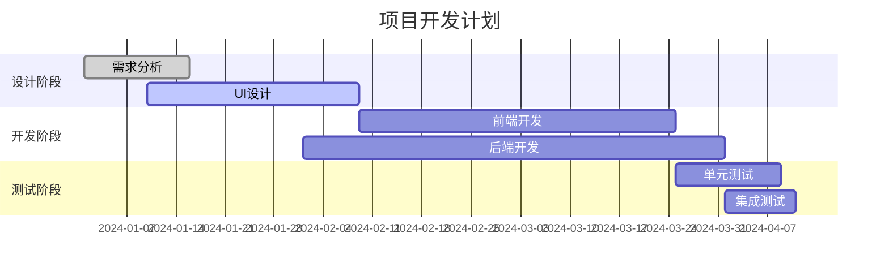
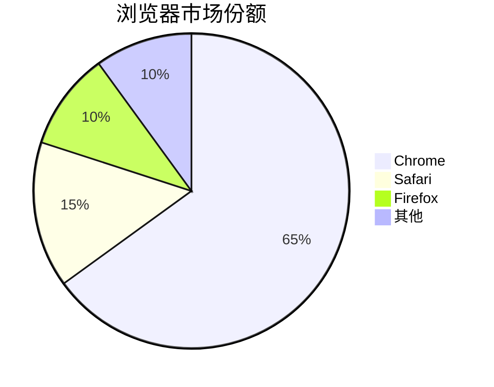
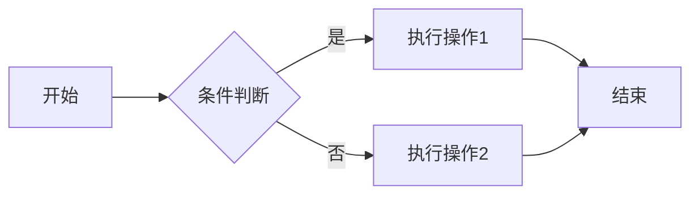
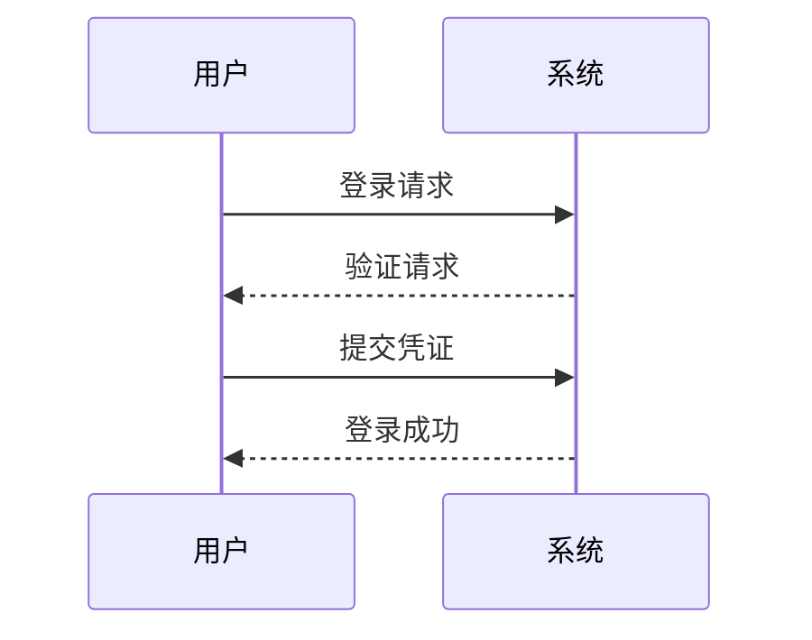
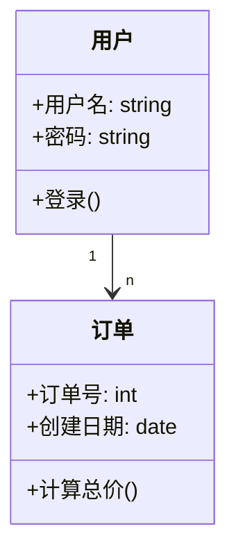
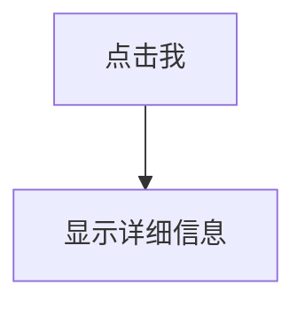

<center><h1>markdown语法文档</h1></center>  

# markdown

## 目录

​	[标题](#标题)
​	[锚点](#锚点)
​	[引用/注释](#引用/注释)
​	[列表](#列表)
​	[表格](#表格)
​	[段落](#段落)
​	[代码](#代码)	
​	[超链接](#超链接)
​	[图片](#图片)
​	[公式/数学表达式](#公式/数学表达式)
​	[`htmlcss`应用](#`htmlcss`应用)
​	[绘图](#绘图)

## 标题

Markdown 使用 # 号来创建标题，这是从 HTML 的 <h1> 到 <h6> 标签概念演化而来的。使用 # 号可表示 1-6 级标题，一级标题对应一个 # 号，二级标题对应两个 # 号，以此类推。
标题居中 
`<center><h1>你好</h1></center>`

```markdown
# 一级标题
## 二级标题
### 三级标题
........
```

## 锚点：

大多数 Markdown 处理器会自动为标题创建锚点（anchor），便于页面内跳转：`[跳转到方法论部分](#方法论)`

##  引用/注释

```markdown
> 一级引用/注释
>> 二级引用/注释  
........
```

## 列表

```markdown
1
无序列表+-*
2选择框
-[X]
-[ ]
-[ ]
```

1 无序列表
`无序列表:+-*`

* 无序列表1
* 无序列表2

2 有序列表
	1 有序列表1
		1 有序列表a 
			1 有序列表
		2 有序列表b	
	2 有序列表2

3 选择框
`-[ ]/-[x]`

- [ ] 选择框1,未选择
- [ ] 选择框2,未选择
- [x] 选择框3,选择

## 表格

```markdown
|左对齐|剧中对齐|右对齐|
|:-----|:----:|-----:|
|内容|内容|内容|
```

| 左对齐 | 剧中对齐 | 右对齐 |
| :----- | :------: | -----: |
| 内容   |   内容   |   内容 |

## 段落

### 换行

---空两格回车/空一行

### 分割线

分割线:三个`***/___`

### 字体

斜体`*内容*`
	*内容*
高亮:`==内容==`
	==内容==
粗体:`**内容**/__内容__`
	**内容**
粗斜体:`***内容***`
	***内容***
下划线:`<u>内容</u>`
	<u>内容</u>
注脚:`-内容`
	~内容
删除线:`~~内容~~`
	~~内容~~
上标:`[^内容]引用`
	内容[^上标]

## 代码

````markdown
四个空格
斜飘
```python
内容
```
`内容`
````

## 超链接

```markdown
1	<超链接>
2	[内容][脚注]
	.....
	[脚注]超链接
3	超链接
4	[内容](超链接)
```


## 图片

[图床](https://imgse.com/)

```markdown
1拖拽
2图床:图片云盘”https://imgse.com/”
	1	[(超链接)]
	2	html使用html操作图片大小
3	
```

## 公式/数学表达式

```markdown
公式:$内容$
数学表达式:$$内容$$
	分式\frec{分子}{分母}
	开平方:\sqrt[次方数]{内容}
	不等于:\not
	约等于:\approx
	小于等于:\leq
	大于等于:\geq
	乘:\times
	除\div
	求和:sum
	累乘:\prod
	累除:\coprod
	平均值\overline
	度:^\cric
	派:\pi
	无穷:\infty
	定积分:\int
```

## `htmlcss`应用

`ctrl+shift+p-->style.less`内定以 `css`

## 绘图

### 语言Mermaid

### 支持图表类型

支持图表类型：
[流程图](###流程图) (`Flowchart`):`graph` [流程图方向](##规则)
[序列图](###序列图) (`Sequence Diagram`):`sequenceDiagram`
[类图](###类图) (`Class Diagram`):`classDiagram`
状态图 (`State Diagram`)
[甘特图](###甘特图) (`Gantt Chart`):`gantt`
[时序图](###时序图):`sequenceDiagram`
[饼图](###饼图 ) (`Pie Chart`):`pie`

### [规则]:

[流程图方向]:
`TD` 或 `TB`：从上到下
`BT`：从下到上
`RL`：从右到左
`LR`：从左到右

### 节点形状
A[方形]：矩形
B(圆角矩形)：圆角矩形
C{菱形}：菱形（决策）
D((圆形))：圆形
E>旗帜形]：旗帜形

### 连接线类型

```
--> 实线箭头
-.-> 虚线箭头
==> 粗实线箭头
-- 实线
-. 虚线
```

### [甘特图]:

```
gantt
    title 项目开发计划
    dateFormat  YYYY-MM-DD
    section 设计阶段
    需求分析      :done,    des1, 2024-01-01,2024-01-15
    UI设计       :active,  des2, 2024-01-10, 30d
    section 开发阶段
    前端开发      :         dev1, after des2, 45d
    后端开发      :         dev2, 2024-02-01, 60d
    section 测试阶段
    单元测试      :         test1, after dev1, 15d
	集成测试      :         test2, after dev2, 10d
```

#### 语法要点

`title` 设置标题
`dateFormat` 定义日期格式
`section` 定义阶段
任务状态：`done`（已完成）、`active`（进行中）、`crit`（关键）

#### 例子



### [饼图]:

```
pie
    title 浏览器市场份额
    "Chrome" : 65
    "Safari" : 15
    "Firefox" : 10
    "其他" : 10
```

#### 语法要点

title 标题
 "项目" : 百分比

#### 例子




### [流程图]:

```
graph LR
    A[开始] --> B{条件判断}
    B -->|是| C[执行操作1]
    B -->|否| D[执行操作2]
    C --> E[结束]
    D --> E
```

#### 语法要点

graph 声明流程图
LR 表示从左到右布局 (可选 TB/RL/BT)
--> 表示箭头连接
[] 表示矩形节点
{} 表示菱形条件节点

### 方向

流程图方向
`TD` 或 `TB`：从上到下
`BT`：从下到上
`RL`：从右到左
`LR`：从左到右

### 节点形状

A[方形]：矩形
B(圆角矩形)：圆角矩形
C{菱形}：菱形（决策）
D((圆形))：圆形
E>旗帜形]：旗帜形
### 连接线类型

```
--> 实线箭头
-.-> 虚线箭头
==> 粗实线箭头
-- 实线
-. 虚线
```

#### 例子



### [序列图]:

```
sequenceDiagram
    participant 用户
    participant 系统
    用户->>系统: 登录请求
    系统-->>用户: 验证请求
    用户->>系统: 提交凭证
    系统-->>用户: 登录成功
```


#### 语法要点

participant 定义参与者
->> 表示实线箭头
-->> 表示虚线箭头

#### 例子



### [类图]:

```
classDiagram
    class 用户 {
        +用户名: string
        +密码: string
        +登录()
    }
    
    class 订单 {
        +订单号: int
        +创建日期: date
        +计算总价()
    }
    
    用户 "1" --> "n" 订单
```

#### 语法要点

`classDiagram`:申明类图
class:申明类名
`+`变量名: 数据类型
`+`方法()

类与类数量对应关系

#### 例子




### 特别




[上标]:你好
